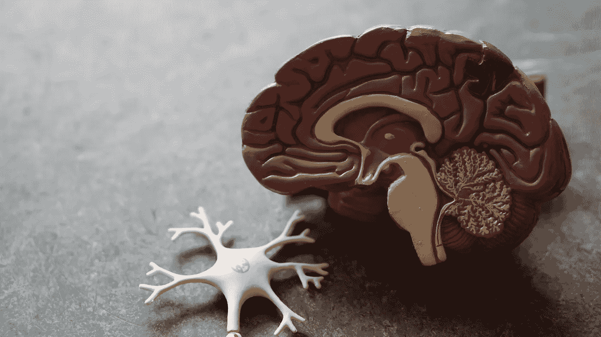
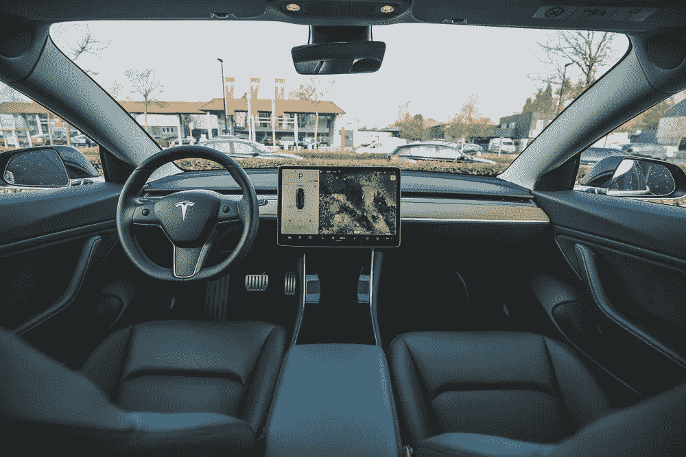
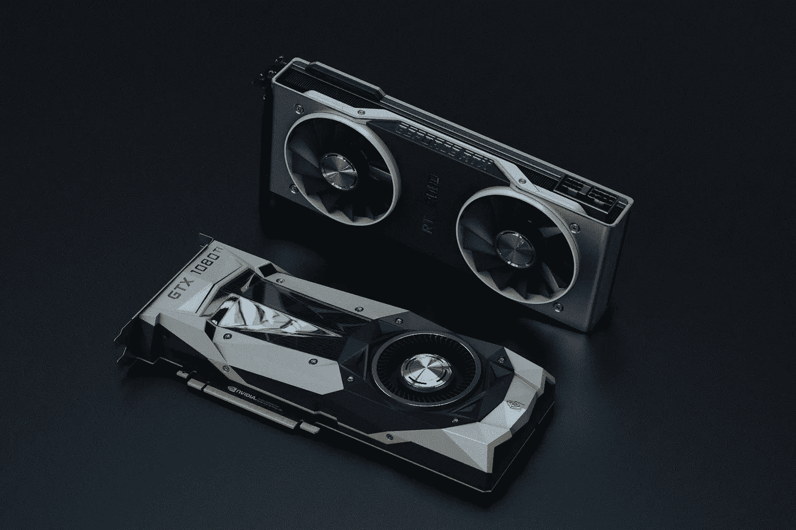
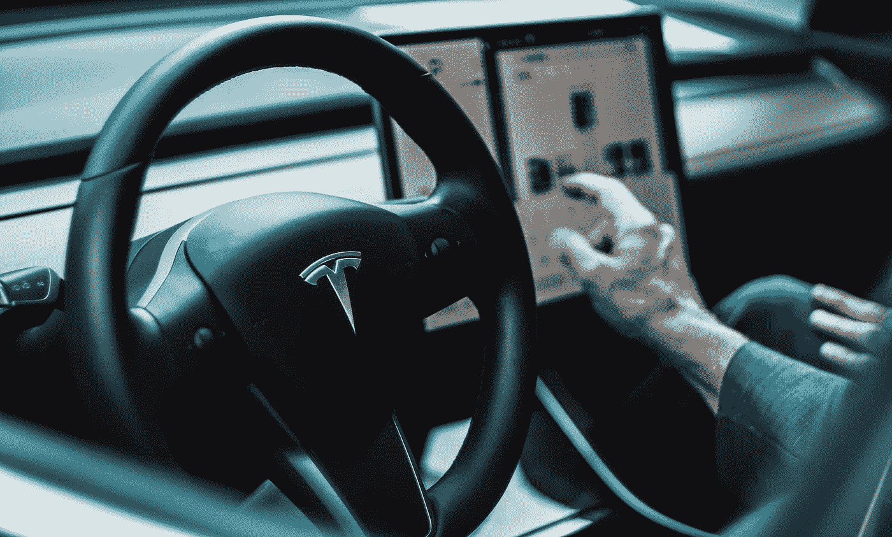

# 机器学习最令人兴奋的方面

> 原文：<https://towardsdatascience.com/the-most-exciting-aspect-of-machine-learning-94bbd874e65a?source=collection_archive---------34----------------------->

JD Mason 在 [Unsplash](https://unsplash.com/s/photos/thinking?utm_source=unsplash&utm_medium=referral&utm_content=creditCopyText) 上的照片

## 是的，是计算机视觉

> 这篇文章是对机器学习(ML)这个奇妙领域中的一个特定部分的探索。你应该从这篇文章中获得以下之一:探索对你来说可能是新的机器学习领域的新热情，或者与你有相似兴趣的新朋友。

大约在 5 亿年前，第一个有机体开始通过视觉感知观察它的环境[。今天，我们有人造机器和照相机能够从输入到它们的光学或远程传感器的输入数据中获得对风景的理解。可以肯定地说，我们已经走了很长一段路。](https://www.newscientist.com/definition/evolution-of-the-eye/)

尽管智能的定义模糊不清，但智能的一个公认的重要组成部分是智能体创建其环境模型的能力。了解我们的环境和其中的物体(或其他代理)允许进一步的活动，如预测，决策，分类，建议等。

Robina Weermeijer 在 [Unsplash](https://unsplash.com/s/photos/brain?utm_source=unsplash&utm_medium=referral&utm_content=creditCopyText) 上拍摄的照片

当你阅读这篇文章时，进入你眼睛的光线转化为电信号，被视神经接收并发送到大脑。反过来，大脑提供这些信号的可视化，以模拟其环境。人类生物学令人着迷，极其复杂。

然而，我们已经承担起在几百年内复制自然界花了几十万年才形成的东西。

# 关心的领域

如果你读过我以前的一些文章，你可能会猜到**计算机视觉**领域对我来说是目前最令人兴奋的机器学习领域。

***计算机视觉(CV)是机器或系统如何通过调用一个或多个作用于所提供信息的算法来生成对视觉信息的理解。这些理解被转化为决策、分类、模式观察等等。***

左图:西蒙·贝克在 Unsplash 上拍摄的照片。右图:[布拉姆·范·奥斯特](https://unsplash.com/@ort?utm_source=unsplash&utm_medium=referral&utm_content=creditCopyText)在 [Unsplash](https://unsplash.com/s/photos/tesla?utm_source=unsplash&utm_medium=referral&utm_content=creditCopyText) 拍摄的照片

计算机视觉技术是我们日常使用的大多数人工智能应用的背后，从智能手机的面部识别功能到即将到来的[无收银零售店](https://www.justwalkout.com/)，让我们不要忘记每个人最喜欢的汽车品牌的自动驾驶汽车功能。想想在 60 年代，解决计算机视觉曾经是一所大学的学生暑期项目，或者故事是这样的，这几乎是疯狂的。

在 CV 领域内，有许多问题需要解决；常见的有物体检测、物体识别、姿态估计、手势识别、人脸检测、深度估计等。我不会深究常见的简历问题的细节，但你可以看到简历领域有很多事情让你忙碌。

# **回首往事**

照片由 [Nana Dua](https://unsplash.com/@nanadua11?utm_source=unsplash&utm_medium=referral&utm_content=creditCopyText) 在 [Unsplash](https://unsplash.com/s/photos/gpu?utm_source=unsplash&utm_medium=referral&utm_content=creditCopyText) 上拍摄

计算机视觉和深度学习使得 GPU(图形处理单元)在机器学习中变得司空见惯。

GPU 是机器学习研究人员和工程师的标准硬件，这种硬件使 [Nvidia](https://www.nvidia.com/) 成为当今最有价值的科技公司之一。

GPU 旨在加速图形渲染和纹理映射等处理任务。GPU 与机器学习应用相关的关键属性**是它们同时处理和执行数据计算的能力，以及它们快速的内存变更。**

研究人员使用 GPU 来训练和测试机器学习技术，以解决视觉处理和图像识别等计算机视觉任务。2006 年，微软的研究人员发表了一篇[论文](https://www.researchgate.net/publication/228344387_High_Performance_Convolutional_Neural_Networks_for_Document_Processing)，介绍了使用 GPU 来训练和测试用于文档处理的卷积神经网络。研究人员受到了 D. Steinkraus 等人的早期[工作](https://ieeexplore.ieee.org/document/1575717)的启发。

使用卷积神经网络(CNN)解决计算机视觉相关任务也是机器学习领域的一个转折点。CNN 利用数学卷积运算并使用二维滤波器，其中滤波器的值在训练期间通过反向传播进行修改，反向传播是一种能够在神经网络内学习的技术。CNN 非常适合图像识别和分类等计算机视觉任务，但在标准 CPU 上训练起来非常慢。因此，早期的 ML 研究人员开始探索使用 GPU 来训练和测试 CNN。

GPU、深度学习以及高度准确和高性能的模型开始年复一年地出现，特别是在 2012 年推出 Alex net[之后。AlexNet 在 NVIDIA GTX 580 3GB GPU](https://papers.nips.cc/paper/2012/file/c399862d3b9d6b76c8436e924a68c45b-Paper.pdf) 上进行训练，由 8 层组成，包括 5 个 conv 层和 3 个全连接层。当时，它在图像分类方面达到了最先进的水平。

这里的关键要点是，在试图优化神经网络的训练和测试以解决计算机视觉任务时，研究人员探索了 GPU 和不同神经网络架构的使用。

# 各种应用

我觉得计算机视觉有趣的另一个原因是它对不同问题的广泛适用性。还有大量的工业应用解决方案以某种形式或方式利用了 CV 技术。

我从未想象过在开发 iOS 移动游戏应用的游戏工作室工作，但事实证明，智能手机上的摄像头打开了一个可能性的世界。想象一个增强的虚拟现实。

UNIBOA 在 [Unsplash](https://unsplash.com/s/photos/augmented-reality?utm_source=unsplash&utm_medium=referral&utm_content=creditCopyText) 上拍摄的照片

我使用构建和训练的模型来解决姿势估计、对象检测和手势识别。这些型号为 2–5MB(兆字节)；有比这些模型更大的 mp3 歌曲可以实时预测 17 个人体关节的位置。简直惊艳！

你必须承认，机器学习模型的研究和商业应用之间的差距正在缩小，这主要是由于寻找开发和交付机器学习模型的优化方法的持续工作。英特尔(Intel)、苹果(Apple)和英伟达(Nvidia)发布的优化人工智能芯片提供了平台，移动优化的人工智能模型可以在没有计算限制的情况下运行。

照片由[欧文比尔德](https://unsplash.com/@owenbeard?utm_source=unsplash&utm_medium=referral&utm_content=creditCopyText)在 [Unsplash](https://unsplash.com/s/photos/healthcare?utm_source=unsplash&utm_medium=referral&utm_content=creditCopyText) 上拍摄

就行业相关性而言，如果你有计算机视觉专业知识，你就可以接触到广泛的行业选择。医疗机构需要计算机视觉专家来开发算法，以改善 x 射线图像的图像处理，并简化从分析到诊断的医学成像流程。国防和安全机构需要计算机视觉专家来构建检测和跟踪算法。汽车制造商和科技公司正在招聘 CV 工程师，以帮助实现自动驾驶汽车。

如果你是杰出的，对计算机视觉充满热情，你的技能的未来相关性是无限的(*警告* : *只要你保持它们是最新的*)。

你可能会发现大多数管理学科在现代公司中都有一席之地，尤其是现在社会依靠技术和数据运作。

# 未来

令人兴奋的是，看到机器拥有类似的感知能力和对风景的理解能力，而这些能力是大自然花了几百万年才开发出来的。

商业市场和媒体的注意力都集中在引入自动驾驶汽车上。特斯拉是这一领域的领先公司，充分利用摄像头作为其车队中唯一的视觉传感器。

戴维·冯迪马尔在 [Unsplash](https://unsplash.com/s/photos/tesla?utm_source=unsplash&utm_medium=referral&utm_content=creditCopyText) 上拍摄的照片

特斯拉最新的[演示](https://www.youtube.com/watch?v=3SypMvnQT_s&ab_channel=TeslaOwnersOnline)展示了他们的进展，例如从视频输入中获取时间数据，并创建一种新的神经网络架构，该架构接受向量空间中的输入数据，而不是标准的 2D 向量表示图像。

大数据和人工智能技术在社会上越来越普遍。同时，消费者已经将隐私作为首要关注的问题，尤其是在使用连接到互联网的应用程序时。在一个个人数据构成个人数字身份的世界里，隐私问题变得至关重要。计算机视觉应用是人工智能监管讨论的前沿。一个例子是在公共场所使用人脸检测和识别系统。

至于我，我目前正在使用计算机视觉解决方案开发一个移动应用程序，该应用程序可以实时监控远程和办公室工作人员的姿势变化并提出建议。我参与的另一个令人兴奋的项目是使用笔记本电脑摄像头跟踪眼睛来检测读者中的读写障碍。毫无疑问，这些都是令人兴奋和有趣的项目。

## 如果你想了解更多关于计算机视觉和深度学习的知识，你可以在我即将到来的 O'Reilly live 培训课上和我一起学习。

<https://www.oreilly.com/live-events/practical-introduction-to-the-world-of-computer-vision-and-deep-learning-with-tensorflow-keras/0636920060577/0636920060576/>  

# 想要更多吗？

1.  [**订阅**](https://richmondalake.medium.com/subscribe) 在我发布文章时获得通知
2.  [**成为推荐媒介会员，支持我的写作**](https://richmondalake.medium.com/membership)
3.  通过 [**LinkedIn**](https://www.linkedin.com/in/richmondalake/) 联系我
4.  跟我学学 [**奥赖利**](https://www.oreilly.com/live-events/practical-introduction-to-the-world-of-computer-vision-and-deep-learning-with-tensorflow-keras/0636920060577/0636920060576/)