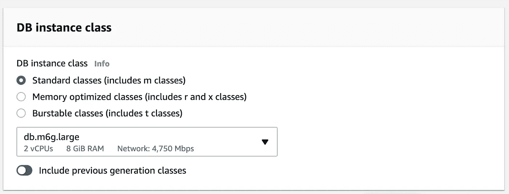
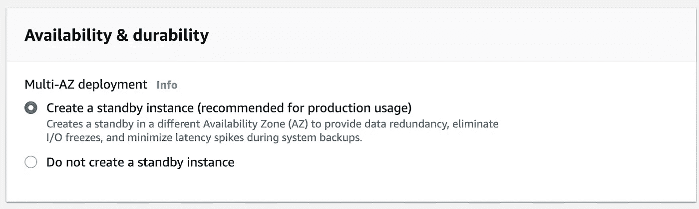
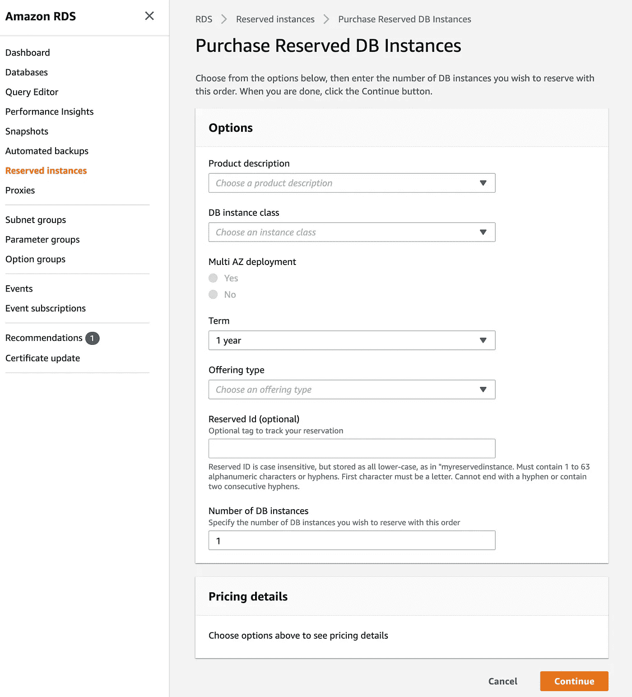

# 亚马逊 RDS 让您物超所值

> 原文：<https://towardsdatascience.com/the-most-for-your-money-from-amazon-rds-51784064da1f?source=collection_archive---------22----------------------->

## 绩效评估和成本节约方案

亚马逊 RDS 最物有所值—通过 Shutterstock 获取图片(标准许可)

[Amazon RDS](https://aws.amazon.com/rds/) 是一个强大的托管数据库服务，可以根据您的需要轻松创建、扩展和配置。
然而，亚马逊 RDS，像大多数 AWS 服务一样，如果没有正确的设置和监控，会很快产生高额(更重要的是浪费)成本。
作为一名数据库维护人员，这份服务概述将为您提供如何让您的资金发挥最大价值的高级原则和工具。

**在本文中，我将重点介绍 PostgreSQL 数据库类型，但是其他 DB 引擎也有相同或非常相似的配置和指标。只有 Amazon Aurora —无服务器会有很大不同。*

# **亚马逊 RDS 的主要成本来源**

在创建或更新 Amazon RDS 实例时，您需要考虑 4 个主要的成本相关配置:实例类、多 AZ 配置、硬盘存储和供应的 IOPS，然后是支持服务:快照和到 S3 的快照导出。让我们深入探讨每一个问题。

## **实例类** ( ***成本影响:高*** )

实例类(作者图片)

这是成本的主要驱动因素。它定义了硬件类型用途、vCPU、CPU 信用、内存和网络性能。它是按小时计费的(和/或胸围积分，如果适用的话), RDS 有大量的实例选项供您选择。
实例类型列表及其[用途此处](https://aws.amazon.com/rds/instance-types/)和[定价此处](https://aws.amazon.com/rds/pricing/)。

## **多 AZ 配置(成本影响:高)**

多 AZ 配置(图片由作者提供)

它为您的实例增加了冗余，以防出现故障。对于生产数据库来说，这是必须的，但对于开发和试运行来说就不那么重要了。如果主实例出现问题，warm 实例将始终处于备用模式，因此成本几乎会翻倍。确保除非在生产环境中，否则不要使用它。

> 启用多 AZ 配置还会增加实例类型、硬盘存储和 IOPS 的成本。

## **硬盘存储(成本影响:中低)**

存储自动缩放(图片由作者提供)

它可以是磁性、固态硬盘、+/-调配的 IOPS。这里的选项在成本方面没有太大的问题，即使磁性将比 SSD 便宜。它是按 GB 计费的，而且非常低。当然，如果你在几十万 GB 的数据库中，你可能要多注意这一点。调配的 IOPS 也会变得非常昂贵。

> **Pro 提示:**当你设置存储时，选中“存储自动缩放”，它可以自动缩放(使用的额外存储之外)，如果数据发生任何重大波动，它将防止你的数据库下降。造成这种情况的原因不仅仅是数据的增长，还可能是因为读取副本滞后、数据未被清空，或者在请求大量涌入时索引未被重构(仅举几个例子)。当然，你不应该依赖于这种长期的和调整“分配的存储”，一旦它被注意到和永久的。

## **快照(RDS 备份)(成本影响:低)**

这是非常低的，对整个账单几乎无足轻重。您可能需要注意的是保留期，因为您需要支付备份、存储和数据传输的费用。对于非生产数据库，您可以将保留期设置为 3 -7 天，以消除长期存储成本。

## **供应 IOPS(成本影响:中到高)**

IOPS 是一种额外的配置，默认情况下不会应用，但如果使用它们，您应该小心，因为它们会显著影响成本。

## **快照出口到 S3** **(成本影响:低)**

这不是大多数人使用的常见选项，但尽管如此，还是要意识到与此相关的成本。随着数据库规模的增长，it 成本也会增加。

# **性能测量&实例调整**

既然您已经运行了数据库，那么您需要将重点放在监控和优化上。我已经确定了评估的主要指标:

*   网络流通量
*   CPU 利用率和/或 CPU 信用使用
*   可释放内存
*   读 IOPS，写 IOPS
*   突发余额和/或 CPU 信用使用

Amazon RDS-->(特定的)数据库实例-->监控(图片由作者提供)

这不是一个完整的列表，而是几个你应该注意的基本列表。这些特定的指标将决定是否需要改变。当我们在这里讨论节省时，您正在寻找浪费的资源或低于实例类允许的 50%的资源利用率。
理想的规则是，平均来说，您希望利用 75%的允许资源。是的，你甚至可以达到 85%-90%，但这真的会推动极限，如果意外的激增发生，你会走投无路。
让我们深入了解每项指标。

## **网络吞吐量**

这里的用法将指示实例类类型的变化，特别是*网络性能*规范的变化。

## CPU 利用率和/或 CPU 信用使用

评估 CPU 使用情况。如果您使用的太少，您可以缩减到具有不同的*内核数量和 vCPU* 单元的实例。

## **可释放内存**

评估您使用了多少内存，尤其是在您的高峰期，75%左右的利用率是正常的。如果你用得太少，你可以缩减到一个更低*内存容量的实例。*

## 读 IOPS，写 IOPS

它决定了访问你硬盘的速度。此处的任何更改都将决定您的硬盘类型和/或配置/取消配置额外的 IOPS 的更改。
[关于 IOPS 的更多信息和确定您的基本上限](https://docs.aws.amazon.com/AmazonRDS/latest/UserGuide/CHAP_Storage.html)

## 突发余额和/或 CPU 信用使用

*仅适用于“可突发的性能实例”
如果您的实例类型属于此类别，请密切注意，因为可突发的实例可能会超出实例容量，这将产生成本。
另一方面，如果您没有使用这个选项，您可能希望获得一个具有较低 CPU 信用/小时的实例。为了评估最适合您的方案，您必须监控两个指标——“突发平衡”和“CPU 信用使用”。

> **警告:**这些指标都不是独立工作的，因为实例类不是每个指标都可以配置的，但是它们是一组预定义的配置。您需要确定哪一对最适合您的用例。
> 
> **专业提示:**如果不永久投入生产，至少在最初几个月启用性能洞察。使用该工具，您将能够在您的堆栈上或直接在使用数据库的应用程序上微调查询、连接和许多其他事情。
> 通过这些内部的优化可以导致更广泛的实例优化，并潜在地降低实例类型的规模和更多的节省。
> [关于性能洞察的更多信息](https://docs.amazonaws.cn/en_us/AmazonRDS/latest/UserGuide/USER_PerfInsights.UsingDashboard.html)

# **节约成本的附加方式**

## 保留实例

*AWS 控制台- >亚马逊 RDS - >预约实例*(图片由作者提供)

如果您打算长时间运行同一个实例，那么保留实例(RI)是一个不错的选择。如果您承诺一年或更长时间，它可以为您节省大约 30%到 50%。
一个有趣的细节是，您正在为一个特定的实例类类型所使用的单元付费。这种承诺允许您通过仍然利用预留来扩大或缩小同一个实例类。
[关于保留实例的更多信息](https://aws.amazon.com/rds/postgresql/pricing/)

## **建立账户/服务预算**

最后，如果您不确定您需要什么样的配置属性，您至少应该建立一个预算并相应地进行监控。您可以在“我的计费仪表板”->“预算”下完成此操作。这不会直接帮你省钱，但这是监控成本的主动方式。

# 结论

这是一个非常简短的介绍，介绍了如何在高层次上评估您的 Amazon RDS 实例，但是它应该让您朝着正确的方向开始。如果您需要更深入的研究，您将必须彻底阅读 Amazon RDS 文档，通过 CloudWatch 和 Performance Insights 保持监控，并检查什么最适合您的用例。

# 另外，阅读

[亚马逊 S3 最划算](/the-most-for-your-money-from-amazon-s3-6536c78189da)

# 联系人

我是一名软件、数据和机器学习顾问，通过了 [AWS 机器学习](https://www.credly.com/badges/58e38a3f-af0c-441c-be90-6ed99fc4a788/public_url) & [AWS 解决方案架构师认证——专业](https://www.credly.com/badges/0db46f4c-3f60-413d-aa31-8d5e56982d2d/public_url)。如果您的下一个机器学习项目需要帮助，请联系我们。
关注我的最新文章和项目[，关注我的媒体](https://vel-lesikov.medium.com/subscribe)。

其他联系人:

*   [领英](https://www.linkedin.com/in/velimir-lesikov/)
*   [中等轮廓](https://vel-lesikov.medium.com/)
*   [GitHub](https://github.com/velles)