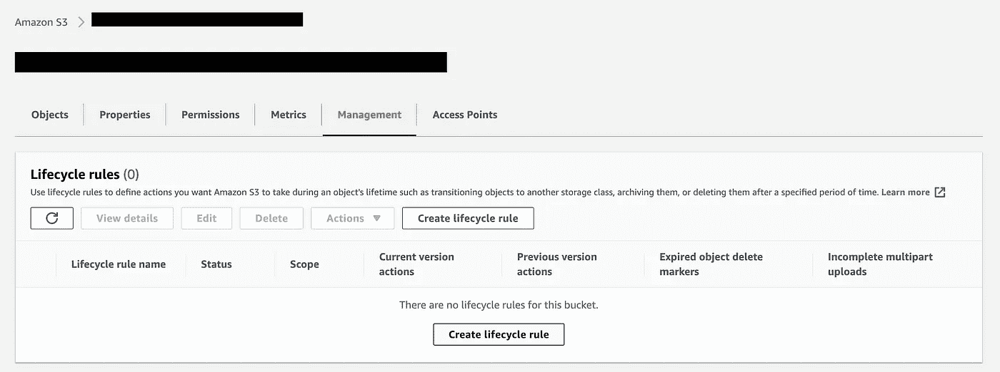
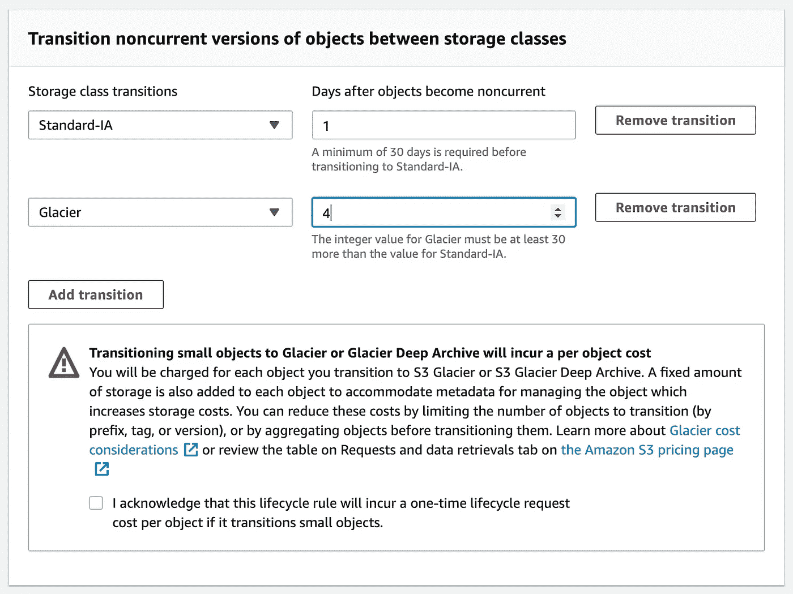
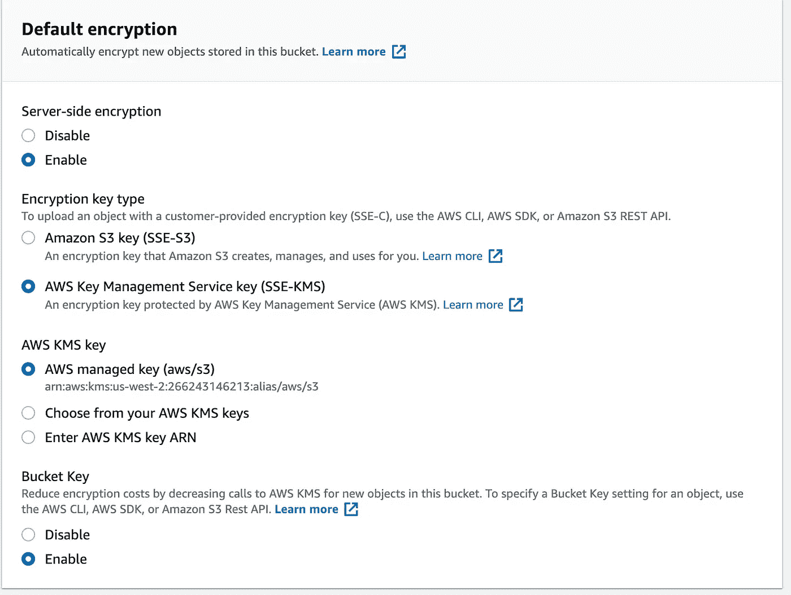

# 亚马逊 S3 最物有所值

> 原文：<https://towardsdatascience.com/the-most-for-your-money-from-amazon-s3-6536c78189da?source=collection_archive---------24----------------------->

## 在节约的前提下利用云存储的强大功能

亚马逊 S3 的最物有所值——图片来自 Shutterstock(标准许可)

[亚马逊 S3](https://aws.amazon.com/s3/) 是 AWS 旗下的文件基础云存储。它可以用于任何类型和大小的文件。它具有无限的可扩展性、持久性和行业标准安全性(正确配置时为**)。它可以作为一个网站资产主机，一个实际的网站，或一个数据湖，它的即插即用与任何 AWS 服务。*

*对于大多数零件来说，亚马逊 S3 非常便宜。但是，当数据不断堆积时，这可能具有欺骗性，并且没有针对最佳预算进行监控。无论您是数据工程师、数据科学家还是网站管理员，您都可能会陷入不必要成本的陷阱。在这篇概述中，我将向你展示在亚马逊 S3 上超支最常犯的错误，以及如何从一开始就避免它们。*

***亚马逊 S3 是一个非常严格的系统，有许多用例。在我的概述中，我将介绍最常见的方法以及在其中需要寻找的内容。**

# ***存储类***

*存储类是 S3 的核心，也是最容易被忽视的选项，因为人们会选择默认的——S3 标准通用类。将数据放入(或移动到)正确的位置将是成本的一个驱动因素。在选择存储类别时，需要考虑的是数据的**生命周期**和更长时期的**访问频率**。*

*存储类别快速概述:*

***S3 标准—通用** 这是最常见的一种，也是您默认启动的一种。它用于经常使用的数据。*

***S3 智能分层**
该层用于未知或不断变化的访问模式。它会自动确定哪些数据不经常被访问，并为您移动这些数据。您可能会为监控支付额外的费用，但是如果您真的不知道您的数据，并且没有设置生命周期规则，这是值得的。您还需要为每 1000 个生命周期事务请求付费，因此，如果您有大量数据，您不希望在存储类别之间来回移动太多，这样可能不是您的最佳选择。*

***S3 标准-IA-频繁访问:**用于检索频率较低但需要快速传输的数据。这是一种较低的存储成本，但您需要为数据检索付费。*

***S3 一区-IA:** 数据访问不太频繁的地方。顾名思义，它不是由第二个区域备份的，所以它应该只用于可复制的数据，类似于第二个备份。*

***S3 冰川:**不常用的访问层。可以在几分钟到几小时内检索数据。这是存储备份或旧版本的地方。存储很便宜，但是你要为数据传输付费。*

***S3 冰川深层档案馆:**专为极不频繁的访问而设计，一年大约 1-2 次。数据检索可能需要几个小时。存储是所有选项中最便宜的，但你要为数据传输付费。*

***S3 前哨:**用于本地存储，与 S3 API 交互以获取数据。当您有内部数据存储需求时，这是理想之选。*

**关于* [*存储类*](https://aws.amazon.com/s3/storage-classes/?nc=sn&loc=3) *和* [*存储类定价*](https://aws.amazon.com/s3/pricing/) 的更多信息*

# *生命周期规则*

**

*“创建生命周期规则”位于“管理”选项卡下(按作者分类的图像)*

*生命周期规则的主要思想是在存储类之间自动移动数据，删除旧数据或版本。功能非常强大，超级好用。从我的经验来看，它通常根本不被使用。生命周期规则是一劳永逸的，是一种“无服务器”的方式来抽象您的数据管理，并通过设计保持低成本。*

# ***版本控制***

**

*亚马逊 S3 版本设置(作者图片)*

*这是一个非常简洁的特性。适合审计需求。如果您需要使用此选项，您在这里可以做的最好的事情是将旧版本过渡到更便宜的长期存储类别，或者通过生命周期规则在几天内删除旧版本。*

## *版本控制的生命周期规则示例*

*您将为多次存储数据付出代价，这就是为什么我建议以生命周期规则为例:*

**

*版本控制的生命周期规则示例(按作者分类的图像)*

*1.从 S3 标准(假设它是默认的)在 1 天内将旧版本移动到 S3 标准-IA。从 S3 斯坦达尔-IA 在 4 天内将文件转移到 S3 冰川
现在，请注意与转移到 S3 冰川相关的每个文件的转移成本。*

*[关于版本控制的更多信息](https://docs.aws.amazon.com/AmazonS3/latest/userguide/Versioning.html)*

# ***加密类型&成本***

**

*亚马逊 S3 加密设置(作者图片)*

*在 S3，您可以选择加密静态数据。您可以加密整个桶或单个文件夹/后缀。您可以选择使用亚马逊 S3 密钥(SS3-S3)或 AWS 密钥管理服务密钥(SSE-LMS)。如果你使用一个自定义的(你自己的)KMS 键，它的工作方式是每次你从 S3 读取一个对象时，它也会调用 KMS API，这会产生成本。例如，如果您使用 S3 作为数据湖，或者使用 Athena，那么每次读取文件都会增加不必要的成本。您确实可以选择 Bucket Key，通过最大限度地减少对 KMS 的 API 调用来降低成本，但您最终还是要支付一笔竞价。*

*我建议你去 SS3-S3，除非你有其他要求。*

***加密可能是一个特定的项目要求，在这种情况下，您需要选择最佳架构，并向利益相关方说明成本。**

*[关于亚马逊密钥管理服务(KMS)的更多信息](https://aws.amazon.com/kms/)*

# ***S3 为数据湖***

*在 S3 上为数据湖存储数据时，p **artitioning** 和**文件格式是这里的**主要关键字。您希望以一种需要对更多文档进行更少扫描的结构来组织文件。会更快更便宜。这也是**生命周期规则**再次发挥作用的地方，它可以帮助您自动清除任何陈旧数据或将其归档到长期存储中。*

*此外，确保以尽可能小的格式存储数据。例如， [Parquet](https://parquet.apache.org/) 或 [Orc](https://orc.apache.org/) 将是从 [AWS Athena](https://aws.amazon.com/athena/?whats-new-cards.sort-by=item.additionalFields.postDateTime&whats-new-cards.sort-order=desc) 查询数据和从 [AWS Glue](https://aws.amazon.com/glue/?whats-new-cards.sort-by=item.additionalFields.postDateTime&whats-new-cards.sort-order=desc) 爬行的理想选择。默认情况下，大多数 AWS 服务都支持这两种格式。这不仅是最佳实践，而且可以最小化存储大小。*

# *网络服务的 S3*

*这里最常见的用例是托管网站图像或其他资产，如 javascript、样式表(CSS)、缩略图等。你甚至可以在 S3 上建立一个静态网站。在所有这些使用案例中，您将为数据传输到互联网付费。如果这是您的预期用例，您肯定应该使用 [Amazon CloudFront](https://aws.amazon.com/cloudfront/) 来缓存任何长期永久资产，并从那里为它们提供服务。这还将大大提高资产加载的速度，并降低直接从 S3 读取数据的成本。是的，你需要为 CloudFront 付费，但这比直接使用 S3 要少得多。*

# *结论*

*S3 的大部分零件都非常便宜。前 50 TB 的标准存储仅为每 GB 0.023 美元*(*撰写本文时的价格)*如果您是一家大型或小型企业，这对您来说可能不是一个大数目。我个人不喜欢口袋漏水，为什么不从我的项目一开始就防止任何损失。对于基于 AWS 的构建，我总是遵循 AWS 良好架构框架的[5 Pillers](https://aws.amazon.com/architecture/well-architected/?wa-lens-whitepapers.sort-by=item.additionalFields.sortDate&wa-lens-whitepapers.sort-order=desc)，成本在其中扮演了重要角色。希望我给了你一些好的见解，告诉你如何在亚马逊 S3 上从几块钱到几个猎人。*

# *另外，阅读*

*[亚马逊 RDS](/the-most-for-your-money-from-amazon-rds-51784064da1f) 最划算*

# *联系人*

*我是一名软件、数据和机器学习顾问，通过了 [AWS 机器学习](https://www.credly.com/badges/58e38a3f-af0c-441c-be90-6ed99fc4a788/public_url) & [AWS 解决方案架构师认证——专业](https://www.credly.com/badges/0db46f4c-3f60-413d-aa31-8d5e56982d2d/public_url)。如果您的下一个机器学习项目需要帮助，请联系我们。
关注我的最新文章和项目[，关注我的媒体](https://vel-lesikov.medium.com/subscribe)。*

*   *[领英](https://www.linkedin.com/in/velimir-lesikov/)*
*   *[中等轮廓](https://vel-lesikov.medium.com/)*
*   *GitHub*