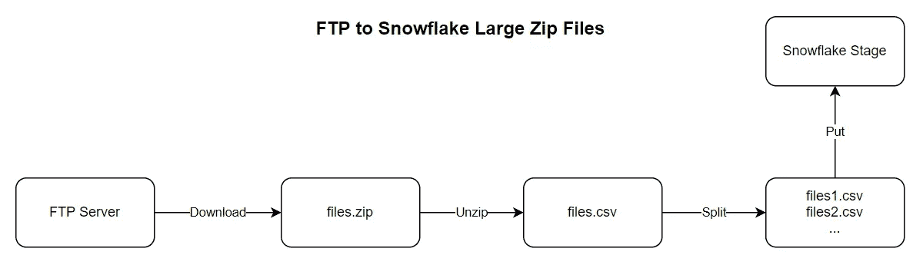

# 伟大的数据工程师最重要的特质

> 原文：<https://towardsdatascience.com/the-most-important-trait-of-great-data-engineers-8badc589c88e?source=collection_archive---------24----------------------->

## 你很想知道吗？

马尔科·布拉泽维奇在 [Unsplash](https://unsplash.com?utm_source=medium&utm_medium=referral) 上的照片

我接触过或读到过的所有伟大的数据工程师都有一个共同的特点。相反，所有不太好的数据工程师都缺少这一关键要素。不是某种特定工具的技能或知识，而是一种内在的固有品质。数据工程师每天都在解决新的问题，如果没有这个最重要的特征，我们可能无法交付任何有价值的东西。

现在，我们已经谈到了[对数据工程师来说最重要的技能](https://medium.com/geekculture/the-most-important-skill-for-data-engineers-46fc1faff6ae)，这个特质是相关的。如果没有这个关键因素，你可能会在学习新工具和流程时遇到困难。先说个例子。我需要将文件从 FTP 服务器转移到 Snowflake。这些文件是 zip 格式的，有些文件的大小约为 1G。雪花不支持 zip 格式，喜欢 100m 或更小的文件。这创造了一个有趣的小挑战。

FTP 到雪花工作流的数据流

我需要从 FTP 下载 zip 文件，解压，分割成更小的文件，然后上传到雪花阶段。每天都有新文件创建，所以这需要自动化。由于我们没有使用气流，我不能使用现有的运营商和 Fivetran 似乎是一个小问题的昂贵解决方案。对于我的首选脚本语言 Python 来说，这似乎是一项伟大的任务。但是我的经理向我挑战。

## 思维不同

不写新的应用程序能做到吗？嗯，我不这么认为。对于脚本来说，这似乎是一个简单的例子。这让我很好奇。这不是一个简单的 Python 脚本。我必须查询 FTP 服务器，看看有什么文件存在。下载它们，解压，然后分割成更小的文件。考虑到过程中可能出现的所有问题，这似乎是相当多的编码。也许有更好的方法。我的好奇心被激起了。

一定有人已经解决了我面临的许多问题。我发现 LFTP 有一个镜像命令，可以从 FTP 服务器下载任何新文件。Linux 有一个为将文本文件分割成更小的块而定制的 split 命令。也许 Python 不是正确的解决方案。最重要的是，我们已经在 Kubernetes 集群中配置了 ARGO，因此工作流管理已经存在。长话短说，我把自己换成了一个很小的 shell 脚本。实际上，有几个。那么，这和数据工程师最重要的特质有什么关系呢？

## 已经是什么了！

我想你知道我们在说什么。是好奇。你天生好奇吗？你喜欢弄清楚事物是如何工作的吗？想出巧妙的方法来解决难题？什么事？太好了，你会成为一名优秀的数据工程师，因为好奇心是所有伟大的数据工程师的基本特质。我们不能依靠现有的模式来解决每个问题，所以我们必须拿出自己的模式。要做到这一点，我们需要好奇。我们需要不断地接触新的工具和流程。做事的新方法。

数据工程师每天都在解决新问题，如果没有好奇心，我们可能无法交付任何有价值的东西。好奇的数据工程师阅读了博客，观看了视频，并使用了新工具。他们重新评估了旧技术，并找到了利用它们的新方法。当挑战出现时，他们会研究并利用现有的知识来寻找聪明的解决方案。这就是为什么我认识的所有伟大的数据工程师都天生好奇。但是，他们不杀猫。