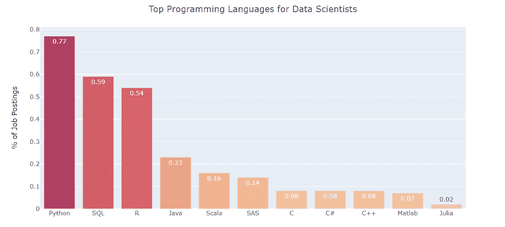

# 2021 年数据科学家最需要的技能

> 原文：<https://towardsdatascience.com/the-most-in-demand-skills-for-data-scientists-in-2021-4b2a808f4005?source=collection_archive---------7----------------------->

## 来自 15，000 多个数据科学家职位发布的网络搜索结果

作者创建的图像

> **对 15，000 多个数据科学家职位发布的最受欢迎技能的深入分析。**

# **简介**

> **请务必点击** [**订阅此处**](https://terenceshin.medium.com/membership) **或我的** [**个人简讯**](https://terenceshin.substack.com/embed) **千万不要错过另一篇关于数据科学指南、技巧和提示、生活经验等的文章！**

我只想说，这在很大程度上受到了杰夫·黑尔在 2018/2019 年写的文章的启发。我写这篇文章只是因为我想获得对当今需求技能的最新分析，我分享这篇文章是因为我假设有人也希望看到 2021 年数据科学家最需要的技能的更新版本。

从这个分析中得到你想要的-很明显，从网络搜集的招聘信息中收集的见解与实际上最需要的数据科学技能并不完全相关。然而，我认为这给了你一个很好的提示，告诉你应该更关注什么样的一般技能，同样的，也应该远离这些技能。

也就是说，我希望你喜欢这个，让我们开始吧！

# **方法论**

为了这个分析，我从 Indeed、Monster 和 SimplyHired 网站搜集并积累了超过 15000 条招聘信息。我没有抓取 LinkedIn，因为我在抓取时遇到了验证码问题。

然后，我查看有多少招聘信息包含了我正在搜索的每个词。我搜索的术语列表如下( ***)如果你想看其他技能，请在评论中提出，这样我可以添加到明年的分析中！*** ):

*   Python，SQL，R，Java，Git，C，MATLAB，Excel，C++，JavaScript，C#，Julia，Scala，SAS
*   scikit-学习，熊猫，NumPy，SciPy
*   Matplotlib，Looker，Tableau
*   TensorFlow，PyTorch，Keras
*   Spark，Hadoop，AWS，GCP，Hive，Azure，Google Cloud，MongoDB，BigQuery
*   Docker，Kubernetes，气流
*   NoSQL、MySQL、PostgreSQL
*   Caffe，Alteryx，Perl，Cassandra，Linux

从每个来源获得计数后，我将它们相加，然后除以数据科学家职位发布的总数，得到一个百分比。例如，Python 的值 0.77 意味着 77%的职位发布中包含 Python。

最后，我将结果与杰夫·黑尔在 2019 年所做的分析进行了比较，以获得 2019 年至 2021 年的百分比变化。

> **请务必在此** [**订阅**](https://terenceshin.medium.com/membership) **或我的** [**个人简讯**](https://terenceshin.substack.com/embed) **千万不要错过另一篇关于数据科学指南、技巧和提示、生活经验等的文章！**

# 结果

## 顶级技能

以下是 2021 年最受欢迎的 25 项数据科学技能，从高到低排列如下:

作者创建的图像

## 顶级编程语言

为了获得更详细的信息，下面的图表显示了供数据科学家使用的顶级编程语言:

作者创建的图像

Python、SQL 和 R 是排名前三的编程语言并不奇怪。

就我个人而言，我也袖手旁观这样的事实，你应该知道 Python 或 R 以及 SQL。我是从 Python 开始的，我可能会一辈子都坚持使用 Python。就开源贡献而言，它遥遥领先，而且学习起来很简单。SQL 可以说是任何与数据相关的职业类型中最重要的技能，无论你是数据科学家、数据工程师、数据分析师还是业务分析师，这个清单还可以继续列下去。

## 顶级 Python 库

同样，下图显示了数据科学家的顶级 Python 库:

作者创建的图像

TensorFlow 排名第一，因为它是最受欢迎的深度学习 Python 库之一。PyTorch 是一个强有力的选择，因此它的排名不会落后太多。

Scikit-learn 可以说是 Python 中最重要的机器学习库。在使用 Pandas 和/或 NumPy 清理和处理您的数据后，scikit-learn 用于构建机器学习模型，因为它有大量用于预测建模和分析的工具。

在我看来，熊猫、NumPy 和 SciPy 对数据科学家来说也是必不可少的，尽管它们有上述的表现。

## 增长最快和下降最快的技能

下面的图表显示了从 2019 年到 2021 年增长和下降最快的技能:

作者创建的图像

作者创建的图像

以下是上面两张图表中的一些要点:

1.  与云相关的技能有了巨大的增长，比如 AWS 和 GCP。
2.  类似地，与深度学习相关的技能也有很大增长，如 PyTorch 和 TensorFlow。
3.  SQL 和 Python 的重要性持续增长，而 R 仍然停滞不前。
4.  Apache 产品，如 Hadoop、Hive 和 Spark，重要性继续下降。

# 感谢阅读！

> **请务必在此** [**订阅**](https://terenceshin.medium.com/membership) **或我的** [**个人简讯**](https://terenceshin.substack.com/embed) **千万不要错过另一篇关于数据科学指南、技巧和提示、生活经验等的文章！**

我希望这个分析对你有用。我不会完全证明仅仅基于这种资源选择学习一种技能而不是另一种技能的决定是正确的，但是正如我之前所说的，我认为这给出了一个很好的主意，关于什么在重要性上增加和减少。

如果你喜欢这个，请一定要关注我的 Medium，一如既往，我祝你在学习中一切顺利！

不确定接下来要读什么？我为你挑选了另一篇文章:

</a-complete-52-week-curriculum-to-become-a-data-scientist-in-2021-2b5fc77bd160>  

**又一个！**

</all-machine-learning-algorithms-you-should-know-in-2021-2e357dd494c7>  

# 特伦斯·申

*   ***如果你喜欢这个，*** [***跟我上媒***](https://medium.com/@terenceshin) ***了解更多***
*   ***有兴趣合作吗？让我们连线上***[***LinkedIn***](https://www.linkedin.com/in/terenceshin/)
*   ***报名我的邮箱列表*** [***这里***](https://forms.gle/tprRyQxDC5UjhXpN6) ***！***