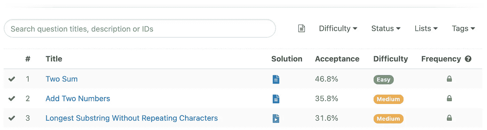

# 罗马到整数问题的最现成的代码

> 原文：<https://towardsdatascience.com/the-most-out-of-the-box-code-for-roman-to-integer-problem-4291132091e9?source=collection_archive---------38----------------------->

## 学习机

## 这绝对是我遇到的最聪明的解决方案之一

[Erda Estremera](https://unsplash.com/@erdaest?utm_source=medium&utm_medium=referral) 在 [Unsplash](https://unsplash.com?utm_source=medium&utm_medium=referral) 上拍摄的照片

你是软件工程师还是数据科学家？你为编码面试做好准备了吗？如果你对这两个问题的回答都是肯定的，那么你很可能听说过 [LeetCode](https://leetcode.com/) 。

对于那些不熟悉 LeetCode 的人来说，这是一个充满了数千个编码问题的网站，人们可以用它来训练自己的编码技能。在撰写本文时，它有 1835 个问题，并且还在增加。

我强烈建议大家不管你的专业是什么，都要坚持练习自己的解题技巧。以我的经验，几乎所有职位，从后端、前端、机器学习工程师，到数据科学家，通常在面试过程中都有一轮或更多的编码。

如果你进入[问题](https://leetcode.com/problemset/all/)页面，你会看到问题列在一个表格里，就像这样。

作者 LeetCode 问题截图

大多数问题都有 LeetCode 提供的解决方案，但其中一些需要您以每月 35 美元或每年 159 美元的价格订阅 LeetCode。我只是说，人们几乎总是会在讨论页面上发布他们自己的解决方案，所以你可以利用这些信息做你想做的事情。

不过说真的，我经常在讨论页面而不是解决方案页面找到最佳解决方案。

这是我在 LeetCode 中遇到的最喜欢的解决方案之一。

# 罗马到整数问题

第一页列出的一个问题是[罗马数字到整数的问题](https://leetcode.com/problems/roman-to-integer/)，任务是将罗马数字转换成整数。比如“VIII”变成 8，“MCMXCVII”变成 1997。

幸运的是，罗马数字被限制在 1-3999 的范围内，所以我们将使用的最大数字是代表 1000 的 M。

问题最难的是处理像“IV”、“IX”、“XL”等案件。其中较小的数在较大的数之前，并导致该数被减去而不是相加。

所以我在那里，在让解决方案工作并通过所有测试用例之前，尝试编码 10 分钟。

和往常一样，我查看了讨论页面，了解其他人对这个问题的看法。然后，我遇到了这个解决方案，声称它比 99.78%的要好。当然，我很好奇，不得不点击它。这是解决方案。

通过 [hgrsd](https://leetcode.com/hgrsd/) 解决

> 罗马人很可能会被它如何屠杀他们的数字系统所激怒。抱歉，伙计们。- [hgrsd](https://leetcode.com/problems/roman-to-integer/discuss/264743/Clean-Python-beats-99.78.)

我完全同意他的观点。

该解决方案没有为“IV”、“IX”等创建特殊的逻辑，而是用更容易处理的“IIII”、“VIIII”等形式来替换它们。

这将使问题更简单，因为代码只需要在罗马数字中添加每个字符。

这个解决方案是多么巧妙，我大吃一惊。的确，它违反了正确罗马数字的规则，但考虑到问题的限制，它可以给出正确的答案。

这是我比较后想出的解决方案。

原则上，它检查下一个罗马字符是否比当前字符大。如果答案是肯定的，那么它会减去这个数字，而不是相加。

考虑到问题的局限性，两种解决方案都会很有效。然而，第一个解决方案让我开怀大笑，而相比之下，我的解决方案有点无聊。

# 结论

当我面对同样的问题时，看到别人的方法和我的有多么不同，这让我着迷。我想感谢 LeetCode 为每个问题提供了解决方案和讨论页面。

> 我总是在讨论页面中找到最好和最有创意的解决方案。

我记不清有多少次我对自己说，“为什么我没有早点想到这个？”在看到像这样的现成解决方案后。

许多其他问题的解决方案也同样非常规，但这一个很容易就能解决问题。

即使您没有准备面试，我也强烈建议您偶尔练习一下 LeetCode。它将帮助你保持你的编码技能，并保持在你的游戏的顶端。

谁知道您可能会在问题中想到或发现什么？

*学习机是一系列关于我所学的东西的故事，我认为很有趣，可以分享。有时也是关于机器学习的基础。* [*定期更新*](https://chandraseta.medium.com/subscribe) *新故事，并* [*成为*](https://chandraseta.medium.com/membership) *中级会员，阅读无限故事。*

 [## 成为媒体成员—里奥纳尔迪·钱德拉塞塔

### 作为一个媒体会员，你的会员费的一部分会给你阅读的作家，你可以完全接触到每一个故事

chandraseta.medium.com](https://chandraseta.medium.com/membership)