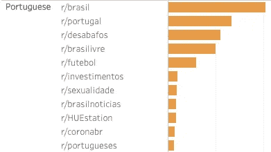
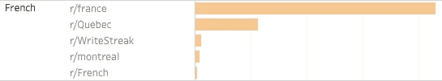

# 分析约 100 万条评论后，Reddit 上最受欢迎的语言

> 原文：<https://towardsdatascience.com/the-most-popular-languages-on-reddit-analyzed-with-snowflake-and-a-java-udtf-4e58c8ba473c?source=collection_archive---------9----------------------->

## Reddit 上最流行的语言(除了英语)会让你大吃一惊。为了构建这个图表，我用雪花和 Java UDTF 分析了将近一百万条 Reddit 评论(不到两分钟)。

Reddit 上最受欢迎的语言，分析了 1M 评论后:英语，德语(！)，西班牙语，葡萄牙语，法语，意大利语，罗马尼亚语(！)，荷兰语(！)…

与母语为英语的人数相比，结果令人惊讶:


Reddit 上的热门语言— [全图](https://i.imgur.com/GRGVyOW.png) + [更新 Tableau 互动](https://public.tableau.com/views/202110-redditlanguages-pub/Dashboard1?:language=en-US&publish=yes&:display_count=n&:origin=viz_share_link)(作者)

德语是 Reddit 上第二受欢迎的语言——这可能是本周 [Reddit 在柏林](https://www.redditinc.com/blog/hallo-and-guten-tag-reddit-is-coming-to-germany)开设办事处的一大原因:

> 每天都有数百万德国用户涌向 Reddit，与那些有相似兴趣的人一起寻找社区和归属感，随着 47%的用户年增长率，德国现在是我们第五大用户群的所在地。今天，我们正式向我们在欧洲中心的朋友们问好，并通过地面上的专门团队打开我们在柏林的大门。

在本帖中，我们将在 Snowflake 中用 Java UDF 分析近百万条 reddit 评论的结果——不到两分钟。还有哪些语言、地区、话题在 Reddit 上有很高的代表性？

# 分析

我从前 40 个子编辑之外的将近一百万条 Reddit 评论开始(在下面找到构建这个样本的确切规则)。一旦分析完成，就会发现只有约 3%的评论是用英语以外的语言写的:


约 97%的 Reddit 分析评论是英文的

最受欢迎语言的排名令人惊讶:Reddit 上第二受欢迎的语言是德语。第三个是西班牙语(没那么令人惊讶)，接下来是葡萄牙语、法语、意大利语、罗马尼亚语和荷兰语:


Reddit 上除英语之外最受欢迎的语言(图片由作者提供)

这些结果令人惊讶，因为德语是世界上第 12 大流行语言。作为一种语言，法语甚至比德语更受欢迎，但德语社区在 Reddit 上发现了更多的吸引力。

根据维基百科，这些是世界上使用最多的语言——这个列表与 Reddit 在其用户中看到的完全不同:


维基百科:[按使用者总数排列的语言列表](https://en.wikipedia.org/wiki/List_of_languages_by_total_number_of_speakers)

## 一种语言，许多子编辑

**德语 subreddits:** 大多数德语注释位于/r/de 中，即德国的 subreddit，其次是/r/Austria，然后是/r/Finanzen 中的金融对话。其次是德语版的/r/me_irl: [/r/ich_iel/](https://www.reddit.com/r/ich_iel/) 。


(图片由作者提供)

**西班牙语 subreddit:**西班牙语中最大的 subred dit 是/r/argentina。这很令人惊讶，因为墨西哥的人口是他们的 3 倍，但是/r/mexico 只有他们评论的 1/3。


(图片由作者提供)

**葡萄牙语 subreddit:**葡萄牙语中最大的 subred dit 是/r/brasil，其次是/r/portugal。这很令人惊讶，因为巴西的人口是他们的 20 倍，但/r/brasil 的评论只有他们的 1.5 倍。他们最受欢迎的话题是告白、未经审查的内容、足球、投资和性。



(图片由作者提供)

法语 subreddits: 令人惊讶的是/r/Quebec 是仅次于/r/france 的第二大法语 sub。



(图片由作者提供)

**以此类推**:列表继续


代表多种语言的子编辑(图片由作者提供)

## 一个子编辑，多种语言

一些子编辑处理多种语言的内容。常见的组合是英语加上另一种语言，然后是/r/塞尔维亚，它将其注释分为波斯尼亚语、克罗地亚语和塞尔维亚语:


带有多语言注释的子编辑(图片由作者提供)

# 操作方法

获取 100 万条 reddit 评论并在 Snowflake 中用 Java UDF 分析他们的语言并不困难，之前的帖子解释了这一点:

<https://medium.com/snowflake/loading-reddit-comments-into-snowflake-44b9f2072a84>  <https://medium.com/snowflake/new-in-snowflake-java-udfs-with-a-kotlin-nlp-example-e52d94d33468>  

# 疑问和注释

## 用 Java UDTF 检测语言

由于雪花最近宣布支持 [Java 表 UDF](https://docs.snowflake.com/en/developer-guide/udf/java/udf-java-tabular-functions.html)，我决定尝试一下。令人惊讶的是，表格 UDF 比我以前的 Java UDF 表现得更好。在下面的部分中可以找到关于这个的细节。

<https://www.snowflake.com/blog/bringing-more-to-the-table-azure-and-udtf-support-with-snowpark/>  

UDTFs 能够读取表并将表输出回来。这是产生本文结果的 UDTF 实现:

```
create or replace function detect_lang_udtf(v varchar)
returns table(output_value varchar)
language java
imports = ('@~/lingua-1.1.0-with-dependencies.jar')
handler='MyClass'
target_path='@~/202110xx3.jar'
as
$$
import java.util.stream.Stream;

import com.github.pemistahl.lingua.api.*;
import static com.github.pemistahl.lingua.api.Language.*;class OutputRow {
  public String output_value; public OutputRow(String output_value) {
      this.output_value = output_value;
  }
}class MyClass { static LanguageDetector detector = LanguageDetectorBuilder.fromAllLanguages().withPreloadedLanguageModels().build(); public MyClass()  {
  } public static Class getOutputClass() {
      return OutputRow.class;
  } public Stream<OutputRow> process(String input_value) {
      String x = detector.detectLanguageOf(input_value).toString();
      return Stream.of(new OutputRow(x));
  } public Stream<OutputRow> endPartition() {
      return Stream.empty();
  }
}$$;
```

## ~百万条评论样本

规则:

*   从 2020 年 12 月 1 日至 2021 年 12 月 14 日之间的 14 天 reddit 评论开始(参见[如何在雪花上加载 reddit 评论](https://medium.com/snowflake/loading-reddit-comments-into-snowflake-44b9f2072a84))。
*   丢弃前 40 个子编辑中的评论(不需要分析每个语言，主要是英语)。
*   从评论中删除特殊字符、URL 和链接。
*   只允许超过 200 个字符的评论。
*   丢弃 90%的剩余评论，保留 10%的随机样本。
*   应用前面的规则后，只保留子编辑中超过 50 条注释的注释(采样前为 500 条)。
*   有待分析的评论总数:3，860 个子评论中的 938，131 条。

```
create or replace temp table reddit_sample as 

with top_subs as (
    select count(*), v:subreddit subreddit
    from reddit_comments_sample
    group by 2 
    order by 1 desc
    limit 40
)

select *
from (
    select *, v:subreddit subreddit
        , regexp_replace(v:body, 'http[^ ]*', '') body_clean1
        , regexp_replace(body_clean1, '&[a-z][a-z]+;', '') body_clean2
        , regexp_replace(body_clean2, '\\[[^\\]]*\\]', '') body_clean
        , count(*) over(partition by subreddit) c_sub 
    from reddit_comments_sample
    where v:author not in ('[deleted]', 'AutoModerator')
    and subreddit not in (select subreddit from top_subs)
    and length(body_clean) > 200
    and uniform(0::float, 1::float, random()) < 0.1
)
where c_sub > 50
;
```

**用 UDTF 分析每个评论的语言**

为了优化，我们只给函数一个清理过的注释的前 200 个字符进行分析:

```
create table reddit_sample_languages_udtf
as
select *, output_value lang
from reddit_sample a, table(detect_lang_udtf(substr(body_clean, 0, 200)))  x
;
```

## 算英语 vs 不算


97%经过分析的 reddit 评论是英文的

```
select count(*) comments
    , ratio_to_report(comments) over() percent
    , iff(lang='ENGLISH', 'English', 'Not English') language
from reddit_sample_languages_udtf
group by 3
order by 1 desc
```

## UDF 对 UDTF 的表演

我以前的 UDF 用 XL 雪花仓库花了 4 分钟分析了 100 万条评论，而新的 UDTF 用了不到一半的时间就能做到。

当查看细节时，发现 UDF 和 UDTF 消耗的资源量相似——UDTF 更快，因为雪花并行化更好地执行了这些调用。

不要对此过于担心，因为雪花工程师目前正在努力改进这些情况。Java UDFs 和 UDTFs 目前在 Snowflake 中处于预览模式，您很快就能体验到这些改进。


XL warehouse 上 Java UDF 与 UDTF 的性能对比——UDTF 在当前实现下执行了更好的并行化(改进正在进行中)

```
select lang, count(*)
from (
    select *, detect_langs(substr(body_clean, 0, 200)) lang
    from reddit_sample a
)
group by 1
order by 2 desc
--4:06 UDF xl
;select lang, count(*)
from (
    select *, output_value lang
    from reddit_sample a
        , table(detect_lang_udtf(substr(body_clean, 0, 200)))  x
)
group by 1
order by 2 desc- 1m58s UDTF xl 
;
```

## 过滤和格式化结果

此查询查看以前的结果，格式化标签，查看子编辑中检测到的语言之间的比率，并排除每个子编辑中表示少于 2%的语言:

```
select 'r/'||subreddit sub
    , initcap(lang) language
    , count(*) c
    , ratio_to_report(c) over(partition by sub) ratio
    , sum(iff(language!='English', c, 0)) over(partition by sub) total_not_english
    , sum(c) over(partition by sub) total
from reddit_sample_languages_udtf
group by 1, 2
qualify ratio > .02
order by total_not_english desc, c desc, 1, ratio desc
```

# 信用

*   [杰森·鲍姆加特纳](https://medium.com/u/3a16fa97630d?source=post_page-----4e58c8ba473c--------------------------------)负责[收集和分享 Reddit 的评论](https://medium.com/snowflake/loading-reddit-comments-into-snowflake-44b9f2072a84)。
*   [Peter M. Stahl](https://github.com/pemistahl) 为 [Lingua](https://github.com/pemistahl/lingua) 项目检测 Java 中的语言。
*   雪花使在 UDF 中运行 Java 代码变得容易。

# 更新和评论

[](https://www.reddit.com/r/dataisbeautiful/comments/qhhqoy/the_most_popular_languages_on_reddit_after/)

[关于 reddit 的讨论](https://www.reddit.com/r/dataisbeautiful/comments/qhhqoy/the_most_popular_languages_on_reddit_after/)

*   查看 reddit 上的[评论，即:](https://www.reddit.com/r/dataisbeautiful/comments/qhhqoy/the_most_popular_languages_on_reddit_after/)[/r/dataisbeautiful/[…]/the _ most _ popular _ languages _ on _ Reddit](https://www.reddit.com/r/dataisbeautiful/comments/qhhqoy/the_most_popular_languages_on_reddit_after/)
*   [更新了 Tableau 上的交互式仪表盘](https://public.tableau.com/views/202110-redditlanguages-pub/Dashboard1?:language=en-US&publish=yes&:display_count=n&:origin=viz_share_link)。

# 想要更多吗？

*   用一个[雪花免费试用](http://bit.ly/sf-free-trial)账户试试吧——你只需要一个电子邮件地址就可以开始了。

我是 Felipe Hoffa，雪花的数据云倡导者。谢谢你和我一起冒险。可以[在 Twitter](https://twitter.com/felipehoffa) 和 [LinkedIn](https://www.linkedin.com/in/hoffa/) 关注我。查看[reddit.com/r/snowflake](https://www.reddit.com/r/snowflake/)最有趣的雪花新闻。