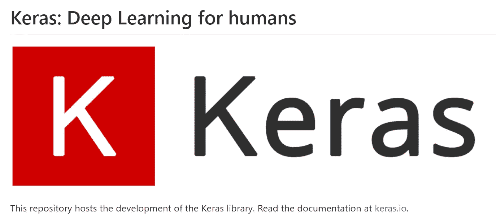
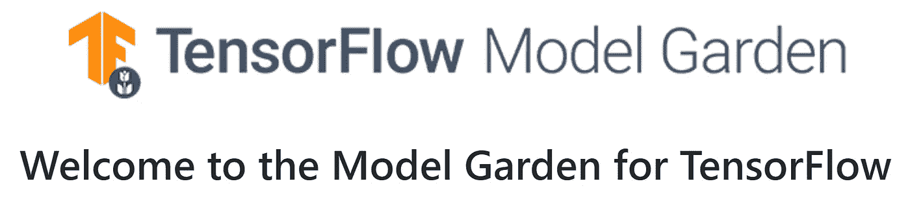
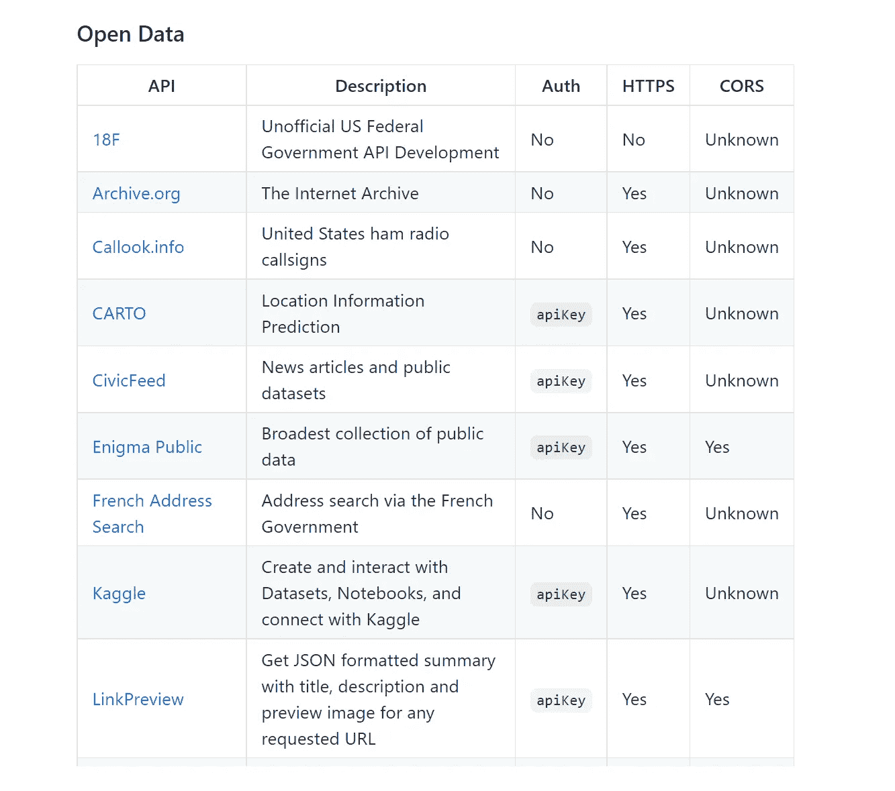

# 数据科学和 Python 的 GitHub Repos

> 原文：<https://towardsdatascience.com/the-most-starred-forked-github-repos-for-python-and-data-science-f8bb3de47e96?source=collection_archive---------22----------------------->

## 发现许多数据专业人员和 Python 程序员正在关注的非常受欢迎的回购

[史蒂夫·哈维](https://unsplash.com/@trommelkopf?utm_source=medium&utm_medium=referral)在 [Unsplash](https://unsplash.com?utm_source=medium&utm_medium=referral) 上拍照

GitHub 库的**星★** 和**叉ψ**是项目受欢迎程度和质量的一个很好的指示器。

**主演**一个回购除了作为书签功能，相当于在社交媒体上点击‘喜欢’按钮。

**分叉**回购创建内容的副本，表明某人对试验或贡献项目的兴趣。

在本文中，我们来看看 GitHub 上最流行的**基于 Python 的数据相关**repos。

## [10] [牛逼的机器学习](https://github.com/josephmisiti/awesome-machine-learning)

**★**50757
**ψ**12575

[*令人敬畏的机器学习*](https://github.com/josephmisiti/awesome-machine-learning) repo 提供了一个针对 Python 和其他编程语言的**机器学习**框架、库和软件的精选列表。

如果你正在寻找 Python 和机器学习的交叉点，你应该看看这个。

## [9] [keras](https://github.com/keras-team/keras)

**★**51954
**ψ**18752

[*Keras*](https://github.com/keras-team/keras)*是一个基于 Python 的**深度学习** **API** ，运行在高度流行的开源机器学习平台 [Tensorflow](https://www.tensorflow.org/) 之上。*

*Keras 专注于快速实验，允许用户尽可能快地从想法到结果。*

**

*截图来自 Keras GitHub 页面|图片在 Apache 许可下使用*

## *[烧瓶](https://github.com/pallets/flask)*

***★**56095
**ψ**14461*

*[*Flask*](https://github.com/pallets/flask) 也是最流行的 Python web 应用程序框架之一(也是我个人最喜欢的)，这是由于它在定制方面的易用性和灵活性。*

*Flask 也常用于在数据科学项目中部署**机器学习(ML)模型**。这一点很重要，因为 ML 车型的[值只有在投入生产](/key-learning-points-from-mlops-specialization-course-deeplearning-ai-andrew-ng-5d0746605752)时才能实现。*

## *姜戈*

***★**58644
**ψ**25067*

*[*Django*](https://github.com/django/django) 是一个流行的高级 Python Web 框架，它鼓励快速开发以及干净、实用的设计。*

*Django 以其速度、安全性和可伸缩性而闻名，是 web 开发的一个流行的开源框架选项，也可以用于机器学习模型的部署。*

## *[型号](https://github.com/tensorflow/models)*

***★**70683
**ψ**44539*

*[*车型*](https://github.com/tensorflow/models) 回购是 [Tensorflow](https://www.tensorflow.org/) 车型园的所在地。它包括最新模型和建模解决方案的不同实现。*

*它旨在展示建模的最佳实践，以便用户可以充分利用 **TensorFlow** 进行研究和产品开发。*

**

*截图来自模型 GitHub 页面|图片在 Apache 许可下使用*

## *【5】[YouTube-dl](https://github.com/ytdl-org/youtube-dl)*

***★**97905
ψ5514*

*[*youtube-dl*](https://github.com/ytdl-org/youtube-dl) 项目(顾名思义)是一个命令行程序，供用户**从 YouTube** 下载视频。如果你想为视频分析检索数据，这个回购无疑会很有帮助。*

**

*诺德伍德主题公司在 [Unsplash](https://unsplash.com?utm_source=medium&utm_medium=referral) 上拍摄的照片*

## *[4] [牛逼——巨蟒](https://github.com/vinta/awesome-python)*

***★**101024
**ψ**19535*

*[*awesome-python*](https://github.com/vinta/awesome-python)repo 提供了一个 Python 框架、库、软件和资源的精选列表。*

*它整理了广泛主题的广泛列表，如[数据可视化](https://github.com/vinta/awesome-python#data-visualization)、[数据库驱动](https://github.com/vinta/awesome-python#database-drivers)、[网络爬行](https://github.com/vinta/awesome-python#web-crawling)和[深度学习](https://github.com/vinta/awesome-python#deep-learning)。*

## *[3] [Python-100 天](https://github.com/jackfrued/Python-100-Days)*

***★**106206
**ψ**42079*

*[*Python-100 天*](https://github.com/jackfrued/Python-100-Days) 回购因为内容是用普通话写的，所以迎合了**华语**观众。它包括一个在 100 天内学习 Python 的结构化课程。*

*如果你懂普通话，并且热衷于开始 Python 学习之旅，这个回购当然适合你。*

## *[Python](https://github.com/TheAlgorithms/Python)*

***★**113189
**ψ**30836*

*这个 [*Python*](https://github.com/TheAlgorithms/Python) repo 包含大量示例代码，用于众多算法的 Python 实现。*

*它包括**像计算机视觉和神经网络这样的热门**主题，一直到**像区块链和动态编程这样的专业**主题。*

**

*马里乌斯·马萨拉尔在 [Unsplash](https://unsplash.com?utm_source=medium&utm_medium=referral) 上的照片*

## *[1] [公共-API](https://github.com/public-apis/public-apis)*

***★(星星):**141984
**ψ(叉子):**16596*

*这是基于受欢迎程度的顶级回购。[*public-API*](https://github.com/public-apis/public-apis)repo 提供了一个用于软件和 web 开发以及数据科学的**免费 API**的合并列表。*

*我发现与数据专业人员高度相关的几类 API 包括[开放数据](https://github.com/public-apis/public-apis#open-data)、[数据验证](https://github.com/public-apis/public-apis#data-validation)、[测试数据](https://github.com/public-apis/public-apis#test-data)和[机器学习](https://github.com/public-apis/public-apis#machine-learning)。*

**

*在麻省理工学院许可下使用的开放数据类别|图像中可用的 API 示例*

# *结论*

*GitHub 拥有丰富的令人惊叹的开源内容，所以我希望这给了你一些灵感，让你知道应该关注哪些 repos。*

*以上列表是基于 [**EvanLi 的 Github 排名回购**](https://github.com/EvanLi/Github-Ranking) 参考的，我强烈推荐你也去看看。*

*欢迎您加入我的数据科学学习之旅！关注此[媒体页面](https://kennethleungty.medium.com/)以了解更多数据科学内容，或者在 [LinkedIn](https://www.linkedin.com/in/kennethleungty/) 上联系我。尽情探索流行的 GitHub repos 吧！*

*</analyzing-english-premier-league-var-football-decisions-c6d280061ebf>  </free-resources-for-generating-realistic-fake-data-da63836be1a8>  </key-learning-points-from-mlops-specialization-course-deeplearning-ai-andrew-ng-5d0746605752> *