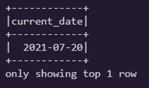

# Spark 中最有用的数据操作函数

> 原文：<https://towardsdatascience.com/the-most-useful-date-manipulation-functions-in-spark-7d827f790b?source=collection_archive---------1----------------------->

## 用清晰的例子深入探究最有趣的日期函数


在 [Unsplash](https://unsplash.com/s/photos/time?utm_source=unsplash&utm_medium=referral&utm_content=creditCopyText) 上 [NeONBRAND](https://unsplash.com/@neonbrand?utm_source=unsplash&utm_medium=referral&utm_content=creditCopyText) 拍摄的照片

Pyspark 和 Spark SQL 提供了许多内置函数。当使用存储日期和时间类型值的 DataFrame 时，日期和时间函数等函数非常有用。有时，您可能想写一个 UDF(用户定义的函数),但后来意识到最好还是查看一下文档，因为它已经存在了。在本文中，我们将通过一些例子来检查哪些是最重要的 Spark SQL 日期函数。

# Spark SQL 日期函数

Spark SQL 内置日期函数对用户和性能都很友好。Spark SQL 支持 Apache Hive 中支持的几乎所有日期函数。下表列出了 Spark SQL 日期函数，这些函数可用于操作包含数据类型值的数据框列。这个列表包含了 Apache Spark 支持的几乎所有日期函数。


日期函数及其描述的摘要(图片由作者提供)

对于本教程，我使用的是机场数据集，该数据集是开源的，可以在 [Kaggle](https://www.kaggle.com/flashgordon/usa-airport-dataset) 上找到。

```
**Reading CSV File**
>>> df = spark.read.csv("Airports2.csv", header=True, inferSchema=True)***Visualizing the first 5 rows of the dataset***
>>> df.show(5)
```


(图片由作者提供)

```
**Checking the Schema**
>>> df.printSchema()
```


(图片由作者提供)

如你所见，上面包含日期的“Fly_Date”列是字符串类型。

1.  **To_date(col)** → *将包含日期值的字符串类型转换为日期格式*

```
**Example:*****Converting the string type "Fly_date" column containing dates value to date type/format.***>>> df = df.withColumn(‘Fly_date’, **to_date**("Fly_date"))
>>> df.printSchema()
```


(图片由作者提供)

**2。Date_format(date，format)** → *将日期/时间戳/字符串转换为由第二个参数给出的日期格式指定的格式的字符串值。*

```
**Example:*****Format "Fly_date" column with the "dd/MM/yyyy" format*** >>> df.select("Fly_date", **date_format**("Fly_date", "dd/MM/yyyy").alias("Formatted_date")).show(3)
```


(图片由作者提供)

**3)日期 _ 添加(开始，天数)** →向日期添加天数

```
**Example:*****Adding two days to the Fly_date columns***>>> df.select("Fly_date", **date_add**("Fly_date",2).alias("date_added")).show(5)
```


(图片由作者提供)

**4)添加月数(开始，月数)**→添加月数

```
**Example:*****Adding two months to the date columns and saving into a new dataframe***>>> test_df=df.select('Fly_date', **add_months**(df.Fly_date,2).alias("months_added"))>>> test_df.show(5)
```


(图片由作者提供)

**5) Datediff(end，start)** →返回两个日期之间的天数差。

```
**Example:*****Returns the difference between two dates in days***>>> test_df.select("Fly_date","months_added", **datediff**("months_added", "Fly_date").alias("date_diff")).show(3)
```


(图片由作者提供)

**6)提取单个“日期”元素**

*   **Year(Col)** →提取给定日期对应的年份为整数。
*   **Quarter(Col)** →提取给定日期对应的季度为整数。
*   **Month(Col)** →提取给定日期对应的月份为整数。
*   **Dayofmonth(Col)** →提取给定日期的月份中相应的一天作为整数。
*   **Weekofyear(Col)** →提取给定日期对应的周数为整数。
*   **Hour(Col)** →提取给定日期对应的小时数为整数。
*   **分钟(Col)** →提取给定日期对应的分钟数为整数。

```
**Examples:** **# Year**
>>> test_df.select("date_days", **year**( "date_days").alias("year")).show(3)**# Month**
>>> test_df.select("date_days", **Month**( "date_days").alias("Month")).show(3)**# Dayofmonth**
>>> test_df.select("date_days", **Dayofmonth**( "date_days").alias("Day of the Month")).show(3)**# Weekoftheyear** >>> test_df.select("date_days", **Weekofyear**( "date_days").alias("Week of the year")).show(3)
```


提取年、月、日和周(图片由作者提供)

**7) Date_sub(开始，天数)→** 从日期字段中减去天数。

```
**Example:*****Subtract three days to the current date***>>> df.select('Fly_date', **date_sub**(df.Fly_date,3).alias("date_sub")).show(3)
```


日期子结果(作者图片)

**8) Last_day(date) →** 返回给定日期所属月份的最后一天。

```
**Example:*****Get the last day of the month using "last_day" function***>>> df.select("Fly_date", **last_day**( "Fly_date").alias("last_date")).show(4)
```


(图片由作者提供)

**9) Months_between(date 1，date 2) →** 得出两个日期之间的月数。

```
**Example:*****Identify the months between "Month Added"  and "Fly date" using months_between function***>>> new_df=test_df.select("Fly_date","month_added", **months_between**("month_added", "Fly_date").alias("months")).show(3)
```


(图片由作者提供)

**10) Next_day(date，dayOfWeek) →** 返回晚于日期列值的第一个日期。

```
**Example:*****Getting next Tuesday date using the "next_day" function***>>> df.select("Fly_date", **next_day**("Fly_date", "tue").alias("Next_Tuesday")).show(3)
```


(图片由作者提供)

**11)按‘日期’排序→** 按日期排序数据帧

```
**Example:*****Sorting the selected columns by "Fly date" column in descending order***>>> df.select("Passengers","Fly_date")./
   **sort**(df.Fly_date.desc()).show(3)
```


(图片由作者提供)

**12)当前时间戳→** 返回当前时间戳作为时间戳列

```
**Example:*****Returns the current timestamp as a timestamp column***>>> df.select(**current_timestamp()**.alias( "current_timestamp")).show(1)
```


(图片由作者提供)

当前日期→ 以日期列的形式返回当前日期。

```
**Example:
** 
***Returns the current date as a date column***>>> df.select(**current_date**().alias(“current_date”)).show(1)
```



(图片由作者提供)

# 结束注释

在这篇文章中，我试图用一个相关的例子来展示不同的日期函数。这些函数在日期类型列的操作以及为机器学习提供有趣的功能和从数据中创建有趣的见解方面提供了很大的灵活性。尽可能使用这些函数，而不是 Spark SQL 用户定义的函数。感谢您的阅读:)

更多阅读:

[](/dimensionality-reduction-for-data-visualization-pca-vs-tsne-vs-umap-be4aa7b1cb29) [## 数据可视化的降维:主成分分析与 TSNE、UMAP 和线性判别分析

### 使用 PCA、TSNE、LDA 和 UMAP 可视化高维数据集

towardsdatascience.com](/dimensionality-reduction-for-data-visualization-pca-vs-tsne-vs-umap-be4aa7b1cb29) [](/statistical-testing-understanding-how-to-select-the-best-test-for-your-data-52141c305168) [## 统计测试:了解如何为您的数据选择最佳测试！

### 这篇文章面向有抱负的数据科学家和机器学习(ML)学习者和实践者。

towardsdatascience.com](/statistical-testing-understanding-how-to-select-the-best-test-for-your-data-52141c305168) [](/creating-beautiful-gif-with-python-for-your-data-analysis-ac50c618b559) [## 如何在 Python 中为您的数据分析创建漂亮的 GIF

### 几行代码中的交互性和动画

towardsdatascience.com](/creating-beautiful-gif-with-python-for-your-data-analysis-ac50c618b559) [](/most-common-data-modelling-interview-questions-4055adf79229) [## 每个人都应该知道的最常见的数据建模面试问题

### 了解 SQL、NoSQL、关系数据库等的基础知识…

towardsdatascience.com](/most-common-data-modelling-interview-questions-4055adf79229)