# 特征缩放的秘密终于被解开了

> 原文：<https://towardsdatascience.com/the-mystery-of-feature-scaling-is-finally-solved-29a7bb58efc2?source=collection_archive---------6----------------------->

照片由 [Danist Soh](https://unsplash.com/@danist07?utm_source=unsplash&utm_medium=referral&utm_content=creditCopyText) 在 [Unsplash](https://unsplash.com/?utm_source=unsplash&utm_medium=referral&utm_content=creditCopyText) 上拍摄

## [思想与理论](https://towardsdatascience.com/tagged/thoughts-and-theory)

***首席研究员:Dave Guggenheim /合作研究员:Utsav Vachhani***

**摘要**

对于一些机器学习模型，特征缩放是数据预处理的重要步骤。正则化算法(例如，lasso 和 ridge 惩罚)、基于距离的模型(例如，k-最近邻、聚类、支持向量机等)。)，以及人工神经网络在预测器处于相同尺度或相同边界内时都表现得更好。但是特征缩放不仅仅是诱导一致性；它可以成为您预测建模工具箱的强大补充。

我们通过对 60 个分类数据集进行 800 多次实验来研究特征缩放，我们所了解到的将会是惊喜的。一方面，你看到的关于选择缩放方法的规则对于预测模型是没有意义的。另一方面，曾经被认为是数据预处理的一个卑微的方面，一种新的特征缩放方法可以从我们的模型中释放出更高的性能。

本文假设您熟悉分类模型、特性缩放原因和方法、支持向量机以及偏差和方差。

**简介**

你可能会问什么时候应该使用规范化，什么时候应该使用标准化。这个问题没有确定的答案”(Burkov，2019，pg。46).

距离 k-最近邻算法的发明已经过去了 50 年，这可能是第一个需要预测器一致性的监督模型，而特征缩放仍然是一个谜。尽管缺乏一个明确的答案，但关于何时应该使用标准化或规范化，有几个规则在广泛和重复的分布中。一些规则以数据为中心，而另一些则侧重于选择特征缩放方法的学习模型。我们将测试这些规则，努力强化或改进它们的用法，也许会开发出一个更确定的特性缩放答案。

***以数据为中心的启发式包括以下:***

1.如果您的数据有异常值，请使用标准化或稳健缩放。

2.如果您的数据具有高斯分布，请使用标准化。

3.如果您的数据具有非正态分布，请使用归一化。

***以模型为中心的规则包括这些:***

1.如果您的建模算法假设(但不要求)残差为正态分布(即正则化线性回归、正则化逻辑回归或线性判别分析)，请使用标准化。

2.如果您的建模算法对数据的分布没有任何假设(例如，k-最近邻、支持向量机和人工神经网络)，则使用归一化。

在每个用例中，规则都提出了与数据或学习模型的数学拟合。我们的目标是测试这些规则，以发现它们的有用性，并确定是否可以开发一个更全面的集合来指示特征缩放方法的完美选择。

**模型定义**

由于其对缩放数据的要求，我们选择了支持向量分类器，因为除了以数据为中心的规则之外，它还可以帮助确认那些不假设数据或残差正态分布的算法的以模型为中心的规则。

本研究中的所有模型都是使用 sci-kit 学习库中的支持向量分类器(SVC)包进行的。每个模型通过分层抽样进行 10 倍交叉验证，所有模型都使用以下超参数值:

a.kernel = 'rbf '，

b.gamma = '自动'，

c.随机状态= 1

所有其他超参数保留各自的默认值。所有模型都是使用这些缩放算法(sci-kit 学习包在括号中命名)用特征缩放数据构建的:

a.标准化(标准缩放器)

b.L2 归一化(归一化器；norm='l2 ')

c.鲁棒(RobustScalerquantile_range=(25.0，75.0)，with_centering=True，with_scaling=True)

d.规范化(最小最大缩放器；feature_range =多个值(见下文))

*d1。特征 _ 范围= (-1，1)*

*d2。特征 _ 范围= (0，1)*

*d3。feature_range = (0，2)*

*d4。feature_range = (0，3)*

*d5。feature_range = (0，4)*

*d6。feature_range = (0，5)*

*d7。feature_range = (0，6)*

*d8。feature_range = (0，7)*

*d9。feature_range = (0，8)*

d10。特征 _ 范围= (0，9)

应该注意的是，根据“支持向量分类实用指南”(Hsu，Chang，Lin 等人，2003)，应该使用范数(-1，1)或范数(0，1)来获得最佳结果。这与以下观点一致:因为径向基核函数在其数学中使用特征向量之间的平方欧几里得距离，所以 SVC 模型在归一化时应该表现得更好，因为它为距离度量保留了更准确的信息。sci-kit learn 中的 SVC 文档将标准化作为另一个选项(Scikit-learn_developers，未注明)。

在每个预测因子少于 12 个样本的情况下，我们将测试分区限制为不少于总体的 10%。如果有足够的样本达到合理的预测精度(由样本复杂性泛化误差确定),我们使用统一的 50%测试分区大小。在这两个界限之间，我们调整了测试规模，以限制泛化测试误差，与训练样本规模进行权衡(Abu-Mostafa，Magdon-Ismail，& Lin，2012，第。57).

任何缺失值都使用 MissForest 算法进行估算，因为该算法在多重共线性、异常值和噪声面前具有很强的鲁棒性。分类预测因子是使用 pandas get_dummies 函数一次性编码的，没有丢弃的子类型(drop_first=False)。低信息变量(如身份证号码等。)在训练/测试分区之前被丢弃。

构建这些模型的目的是比较特征缩放算法，而不是调整模型以获得最佳结果。出于这个原因，我们在模型中引入了尽可能多的默认值，为上述比较创造了一个平台。此外，伽马值可以通过交叉验证进行调整，因此该模型不会像之前的研究(Pandey & Jain，2017 年)所证明的那样，偏爱一种缩放方法。所有性能指标都是作为对测试数据的预测的总体准确性来计算的，并且通过两个阈值来检查该指标:1)作为概化的度量，在最佳性能的 3%以内，以及 2)作为预测准确性的度量，在最佳性能的 0.5%以内。

本分析中使用的 60 个数据集如表 1 所示，具有广泛的预测器类型和类(二元和多元类)。大多数数据集可以在 UCI 索引( [UCI 机器学习库:数据集](https://archive.ics.uci.edu/ml/datasets.php))找到。不在 UCI 索引中的数据集都是开源的，可以在 Kaggle:

波士顿房屋:[波士顿房屋| Kaggle](https://www.kaggle.com/c/boston-housing)；HR 员工流失:[员工流失| Kaggle](https://www.kaggle.com/colearninglounge/employee-attrition)；借贷俱乐部:[借贷俱乐部| Kaggle](https://www.kaggle.com/c/lending-club/data)；电信客户流失:[电信客户流失| Kaggle](https://www.kaggle.com/blastchar/telco-customer-churn)；丰田卡罗拉:[丰田卡罗拉| Kaggle](https://www.kaggle.com/tolgahancepel/toyota-corolla)

38 个数据集是二项式的，22 个是多项式分类模型。所有模型都是根据所有数据集创建和检查的。表中列出的预测数是未编码的(分类的)和所有原始变量，包括排除前的非信息变量。

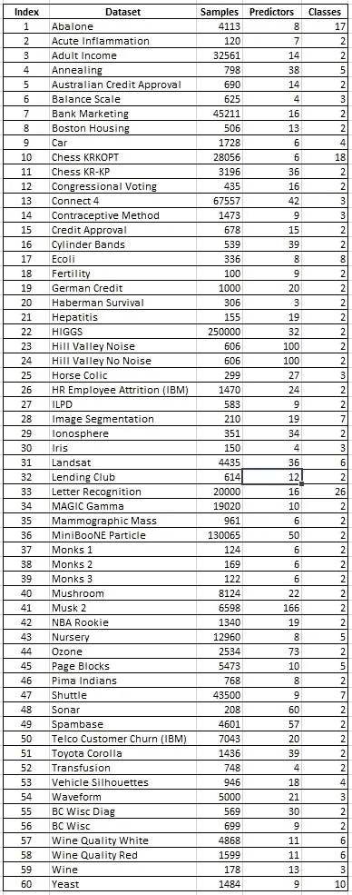

表 1:数据集(按作者分类的图片)

**尝试开发启发式数据中心**

***异常值分析—异常分值***

我们检查的第一个以数据为中心的规则涉及数据范围内异常值的存在，并建议了两种不同的方法:1)标准化，和 2)稳健缩放。为了测试这一规则，我们构建了一个隔离森林模型，专门用于根据整个数据集中的异常值密度生成异常值。然后，我们将原始得分转换为调整后的平均绝对异常得分(MAAS ),以便在数据集的交叉样本之间进行比较。图 1 显示了数据的子集，包括准确度、最佳特征缩放方法和 MAAS 评分(星号表示相对于预测值计数样本数量较少的数据)。

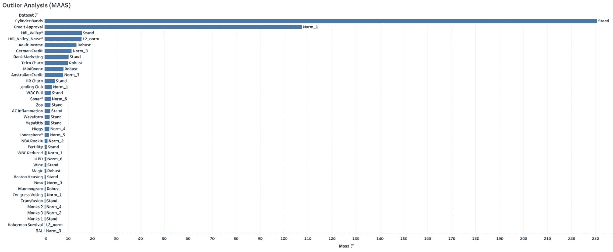

图 1: MAAS(异常密度)对比图(图片由作者提供)

标准化或稳健缩放与较高的异常值密度之间没有一致的关系。这可能很难检测到，因为当以数据为中心的规则与以模型为中心的规则冲突时，结果是未知的，例如当数据要求标准化而模型寻求规范化时。规则的第一个严重缺陷…

***统一与定制特征缩放***

我们在数据集的一个子集上检查了单独缩放与统一缩放，测试了以数据为中心的规则是否通过预测器离散地应用。用于此分析的数据集包括:

澳大利亚信贷，银行，波士顿住房，国会，圆筒乐队，生育，德国信贷，哈伯曼生存，肝炎，希格斯，希尔 _ 山谷(无噪音)，希尔 _ 山谷(噪音)，和马绞痛。

个体或“自定义”特征缩放对所有数值变量使用标准化，对所有明显的分类变量使用默认标准化(feature_range = (0，1))。这种方法在任何时候都不会超过最佳单一特征缩放方法在任何数据集上的精度，这可能是因为变量不再按照学习模型的要求进行统一缩放。

***分布分析***

测试以数据为中心的规则还需要创建一个单一的“超级”预测器，该预测器只包含重要的信息，以便进行分布分析。

这个过程从使用超参数的默认值构建一个简单的随机森林模型开始，以揭示由信息增益确定的可变重要性。从中，我们选择了总计超过 50%的信息增益的预测因子；这个限制对于图形显示的简约性至关重要。如果没有对预测因子的这种限制，检测模式可能会困难得多。这些变量被命名为“Top50”，它们被连接成一个单独的列，一个超级预测值，可以检查其分布特征和描述性统计数据(有关更多信息，请参考图 2 和图 3)。

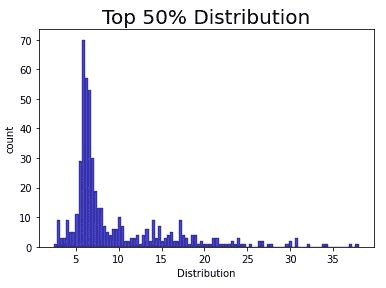

图 2:波士顿住房 50 强直方图(图片由作者提供)

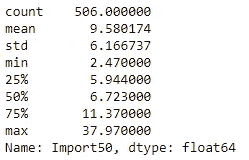

图 3:波士顿住房 50 强描述性统计(图片由作者提供)

使用前 50 个直方图，我们测试了关于高斯和非高斯分布的以数据为中心的规则。标准化在 60 个测试数据集的 30 个数据集上表现最佳，但在其中只有 4 个案例中，Top50 的双尾分布符合最广泛的“正常”定义(参见图 2 中的示例)。因此，关于高斯分布和标准化的规则在各种数据集之间缺乏一致性。让事情变得更加混乱的是那些标准化和默认规范化表现同样出色的例子。有关这些匹配的更多信息，请参考图 4 和图 5。

图 4:肝炎 50 强直方图(图片由作者提供)

图 4 是肝炎数据集，标准化和规范化的总体准确率达到 81.25%。

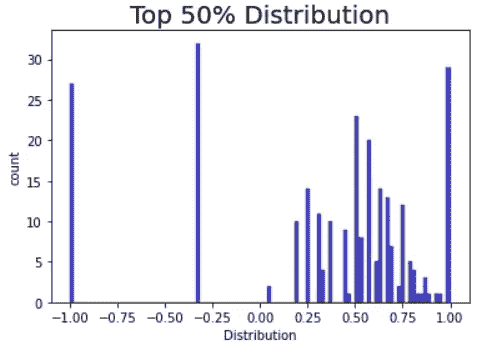

图 5:生育率前 50 名直方图(图片由作者提供)

图 5 是生育力数据集，标准化和规范化的总体准确率达到 90.00%。

两个非常不同的发行版，但具有相同的功能扩展性能！但是我们还没有完成发行。使用前 50 个预测值，我们进行了一个分布分析，看看是否有任何超级预测值符合 89 个分布模式中的一个，从中可以得出更好的启发(见图 6)。

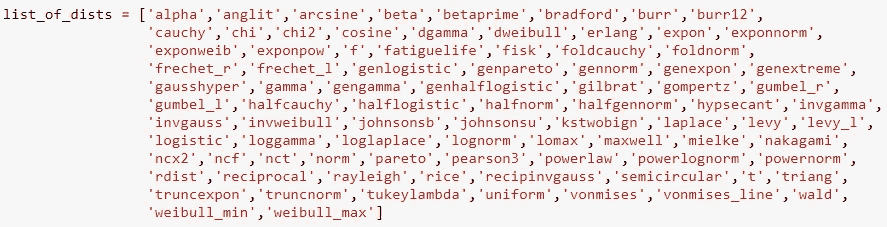

图 6:分布模式列表(图片由作者提供)

在我们的分布分析中找不到快乐。唯一匹配任何数据集的模式是 Von Mises，它只在两种情况下匹配——这对于开发新规则来说是不够的。在特征尺度选择方面，分布和分布模式显得很弱。

有一条以数据为中心的“规则”似乎是常识。国会投票数据由只有 0 和 1 两个值的预测值组成。在这种情况下，特征范围从 0 到 1 的归一化应该是最好的特征缩放方法(参见图 7)。是的，但是除此之外，标准化、稳健缩放、norm(0，2)、norm(0，3)和 norm(-1，1)在顶级性能方面都是相同的。**其余的标准化方法在测试准确性方面落后超过 7%**。这提出了一个有趣的问题，“为什么 Norm(0，3)的精确度最高，而 Norm(0，4)的精确度最低？”答案可能会让你大吃一惊。

图 7:国会投票 50 强直方图(图片由作者提供)

**经过这一级别的调查，我们可以断言，以数据为中心的规则充其量是有缺陷和令人困惑的，它们应该被避免。**

**试图开发一种启发式模型中心性**

以模型为中心的规则只在对数据分布不做任何假设的算法方面进行了测试，如 k-最近邻、支持向量机和人工神经网络。因为具有径向基核的支持向量机使用欧几里德距离，所以我们的测试被限制在这个区域。需要做进一步的测试来扩展它，以包括人工神经网络和那些假设残差为正态分布的建模算法。

在对照 60 个数据集检查了列出的特征缩放方法后，**我们发现标准化比任何版本的归一化更好地概括和预测**，这与距离测量和归一化之间的数学对齐相反。图 8 显示了数据集的数量以及每种要素缩放方法达到最佳精度性能 3%以内的数据集占总数的百分比，以表示概化；图 9 显示了数据集的数量以及这些方法达到接近最佳或最佳性能(最佳精度 0.5%以内)的数据集占总数的百分比，以表示预测精度。以强度显示的条形展示了两种最常见的支持向量特征缩放方法和最佳表现方法标准化之间的差异。

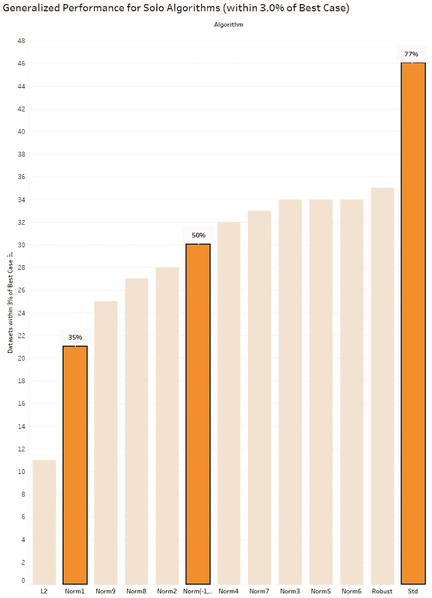

图 8:功能将性能调整到最佳情况的 3.0%以内(图片由作者提供)

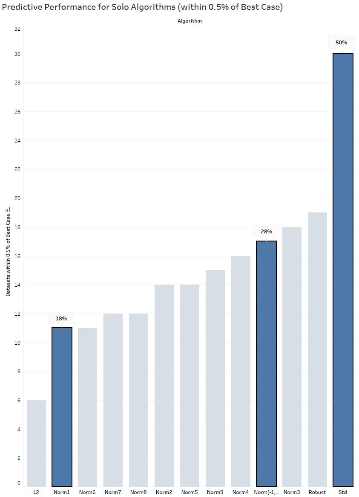

图 9:功能将性能调整到最佳情况的 0.5%以内(图片由作者提供)

**偏差-方差障碍**

基于从以数据为中心和以模型为中心的结果中收集的证据，**我们假设与数据或模型一致的特征缩放可能是过度拟合的原因，就像超参数一样，需要对其进行“去谐”以获得最佳性能。**这就是 Z 分数标准化(一种扭曲距离测量的缩放方法)在距离敏感学习模型中表现最佳的原因，它抑制了对训练数据的过度拟合。以及为什么 Norm3 和 Norm4 在国会投票数据集上如此不同；预测误差曲面中的各种极小值。

这些规则寻求与数据或模型的匹配，但对齐会导致低偏差和差的预测性能。简而言之，这些规则似乎与其预期效果背道而驰。

因为一旦数据被划分为训练集和测试集，我们就面临方差的影响，方差是一种随机函数，它将创建精确选择启发式算法的过程变成了 NP-hard 问题。在 Python 语言中，从“fit_transform”到“transform”的看似简单的转换不仅仅是列度量中的不匹配。它嵌入了额外的方差复杂性。在对训练数据应用 fit_transform 时，会产生密切相关的偏差。**这是机器学习的新观点，在为需要规模数据的学习算法建模之前，先接受偏差和方差。**

为了测试特征缩放和偏差-方差权衡之间的关系，我们构建了相同的归一化模型，从 feature_range = (0，1)到 feature_range = (0，9)依次循环。每个阶段的训练和测试集精度被捕获并标绘，训练用蓝色，测试用橙色。**当我们在不改变数据或模型的任何其他方面的情况下增加特征范围时，结果是更低的偏差。**在大多数情况下，较低的偏差伴随着较高的方差和较差的测试结果。参考图 10-12，了解六十个数据集中三个数据集的详细情况。

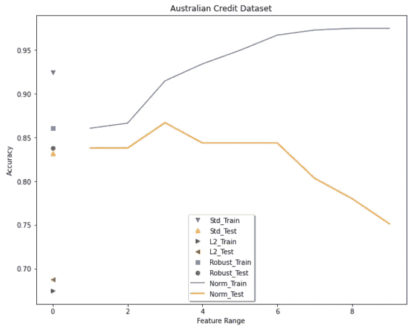

图 10:澳大利亚信贷标准化图(图片由作者提供)

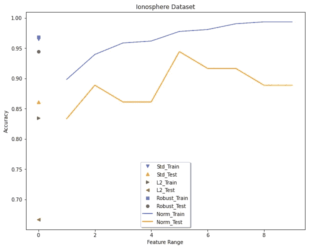

图 11:电离层归一化图(图片由作者提供)

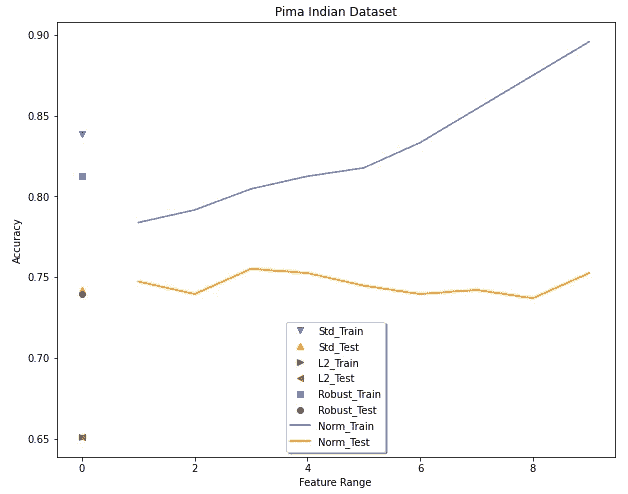

图 12: Pima 印度标准化图(图片由作者提供)

偏倚、方差和特征缩放之间的关系得到了明确的证实。当然，这只是六十个数据集中的三个，所以这里是我们提供的一些额外的图表作为证据(按字母顺序，不多不少):

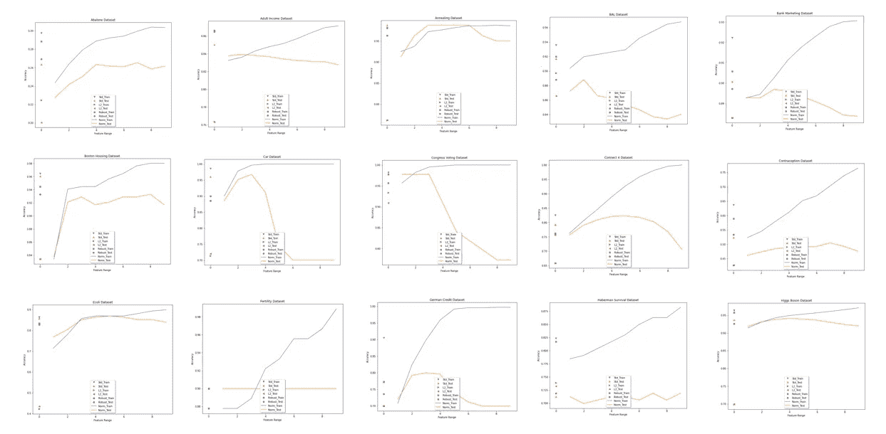

这种偏差-方差性能可能是特定于支持向量分类器的；需要做更多的工作来确定情况是否如此。无论如何，在训练数据上在 Norm(0，9)处达到的最大准确度值进一步证实了归一化更适合于距离度量，并且因此产生较差的预测性能。

但是那些没有查看偏差和方差范围的缩放方法呢？关于点值，如标准化，方差本身可被视为“学习模型中的不稳定性”(Abu-Mostafa 等人，2012)，我们通过创建 200 个不同的训练/测试分裂来诱导这种不稳定性，如通过从 1 到 200 按一个单位顺序递增 random_state 值所定义的。这些点表示测试与训练准确性的比率，该图通过数据的随机划分显示了这两个指标之间的波动性。

使用具有相同 SVC 模型的波士顿住房数据集，图 13 显示了使用标准化的随机方差分布，而图 14 显示了相同的输出，但具有稳健的缩放。这些图中的每个数据点(即，底部的刻度指示分区的随机状态值)使用相同的分区数据进行训练和测试。

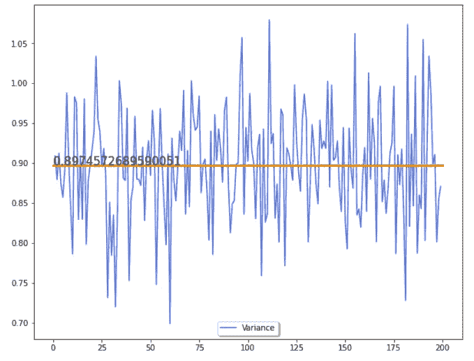

图 13:波士顿住宅的 200 个 SVC 模型与 StandardScaler 的差异(图片由作者提供)

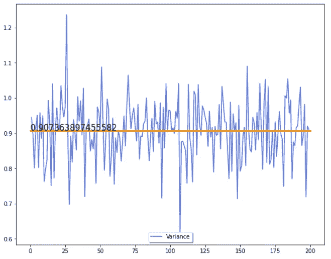

图 14:波士顿住宅的 200 个 SVC 模型与 RobustScaler 的差异(图片由作者提供)

注:方差均值几乎相同(0.892 对 0.907)，但考虑到 StandardScaler 和 RobustScaler 是本研究中仅有的两种缩放算法，意味着将变量集中在零。在鲁棒定标器的情况下，中值也是以零为中心的。

每个图展示了其各自的缩放方法和学习算法的不稳定性或方差函数，正如预期的那样，当使用相同的数据和相同的模型时，它们提供了明显不同的分布。

方差和特征缩放相互作用，方差是一个随机函数。考虑到随机性如何混淆特征缩放的正确选择，我们提出了以下推测:

**猜想 1:由于方差，无法开发出以数据为中心或以模型为中心的规则来指导预测模型中特征缩放的完美选择。**

布尔科夫的断言(2019)得到了对其机制的理解的充分支持。我们没有制定规则，而是选择了一条“模糊”的前进道路。

**分类模型的广义特征缩放算法**

考虑到随机函数是不可预测的，而是广义的，我们的下一个方法是建立一个集成特征缩放算法，以提高 3%阈值的泛化能力和 0.5%阈值的预测精度。

由于共享的零均值和适用性的潜在收益，我们建立了两个集成特征缩放算法，结合标准化和鲁棒缩放，并针对 60 个数据集测试它们。这与图 8(概化)和图 9(预测准确性)中描述的前两种缩放方法相一致。

图 15 显示了两种集成算法，第一种使用堆叠分类器，第二种使用软阈值(概率而不是类成员)实现投票分类器。这两个集合都是使用 Python 中 sci-kit learn 库的标准包实现的。

图 15:集合特征缩放过程流程(图片由作者提供)

在图 16 中可以找到比较结果，该结果对照最佳 solo 方法(标准化)检查了这些集合的性能。

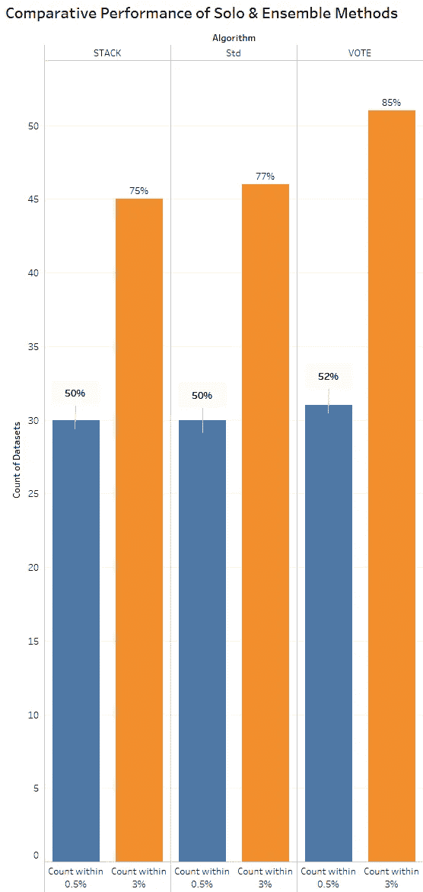

图 16:与最佳 Solo 算法的集合特征缩放比较(图片由作者提供)

在图 14 中，堆叠分类器似乎并没有改进标准化，但这并不是全部。在 STACK 获得最佳准确度的 30 个案例中，17 个模型创造了新的记录(即超级表现者)。STACK 的概括能力比标准化稍差，但准确性更高。详情参见图 17。

就投票而言，在达到最佳准确率的 31 个案例中，有 14 个创造了新的记录。投票集合在普遍性和准确性方面都优于标准化。

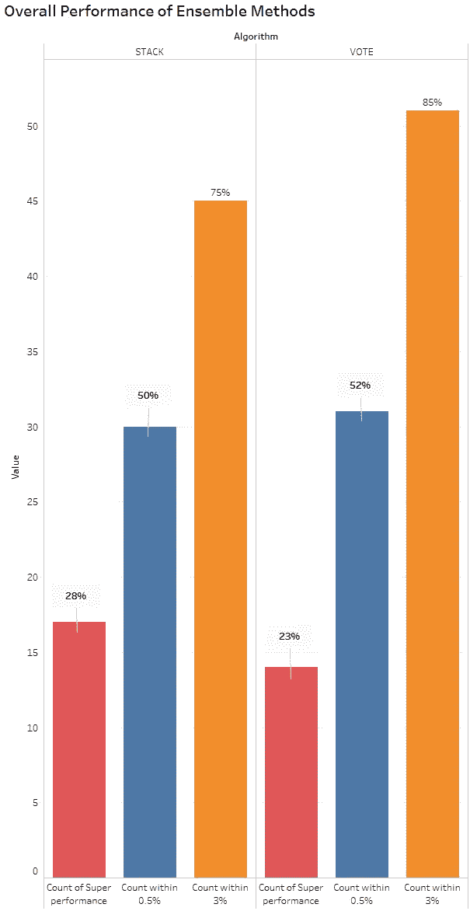

图 17:集合特征缩放性能(图片由作者提供)

为了进一步改善结果，在参考图 8 及其概化描述后，我们构建了一个三管道模型，除了标准化和稳健缩放之外，还增加了归一化(0，6)。详情参见图 18。

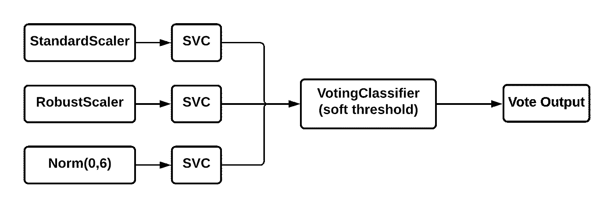

图 18:三重管道特征缩放集合(图片由作者提供)

这种集成在六个数据集上进行测试，对于这六个数据集，稳健缩放和标准化都表现不佳，但 Norm(0，6)表现优异，并且在每种情况下，测试精度都因为较低的偏差而受到影响。这让我们想到了另一个猜想:

**猜想 2:预测模型的特征尺度集成的可推广性受到减少偏差的限制。**

**结论**

如果你必须有规则，那么作为一个粗略的猜测，**选择与学习模型**的拟合相反的特征缩放方法。首先，与分布无关或对距离敏感的模型应该使用标准化。进一步的工作是必要的，以确认归一化是否是与分布相关的模型的最佳拟合。

我们通过一类新的模型——特征尺度集成，实现了更高的泛化能力和准确性。但是这种性能的提高是以计算成本为代价的。使用 SVC 模型生成类别概率而不是类别成员资格(软阈值对硬阈值)需要额外的 5 重交叉验证，并且需要更多的时间和计算资源。

如果您有这些资源，那么不管未来数据引起的扰动如何，投票集合作为一种通用算法应该工作得很好。如果时间和计算过程不可用，标准化本身就可以很好地处理这些基于距离的模型。但是，如果您需要最高的精度，可能需要采用试错法来找到“完美”的缩放算法。

**参考文献**

Abu-Mostafa，Y. S .、Magdon-Ismail，m .、和 Lin，H.-T. (2012 年)。*从数据中学习*(第四卷)。美国纽约 AMLBook:

布尔科夫，A. (2019)。一百页的机器学习书。

许春伟，张春春，林春军，等。(2003).支持向量分类实用指南。台北。

Mohamad，I. Bin 和 Usman，D. (2013 年)。标准化及其对 K 均值聚类算法的影响。*应用科学、工程与技术研究杂志*， *6* (17)，3299–3303。[https://doi.org/10.19026/rjaset.6.3638](https://doi.org/10.19026/rjaset.6.3638)

潘迪和贾恩(2017 年)。使用不同归一化技术的 KNN 算法的比较分析。*国际计算机网络与信息安全杂志*， *11* (11)，36。

Scikit-learn_developers。(未注明)。sklearn.svm.SVC 文档。检索自[https://sci kit-learn . org/stable/modules/generated/sk learn . SVM . SVC . html？highlight = SVC # sk learn . SVM . SVC](https://scikit-learn.org/stable/modules/generated/sklearn.svm.SVC.html?highlight=svc#sklearn.svm.SVC)

**联系方式:**

戴夫·古根汉姆:参见作者简介和简历，[dguggen@gmail.com](mailto:dguggen@gmail.com)

乌特萨维·瓦赫哈尼:[领英简历](https://www.linkedin.com/in/uv29/)，[uk.vachhani@gmail.com](mailto:uk.vachhani@gmail.com)