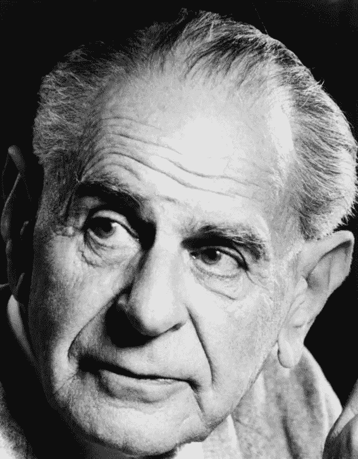

# 建模的神话:证伪

> 原文：<https://towardsdatascience.com/the-myths-of-modelling-falsification-d2e4df98807c?source=collection_archive---------41----------------------->

照片由[陈嘉里](https://unsplash.com/@gary_at_unsplash?utm_source=unsplash&utm_medium=referral&utm_content=creditCopyText)在 [Unsplash](https://unsplash.com/s/photos/waste?utm_source=unsplash&utm_medium=referral&utm_content=creditCopyText) 上拍摄

## 我们不会通过反复尝试去证伪来验证模型，也不应该去尝试；有了因果关系和贝叶斯概率，我们可以做得更好。

# 神话

伪造的神话有两个版本

*   科学通过反复尝试去证伪理论、推测或假设而进步。这是描述性的神话。
*   科学**应该通过反复尝试去证伪理论、推测或假设而进步。这就是规范的神话。**

证伪的规范性神话是广泛宣扬的科学实践学说的一半，还有[数据的首要性和客观性的实证主义神话](/myths-of-modelling-data-speak-358805890baa)——数据是所有分析的起点，我们通过公正地收集数据并“让数据说话”来确保模型的客观性。

根据这种双重学说，一旦数据“说话”，我们就通过一个反复尝试证明这些假设错误的过程来检验它们预言的假设。只有这样，我们才能渐进地迭代到客观真理。

这种信念非常普遍，考虑到实证主义作为一种哲学运动在 60 年代几乎已经死亡，而证伪主义，正如我们将看到的，在它被引入之前 20 年就被有效地驳斥了。但是后现代的过度，社会建构主义似乎已经把科学实践吓回到一个狭窄的归纳盒子里。

这篇文章和我之前关于实证主义的文章认为，这种学说往好里说是被误导了，往坏里说是直接造成了损害。当然，在它的影响下，现代统计学在某些领域的实践已经萎缩了，这种实践带有一种对假设检验的强迫性先入为主和对解释性因果模型的歇斯底里的反感。但是，通过揭穿这些神话，让因果关系和概率论在科学实践中占据自然、正当的位置，确保数据分析和机器学习在这些领域的实践不会遭受同样的命运可能还不算太晚。

# 伪造的起源

卡尔·波普尔(LSE 图书馆—[https://www . Flickr . com/photos/LSE Library/3833724834/in/set-72157623156680255/](https://www.flickr.com/photos/lselibrary/3833724834/in/set-72157623156680255/))

这两个神话是不可能的合作者，因为证伪的伟大普及者不是别人，正是实证主义的复仇女神卡尔·波普尔。

波普尔提出证伪作为休谟归纳问题的解决方案。休谟关于归纳法的问题是，我们认为重复观察证实了我们的信念的唯一依据是，我们被证实的信念被重复观察了。也就是说，归纳法的问题在于，我们对归纳法的信仰是归纳法。

波普尔认为，虽然我们不能归纳地证实我们的信念，但我们可以通过简单地观察它们与预测结果的偏差，来推断地证明它们是错误的。

然后他建议科学应该进行一个他称之为推测和反驳的过程。

> 知识进步的方式，尤其是我们的科学知识，是通过不合理的(和不合理的)预期，猜测，对我们的问题的尝试性解决方案，推测。这些猜想被批评所控制；也就是说，试图反驳，其中包括严重的关键测试。他们可能经受住这些考验；但是它们永远不能被肯定地证明是正当的:它们既不能被确定为真实的，也不能被确定为“可能的”(在概率演算的意义上)

对波普尔来说，正是在理论之间的裁决中，我们力求客观和公正，他的目标是通过这些理论的主角之间的对抗过程来实现。

> 大胆的想法、不合理的预期和思辨的思想是我们解释自然的唯一手段:我们唯一的工具，我们抓住自然的唯一工具。我们必须冒险让他们赢得我们的奖品。我们当中那些不愿意让自己的观点面临被反驳的危险的人，是不会参与科学游戏的。

# 为什么我们继续坚持这个神话

波普尔与其说是把归纳的铁罐扔进垃圾箱，不如说是把它踢到街上更远的地方，暂时把归纳的怀疑换成演绎的偶然性。此外，正如我们将看到的，事实证明，反驳假说或设计批判性测试毕竟不是那么容易。

但是猜想和反驳的过程有着巨大的实际的，坦率地说是道德的吸引力。通过抛弃数据“说话”的概念——它们自己产生意义或提供理论——并通过将客观性的审查从数据转移到对立理论之间的竞争，波普尔的方案解放了我们的想象力，并将假设放回其应有的位置，与数据对话，而不是屈从于数据。数据暗示假设，但假设引导我们回到数据，更好的是，在试图反驳我们的假设时，暗示我们寻找新的数据。

# 为什么证伪是一个神话

不幸的是，科学通过演绎证伪并不比通过天真的归纳发展得更快，也不可能，因为我们永远无法脱离大量额外的辅助假设来检验一个假设，这些额外的辅助假设解释了要检验的假设是如何与应该反驳它的观察联系在一起的。这个反对波普尔“严格批判检验”的可能性的论点，是皮埃尔·迪昂在他的《物理理论的目的和结构》(1906 年，当时波普尔四岁)中非常优雅地提出的。

在他的许多例子中，迪昂讨论了在 19 世纪中期观察到的天王星轨道的偏差。这些偏差绝不会以任何方式破坏牛顿的万有引力定律，而预测的轨道就是从万有引力定律中推导出来的，这些偏差只是被假设为挑战一个辅助假设——即天王星没有受到任何其他大质量附近物体的影响。这一点，以及西方数学史上一些最英勇的手工计算，最终导致了海王星的发现。科学的进步归功于证伪的失败。

迪昂的例子尤其令人心酸，因为水星轨道的偏离在当时促使人们试图发现一颗行星，这颗行星的存在是如此确定，以至于它已经有了一个名字:瓦肯。在《目标与结构》出版十多年后，爱因斯坦证明了在水星的情况下，问题确实出在牛顿的理论上。但是牛顿的理论从未受到任何失败的严重挑战，直到水星轨道的偏差被广义相对论解释——一个源于灵感猜想的理论，如果曾经有过的话。

迪昂反对科学实践中证伪的现实性或可能性的论点，在奎因对大约半个世纪后的讨论做出贡献后，被称为迪昂-奎因问题。但是奎因的主张更为有力。

奎因认为，任何理论都可以适应经验观察，这更多的是一种诗意的灵感，而不是来自任何特别详细记录的理性过程。这是一个更加可疑和危险的说法，因为如果理论总是可以调整以适应观察，那么理论的构建就真的没有限制。这就是疯狂，或者至少是社会建构主义。我们不会去那里。迪昂会为我们做的。

# 为什么这是个问题

除了宣扬一种既未实践也不可能实践的实践的认知失调之外，唯一真正的缺点是，有了我们现在所拥有的工具，我们可以做得更好，而不是在竞争对手的猜测之间的竞争中约束自己进行证伪。

# 我们应该做什么？

因果关系和概率是波普尔难题中缺失的部分，因为它们共同为解释性猜想提供了一种自然语言，并为广泛使用数据(证实性的和矛盾的)提供了一个内置框架，以告知公开竞赛中猜想的可能性。

受到休谟的困扰，波普尔对因果关系很冷静，他在假设性猜想的熔炉中评估因果模型所需的概率框架还处于萌芽状态。此外，流行的频率主义概率框架已经是归纳主义的好朋友(因此不是波普尔的朋友)。

后来对休谟的解读表明，休谟认为缺乏相信因果关系的逻辑基础是逻辑的问题，而不是因果关系的问题，他愿意接受自然界中存在真正的原因，但我们对它们的认识必然是偶然的和假设的。

本着这种精神，鉴于波普尔方案中知识的内在偶然性，坚持反驳的演绎确定性似乎是不可支持的。摆脱了这种约束，我们就可以利用推理机器的全部武器，在我们必须解决的问题的因果解释模型和我们必须指导我们这样做的数据之间进行激烈的竞争。