# 朴素贝叶斯分类器

> 原文：<https://towardsdatascience.com/the-naive-bayes-classifier-how-it-works-e229e7970b84?source=collection_archive---------7----------------------->

通过简单的例子解释了朴素贝叶斯算法。

作者图片

**内容:**

*简介*

*1。贝叶斯定理*

*2。朴素贝叶斯分类器*

*3。一个简单的二元分类问题*

*3.1 先验概率计算*

*3.2 类条件概率计算*

*3.3 预测后验概率*

*3.4 用连续数据处理特征*

*3.5 处理不完整数据集*

*4。使用 Scikit Learn 的朴素贝叶斯*

*4.1 处理混合特征*

*5。结论*

6。参考文献

**简介:**

分类算法试图预测分类目标变量的类别或标签。分类变量通常代表具有离散值的定性数据，如通过/失败或低/中/高等。在许多分类算法中，朴素贝叶斯分类器是最简单的分类算法之一。在其他应用程序中，朴素贝叶斯分类器通常用于大型文本数据集。本文的目的是解释朴素贝叶斯算法是如何工作的。朴素贝叶斯分类器基于贝叶斯定理，这将在下面讨论。

**1.0 贝叶斯定理:**

假设进行了一项关于购买超高清电视的客户调查。调查结果以列联表的形式呈现如下:

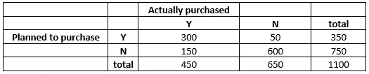

表 1:列联表

为简单起见，列联表中的类别用字母表示如下:

答:计划购买

b:实际购买

答`:不打算购买

b `:实际上没有购买

基于上述符号，列联表中的信息也可以用文氏图的形式表示。

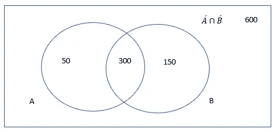

作者图片

P(A)计划购买的概率= 350/1100。

P(B)实际购买的概率= 450/1100

P(A∩B)计划购买和实际购买的概率= 300/1100

请注意，在计算 P(B)时，我们没有考虑客户是否打算购买。顾客计划购买的先验知识改变了顾客实际购买的可能性。这也被称为假设顾客计划购买的实际购买的条件概率。它被表示为 P(B|A)。

P(B|A) = 𝑃(𝐴∩𝐵)/𝑃(𝐴) = 300/350，即在计划购买的总实例中，实际购买了多少。

这个等式可以改写为

𝑃(𝐴 ∩ 𝐵) = 𝑃(𝐵|𝐴)∗𝑃(𝐴)

我们也可以写出假设客户实际购买了 P(A|B) = 𝑃(𝐵∩𝐴)/ 𝑃(𝐵)= 300/450 的计划购买的条件概率。

我们可以将此改写为:

𝑃(𝐵 ∩ 𝐴) = P(A|B)*P(B)

由于 P(A∩B) = P(B∩A ),我们可以使上述两个方程的右边相等，从而得到:

𝑃(𝐵|𝐴)∗𝑃(𝐴)=𝑃(A|B)∗𝑃(B)

这个等式可以改写成贝叶斯定理:

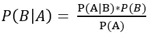

如果 a 和 b 是独立事件，那么𝑃(𝐴∩𝐵)=𝑃(𝐴)÷𝑃(𝐵).

因此，当 A 和 B 是独立事件时，P(A|B) = P(A)

**2.0 朴素贝叶斯分类器:**

让我们数据集中的特征向量由𝑨 = (𝐴₁,𝐴₂,…，𝐴ₙ).目标向量是具有值𝐵ᵢ，i= 1，2，…k 的分类向量，其中 k 是目标向量的类别/标签总数。

给定一个新的特征向量𝐴₁,𝐴₂,…，𝐴ₙ，朴素贝叶斯分类器预测概率 P(𝐵ᵢ| (𝐴₁,𝐴₂,…，𝐴ₙ)，i=1，2，…。k，即给定特征向量的目标向量的每个类别/标签的条件概率。这种条件概率也称为后验概率，可以用简洁的形式写成𝑃(𝐵ᵢ| 𝑨，i=1，2，…k。然后，朴素贝叶斯分类器将后验概率最高的类/标签 I 选为最可能的结果。

使用贝叶斯定理计算类别的后验概率:

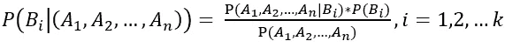

在上面的等式中，分母 P(𝐴₁,𝐴₂,…，𝐴ₙ)对于所有类别𝐵ᵢ都是相同的，i= 1，2，…k。因此，为了计算类别的后验概率，我们可以忽略它，只需计算分子 P( **A** | 𝐵ᵢ)和 p(𝐵ᵢ)I = 1，2…k 中的各项。下面将解释这些项的计算方法。

术语 P(𝐵ᵢ)也称为类别 I 的先验概率。设 m 是数据集中数据点的总数，𝑁Bⱼ是数据集中类别𝐵ⱼ的实例数，则对于第 j 个类别:

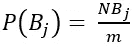

因此，为了计算先验概率，我们需要计算数据集中每个类的实例数，并将其除以数据集中的数据点总数。

为了计算项 P( **A** | 𝐵ⱼ)，朴素贝叶斯分类器假设特征彼此独立，即特征𝐴ₛ的出现不受特征𝐴ᵣ.的出现的影响这个假设并不适用于所有情况，因此这个分类器被命名为朴素贝叶斯分类器。

特征独立性的假设产生:

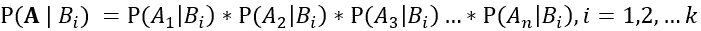

P(𝐴ₛ|𝐵ᵢ)也称为类条件概率。计算和存储类别条件概率是任何朴素贝叶斯分类器执行的关键任务之一。

假设在一个数据集中有三个分类特征𝐴₁,𝐴₂和 A₃。𝐴₁要素有 2 个等级/标签，𝐴₂要素有 3 个等级/标签，A₃要素也有 2 个等级/标签。总的特征标号是 2+3+2=7。数据集中的目标变量是一个二元分类变量，即只有 2 个类别。对于这样的数据集，我们需要计算和存储 7*2=14 个类别条件概率。在预测阶段查找这些概率。在下一节中，将使用一个简单的示例来解释先验和类别条件概率以及后验概率的计算。

**3.0 一个简单的二元分类问题:**

这个虚构的示例数据集包含与事故相关的不同情况的示例。目标变量 accident 是一个带有是/否值的二元分类变量。有 4 个分类特征:天气状况、道路状况、交通状况和发动机问题。

下面列出了与每个功能相关的类别/标签:

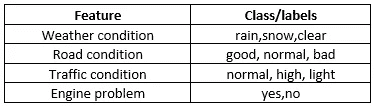

表 2:要素类

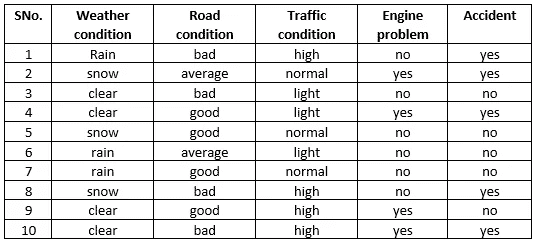

表 3:示例数据

**3.1 先验概率计算:**

有 10 个数据点(m = 10)。有 5 个分类/标签“是”(𝑁Accidentᵧₑₛ = 5)，5 个分类/标签“否”(𝑁Accidentₙₒ = 5)。可以使用第 2.0 节中的先验概率公式计算先验概率:

𝑃(Accidentᵧₑₛ) = 5/10

𝑃(Accidentₙₒ) = 5/10

**3.2 类条件概率计算:**

首先根据目标标签(是/否)分割数据集。因为目标变量有 2 个类，所以我们得到 2 个子表。如果目标变量有 3 个类，我们将得到 3 个子表，每个类一个。

以下两个表分别显示了目标类/标签“否”和“是”的数据集:

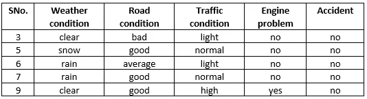

表 4:目标标签“否”的子表

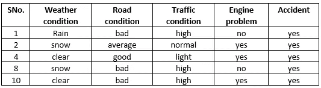

表 5:目标标签“是”的子表

类别条件概率𝑃(𝑨 |𝐵ₙₒ和𝑃(𝑨 |𝐵ᵧₑₛ可以使用如下所示的表 4 和表 5 来计算:

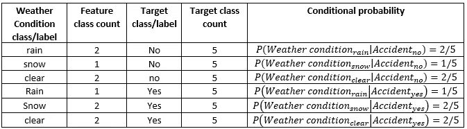

表 6:天气条件的分类条件概率

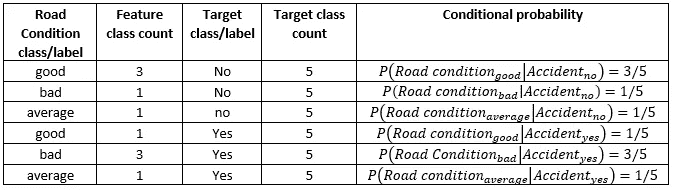

表 7:路况的等级条件概率

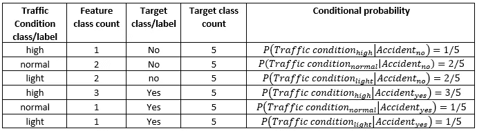

表 8:交通状况的类别条件概率

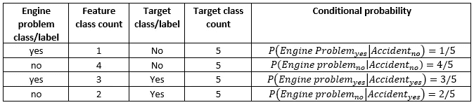

表 9:引擎问题的类条件概率

虽然类条件概率的计算很简单，但是条件概率应该被系统地组织，因为在预测阶段需要查找这些概率。

**3.3 预测后验概率:**

假设我们现在有了一个新的特征向量:

天气状况:下雨

路况:良好

交通状况:正常

发动机问题:没有

任务是预测事故是否会发生？

使用第 2.0 节中的后验概率公式计算每个目标类别的后验概率。

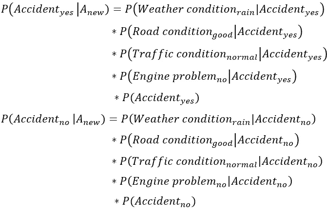

注意，如第 2.0 节所述，分母的计算被省略。代入上表 6、7、8 和 9 中的先验概率和类别条件概率的值，我们得到:

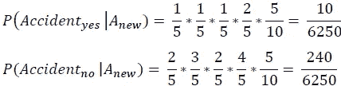

自𝑃(accidentₙₒ|𝐴ₙₑ𝓌)> 𝑃(accidentᵧₑₛ|𝐴ₙₑ𝓌)的预言是偶然的= '不'。

概率可以通过归一化后验概率来获得:

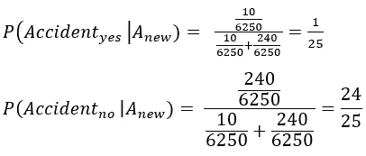

**3.4 用连续数据处理特征:**

这个玩具示例中的数据集只有分类变量。如果数据集具有不断变化的要素会怎样？例如，假设我们有一个记录事故发生时温度的特征温度。这种特征的类条件概率的计算不能再基于上面解释的计数方法来计算。通常假设连续特征变量是正态分布的。对于正态分布，随机变量(x)在 x 和 x+dx 之间的概率由下式给出:

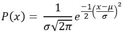

上式中的𝜇和𝜎是给定正态分布的均值和标准差。

基于目标变量类的子表的创建类似于上面所解释的。计算子表(表 4 和表 5)后，我们计算并存储平均温度𝜇ₜₑₘₚₑᵣₐₜᵤᵣₑ|Accidentₙₒ、𝜇ₜₑₘₚₑᵣₐₜᵤᵣₑ|Accidentᵧₑₛ，以及来自 2 个子表的温度特征变量的标准偏差𝜎ₜₑₘₚₑᵣₐₜᵤᵣₑ|Accidentₙₒ和𝜎ₜₑₘₚₑᵣₐₜᵤᵣₑ|Accidentᵧₑₛ。

在预测阶段，给定一个新的温度值，使用如上所示的正态分布曲线的分析形式计算类别条件概率:

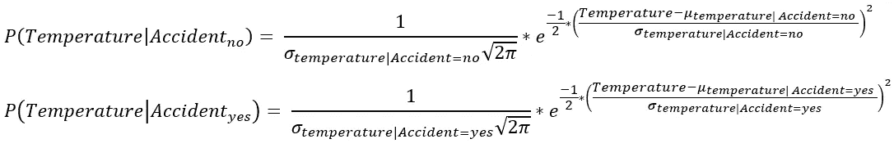

**3.5 处理不完整数据集:**

在上述示例数据集中，存在足够的数据来计算所有类别条件概率。如果训练数据集中的目标类缺少特定的要素标注，该怎么办？例如，在我们的例子中，𝑃(𝑊eatherconditionᵣₐᵢₙ|accidentᵧₑₛ= 0。这将导致后验概率𝑃(accidentᵧₑₛ|𝐴ₙₑ𝓌= 0，即使其他类别的条件概率不为零。拉普拉斯校正用于处理这种情况。具有拉普拉斯校正的类条件概率的一般形式是:

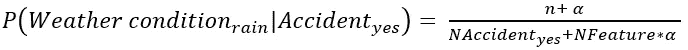

对于第 3.0 节中讨论的示例，n = 1 是事故=是时的要素类计数(即雨)。𝑁Accidentᵧₑₛ= 5 号。

NFeature = 4(数据集中有 4 个要素)。

α是拉普拉斯校正因子。

拉普拉斯校正应用于所有类别的条件概率计算。从上式可以看出，对于特定的特征类，如果 n = 0，则类条件概率非零。

对先验概率的拉普拉斯校正的形式是

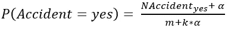

同样对于 3.0 节中讨论的例子

m = 10(数据点的总数)。

k = 2(目标变量类数量)。

为了理解校正因子α的影响，考虑一种假设情况，其中:n = 1，NFeature = 4，𝑁Accidentᵧₑₛ= 60，m = 100，k = 2。

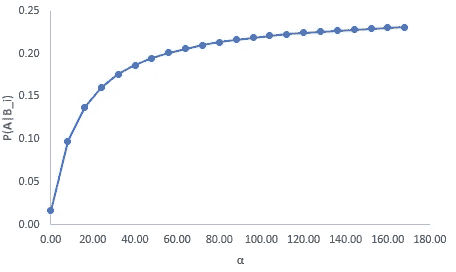

图 1

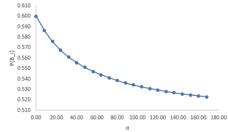

图 2

图 1 和图 2 分别显示了上述假设情况下类别条件概率和先验概率的变化。从图 1 中，我们可以看到，随着α的增加，类别条件概率趋向于 1/4 = 0.25。同样，从图 2 中，我们可以看到，随着α的增加，先验概率趋于 1/2 = 0.5。

通过让α趋于无穷大，这些极限值也可以从拉普拉斯校正方程中看出:

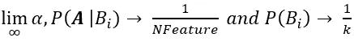

因此，随着校正因子的值增加，类别条件概率趋向于均匀的概率分布，每个特征具有相同的类别条件概率 1/NFeature。

类似地，每个目标类别的先验概率趋向于均匀概率，每个类别具有相同的 1/k 的先验概率。对于大多数问题，值α通常选择为 1。

**4.0 使用 Scikit 学习的朴素贝叶斯:**

sklearn 中的 nave _ Bayes 模块支持不同版本的 nave Bayes 分类，例如高斯 nave Bayes(在 3.4 节中讨论)、用于分类特征的多项式 nave Bayes 以及其他版本。

本节使用 iris 数据集来说明 Scikit learn 中可用的高斯朴素贝叶斯分类器的用法。数据集可以在这里找到:*[*【https://www.kaggle.com/uciml/iris?select=Iris.csv】*](https://www.kaggle.com/uciml/iris?select=Iris.csv)*

*虹膜数据集是一个微小的数据集，由 4 个连续的特征向量组成，描述了鸢尾花家族的不同特征。有 3 个目标类别涉及三种鸢尾花。目的是为一组新的特征向量正确地预测花卉种类。*

*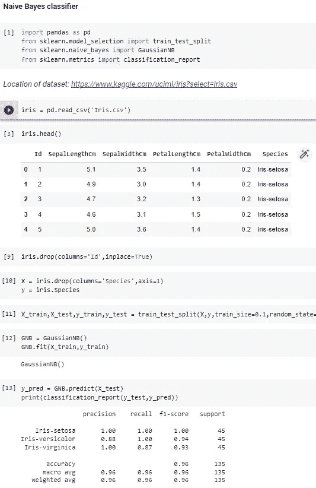*

*对于这个简单的数据集，高斯朴素贝叶斯分类器在预测花卉种类时达到了 0.96 的准确度分数。*

***4.1 处理混合功能:***

*如果数据集同时具有连续和分类特征。sklearn 的一个简单方法是使用宁滨将连续变量转换为分类变量。例如，通过定义冷、温和、热温度类别的温度范围，可以将温度等特征转换为分类变量。将所有要素转换为分类要素后，可以使用 sklearn 中 nave _ Bayes 模块中的多项式算法进行拟合和预测。*

***5.0 结论:***

*朴素贝叶斯分类器是一个简单而通用的分类器。由于计算成本低，朴素贝叶斯分类器对于大型数据集非常有效。在性能方面，朴素贝叶斯分类器比许多其他分类器具有更好的性能。朴素贝叶斯分类器的一个主要缺点是固有的特征独立性假设。实际上，真实数据集中的要素很少是独立的。尽管有这个缺点，朴素贝叶斯分类器在初步理解数据时非常有用。*

***6.0 参考文献:***

1.  *基本商业统计概念和应用，M.L. Berenson，D.M. Levine，T.C. Krehbiel。*
2.  *[https://scikit-learn.org/stable/modules/naive_bayes.html](https://scikit-learn.org/stable/modules/naive_bayes.html)*