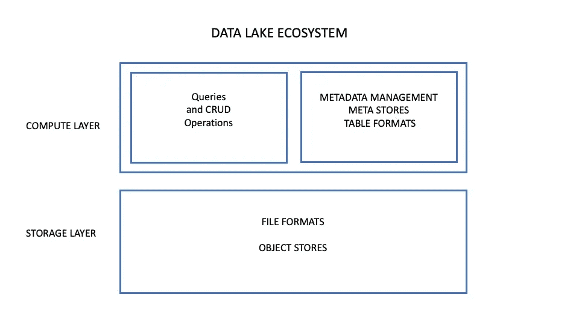
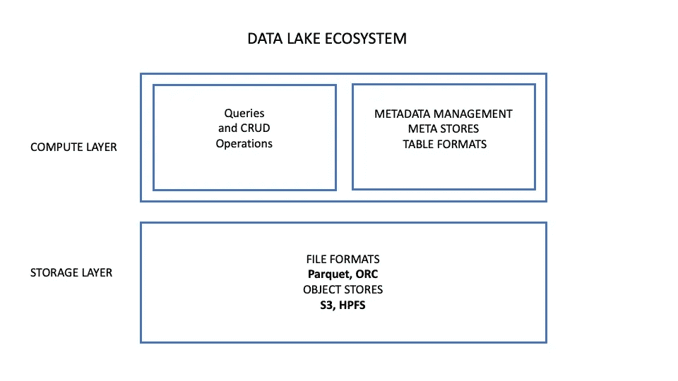
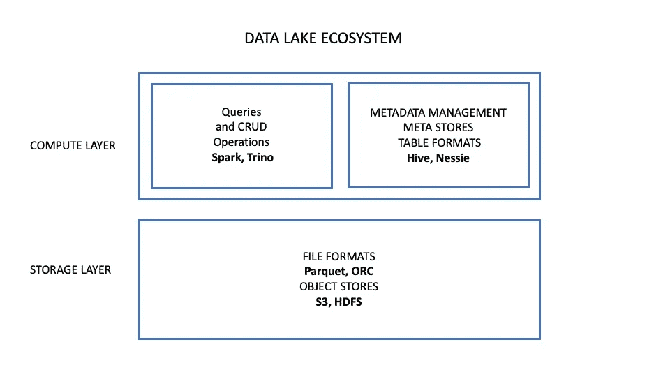
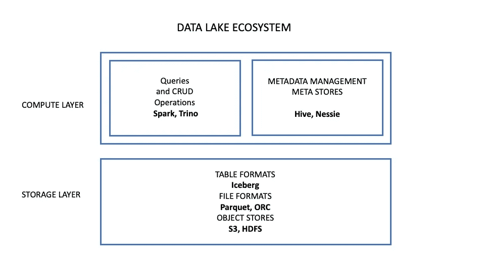

# 新一代数据湖

> 原文：<https://towardsdatascience.com/the-new-generation-data-lake-54e10e02b757?source=collection_archive---------5----------------------->

## 千万亿字节架构，不容错过！

*图片由休伯特·纽菲尔德拍摄:*[*https://unsplash.com/photos/7S21XSxKxVk*](https://unsplash.com/photos/7S21XSxKxVk)

用于机器学习项目的数据量持续增长。数据科学家和数据工程师已经转向数据湖来存储海量数据并寻找有意义的见解。多年来，数据湖体系结构已经发展到以可接受的读/写速度大规模扩展到数百 TB。但是大多数数据湖，无论是开源的还是私有的，都已经达到了 Pb 级的性能/成本墙。

快速查询扩展到 Pb 级需要新的架构。幸运的是，新的开源 Pb 架构已经出现。关键要素来自开源解决方案提供的新表格格式，如[****【胡迪】****](https://hudi.apache.org/)****[**三角洲湖**](https://delta.io/)**和 [**阿帕奇冰山**](https://iceberg.apache.org/)**。这些组件使数据湖能够以惊人的速度扩展到 Pb 级。********

******为了更好地认识这些新的表格格式是如何帮助我们的，我们需要了解当前数据湖架构的哪些组件伸缩性好，哪些组件伸缩性不好。不幸的是，当单个部分无法扩展时，它就会成为瓶颈，并阻止整个数据湖高效地扩展到 Pb。******

******我们将重点关注开源数据湖生态系统，以更好地了解哪些组件可以很好地扩展，哪些组件可以防止数据湖扩展到 Pb。然后我们将看到冰山如何帮助我们大规模扩展。这里学到的经验可以应用于专有数据湖。******

********数据湖架构********

****如下图所示，典型的数据湖体系结构有两个主要层。存储层是数据所在的位置，计算层是执行计算和分析操作的位置。****

********

****作者图片****

******对象存储和文件格式—可扩展******

****数据湖存储由对象存储处理。我们可以通过简单地添加更多的服务器来大规模扩展对象存储。这些容器跨越不同的服务器，使得对象存储具有极大的可伸缩性、弹性以及(几乎)故障安全性。****

****如今，最受欢迎的对象存储是亚马逊 Web Services 提供的[](https://aws.amazon.com/pm/serv-s3/?trk=ps_a134p000004f2aOAAQ&trkCampaign=acq_paid_search_brand&sc_channel=PS&sc_campaign=acquisition_US&sc_publisher=Google&sc_category=Storage&sc_country=US&sc_geo=NAMER&sc_outcome=acq&sc_detail=amazon%20s3&sc_content=S3_e&sc_matchtype=e&sc_segment=488982706716&sc_medium=ACQ-P|PS-GO|Brand|Desktop|SU|Storage|S3|US|EN|Text&s_kwcid=AL!4422!3!488982706716!e!!g!!amazon%20s3&ef_id=CjwKCAjwyvaJBhBpEiwA8d38vGc_Lr0hi5Jkxq3g1hUxTNsf3NiB8GnWg86miqh-W-xJ0a7rjyl7lhoCssoQAvD_BwE:G:s&s_kwcid=AL!4422!3!488982706716!e!!g!!amazon%20s3)******(**简单存储服务)和 [**Hadoop 分布式文件系统**](https://hadoop.apache.org/docs/r1.2.1/hdfs_design.html)**【HDFS】**。一个扁平的、大规模可扩展的分布式水平架构被用于本地化这些容器和其中的对象。当然，你可以在 GCP、Azure 上找到非常相似的服务。********

****[**阿帕奇拼花**](https://parquet.apache.org/)**[**阿帕奇 ORC**](https://orc.apache.org/)**都是常用的文件格式。他们使用列存储文件格式，在分析使用方面，这比基于行的文件格式可伸缩性好得多。这些文件管理系统在读/写操作期间只读取所需的列，这大大加快了读/写速度。********

******具有上述对象存储和文件格式系统的存储层如下所示。******

************

******作者图片******

********数据处理—可扩展********

****计算层管理所有执行命令，包括创建读取更新删除(CRUD)以及执行高级查询和分析计算。它还包含元存储，元存储包含并管理元数据和文件位置等信息，以及需要以事务方式更新的其他信息。****

****[**Apache Spark**](https://spark.apache.org/)**是比较流行的开源数据处理框架之一，因为它可以轻松处理大规模数据集。实验表明 Spark 的处理速度比 Hadoop 快 100 倍。speed 通过缓存数据、在内存中运行计算和执行多线程并行操作来实现其可伸缩性和速度。Spark APIs 允许开源数据湖的许多组件与 Spark 一起工作。******

******[**presto SQL**](https://prestodb.io/)**，现在更名为**Trino**，是一个分布式 SQL 查询引擎，旨在对大型数据集进行快速分析。Trino 最初是由脸书在 2013 年开发的。它可以通过单个查询访问和查询来自多个不同数据源的数据，并执行来自 Hadoop 和 S3 等独立存储系统中的表的连接。它使用一个协调器来管理在一个机器集群上运行的一群工人。********

****Presto 没有自己的元商店。Presto 协调器需要调用一个元存储来知道文件存储在哪个容器中。在对不同的节点执行查询计划之前，它会生成一个查询计划。尽管 Presto 协调器很有效，但由于其架构，它代表了单点故障和瓶颈。****

****尽管 Spark 和 Presto 都被用作数据湖的 SQL 接口，但它们的用途不同。Presto 旨在创建和处理大型数据集的大型查询。数据科学家和数据分析师使用它来探索大量数据。另一方面，Spark 主要由数据工程师用于数据准备、处理和转换。由于它们的目的不同，所以它们通常都共存于数据湖环境中。****

******元商店—不太可扩展******

****元商店管理系统在大规模扩展时会遇到问题。让我们看看如何。****

****在开源数据湖中常用的[**Apache Hive**](https://hive.apache.org/)**Meta Store 是脸书在 2010 年开发的。Hive 使用关系数据库管理系统(RDBMS)来跟踪表的元数据，比如位置、索引和模式。“RDBMS”不容易扩展到 Pb 级，因此可能成为巨大数据湖的速度瓶颈。Hive 使用 map-reduce，这涉及到在将 SQL 查询发送到正确的容器之前对其进行翻译。当访问大量数据存储时，这会大大降低查询速度。Hive 的另一个缺点是它没有版本控制管理系统。******

******[**Nessie**](https://projectnessie.org/)**比 Hive 更新，规模更大。它使用一个可扩展的后端数据存储，如[**Amazon DynamoDB**](https://aws.amazon.com/dynamodb/)**来存储元数据。Nessie 提供了一个设计良好的受 Git 启发的数据版本控制系统。它的 API 使它很容易与 Spark、Hive 或 Iceberg 集成。然而，Nessie 数据存储驻留在计算层，它不能像对象存储那样扩展，因此可能成为瓶颈。**********

******具有上述数据处理、元数据管理和表格格式的数据湖体系结构如下所示。******

************

******作者图片******

******现在，让我们看看 Iceberg 如何克服这些元存储瓶颈。******

********冰山的关键********

****Apache Iceberg 是网飞创建的一种表格式规范，用于提高大型数据湖查询的性能。它是 Pb 级数据湖的重要组成部分。Ryan Blue，网飞的 Iceberg 的创造者，[解释了](https://www.youtube.com/watch?v=nWwQMlrjhy0&t=138s)他们如何能够将 Atlas 系统的查询规划性能时间从使用 Hive 和 Parquet 的 9.6 分钟减少到使用 Iceberg 的 42 秒。****

****Iceberg 管理位于对象存储桶中数据旁边的文件中的表定义和信息(文件元数据)。可伸缩性的关键是 Iceberg 元存储可以分布在对象存储中的多个资源上。这为数据湖提供了巨大的元存储可伸缩性，避免了上述驻留在计算级别的其他元存储所造成的瓶颈。冰山表架构的详细描述可以在[这里](https://www.dremio.com/apache-iceberg-an-architectural-look-under-the-covers/#:~:text=Ryan%20Blue%2C%20the%20creator%20of,because%20of%20these%20directory%20listings)找到。****

****Iceberg 附带了一组数据处理引擎可以使用的 API 和库。文件仍然使用 Avro、Parquet 或 ORC 等文件格式存储。****

****Iceberg 不使用传统的基于日期的分片来管理存储桶，而是使用自己的优化规则来提高灵活性和速度。使用 Iceberg 的分片方法极大地优化了历史查询速度。Iceberg 可以与 Nessie 集成进行版本控制管理，并回滚到以前的表、分区和模式布局实例。****

****Iceberg 提供了 Java 和 Python 两种语言的 SDK。这个 SDK 可以通过 Spark、Presto Flink 和 Hive 访问。即使您选择使用 Iceberg 作为您的表格式，您仍然需要使用 Spark 和/或 Presto 这样的工具来查询 Iceberg。在撰写本文时，Iceberg Python SDK 仅限于读取操作，但是如果您不想直接将应用程序与 Iceberg 集成，您可以随时使用 Spark 甚至 Presto，这可能是一个挑战。****

****带有冰山文件格式管理组件的新的 Pb 级开源数据湖如下所示。****

********

****作者图片****

****在不久的将来，机器学习平台将在其架构中包括基于 Iceberg 等技术的新数据湖，为数据科学家提供大规模可扩展的数据湖，以实现他们最雄心勃勃的项目。****