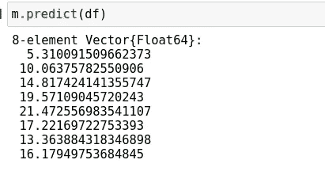
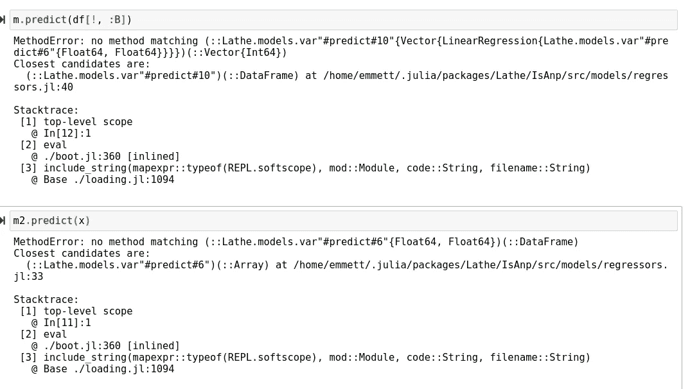
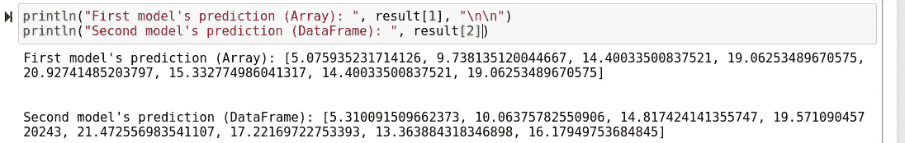
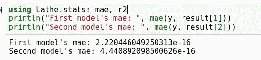
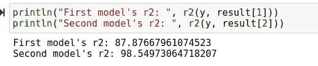
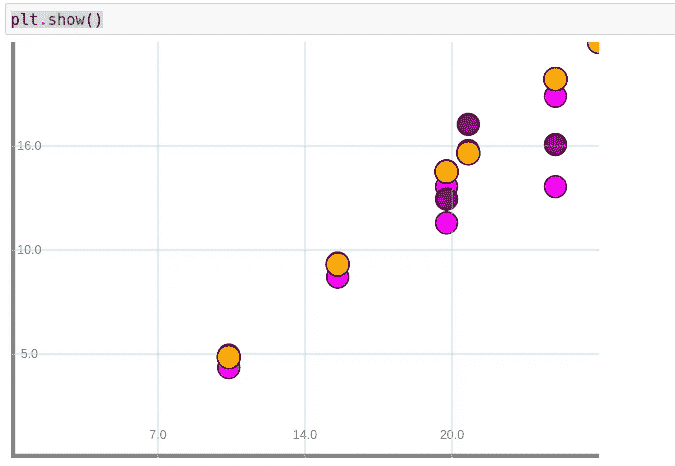

# 新型车床刨床及其使用方法

> 原文：<https://towardsdatascience.com/the-new-lathe-router-and-how-to-use-it-a39591355d15?source=collection_archive---------26----------------------->

## 车床 0.2 中实现的新路由器类型的快速教程。


(src =[https://pixabay.com/images/id-414415/](https://pixabay.com/images/id-414415/)

# 介绍

一个谈到机器学习，自动化是一个特别有趣的话题。机器学习本身在很多方面都是一种非常智能的方式，可以利用统计数据来自动化某些计算任务，所以每当我们谈论自动化机器学习时，我们都在谈论自动化。每当我们使用机器学习时，我们都在自动化编写软件来操纵数据。然而，模型总是需要接收数据，并且这些数据通常需要在命中模型之前进行处理，以使其按预期工作。

为了在提供数据作为模型输入之前处理数据，通常使用管道来处理数据并对数据建模。然而，数据的可怕之处在于，它可能是不可预测的，而且往往是肮脏的。为此，除了他们编写的代码之外，数据科学家在任何地方都没有任何方便的工具，而且这项任务通常不是自动完成的。请允许我向您介绍 Lathe.jl 中的新路由器类型，该类型用于处理数据并通过管道路由数据，并且其实现相当酷。

> [笔记本](https://github.com/emmettgb/Lathe-Books/blob/main/models/latherouter%20sample.ipynb)

# 路由器基础

仅仅通过分析车床刨床背后的想法，就很容易看出这个问题的解决方案是多么的难以确定。将数据导入适当模型的想法非常抽象。抽象是自动化的杀手，因为一些输入数据可能越抽象，量化输入的所有可能性就越困难。

车床路由器类型通过利用返回和传递的函数来执行将数据定向到其各自模型的行为。这个函数的返回结果按顺序作为参数提供给它下面的对象。就像管线或车床模型是车床对象类型一样，路由器也是。这意味着我们可以将路由器放在管道中，将路由器放入路由器中。这为用不同的数据算法将数据链接在一起并沿链向下传递它们创造了无限的可能性。

这真的很酷，因为它可以让我们从一些输入数据开始，通过路由器管道和后续管道发送数据，这些管道一起工作，以提供一系列预测。因此，随着所有的概念解释的方式，让我们现在尝试路由器类型，并设想它做什么。

# 建模

为了利用我们的车床路由器，我们将首先需要建立一些车床模型。今天，我将创建两个线性回归模型，这两个模型都将采用不同类型的输入数据。让我们导入这个模型 DataFrames.jl，最后创建一个 dataframe 来保存模型的一些输入数据:

```
using Lathe.models: LinearRegression
using DataFrames
df = DataFrame(:A => [5, 10, 15, 20, 23, 17, 13, 15], :B => [10, 15, 20, 25, 27, 21, 20, 25],
    :C => [5, 10, 15, 20, 22, 19, 12, 13])
```

接下来，我将把我们的目标提取出来作为一个数组。

```
y = Array(df[!, :A])
```

现在我们将使用 select！从 x 中删除该列。()和 Not()方法一起放在下面的代码中:

```
x = select!(df, Not(:A))
```

现在我们将拟合一个新的线性回归模型，以 x 为特征:

```
m = LinearRegression(x, y)
```

现在让我们试着用它来预测:

```
m.predict(df)
```



(图片由作者提供)

现在，我们将做完全相同的事情，只是这一次，我们将仅使用数据帧中的单个数组来拟合我们的模型:

```
m2 = LinearRegression(Array(df[!, :B]), y)
```

现在我们有了两个模型，重要的是要注意它们之间的区别。由于我们为第一个模型提供了一个 dataframe 作为输入，因此它不能使用数组进行预测。相反的情况适用于第二个模型，它不能使用数据框架进行预测:



(图片由作者提供)

现在，我们将编写一个新的函数，它采用一个可迭代的参数来将数据分成多个返回。请注意，这些返回位置将对应于我们的模型在路由器中的位置。记住，这里可以传递无限多的项，唯一的限制是硬件方面的。从我们的函数开始，在这个实例中，我将为我们的输出定义两个变量:

```
function filter_X(x)
    df = nothing
    array = nothing
```

现在，我将简单地循环遍历 x，并使用一个简单的条件语句检查我们正在迭代的值的类型:

```
for data in x
        if typeof(data) == DataFrame
            df = data
        else
            array = data
        end
    end
```

最后一步，我将返回我们的数据并结束函数:

```
return(array, df)
end
```

最终结果如下所示:

```
function filter_X(x)
    df = nothing
    array = nothing
    for data in x
        if typeof(data) == DataFrame
            df = data
        else
            array = data
        end
    end
    return(array, df)
end
```

请注意返回的位置，这对路由器至关重要，因为路由器使用返回中的位置来知道在运行此函数后将数据放在哪里。我们现在将创建一个新的路由器，使用 fn 关键字参数来表示我们的过滤函数，并传递我们的车床对象。

```
router = Router(m2, m, fn = filter_X)
```

现在，我们可以通过路由器的 predict()函数以任意顺序传递这两个模型的可迭代数据。看看这个:

```
result = router.predict([df[!, :B], x])
```

这产生了一个包含两个预测数组的新数组，每个预测来自一个模型，请看:

```
println("First model's prediction (Array): ", result[1], "\n\n")
println("Second model's prediction (DataFrame): ", result[2])
```



(图片由作者提供)

只是为了好玩，我还评估了两个模型的准确性:

```
using Lathe.stats: mae, r2
println("First model's mae: ", mae(y, result[1]))
println("Second model's mae: ", mae(y, result[2]))
```



(图片由作者提供)

```
println("First model's r2: ", r2(y, result[1]))
println("Second model's r2: ", r2(y, result[2]))
```



(图片由作者提供)

我还用 Hone.jl 可视化了模型。由于 Hone.jl 停产了这么长时间，这出奇地困难，可能不值得付出努力。不管怎样，我决定参与并做到这一点。由于函数的 dataframe 版本已经分解为时间，我决定只分散一个预测，然后由于 Hone.jl 的模块化方法，我们可以为另一个预测和我们预测的原始 y 添加点。

```
using Hone: Points, Circle, Scatter
plt = Scatter(df[!, :B], result[1])secondpredpoints = Points(df[!, :B], result[2], shape = Circle(.5, .5, 24, :purple))
plt.add(secondpredpoints)original = Points(df[!, :B], y, shape = Circle(.5, .5, 24, :magenta))
plt.add(original)
plt.show()
```



(图片由作者提供，洋红色是原始值集，橙色是第一个模型的预测，紫色是第二个模型的预测)

# 结论

在我看来，这种类型肯定会派上用场的！我认为自动化管理数据和预测建模的整个过程的概念非常棒！我想添加的一个非常重要的特性是能够只传递一条必要的数据，并且仍然将它路由到适当的车床对象。然而，由于路由器概念的抽象，我真的认为这几乎是不可能的。然而，如果可能的话，我可以保证我会在即将发布的车床姜饼之前实现它。如果你想了解我在本文中使用的三个软件包(车床、Hone、DataFrames)中的任何一个，我也会在下面留下它们的 Github 链接。非常感谢您阅读我的文章，我希望您和我一样对此感兴趣！

[](https://github.com/ChifiSource/Lathe.jl) [## ChifiSource/Lathe.jl

### Lathe 为 Julia 语言带来了完全不同的方法论。创建类型是为了遵守…

github.com](https://github.com/ChifiSource/Lathe.jl) [](https://github.com/JuliaData/DataFrames.jl) [## JuliaData/DataFrames.jl

### 在 Julia 中处理表格数据的工具。安装:在朱莉娅 REPL，使用 PkgPkg.add("DataFrames")…

github.com](https://github.com/JuliaData/DataFrames.jl) [](https://github.com/ChifiSource/Hone.jl) [## ChifiSource/Hone.jl

### Julia - ChifiSource/Hone.jl 的面向对象图形模块库

github.com](https://github.com/ChifiSource/Hone.jl)