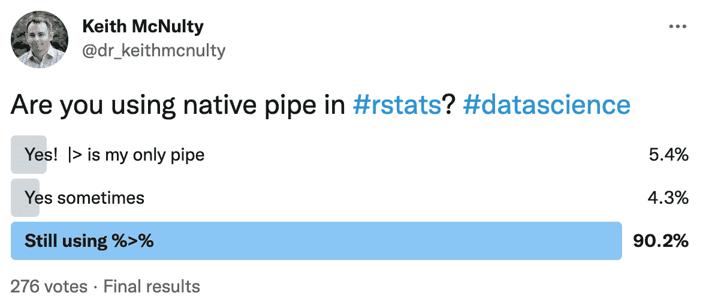

# R 中的新管道和匿名函数语法

> 原文：<https://towardsdatascience.com/the-new-pipe-and-anonymous-function-syntax-in-r-54d98861014c?source=collection_archive---------15----------------------->

## 它是什么，为什么是现在，它真的重要吗？


照片由[米哈尔·马特隆](https://unsplash.com/@michalmatlon?utm_source=unsplash&utm_medium=referral&utm_content=creditCopyText)在 [Unsplash](https://unsplash.com/s/photos/pipes?utm_source=unsplash&utm_medium=referral&utm_content=creditCopyText) 拍摄

从 R 版本 4.1.0 开始，发布了一个新的匿名函数语法，它在精神上类似于 Python 众所周知的 Lambda 语法。

## 匿名函数？什么？

概括地说，在 Python 中有两种编写函数的常用方法。一种方法是定义一个命名函数，如果您需要在许多上下文中重用该函数，这将非常有用。比方说，我想宣布，许多人在许多不同的情况下都很棒。这是一个简单的定义函数。

```
# define a named function
def is_awesome(name: str) -> str:
  return name + " is awesome!"# test
is_awesome("Keith")'Keith is awesome!'
```

自从——实际上是 1994 年，但在数据科学中那是永远——在 Python(和许多其他语言)中也有可能在代码中“一次性”使用的速记函数中写这个——称为 Lambda 函数。λ函数对输入进行运算，而不将函数存储在存储器中，

```
# lambda function
(lambda x: x + ' is awesome!')('Keith')'Keith is awesome!'
```

## 好了，现在这是 R 调了？

是的，以前你只能用完整的函数语法在 R 中编写函数，命名如下:

```
# named function
is_awesome <- function(x) {
  paste(x, 'is awesome!')
}# test
is_awesome('Keith')[1] "Keith is awesome!"
```

或者像这样匿名:

```
(function (x) {paste(x, 'is awesome!')})('Keith')[1] "Keith is awesome!"
```

但是现在，从 R 4.1.0 开始，您有了一个新的简写选项:

```
# new alternative shorthand
(\(x) paste(x, 'is awesome!'))('Keith')[1] "Keith is awesome!"
```

基本上这可以节省你一点打字的时间。我不确定它是否真的那么重要，但是我想对于一些程序员来说，它可能会节省很多时间。反正我估计也伤不了！

## 为什么现在发布这个？

更重要的是，既然它在 Python 中一直存在，为什么现在在 R 中发布呢？嗯，这都与 R 4.1.0 中另一个更有新闻价值的发展有关，它是本地管道操作符。

大多数 R 用户都知道管道操作符`%>%`,它是整洁风格编程的同义词，允许您避免复杂的函数嵌套，并以更线性的操作顺序安排渐进的步骤。例如，代替:

```
gsub('esome', 'ful', paste('Keith', 'is awesome!'))[1] "Keith is awful!"
```

您可以使用管道编写等效的操作，如下所示:

```
library(magrittr)paste('Keith', 'is awesome!') %>%
  gsub('esome', 'ful', .)[1] "Keith is awful!"
```

注意，管道在 base R 中不存在，需要通过一个包(通常是`magrittr`或`dplyr`)来加载。管道在 R 中如此受欢迎，以至于社区长期以来一直呼吁让它成为 base R 中的原生管道。因此，在 R 4.1.0 中引入了一个新的原生管道，与原来的管道共存。

```
# as of R 4.1.0
tolower('KEITH') |> 
  paste('is grammatically incorrect!')[1] "keith is grammatically incorrect!"
```

然而*原生管道与原始管道*不是同一个操作者。一个主要的不同之处在于，本地管道将总是通过管道进入前一个函数的第一个未命名参数。它不接受`.`语法来允许管道进入任何参数。

```
# this won't work
paste('Keith', 'is awesome!') |>
  gsub('esome', 'ful', .)Error in gsub(paste("Keith", "is awesome!"), "esome", "ful", .) : 
  object '.' not found
```

在这方面，让原生管道以与原始管道相同的方式工作的唯一方法是编写一个函数，其中所需的参数成为第一个(或唯一一个)未命名的参数。预料到这可能意味着开发人员要编写更多的函数，这就是为什么同时发布了匿名函数速记。

```
paste('Keith', 'is awesome!') |>
  (\(x) gsub('esome', 'ful', x))()[1] "Keith is awful!"
```

## 这真的重要吗？

所有这些都没有真正迫使你改变以前的编程习惯——你仍然可以使用旧的管道和语法。让我们面对现实吧，与仅仅使用完整语法编写匿名函数相比，这种匿名函数语法看起来很混乱。我不相信这会带来巨大的效率或时间节约。鉴于一些人已经声明，他们期望原生管道最终取代 R 中的原始管道，我不确定我是否明白为什么这一定会导致这种情况。

我最近在 Twitter 上做了一个为期一天的快速民意调查，看看自几个月前这个版本发布以来，有多少人真正改变了他们的习惯。结果如下:



最近的推特投票结果

我们都知道习惯的改变需要一段时间。所以也许这就是为什么不到十分之一的人在使用 R 中的这个新功能？或者可能是因为功能没有提供足够的好处来鼓励人们改变？你怎么想呢?

最初我是一名纯粹的数学家，后来我成为了一名心理计量学家和数据科学家。我热衷于将所有这些学科的严谨性应用到复杂的人的问题上。我也是一个编码极客和日本 RPG 的超级粉丝。在 LinkedIn 或 Twitter 上找到我。也可以看看我关于[*drkeithmcnulty.com*](http://drkeithmcnulty.com/)*的博客或者我关于人物分析的* [*教科书*](http://peopleanalytics-regression-book.org/) *。*