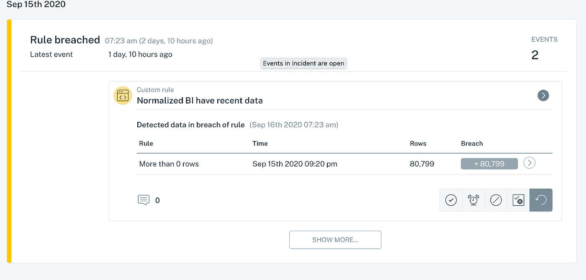

# 数据质量的新规则

> 原文：<https://towardsdatascience.com/the-new-rules-of-data-quality-5e4fdecb9618?source=collection_archive---------9----------------------->

## 引入一种更好的方法，通过测试和可观察性来大规模管理数据质量。

*图片由* [*提供见拍吃重复*](http://seeshooteatrepeat)*[*Shutterstock*](https://www.shutterstock.com/)*，可通过作者购买的标准许可证获得。**

**这个世界上有两种数据质量问题:你能预测的(***)和你不能预测的(* ***未知的*** *)。以下是一些最优秀的数据团队如何采取更全面的方法来大规模解决这两个问题。***

**在过去的几年里，数据团队利用相当于 [**的单元测试**](https://www.kdnuggets.com/2020/08/unit-test-data-pipeline-thank-yourself-later.html) 来检测数据质量问题。2021 年，随着公司接收越来越多的数据，管道变得越来越复杂，这种单点故障方法不再适用。**

**不要误会我的意思:你应该测试你最重要的数据。 [数据测试](https://www.montecarlodata.com/what-is-data-testing/)是捕捉数据管道中出现的特定已知问题的必备工具，有很棒的工具可以帮你做到这一点。由 Fivetran 支持的细分应用程序源和 Salesforce 数据流入您的雪花仓库，然后由 dbt 转换，并最终支持您的首席执行官用于季度财务报告的 Looker 仪表板？测试吧。**

> **尽管如此，即使有了自动化测试，随着数据生态系统的增长和数据的演变，继续更新现有的测试和阈值、编写新的测试和阈值，以及放弃旧的测试和阈值，仍然需要大量的提升。随着时间的推移，这个过程变得乏味、耗时，并导致更多的技术债务[需要你以后偿还。](https://medium.com/weareservian/why-data-engineering-needs-automated-testing-a37a0844d7db)**

**一家电子商务公司的客户——我们称她为 Rebecca——告诉我们，她的数据工程团队过去完全依赖自定义测试来发现最关键管道中的数据问题……直到他们没有这样做。**

**丽贝卡和她的团队通过测试让他们的管道经受了考验，但这一切只需要一个[未知的未知](https://medium.datadriveninvestor.com/known-knowns-unknown-knowns-and-unknown-unknowns-b35013fb350d#:~:text=The%20unknown%20unknowns%20are%20things,Put%20simply%2C%20we%20know%20nothing.)(在这种情况下，是一个分布异常)就能让公司陷入混乱。他们在无法处理的交易上损失了收入，她的主管也失去了对数据的信任。**

**她的团队可以追踪已知的未知情况(例如，我们知道这可能是一个问题，所以让我们测试一下)，但是他们没有一个全面的方法来说明未知的未知情况。**

# **你的数据管道中未知的未知**

****

***未知的未知(即，你无法预测的数据质量问题)通常不会暴露出来，直到它们影响到下游系统——而那时，对你的业务的损害可能已经造成了。图片由* [*万众耶稣会士*](https://unsplash.com/photos/VHXiGXxwOQ4) *上* [*下*](http://www.unsplash.com/) *。***

**未知的未知是指 [**数据停机**](https://medium.datadriveninvestor.com/known-knowns-unknown-knowns-and-unknown-unknowns-b35013fb350d#:~:text=The%20unknown%20unknowns%20are%20things,Put%20simply%2C%20we%20know%20nothing.) 即使是最全面的测试也无法解释的问题，这些问题出现在整个数据管道中，而不仅仅是特定测试所涵盖的部分。未知的未知可能包括:**

*   ****一个关键领域的分布异常**导致你的 Tableau 仪表盘失灵**
*   ****另一个团队进行的 JSON 模式更改**将 6 列变成了 600 列**
*   ****对 ETL** (或者[反向 ETL](https://medium.com/memory-leak/reverse-etl-a-primer-4e6694dcc7fb) ，如果你喜欢的话)的一个非预期的改变导致测试不能运行和错误数据丢失**
*   ****不完整或陈旧的数据直到几周后才被发现，影响了关键的营销指标****
*   ****导致 API 停止收集数据的代码更改**为重要的新产品提供数据**
*   ****数据随时间漂移**可能很难捕捉，特别是如果您的测试只关注 ETL 作业时写入的数据，这通常不会考虑已经在给定表中的数据**

> **这仅仅触及了表面。那么，团队如何防止这些[未知的未知](https://www.montecarlodata.com/good-pipelines-bad-data/)破坏他们原本完美的管道呢？对大多数人来说，把这些问题分成两个截然不同的类别会有所帮助。**

# **两种类型的数据质量问题**

**如果数据测试可以涵盖你*知道的*可能会发生在我们数据上的事情，我们需要一种方法来监控和警告我们*不知道的*可能会发生在你数据上的事情(我们未知的未知)。**

*   ****容易预测的数据质量问题**。对于这些已知的未知，自动化数据测试和手动阈值设置应该覆盖您的基础。**
*   ****不容易预测的数据质量问题**。这些都是你未知的未知。随着数据管道变得越来越复杂，这个数字只会越来越大。**

**同样，应用工程团队并不专门使用单元和集成测试来捕捉有问题的代码，数据工程团队需要采取类似的方法，将 [**数据可观察性**](https://www.montecarlodata.com/data-observability-the-next-frontier-of-data-engineering/) 作为他们堆栈的关键组件。**

# **简介:数据质量的新方法**

**就像软件一样，数据需要**测试和可观察性**来确保一致的可靠性。事实上，现代数据团队必须将数据视为一个动态的、不断变化的实体，并且不仅应用于严格的测试，还应用于持续的可观察性。考虑到数百万种可能破坏数据的方式(或者，未知的未知)，我们可以使用相同的 DevOps 原则来涵盖这些边缘情况。**

****

***数据可观察性通过自动监控和 ML 生成的规则帮助您捕捉未知的未知，扩展数据堆栈的 QA 覆盖范围，并消除手动阈值设置的需要。图片由作者提供。***

**对大多数人来说，一个强大而全面的数据可观测性方法包括:**

*   ****元数据聚合&编目**。如果你不知道你有什么数据，你当然不会知道它是否有用。数据目录通常被整合到最佳的数据可观察性平台中，为您的数据生态系统提供了一个集中的、透明的视角，在一个视图中展示丰富的谱系、模式、历史更改、新鲜度、数量、用户、查询等。**
*   ****自动监控&数据问题报警**。出色的数据可观察性方法将确保您是第一个知道并解决数据问题的人，使您能够在数据停机发生时立即解决其影响，而不是几个月后。最重要的是，这种解决方案需要最少的配置，而且几乎不需要设置阈值。**
*   ****沿袭追踪上下游的从属关系。**强大的端到端沿袭使数据团队能够跟踪从 A(接收)到 Z(分析)的数据流，并在流程中纳入转换、建模和其他步骤。**
*   ****既自定义&自动生成规则**。大多数数据团队需要一种两全其美的方法:使用机器学习来根据历史行为识别数据中的异常，并能够根据数据的规格设置独特的规则。与编码到建模工作流或 SQL 包装器中的特殊查询不同，这种监控不会停留在“表 R 中的字段 T 的值今天低于 S”上**
*   ****数据分析师、数据工程师和数据科学家之间的协作。** [数据团队](https://www.montecarlodata.com/which-of-the-six-major-data-personas-are-you/)应该能够轻松快速地协作解决问题，制定新规则，并更好地了解数据的健康状况。**

**每个数据团队都是不同的，但我们发现这种测试和可观察性的方法既能处理您最可能的数据问题，也能处理数百万其他导致数据管道中断的原因。**

> **说到底，我们能抓住的已知未知*和*未知未知越多越好。**

*****我们很想知道这种方法是否能引起你的共鸣！伸出手去*** [***弗朗西斯科***](https://www.linkedin.com/in/falberini)[***斯科特***](https://www.linkedin.com/in/scott-o-leary-78000a43) ***以及蒙特卡洛团队的其他人。*****

***本文由 Francisco Alberini 和 Scott O’Leary 共同撰写。***

****