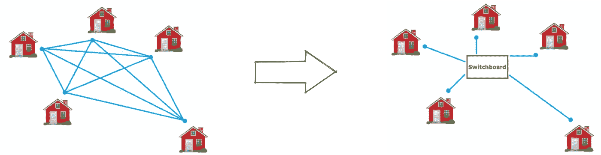
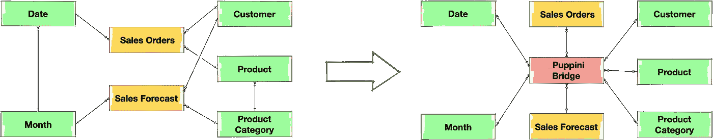
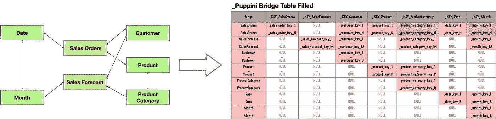

# 分析数据建模回顾中的新“统一星型模式”范例

> 原文：<https://towardsdatascience.com/the-new-unified-star-schema-paradigm-in-analytics-data-modeling-review-a245b2641dc8?source=collection_archive---------3----------------------->

## 意见

## 由 F. Puppini 发明，B. Inmon 推广，它自称是自助式商务智能的一次革命

# 介绍

最近我偶然看到了比尔·恩门和弗朗切斯科·普皮尼的新书，书名是《统一星形模式》(以下简称 USS downstream)。数据仓库之父的新书《2020》绝对吸引了我的注意力，我买了它，并在接下来的 3 天里满怀热情地阅读了它。原来这个概念的作者是弗朗切斯科·普皮尼，比尔·恩门是它的支持者和推动者，但这并没有真正削弱一种建模和组织数据的新方法的价值。

一开始，我真的很怀疑。替代传统的维度模型，被几十年证明并没有让我感觉良好。但是这本书向我打开了数据模型视图的新视角。现在，我相信它不是传统维度建模的替代品(尽管作者声称它是)，而是对它的丰富。所以我们简单回顾一下。

# 美国军舰进场审查

## 关系哲学的转变

在高层次上，作者提出了用于管理分析数据库中实体之间的连接(关系)的巧妙简单的方法:代替具有相互关系的网络，引入超级交换机并通过它管理所有连接:



图片来源于美国军舰书。底部的链接

如果我们将这种说法转化为数据仓库数据模型，这将意味着用一个超级星来代替 galaxy 模式(通过一致的维度连接的一组星型模式),其中所有的表(事实和维度)都通过一个称为 Bridge(由作者命名)或 Puppini Bridge(由 Inmon 命名；我比较喜欢，所以会用:)喜欢上下图:



作者图片

Puppini 桥严格用于连接彼此之间的表，它没有商业价值，建议对最终客户隐藏。

## 普皮尼桥是如何建造的

神奇的桌子是如何建造的？这不是一件小事，让我们来看看。

有一个**先决条件**:数据仓库中的每个表都应该有一个建立在单个列上的主键。建议遵循命名约定:使用前缀`_KEY_` 后跟表名。

Puppini 桥表是一个类似矩阵的表，其中

*   **列** —每个数据仓库表(事实或维度)的主键列表，外加一个名为`Stage`的额外列。所以列数等于数据仓库中的表数(维度和事实)加 1。
*   **行** —所有数据仓库表的`union all`操作的结果，这些数据仓库表只包含键列。因此，桥表中的行数是数据仓库中所有记录的总和(事实和维度)。

为了填充桥接表，我们需要将流程分成几个阶段，每个阶段从一个数据仓库表中加载数据。对于每个表，我们需要将 Stage 列值设置为等于数据仓库表名和 load:

*   **数据仓库表的主键**
*   **所有外键**到其他数据仓库表；直接外键和派生外键

对于上面的示例，事实表和维度表之间的初始关系将导致以下 Puppini 桥实现(暗红色单元格包含派生的外键):



作者图片

有了这样一个中间桥表，我们就可以使用适当的键列连接任意两个数据仓库表。例如，要按产品类别对销售订单和销售预测金额进行分组并合并结果，我们需要使用 Puppini 桥表进行左连接，如下所示:

```
**select** pc.CategoryName,
       sum(so.SalesAmount),
       sum(sf.ForecastedAmount) **from** _PuppiniBridge pb
       **left join** SalesOrders so 
           **on** pb._KEY_SalesOrders = so._KEY_SalesOrders
       **left join** SalesForecast sf 
           **on** pb._KEY_SalesForecast = sf._KEY_SalesForecast
       **left join** ProductCategory pc
           **on** pc._KEY_ProductCategory = pc._KEY_ProductCategory
 **group** **by**
       pc.CategoryName
```

## USS 的主要优势

整本“统一星型模式”书都是围绕**自助 BI** 中 USS 的好处展开的。自助 BI 意味着数据分析师和业务代表可以在任何现代 BI 平台(如 Tableau、Qlik View/Qlik Sense、Tibco SpotFire、MS PowerBI)中探索和发现数据。

galaxy 模式总是包含循环连接(除非它不是一个微不足道的连接),这会导致歧义。这就是为什么 BI 平台限制了表之间相互连接的可能性，以避免循环，这导致了数据探索可能性的限制或数据模型方面工作区的必要性。

将 galaxy 模式转换成 USS 模式，这是一个简单的 star 模式，消除了 BI 平台带来的一系列限制。

USS 模式有助于解决以下挑战:

*   **循环**
*   **风扇疏水阀**
*   **深渊陷阱**
*   **不一致的粒度**联接

对这些挑战的详细解释，以及书中的详细描述和示例。

# 美国军舰的另一边

除了自助 BI，还有数据仓库数据消费场景的其他方面，所以让我们试着从另一个角度来看 USS。

## 非功能性问题

## 可量测性

我对 USS 的主要关注是连接操作的效率和方法的可伸缩性。

由于 Puppini 桥表是所有数据仓库表(包括事实表)的超集，所以它将是一个大表。因此，在查询至少一个事实表的情况下，我们将总是**在两个大表之间连接**(与事实表桥接)，这对关系数据库来说总是一个挑战。我们可以考虑用 merge join 来优化它，但是很可能这是不可能的，因为一个事实表的排序不适用于另一个事实表，等等。

类似的挑战与集群部署的数据分布有关。如果我们根据某个规则分布一个大的事实表，我们将不能对 Puppini 桥表应用相同的规则。即使我们可以对一个事实表这样做，我们也不能对另一个事实表这样做。因此，这导致了对 _Puppini_Bridge 和数据库集群上的其他大型事实表之间的连接效率的关注。

## 模式扩展

模式扩展一直是数据仓库解决方案中非常具有挑战性的一个方面。

当我们在数据仓库中引入一个新的主题领域或者一组新的业务流程时，以传统的方式——我们引入一组新的表(一组新的星型模式)。

就美国军舰而言，除此之外，我们还需要在驾驶台上执行非常沉重的提升操作:

*   **通过添加一个带有适当键列的新列列表来修改**
*   **用正确的连接信息回填**

因此，在大型数据仓库的情况下，这往往是一个非常繁重的操作。

## 功能问题

如果要跳出自助 BI，考虑预定义的报告或数据科学家的数据探索活动，使用内部连接将事实表直接连接到相关维度表会更自然、更合理、更容易，从而避免了到桥表的左(或右)连接。

即使需要将两个事实表相互连接，一个有经验的数据工程师会比通过桥接表更有效地完成这项工作。在这种情况下，将是 2 个大表连接，而不是 3 个大表连接。

# 美国军舰的位置

在我看来，USS 确实是自助 BI 的一个出色的解决方案。一旦构建了 Puppini 桥表，数据分析师和业务用户就可以在 BI 平台上工作，专注于洞察力而不是数据连接挑战，从而避免许多可能的陷阱。

在数据消费的其他领域，这似乎不是那么有益，并且增加了维护工作。

# 免费选项

在我看来，除了传统的维度数据模型之外，还可以使用 USS 方法及其 Puppini 桥，作为自助 BI 的一大优势。

只要所有事实和维度表都有一个基于一列的主键，这实际上是维度建模中的最佳实践之一，就可以实现 Puppini 桥表并将其用于自助 BI。

# 结论

我尽最大努力简要回顾了这一方法。USS 是一种真正新的、有趣的、尚未被业界证明的构建分析的方式。整个想法非常有趣，真的值得评价。如果您构建了一个自助式 BI 解决方案，它绝对值得一试。

它受到比尔·恩门的祝福，所以它应该活下来:)

## 参考

这本书和播客的链接可以在下面找到:

 