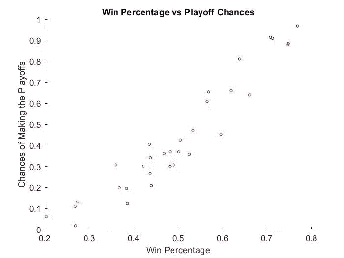
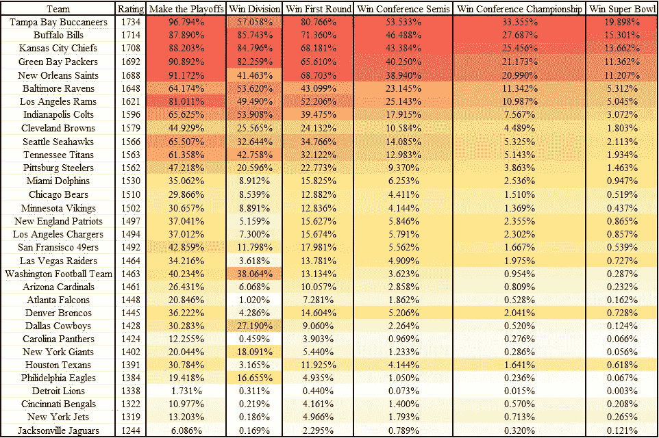
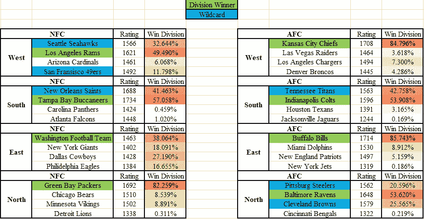
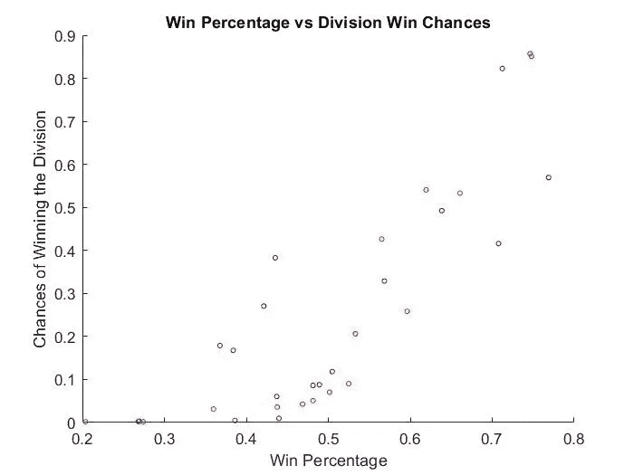
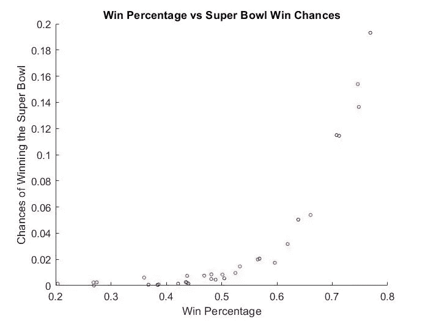

# NFL 模拟:蒙特卡罗方法

> 原文：<https://towardsdatascience.com/the-nfl-simulation-monte-carlo-methods-2f110424b1dd?source=collection_archive---------10----------------------->

## MATLAB 中蒙特卡罗方法在 2021 年 NFL 赛季中的应用



## 简介:

随着 2021 年 NFL 赛季的开始，我认为没有比现在更好的时间来设计一个模拟 2021 赛季的程序了。

我选择使用蒙特卡罗方法，以允许在模拟过程中游戏之间的一些变化。如果球队的排名在一个赛季中保持不变，它不会让球队在几场大胜中获得动力。它也不允许收视率根据淡季因素进行调整，因为淡季因素无法在两季之间量化。也就是说，接下来是我如何制作程序，以及模拟的结果。

## 工作原理:

每个队都有上个赛季的评分，这些评分可以用来确定一个队在某场比赛中获胜、失败或打平的机会。下面的代码是如何确定这些概率的，只使用两个队的评分，还有一个额外的主场优势。

```
Ha = 1/(1+10^((team_data(home_schedule(i),1) - team_data(away_schedule(i),1) + 2.5) * -1/400)); % approx home team chance of winningAa = 1/(1+10^((-1 * team_data(home_schedule(i),1) + team_data(away_schedule(i),1)) * -1/400)); % approx away team chance of winningT = Ha + Aa - 1; % chance of a tieH = Ha - T; % adjusted home team winning chancesA = Aa - T; % adjusted away team winning chances
```

在每一场比赛后，球队的评级会根据他们获胜的几率和实际结果进行调整。如果一个胜算大的队伍输了，那么他们的评分会比胜算小的队伍降的多。下面是实现这一点的代码:

```
team_data(home_schedule(i),1) = team_data(home_schedule(i),1) + 20 * (HW - H); % adjusts home team's ranking based on resultteam_data(away_schedule(i),1) = team_data(away_schedule(i),1) + 20 * (AW - A); % adjusts away team's ranking based on result
```

赛季中的每场比赛都是模拟的，所有 32 支球队的记录都被跟踪。在 272 场比赛之后(每队 17 场)，季后赛必须开始了。NFL 季后赛从每个联盟中抽取 7 支球队，头号种子在第一轮比赛中胜出。每个会议中所有 4 个组别的获胜者由最高获胜百分比决定，然后最后 3 个是由接下来 3 个最高获胜百分比决定的通配符。从那里开始，每轮比赛结束后，进行补种。头号种子在超级碗之前获得主场优势，因为那场比赛是在中立地点进行的。下面是让季后赛发生的一部分代码:

```
index = 0; % used to jump between divisions (index = 0,4,8,12)nfc_leaders = zeros(1,4); % initializes nfc division leaders arraynfc_scores = zeros(1,4); % initializes nfc division leader ratings arrayfor i = 1:4 % for all 4 needed division winnersfor j = 1:4 % for all 4 teams in each divisionif max(team_data(1 + index:4 + index, 5)) == team_data(j + index,5) % if that team has the max win percentage in the divisionteam_data(j + index, 6) = 2; % set the indicator equal to "2"nfc_leaders(i) = j + index; % add team to nfc_leader arraynfc_scores(i) = team_data(j + index,5); % add it's rating into this arrayindex = index + 4; % jumps to next set of 4 teams in next divisionbreakendendend
```

进入季后赛、赢得分区赛、赢得联盟半决赛、赢得联盟冠军或赢得超级碗的球队在重复赛季的过程中被跟踪，以找到每个球队进入季后赛一定长度的几率。下面是实现这一部分的部分代码:

```
for i = 1:7 % for all 7 conference teams in the playoffsfor j = 1:32 % check all 32 teamsif nfc_playoffs(i) == j % if that team made the playoffssuccess_data(j,1) = success_data(j,1) + 1; % add 1 to that data point in team matrixendif afc_playoffs(i) == j % same for afcsuccess_data(j,1) = success_data(j,1) + 1; % same for afcendendend
```

## 结果:

在模拟了 2021 年 NFL 赛季 100，000 次后，我发现了每个球队进入季后赛、赢得分区冠军、赢得季后赛第一轮、赢得联盟半决赛、赢得联盟冠军和赢得超级碗的比率。队伍按当前评分从高到低的顺序排列在左侧。



图片由作者提供

当想知道一支球队赢得了多少次超级碗时，使用一个像 100，000 这样的好整数来表示模拟量会有所帮助。海盗队赢得了所有 100，000 场超级碗的 19.898%，或 100，000 场模拟中的 19，898 次。另一方面，底特律雄狮队在 10 万场超级碗比赛中只赢了 3 场(0.003%)。

在“赢得部门”一栏中，有趣的是，除了 4 个主要异常值之外，较低的评级意味着赢得部门的机会较低。NFC 东区的这 4 支球队都有接近的评级，这意味着他们都有很好的机会赢得该部门。说到部门，下面是每个部门的分类。



图片由作者提供

绿色突出显示的团队最有可能赢得该部门，而蓝色突出显示的团队最有可能是通配符。总的来说，NFC 西区和 AFC 北区似乎是最强的赛区，每个赛区都有 3 个通配符中的 2 个。

我当时对一个球队的胜率如何影响他们在季后赛中的表现很感兴趣，所以下面显示了 3 个不同的散点图。蓝点是 NFC 中的球队，红点是 AFC 中的球队。


图片由作者提供

图的右上角显示了 NFC 和 AFC 之间的微小差异。在那个区域，胜率大致相同的蓝点比红点有更高的季后赛机会，这表明 NFC 比 AFC 更容易进入季后赛。



图片由作者提供

这张图显示了每支队伍赢得分组的机会。在图的左下角有 4 个蓝点属于 NFC 东部团队。这些球队可以有更低的胜率，但仍然有很大的机会赢得分区冠军，因为所有 4 支球队的排名都很接近。



图片由作者提供

对于这最后的情节，每个队赢得超级碗的机会被显示。它表明，常规赛胜率在 0.700 以上的球队在看待超级碗胜率时具有显著优势。

## 结论:

2021 年 NFL 赛季模拟发现了一些有趣的结果。它揭示了本赛季的分区最爱，也提供了一些关于哪些球队更容易进入超级碗的见解。这种模拟可以在每周更新，以积极反映每支球队新的季后赛机会，所以我接下来可能会采取的一些措施是每周查看个人比赛，以找到最大的冷门，或者可能哪些比赛对改变季后赛席位机会最重要。