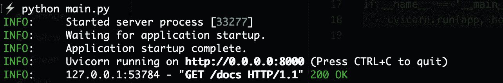
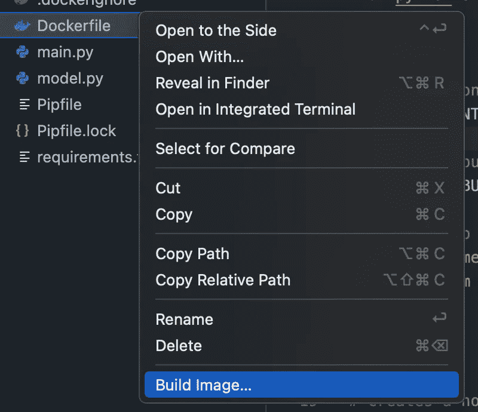
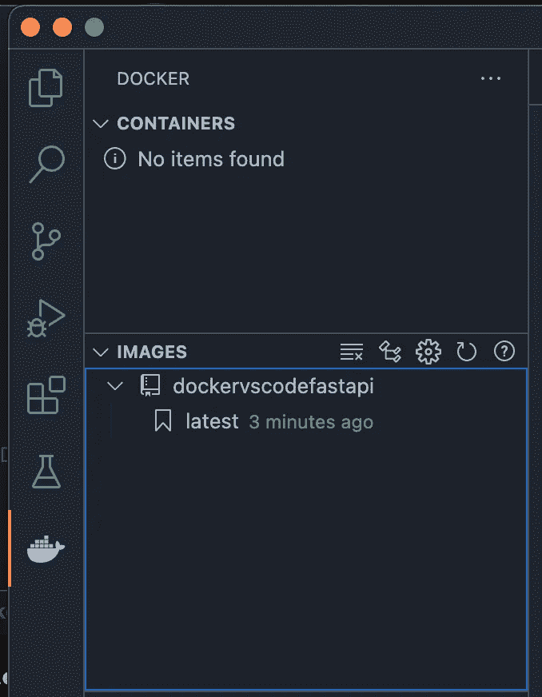
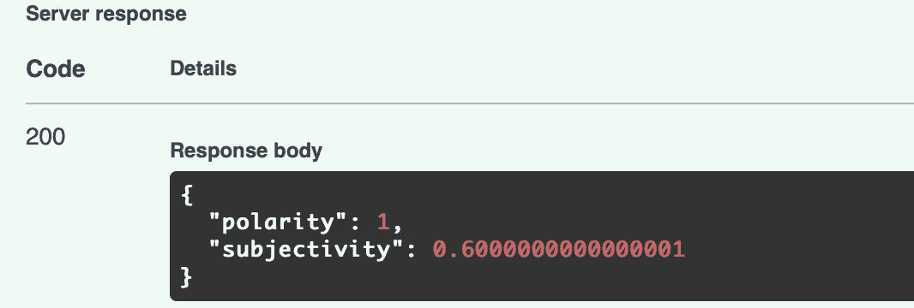

# 使用 Docker 部署 ML 模型的好方法

> 原文：<https://towardsdatascience.com/the-nice-way-to-deploy-an-ml-model-using-docker-91995f072fe8?source=collection_archive---------3----------------------->

## 使用 FastAPI 部署 ML 模型并在 VSCode 中轻松封装它的快速指南。


在 [Unsplash](https://unsplash.com?utm_source=medium&utm_medium=referral) 上由 [Toa Heftiba](https://unsplash.com/@heftiba?utm_source=medium&utm_medium=referral) 拍摄的照片

当由团队中的不同开发人员构建和运行 ML 项目时，存在与 ML 项目相关的挑战。有时，依赖项可能会不匹配，给同一个项目中的其他依赖库带来麻烦。此外，如果你提供一个必须以特定方式执行的项目，你还需要有一个清晰的每一步的文档。

通过使用 Docker，所有这些都可以变得更加容易和快捷。有了容器化，你可以节省很多时间，*和*有助于从长远来看平滑你的应用程序的部署过程。

> 如果您正在寻找一个包含为您的项目手动构建和运行 docker 映像的完整步骤的指南，您可以在本文中找到它:

[](https://pub.towardsai.net/how-to-dockerize-your-data-science-project-a-quick-guide-b6fa2d6a8ba1) [## 如何对您的数据科学项目进行分类——快速指南

### 我是如何一直用这些简单易行的步骤做到的！

pub.towardsai.net](https://pub.towardsai.net/how-to-dockerize-your-data-science-project-a-quick-guide-b6fa2d6a8ba1) 

然而，在本教程中，我将介绍一个更简单的过程来简化 Docker 开发，这个过程完全可以在 VSCode 本身的帮助下完成。

让我们回顾一下构建模型的每一步，然后是 API，最后是 dockerizing。👇

# 构建我们的 ML 模型

我们将使用 Spacy 来构建一个简单的情感分类器，它为传递给它的任何一段文本输出两个结果:

**极性** —它是一个位于[-1，1]范围内的浮点数，其中 1 表示完全肯定的陈述，而-1 表示完全否定的陈述。

**主观性**—*主观*句一般指个人观点、情感或判断，而*客观*则指事实信息。它是一个位于[0，1]范围内的浮点数。

现在，让我们安装一些包来开始我们的开发:

```
pipenv shell # make a new virtual environmentpipenv install pydantic fastapi uvicorn spacy spacytextblob # the packages to install
```

现在，将 **cd** 放到项目中，并制作一个名为“model.py”的新文件。

让我们填写该文件的代码:

```
import spacyfrom spacytextblob.spacytextblob import SpacyTextBlobfrom pydantic import BaseModel class SentimentQueryModel(BaseModel): 
    text : strclass SentimentModel:
    def get_sentiment(self, text): nlp = spacy.load('en_core_web_sm') nlp.add_pipe("spacytextblob") doc = nlp(text) polarity = doc._.polarity subjectivity = doc._.subjectivity return polarity, subjectivity
```

我们使用**sentitenquerymodel**来包含我们对这个模型的唯一查询——我们将为其预测情感的文本，以及**sentitenmodel**作为加载 spacy tokeniser 和 spacytextblob 库并为我们的给定文本执行情感预测的类。

我们现在将进入下一步，构建我们的 API。

# 制作 API

FastAPI 是一种更新、更好的方法，可以将您的机器学习模型部署为 REST API，以便在您的 web 应用程序中使用。

让我们在一个名为“main.py”的新文件中使用我们的“model.py ”,并用它构建一个 REST API:

```
import uvicornfrom fastapi import FastAPIfrom model import SentimentModel, SentimentQueryModelapp = FastAPI()model = SentimentModel() @app.post('/predict') def predict(data: SentimentQueryModel): data = data.dict() polarity, subjectivity = model.get_sentiment(data['text']) return { 'polarity': polarity, 'subjectivity': subjectivity }if __name__ == '__main__':
    uvicorn.run(app, host='0.0.0.0', port=8000)
```

这个 API 现在将在本地主机端口 8000 上运行，我们将通过在终端中运行来验证这一点:

```
python main.py
```

您将看到输出:



按作者排序的图像—运行 FastAPI 的终端输出

如果您导航到 **localhost:8000/docs** ，您将能够在浏览器本身中查看和测试 API！这不是很棒吗？

但是现在我们有了模型和 API，我们终于可以继续用它来制作 Docker 容器了！

# 用码头工人集装箱化

确保您的 VSCode 中安装了 Docker by Microsoft 扩展。接下来，在你的机器上启动 Docker Desktop。

现在，进入 VSCode，输入:Command + Shift + P，调出命令面板。输入“添加 Docker 文件”,你将得到一个选项来添加 Docker 文件到你的项目中。这一流程大大简化了我们的整个工作流程。

按照说明操作，保持端口号为 **8080** 。不要忘记端口 8000 是用于我们的 API 本身，所以我们需要一个不同的 Docker 来运行！

现在，只需右键单击侧边栏中的 Dockerfile 并选择“构建图像”。



按作者分类的图像——构建 docker 图像

在构建映像时，您将开始在终端中看到输出。

接下来，您可以切换到 VSCode 侧栏上的 Docker 选项卡。

在这里，您将看到系统中已有的图像列表。我们刚刚构建的新图像也将在这里显示如下:



按作者分类的图像—展示构建的 docker 图像

现在你只需要右击图像名称下的“**最新**，选择**运行**选项。

您可以通过右键单击构建的容器并单击“查看日志”选项来查看启动日志。

现在，当您导航到 **localhost:8000/docs** 时，您将看到以下屏幕:


按作者排序的图片— API docs +在浏览器中执行！

您只需单击“Execute ”,这将产生如下输出:



按作者分类的图像— API 输出响应

# 几句临别赠言…

所以，现在你有了它——从 ML 模型制作一个 API 并使用 Docker 将其容器化的完整管道！

正如您现在可能已经理解的那样，VSCode 使得任何对 Docker 了解不多的人都可以非常容易地在一个容器中快速启动他们的项目。我希望这篇初学者教程有助于您熟悉使用 Docker 部署 ML 模型。

> 也请查看[这篇关于在模型部署过程中要避免的常见错误的文章](https://neptune.ai/blog/model-deployment-mistakes)！

将来，[我会回来](https://ipom.medium.com)制作一些更复杂的模型，并用 Docker 将它们打包。所以[跟我来](https://ipom.medium.com)留在圈子里！

## [***成为一名中等会员，从不错过我每周发表的任何一篇数据科学文章。***](https://ipom.medium.com/membership/) ***在此加入👇***

[](https://ipom.medium.com/membership/) [## 通过我的推荐链接加入 Medium

### 作为一个媒体会员，你的会员费的一部分会给你阅读的作家，你可以完全接触到每一个故事…

ipom.medium.com](https://ipom.medium.com/membership/) 

# 和我联系吧！

> 在推特上关注我。
> 订阅我的[数据科学刊物](https://yashprakash.substack.com)。
> [查看我所有数据科学文章的完整代码库！](https://github.com/yashprakash13/data-another-day)

我的另外几篇文章你可能会感兴趣:

[](/heres-how-to-use-jupyter-notebooks-on-steroids-with-deepnote-c35251222358) [## 以下是如何在 Deepnote 上使用 Jupyter 笔记本的方法

### 在本教程中，了解 Google Colab 的完美替代方案！

towardsdatascience.com](/heres-how-to-use-jupyter-notebooks-on-steroids-with-deepnote-c35251222358) [](/the-nice-way-to-manage-your-data-science-workflow-7fb92a2ee4a2) [## 管理数据科学工作流的好方法

### 在初学者示例中学习使用 Prefect 构建 ETL 管道

towardsdatascience.com](/the-nice-way-to-manage-your-data-science-workflow-7fb92a2ee4a2)