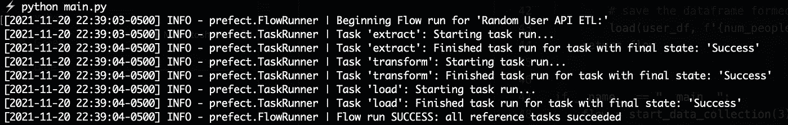
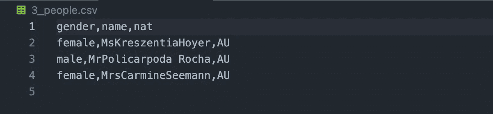

# 管理数据科学工作流的好方法

> 原文：<https://towardsdatascience.com/the-nice-way-to-manage-your-data-science-workflow-7fb92a2ee4a2?source=collection_archive---------18----------------------->

## 在初学者示例中学习使用 Prefect 构建 ETL 管道


简·帕拉什在 [Unsplash](https://unsplash.com?utm_source=medium&utm_medium=referral) 上的照片

作为数据科学家，我们对自己的工作深感自豪。我们试图编写良好的模块化代码，并进行日志记录和测试，以确保我们的代码按预期工作。但不幸的是，数据的**提取**、**转换**、**加载**的完美流水线并不存在，无论我们投入了多少精力去设计它。

其实写好代码有时候和它运行不流畅没有关系。有些因素甚至是我们训练有素的眼睛看不见的，要花相当多的时间和精力去捕捉它们。

那么，如果我告诉你有一种方法可以确保你能看到哪里出错了，万一出错了呢？有一个完美的工具，当你的代码运行良好时，它是不可见的，只有当你的代码不能按预期运行时，它才是可见的。

如果我说有一个工具可以帮助你确保你的代码成功失败呢？

欢迎来到 [**提督**](https://prefect.io) 世界。

完美帮助你熟练和透明地处理工作流程管理。它是一个结合了各种特性的工具，以确保您的代码拥有成功执行或失败所需的一切。

在这篇文章中，我讨论了学习如何使用 Prefect 和构建一个简单的 ETL 管道的一些基本概念。

我们开始吧👇

# 安装提督和一些简单的定义

提督可以简单地用 pip 安装:

```
pip install prefect # please do it inside a virtual environment
```

我们还需要这个教程的**请求**和**熊猫**库。安装简单:

```
pip install requests pandas # also inside a virtual environment
```

**从其完整的文档中可以看出:**

***任务*** 本质上是:

> 完美任务是对何时运行有特殊规则的函数:它们可选地接受输入，执行一些工作，并可选地返回一个输出。

所以它们被用来做一些工作，或者工作的某一部分。

在提督中，工作流被定义为“ ***流程*** ”和

> 工作流(或“流程”)是任务的容器。流表示任务之间的依赖结构，但是不执行任何逻辑。

所以有了**流**，你可以将一些**任务**集合起来执行一组特定的期望功能。它更像是一个任务流水线。

好了，现在我们已经完成了，让我们看看如何建立一个。

# 构建我们的任务

我们在本教程中的目标很简单——在[随机用户免费 API](https://randomuser.me/documentation) 的帮助下获取用户列表，并在每次运行我们的工作流时将它们保存到一个新的 csv 文件中。

听起来够简单吧？

太好了。让我们看看我们需要在其中构建哪些组件。

让我们先导入我们的库，不要太多，我向你保证:

```
import requestsimport pandas as pdfrom prefect import task, Flowimport json
```

现在，首先，我们决定将我们的工作流分成三个任务(功能):

## **提取**

我们将在这个函数中从 API 中获取一个特定数量的 ***用户*** 。

我们使用 requests ***get*** 函数来获取随机用户的列表。

```
@taskdef extract(url_from): response = requests.get(url_from) if response: return json.loads(response.content)["results"] else: print("No response gotten.") 
```

注意到那里的`***@task***`装饰者了吗？这就是将函数变成任务所需的全部内容。

接下来是我们将用来把我们的用户 json 转换成数据帧的函数。

## 改变

在这里，我们将用户的 JSON 字段转换成包含每个人的数据的个人字典**的**列表**T21【people _ list】列表**。

我们将从所有`**person**` 响应中提取三个特征:

1.  姓名=名+姓
2.  性别，以及
3.  国籍

```
@taskdef transform(data_dict): people_list = [] for person in data_dict: single_item = { 'gender': person["gender"], "name": person["name"]["title"] + person["name"]["first"]  + person["name"]["last"],"nat": "AU", } people_list.append(single_item) # return dataframe from list of dicts return pd.DataFrame(people_list)
```

最后，我们有我们的**加载**功能。

## 负荷

这个函数执行简单的任务，将 csv 保存到我们的本地目录。

我们指定“ **data_df** ”作为这个函数的参数，它是我们在转换步骤中构建的数据帧，以及**文件名**作为我们保存的 csv 的参数。

```
@taskdef load(data_df, filename): data_df.to_csv(f"{filename}.csv", index=False)
```

现在，让我们继续构建一个完整的工作流程。

# 制造流动

在这一点上，我们已经定义了自己执行一点任务的独立函数。现在，我们想把他们聚集在一起，建立一个管道。特别是 ETL 管道。

我们和`**Flow**`一起这么做。

```
def start_data_collection(num_people_to_fetch): with Flow("Random User API ETL:") as flow: # get specific number of people profiles upon each request people = extract(f'https://randomuser.me/api/?inc=gender,name,nat&results={num_people_to_fetch}') # make a dataframe out of the response user_df = transform(people) # save the dataframe formed to disk load(user_df, f'{num_people_to_fetch}_people') return flow
```

下面是我们在这个函数中做的事情:

*   我们创建一个新的带有名称的流对象。
*   我们用提取方法启动管道，并获取一些用户
*   然后我们把这些用户转化成熊猫的数据框架
*   最后，我们将数据帧保存为 csv 文件，文件名作为参数指定

我们逐一完成所有这些任务，然后返回我们的流对象。

**只有一个简单的步骤不同于简单地按顺序调用我们的函数**——我们做同样的事情，但是在我们的流对象内部。

# 测试我们的 ETL 工作流程

最后一步是测试我们构建的内容。这里有一个简单的主函数来运行我们的流对象:

```
if __name__ == "__main__": flow = start_data_collection(3) flow.run()
```

仅此而已。你完了。

以下是您在命令行中使用以下命令运行它时得到的输出:

```
python main.py
```



显示我们管道成功的终端输出

这是保存到磁盘的 csv:



通过 API 调用保存了人员详细信息的 csv

# 结束…

这就是——一个简单的 ETL 工作流，帮助你开始使用 Prefect。我建议您尝试自己复制这个示例，并在其中加入一些额外的概念，如故障检测、重试支持等。

如果你想参考全部代码，这里是我的 GitHub repo，包含我在文章中使用的所有资源。明星⭐️它和书签。

<https://github.com/yashprakash13/data-another-day>  

# 最后一件事

我希望这篇文章是一篇简单而有帮助的文章。我定期撰写关于数据科学和编程的文章，并尽我所能让它变得有趣并吸引你。

所以，保持联系，和我一起踏上旅程。:)

👉这里是获取我经常与 100 多个订阅者分享的所有文章、顶级资源和见解的最佳方式。

👉[跟随我在媒体上，永远在循环中](https://ipom.medium.com)。