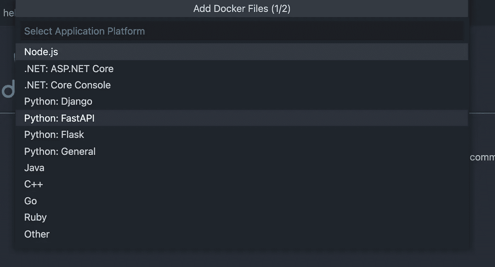
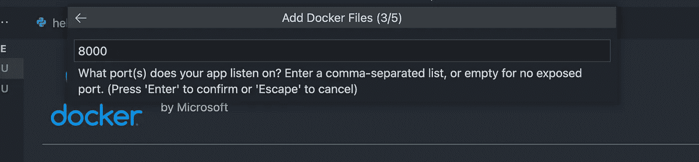
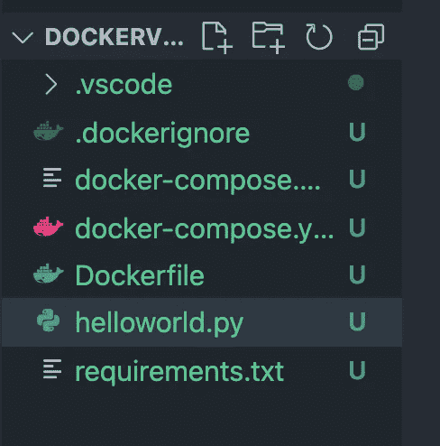
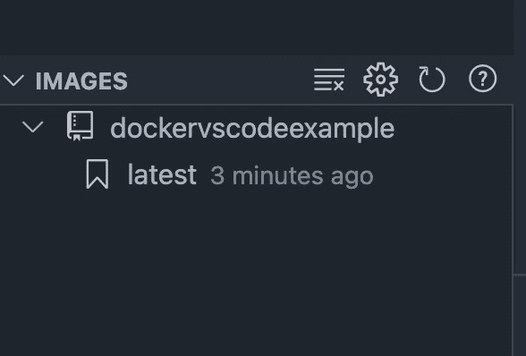
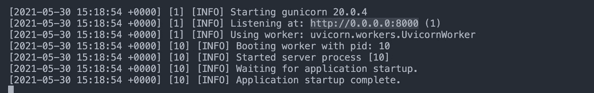

# 将 Docker 与 VSCode 结合使用的好方法

> 原文：<https://towardsdatascience.com/the-nice-way-to-use-docker-with-vscode-f475c49aab1b?source=collection_archive---------3----------------------->

## 在 VSCode 框架下使用 Docker 设置数据科学项目的快速指南。


由 [Curology](https://unsplash.com/@curology?utm_source=medium&utm_medium=referral) 在 [Unsplash](https://unsplash.com?utm_source=medium&utm_medium=referral) 拍摄的照片

您的下一个项目可能包含许多复杂的机器学习代码，其中包含许多不同的库，它们的版本可能会对您的机器造成严重破坏。接下来是确保您的同事也可以运行安装了正确依赖项的应用程序的过程。这带来了新一轮的头痛。

***不一定非要这样。***

**在 docker 容器内开发**可以节省你很多时间，*和*有助于从长远来看平滑你的应用程序的部署过程。在另一篇文章中，我讨论了为您的项目手动构建和运行 docker 映像的完整步骤。这里可以找到[。](https://pub.towardsai.net/how-to-dockerize-your-data-science-project-a-quick-guide-b6fa2d6a8ba1)

> 但是有一个更简单的方法来为你的下一个项目自动设置 Docker，它内置在 VSCode 中。

在这个故事中，让我向您展示我是如何通过几个简单的步骤在一个容器中开始一个新的开发环境的。

我们开始吧👇

# 获取有用的扩展！

VSCode Docker 扩展是所有 Docker 工作流的主干。确保你已经通过访问扩展市场安装了它，或者直接访问这个 URL: [Docker 扩展](https://marketplace.visualstudio.com/items?itemName=ms-azuretools.vscode-docker)。

现在，在你的机器上启动 **Docker 桌面**。

这个扩展使得构建、运行和部署容器化的应用程序变得很简单，所有这些都不需要离开代码编辑器！

在进入下一步之前，请确保 Docker Desktop 正在运行。

# 写一个简单的应用程序

本教程的目的是展示以 dockerised 方式开发一个应用程序是多么容易。记住这一点，我将展示一个使用 **FastApi** 构建 HelloWorld 应用程序的简单示例。

首先，创建一个名为`**helloworld.py**`的新文件，并将这段代码粘贴到其中:

```
*from* fastapi *import* FastAPIapp = FastAPI()@app.get("/")async def root(): *return* {"message": "Hello World"}
```

这将确保我们有一个简单的 API，在暴露的 URL 显示“Hello World”消息。

现在到了我们和 Docker 一起玩的部分。

# 塑造新的码头工人形象

首先，您需要创建一个`**requirements.txt**`文件，其中包含我们正在构建的应用程序的所有依赖项。

由于这个测试应用程序的简单性，我们现在只有这两个:

```
fastapi[all]==0.63.0uvicorn[standard]==0.13.4
```

最后按 CMD + Shift + P 或者 CTRL + Shift + P 打开 VSCode 的命令 pallete。输入并选择**“添加 Docker 文件…”**

将弹出下面的窗口，选择 FastApi 选项。



从 dockerfile 选项中选择 fastapi

这一流程大大简化了我们的工作流程。

**因此，即使我们没有将 FastApi 依赖项放在** `**requirements.txt**` **文件中，它也会添加它。那不是很整洁吗？**

现在，继续选择**端口**选项，如下图所示。默认设置应该就可以了。如果您愿意，可以根据您的要求进行更改。



码头工人的港口选择

最后，建立你的 Docker 形象的步骤到了。在生成的 **Dockerfile** 上点击右键，选择`**Build Image**` **。**

现在，您应该在编辑器中获得以下文件:



生成 Docker 文件后的文件夹结构

太棒了。为了测试我们的 API，我们现在可以进入最后一步了！

# 运行 Docker 容器

现在我们已经准备好了图像，您可以切换到 VSCode 侧边栏左侧的 Docker 选项卡。

在这里，您将看到系统中已有的图像列表。我们刚刚构建的新图像也将在这里显示如下:



形象已经建好了！

这太棒了。现在你只需要右击你的图像名称下的`**latest**`，选择**运行**选项。

您可以通过右键单击构建的容器并单击“查看日志”选项来查看启动日志。这将产生如下输出:



你的 api 是活的！

这意味着我们的 API 正在运行。

# 最后几句话…

打开你的网络浏览器，导航到上面的网址或者简单地: **0.0.0.0:8000。**您现在应该看到 Hello World 消息了！

太好了！现在，您应该能够围绕这个过程构建自己的项目了。

我希望这篇文章能够作为一个很好的起点，让您快速了解使用 Docker 开发 Python 应用程序的便捷方式。我建议你通过阅读官方文档来体验 VSCode 中 Docker 的其他特性。我知道我会的。😃

如果你觉得这篇文章有帮助，[跟随我这里](https://medium.com/@ipom)因为我每周都写，确保你永远不会错过另一篇文章。

此外，我所有数据科学文章的代码库和资源都在这里的[中。](https://github.com/yashprakash13/data-another-day/blob/main/README.md#about-those-code-editorshmmm)快乐学习！

我还有几个故事，你可能会感兴趣:

</deploying-an-ml-model-with-fastapi-a-succinct-guide-69eceda27b21>  </how-to-use-bash-to-automate-the-boring-stuff-for-data-science-d447cd23fffe> 