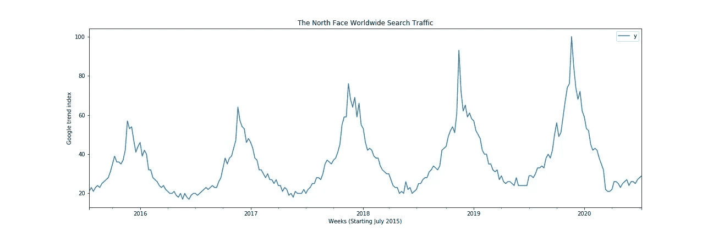
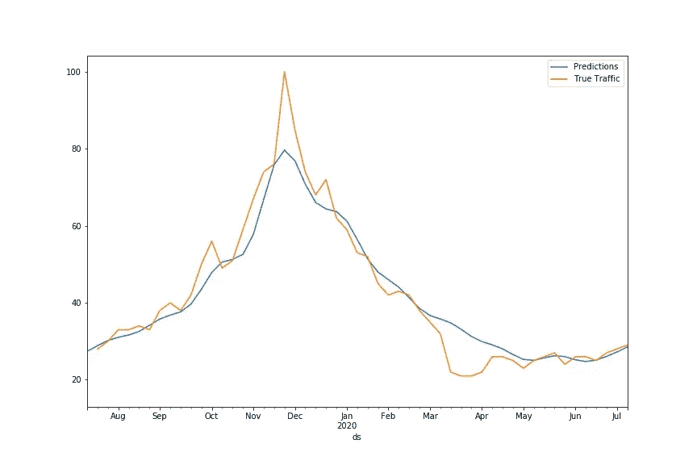
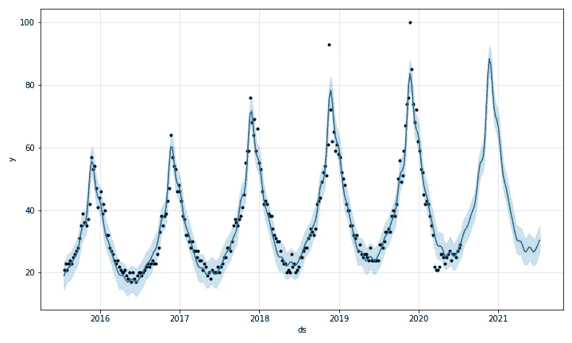
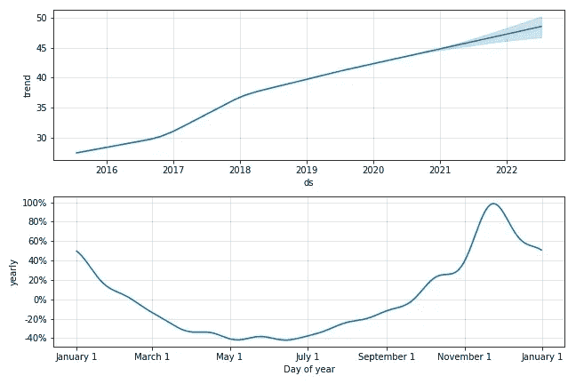
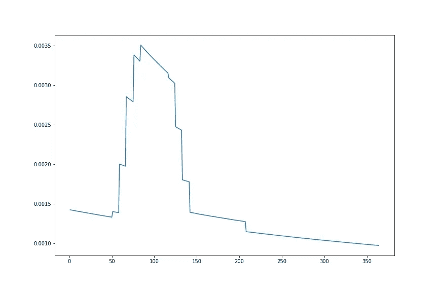

# 北面和无尽的夏天

> 原文：<https://towardsdatascience.com/the-north-face-and-the-endless-summer-a6c8a27c67a6?source=collection_archive---------40----------------------->

## **脸书预言家网站的搜索量趋势和季节性分析**


由[本杰明·沃罗斯](https://unsplash.com/@vorosbenisop?utm_source=medium&utm_medium=referral)在 [Unsplash](https://unsplash.com?utm_source=medium&utm_medium=referral) 上拍摄的照片

在过去的几年里，North Face 一直是全球时尚和户外行业最大的品牌之一。从 1968 年开始作为一个针对核心爱好者的小品牌，到今天与一些最大的炒作品牌合作，如 Supreme，该品牌的知名度有了巨大的增长。

这个机器学习和预测建模项目分析了 North Face 的全球谷歌搜索流量，以了解该品牌最近的成功是否会持续，以及最近的全球事件如何影响其数字足迹。

数据来源于 Google Trends，涵盖了从 2015 年 7 月到 2020 年 7 月的五年时间，数据量是从 0 到 100 的标度值。

搜索量是衡量该品牌整体财务表现的一个很好的指标。该品牌很大一部分销售额将来自数字平台。由于最近的全球事件和商店无限期关闭，这一点变得越来越重要。

已经利用了五年的数据，这个时间框架提供了一个很好的窗口，在这个窗口中，品牌身份和户外行业的地位是一致的——这允许应用统计技术。



5 年间的搜索量

该品牌在深秋经历了最大的搜索流量。这将受到为冬季寻找设备的核心市场和为圣诞节购买产品的消费者市场的推动。夏季是搜索流量最低的季节，因为保暖和防水衣物已经过时。

季节性是一致的，数据呈上升趋势，峰值与总体增长成比例增加。从建模的角度来看，值得注意的是，数据是成倍增长的，搜索流量正以越来越快的速度增长。

实际上，这意味着该品牌正以指数速度增长，然而 2020 年的春天可能会改变这一点。由于新冠肺炎，2020 年初交通流量的下降比预期的更为极端，流量下降到 2018 年夏季的水平。

**脸书先知**

使用脸书先知库，我将数据分为训练集和测试集，并建立了一个模型来预测数据集的最后一年，以便我们可以分析模型在已知值上的性能。

```
m = Prophet(seasonality_mode='multiplicative')
m.fit(train)
future = m.make_future_dataframe(periods=52,freq='W')
forecast = m.predict(future)
```

该模型很好地预测了下图所示的真实值。随着方差的减少，预测是真实曲线的更平滑的代表。



预测与测试集

均方根误差表明，我们的模型平均离真实值有 12.6%的差距，不算很好，但确实有一些预测能力。

```
from statsmodels.tools.eval_measures import rmse
predictions = forecast.iloc[-52:]['yhat']
rmse(predictions,test['y']) / test.mean()y    0.125569 
dtype: float64
```

**对整个数据集进行再训练**

对模型的强度感到满意，它在整个数据集上进行了重新训练，以便我们可以展望未来。

建立另一个模型预测了未来的 52 个周期-数据是每周的，因此这将预测持续到 2021 年 7 月。

```
m = Prophet(seasonality_mode='multiplicative')
m.fit(df)
future = m.make_future_dataframe(periods=52,freq='W')
forecast = m.predict(future)
```

由于信息的季节性，至少需要预测一年，以便评估趋势和季节性。



预测未来一年

这表明，该模型认为，搜索量的积极趋势将会延续，复合倍增性质将继续下去。

展望 2021 年夏季，似乎低谷已经扩大，因此表明未来该品牌的淡季将比往常更长。很难说这是新冠肺炎的结果还是数据中的自然趋势，因为冬季对该品牌越来越重要。

这是查看数据中异常值的好时机；每年都有一周搜索流量明显高于其他数据点，这就是黑色星期五周。

在 2020 年春季开始时也有一群异常值，由于疫情和经济不确定性的结果，这些点低于趋势。

移除这些异常值将提高模型的准确性，但是，这些是解释品牌搜索量表现的关键事件，并且已经包含在建模中。模型的准确性被牺牲了，取而代之的是一种更基本、更原始的预测工具，我们可以用信息周围事件的知识来解释它。

**趋势变化**

对数据洞察应用变点功能可以获得趋势如何随时间变化的信息。

```
from fbprophet.plot import add_changepoints_to_plot
fig = m.plot(forecast)
a = add_changepoints_to_plot(fig.gca(),m,forecast)
```


季节变化点

从 2016 年底到 2018 年初，North Face 的搜索量处于高速增长期。自那时以来，趋势是积极的，但速度在下降。这表明该品牌的增长在放缓。

下面的图表很好地展示了品牌的趋势和每年的季节性。从五年期间趋势的百分比变化来看，该品牌经历了高增长率，然后是较低的增长率。



时间序列组件

第二个差异证实了这一点，增长率增加后增长率下降。



趋势的第一个差异

根据对 North Face 的全球谷歌搜索流量进行的预测建模，结果表明该品牌将继续增加其数字量，但速度会放缓。

该品牌产品的市场过度饱和以及消费者行为的改变可能是其结果，而最近的全球冲击将产生重大影响。

这可能会给该品牌带来更严酷的冬天和商业上无尽的夏天。

我希望你喜欢阅读这篇文章，如果想了解更多信息，请随时通过 LinkedIn 与我联系。

[GitHub repo](https://github.com/gilesdean/the_north_face) 获取代码和数据。