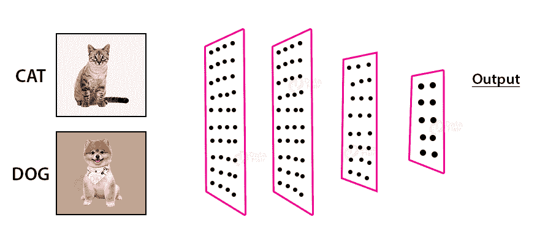

# 不那么天真的贝叶斯

> 原文：<https://towardsdatascience.com/the-not-so-naive-bayes-b795eaa0f69b?source=collection_archive---------21----------------------->


## 采用简单的方法构建垃圾邮件分类器

你有没有想过，当你收到一封邮件后，你的电子邮件服务提供商是如何立即将它归类为垃圾邮件的？或者，你有没有想过，在线电子商务平台的推荐是如何根据实时用户行为快速变化的？这些是朴素贝叶斯分类器投入使用的一些用例。

朴素贝叶斯是一种监督分类算法，主要用于处理二元和多类分类问题，尽管经过一些修改，它也可用于解决回归问题。这是用于处理分类问题的最简单的算法之一，尤其是当数据集具有较少的数据点时。

在这篇文章中，我们将首先看看朴素贝叶斯背后的数学概念，然后我们将看看不同类型的贝叶斯分类器，一旦我们有了朴素贝叶斯分类器实际上是什么的要点，然后我们将尝试建立我们自己的分类器。也请阅读我以前的文章来了解不同的分类算法。

# **朴素贝叶斯简介**

朴素贝叶斯是用于处理分类问题的最简单和广泛使用的监督分类算法之一。这是一种直观的分类算法，基于贝叶斯定理的原理，以统计学家托马斯·贝叶斯牧师的名字命名。


图片由[皮尔·保罗](https://pierpaolo28.github.io/blog/blog29/)提供

朴素贝叶斯模型易于构建，对于处理较小的数据集尤其有用。除了简单之外，朴素贝叶斯还因其速度和准确性而胜过甚至高度复杂的预测模型。该算法在文本数据项目中表现异常出色，包括情感数据分析、垃圾邮件检测和文档分类等。三种主要类型的朴素贝叶斯算法:

1.  **高斯朴素贝叶斯:**特征服从高斯或正态分布时常用。这也需要计算数据的平均值和标准差。
2.  **多项朴素贝叶斯**:用于多项分布数据。这适用于具有离散特征的分类。
3.  **伯努利朴素贝叶斯:**用于多元伯努利分布。它要求将数据点视为二进制值的特征向量。

朴素贝叶斯的另一种变体是互补的朴素贝叶斯或 CNB，当训练集中的类不平衡时，它往往比它的对应物工作得更好。互补朴素贝叶斯(CNB)分类器通过估计除了我们正在评估的类之外的所有类中的数据的参数，改进了朴素贝叶斯分类器的弱点。


图片来自 [StackOverflow](https://www.google.com/url?sa=i&url=https%3A%2F%2Fstackoverflow.com%2Fquestions%2F10059594%2Fa-simple-explanation-of-naive-bayes-classification&psig=AOvVaw3ppJpy46zGlx2D1qtRECGz&ust=1610026776334000&source=images&cd=vfe&ved=0CAMQjB1qFwoTCODt29u4h-4CFQAAAAAdAAAAABAJ)

与它的姐妹算法相比，朴素贝叶斯分类器可以更快地被训练，并且它也做出更快的预测。可以用新的训练数据对其进行修改，而不必从头开始重建模型。

# **朴素贝叶斯的引擎盖下**

如前所述，该算法基于描述事件概率的贝叶斯定理的原理，基于已经发生并以某种方式与事件相关的条件的先验知识。**贝叶斯定理**的等式为:


在哪里，

*   **P(A|B)** 是给定 B 的概率，这叫做后验概率。
*   **P(B|A)** 是数据 B 给定 A 的概率。
*   **P(A)** 是 A 的概率，这叫做 A 的先验概率。
*   **P(B)** 是数据的概率。


图片来自 [Sem Spirit](https://www.google.com/url?sa=i&url=http%3A%2F%2Fwww.semspirit.com%2Fartificial-intelligence%2Fmachine-learning%2Fclassification%2Fnaive-bayes-classification%2Fnaive-bayes-classification-in-python%2F&psig=AOvVaw2sw1kUgsZsNkID-IHFjxlA&ust=1610025444604000&source=images&cd=vfe&ved=0CAMQjB1qFwoTCJja5amyh-4CFQAAAAAdAAAAABAe)

这里 P(A|B)和 P(B|A)是条件概率。这给出了事件 A 发生的概率，假设 B 已经发生，反之亦然。在可能有一个以上结果的情况下，使用的公式是:


训练朴素贝叶斯分类器比它的大多数姐妹算法都要快。这是因为只需要计算每个类别的概率和给定不同输入值的每个类别的概率。

# **朴素贝叶斯有什么好幼稚的？**

这种算法被称为“幼稚”,因为它假设每个属性独立于其他属性。然而，在现实生活中这可能不是真的。简而言之，朴素贝叶斯分类器假定一个类的特定属性(也称为特征)的存在与否与该类的任何其他属性的存在与否无关。


图片来自[外星人](https://www.google.com/url?sa=i&url=https%3A%2F%2Fluminousmen.com%2Fpost%2Fdata-science-bayes-theorem&psig=AOvVaw3VQ0sYXsfKOP3lQLwdFI17&ust=1610031498258000&source=images&cd=vfe&ved=0CAMQjB1qFwoTCLjs2vfIh-4CFQAAAAAdAAAAABAD)

通过一个例子可以很容易理解这个假设。如果一朵花是粉红色的，生长在水中，水平伸展 3 英尺，它可以被认为是莲花。当使用朴素贝叶斯时，所有这些特征独立地贡献了花是莲花的概率，即使它们依赖于彼此的存在和不存在。

尽管如此，分类器在许多真实世界的情况下工作得非常好，尤其是在处理小数据集时。在大多数使用案例中，它的性能与神经网络和 SVM 的不相上下。然而，如果数据集由独立的属性组成，那么它甚至可以产生比逻辑回归算法更优化的结果。


图片来自 [Mathworks](https://www.google.com/url?sa=i&url=https%3A%2F%2Fwww.mathworks.com%2Fhelp%2Fstats%2Fclassification-probability-example-naive-bayes.html&psig=AOvVaw0HAhKc0sb5EQgXB2AJO7vN&ust=1610026254501000&source=images&cd=vfe&ved=0CAMQjB1qFwoTCMDo-462h-4CFQAAAAAdAAAAABAt)

现在您已经熟悉了朴素贝叶斯的概念，我们可以尝试构建我们自己的朴素贝叶斯分类器。用于构建这个模型的代码和其他资源可以在我的 [GitHub 资源库](https://github.com/ashwinraj-in/MachineLearningRecipes/blob/master/NaiveBayes.ipynb)中找到。

## **步骤 1:导入所需的库和数据集**

为了构建模型，我们的第一步将是导入所需的库。Jupyter notebook 和 Python 给了我们在代码的任何地方导入这些库的灵活性。我们需要导入 **Pandas** 和 **Numpy** 库来开始构建模型。

```
***#Import the Libraries and read the data into a Pandas DataFrame***import pandas as pd
import numpy as npdf = pd.read_csv("framingham_heart_disease.csv")
df.head()
```

Pandas 是一个快速易用的工具，构建在核心 python 库 Matplotlib 和 Numpy 之上，用于执行数据分析和操作。 **read_csv** 函数用于将数据集作为 pandas dataframe(一种二维数据结构)加载到我们的笔记本中。


图片来自[量子计算](https://www.google.com/url?sa=i&url=https%3A%2F%2Fquantumcomputingtech.blogspot.com%2F2019%2F10%2Fmachine-learning-classification_19.html&psig=AOvVaw0b9Hs5UpIJANfTV43rXwOS&ust=1610031884678000&source=images&cd=vfe&ved=0CAMQjB1qFwoTCKjLvczKh-4CFQAAAAAdAAAAABAU)

在本例中，我们将尝试构建一个垃圾邮件分类器，能够将给定的电子邮件分类为垃圾邮件或非垃圾邮件。建立模型的数据集可以从[这里](https://www.kaggle.com/uciml/sms-spam-collection-dataset)下载。

## **第二步:探索数据集和文本分析**

加载数据集后，我们的下一步是探索隐藏的预知。我们使用的数据集充满了洞察力。可以使用 **isnull** 函数检测数据集的缺失值。这些缺少值的记录要么被删除，要么用记录的平均值填充。

```
***#Exploring the Dataset***count1 = Counter(" ".join(data[data['v1']=='ham']["v2"]).split()).most_common(20)
df1 = pd.DataFrame.from_dict(count1)
df1 = df1.rename(columns={0: "words in non-spam", 1 : "count"})count2 = Counter(" ".join(data[data['v1']=='spam']["v2"]).split()).most_common(20)
df2 = pd.DataFrame.from_dict(count2)
df2 = df2.rename(columns={0: "words in spam", 1 : "count_"})
```

可以使用各种图表(如饼图和条形图)来可视化数据。这些都在 Matplotlib 包中。数据的好坏取决于它试图回答的问题。在这里，因为我们试图建立一个垃圾邮件分类器，文本分析有一个重要的作用。


作者图片

在这种情况下，由于我们正在将邮件分类为垃圾邮件，因此我们将把邮件中出现的单词作为模型特征。

## **第三步。数据预处理和特征工程**

既然我们已经从数据集获得了洞察力，接下来我们需要做的就是选择构建模型时要包含的要素，并对数据进行预处理。**文本预处理**、**分词**和**过滤停用词**在此步骤完成。

```
***#Feature Engineering***f = feature_extraction.text.CountVectorizer(stop_words = 'english')
X = f.fit_transform(data["v2"])
np.shape(X)
```

停用词是最常被软件忽略的常用词。一些最常见的停用词包括——“the”、“a”、“an”、“is”、“are”、“was”、“was”、“be”、“have”、“has”、“had”和“in”。这些单词没有意义，但是占用了数据库的空间。移除停用词是改善分析的关键步骤。


图片由[桑文德拉·辛格](https://medium.com/@sanvendra)

使用**feature _ extraction . text . count vectorizer(stop _ words = ' English ')**将文档转换为令牌计数矩阵。如果使用 stop_words = english，则使用内置的英语停用词表。在这之后，下一步将是把变量转换成二进制变量。

## **第四步:预测分析和建立模型**

现在，我们已经选择了所需的特征并清理了数据集，构建分类器的下一个任务是将数据集分成训练数据和测试数据。我们将把数据集分成 77%的训练数据和 23%的测试数据，随机状态为 42。

```
***#Split the dataset into training and testing data***data["v1"]=data["v1"].map({'spam':1,'ham':0})X_train, X_test, y_train, y_test = model_selection.train_test_split(X, data['v1'], test_size=0.33, random_state=42)
```


图片由[谷歌开发者](https://developers.google.com/machine-learning/guides/text-classification)

在这之后，我们的最后一步将是在我们的训练数据上安装分类器。对于这个例子，我们将使用多项式朴素贝叶斯分类器。

```
***#Fitting the Model***bayes = naive_bayes.MultinomialNB(alpha=list_alpha[best_index])
bayes.fit(X_train, y_train)
models.iloc[best_index, :]***#Generating the Confusion Matrix for our model***m_confusion_test = metrics.confusion_matrix(y_test, bayes.predict(X_test))

pd.DataFrame(data = m_confusion_test, columns = ['Predicted 0', 'Predicted 1'],
            index = ['Actual 0', 'Actual 1'])
```

在这里，我们的模型有 100%的测试精度，也不会产生任何假阳性。从**混淆矩阵**中，我们发现我们的分类器模型将 56 条垃圾邮件错误分类为非垃圾邮件。

# **改进分类器**

这个简单的算法表现得出奇的好。尽管我们的分类器有相当高的准确度，但仍然有改进的空间。如果连续特征不是正态分布的，那么我们应该首先使用合适的变换技术对特征进行变换。


图片来自[gifs.com](http://gifs.com)

这样，分类器的性能可以大大提高。集成技术(如 bagging 和 boosting)不会对朴素贝叶斯分类器产生太大影响，因为没有要最小化的方差。

# **朴素贝叶斯的优势**

朴素贝叶斯是应用最广泛的分类算法之一。使该算法如此流行的一些特征如下所述:

1.  朴素贝叶斯分类器可以快速训练，并且可以比其他分类器更快地生成预测。
2.  在处理多类问题时效果很好。
3.  与大多数分类器相比，它需要的训练数据少得多，并且在特征独立性假设成立或数据集成立的情况下，可以表现得非常好。


图片来自 [Pinterest](https://pinterest.com)

# **朴素贝叶斯的局限性**

尽管被广泛使用，但是算法的性能还是有一定的限制。其中一些如下所述:

1.  所有功能相互独立的假设在现实生活中很少成立。
2.  如果单个类别标签丢失，那么基于频率的概率估计将为零。这就是所谓的零频率问题。然而，这可以通过使用平滑技术来避免。
3.  数据稀缺可能导致算法的数值不稳定，从而导致分类器模型的模糊预测。

# **总结你所学的知识**

为了总结我们在本文中学到的内容，首先我们讨论了朴素贝叶斯背后的数学概念，以及如何使用它来构建分类模型。然后，我们讨论了不同类型的贝叶斯分类器，以及为什么这样命名该算法。



图片来自[数据文件夹](https://www.google.com/url?sa=i&url=https%3A%2F%2Fdata-flair.training%2Fblogs%2Fcats-dogs-classification-deep-learning-project-beginners%2F&psig=AOvVaw3_CkhllaqlzzCth2qGZzjF&ust=1610075496419000&source=images&cd=vfe&ved=0CAMQjB1qFwoTCPjhz-_siO4CFQAAAAAdAAAAABA4)

然后，我们通过建立自己的分类模型继续学习。为了支持我们的学习，我们讨论了这种分类技术的优点和局限性，以及如何改进算法的性能以做出更好的预测。

至此，我们已经到了这篇文章的结尾。我希望这篇文章能帮助你了解朴素贝叶斯分类器的工作原理。如果你有任何问题，或者如果你认为我犯了任何错误，请随时与我联系！通过[邮箱](http://rajashwin733@gmail.com/)或 [LinkedIn](https://www.linkedin.com/in/rajashwin/) 与我联系。快乐学习！