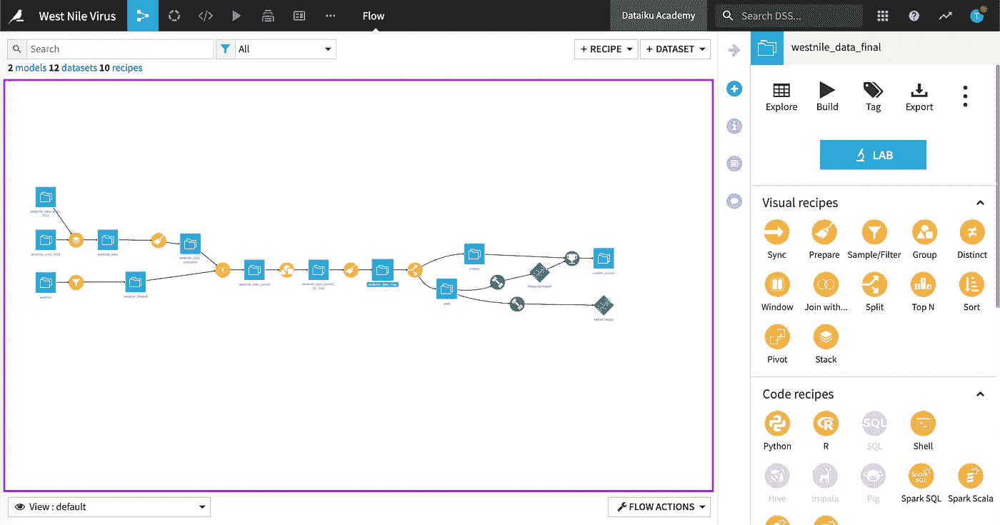
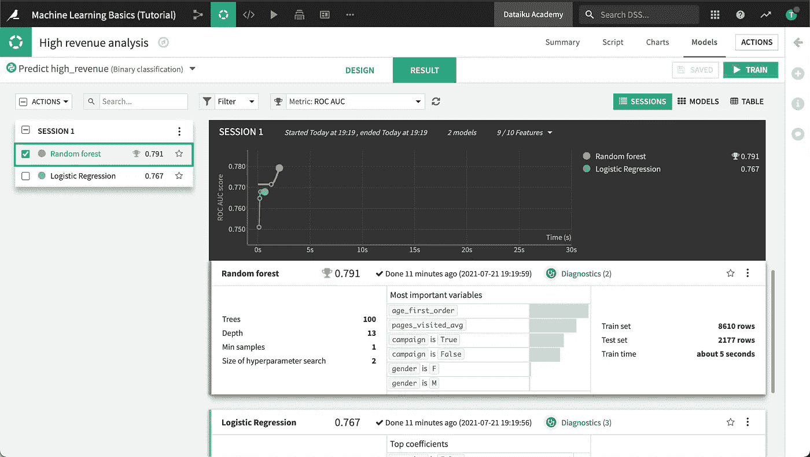

# 2022 年您应该掌握的一个数据科学工具

> 原文：<https://towardsdatascience.com/the-one-data-science-tool-you-should-master-in-2022-c088bb4371b2?source=collection_archive---------11----------------------->

[张秀坤·兰格](https://unsplash.com/@the_real_napster?utm_source=medium&utm_medium=referral)在[号航天飞机](https://unsplash.com?utm_source=medium&utm_medium=referral)上拍摄的照片

## 这个工具已经为我节省了很多时间，现在它正在占领市场！

> 开门见山:如果您不了解 Dataiku DSS，那您应该了解。说真的。它将为您节省数小时、多重头痛，并让您更享受数据科学！

# 什么是数据仓库决策支持系统

DSS(数据科学工作室的简称)是由一家名为 Dataiku 的公司创建的端到端机器学习平台。有时，您会看到人们将平台本身称为 Dataiku。

它的界面允许你将 SQL、R、Python、Jupyter 笔记本和可视化配方(无代码)结合到一个工作流程中。这意味着您可以将其用于数据准备、分析和建模。它还可以读写不同的数据源，

# 为什么你现在就应该学

DSS 正在接管世界:它最初是一家法国初创公司，现在总部位于纽约州，价值 46 亿美元**，拥有大约 **600 名员工。**客户名单:通用电气、丝芙兰、育碧、思科。**

**DSS 允许无代码、低代码和 100%代码的混合。有一种“低代码”趋势，公司正在慢慢走向让每个人都能更容易地访问数据。决策支持系统完全符合这一逻辑，同时仍然设法为那些想要 100%代码化的人保留这一选择。**

**就市场开发而言，决策支持系统仍远未充分发挥潜力。许多公司仍在纯代码环境下工作，这使得工具本身成为一种竞争优势，但从个人角度来看也很重要:因为工具仍在摸索中，所以在每个人都掌握它之前，先掌握它，会让你获得很大的优势。**

# **我的个人账户**

**就我个人而言，我认为对于这样一个可视化工具来说，当您为整个数据科学项目编写代码时，很难实现所有的功能。然而，进入决策支持系统几个月之后，我就已经着迷了:它易于使用的界面让我节省了数百个小时的工作，从数据提取到模型评估。**

****

**这就是决策支持系统流的样子**

**在进行数据**预处理**时，如果您愿意，您可以单独运行其中的一些步骤，并依次查看它们之间的交互方式。如果你不会编码，你可以用 SQL、R、Python 甚至是可视化的方法来实现。**

****

**模型训练界面**

**在**建模**时，您可以尝试许多不同的算法和超参数的组合，对它们进行比较，并实时看到训练的进行。您还可以访问多个情节，展示模型的即时表现(不再与 ggplot 作斗争)。**

**一旦您的模型准备好了，您就可以通过将整个流程导出到 DSS Automation Node 来**将它交付给生产**，这允许您以您需要的任何频率安排作业，在最后发送报告，等等。**

**很明显，你不需要仅仅为了建模而使用它，它还允许**特别分析**和**仪表板数据预处理**(你最终还是需要一个仪表板工具，DSS 并不是要取代它们)。**

**我看到越来越多的公司成功迁移到 DSS，并逐渐允许其他部门访问他们需要的数据，给他们更多的自主权进行简单的**数据提取**和**特别分析**，并给数据科学部门**更多的时间处理其他任务**。**

**此外，我已经看到 DSS 使**协作**变得更加容易:它不仅与 **Git** 集成，您还可以看到是否有其他人与您处理同一段代码，或者甚至是同一个项目。你可以为流程的每个部分留下注释和评论，甚至可以使用 markdown 编写一个完整的 Wiki 来记录你的项目。**

# **一些缺点**

**当然，没有任何工具是完美的，Dataiku 也不例外。**

**从公司的角度来看，它的一个主要缺点是拥有专有技术，这意味着你的公司必须为此付费。此外，它的流程逻辑使得很难将您的项目迁移到其他工具，您可能会发现自己被困在一个昂贵的解决方案中。**

**从个人的角度来看，即使 Dataiku 在网上提供了详尽的文档，如果你需要非常具体的帮助，你也不会在像 Stack Overflow 这样的网站上找到任何东西(让我们面对现实吧，如果没有 Stack Overflow，你不可能通过 Python 中的前 10 行代码)。**

**最后，可视化工具非常基础，只适用于简单的绘图，如直方图和散点图，所以如果您需要做一些稍微复杂的事情，您将需要使用 Python(或者 R，如果您喜欢这类东西的话)。**

# **怎么学呢**

**学习如何使用 DSS 的最好方法是实践:在你的电脑上安装[免费版](https://www.dataiku.com/product/get-started/)，然后**开始用你的**个人数据科学项目**玩**。如果没有，也可以试试他们的[教程](https://www.dataiku.com/learn/portals/tutorials/)，或者上几门[课程](https://academy.dataiku.com/page/course-catalog)。**

**我建议你至少给它一个月的时间，直到你习惯了 DSS 组织工作流程的方式，同时你在一个 **Kaggle 项目**中使用它。你会看到它将允许你更快地**实验**，同时跟踪你的模型的变化和进展。**

**如果你喜欢这篇文章，你可能也会喜欢这些:**

**</the-ultimate-list-of-courses-for-data-scientists-6ad615d6eb43>  </how-i-passed-the-gcp-professional-ml-engineer-certification-47104f40bec5>  联系我，这将是我的荣幸(老实说)。**