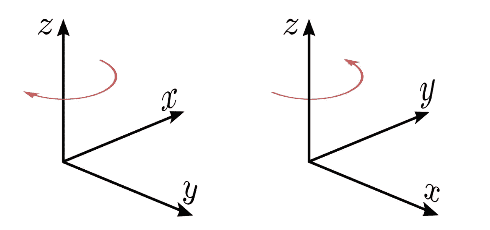
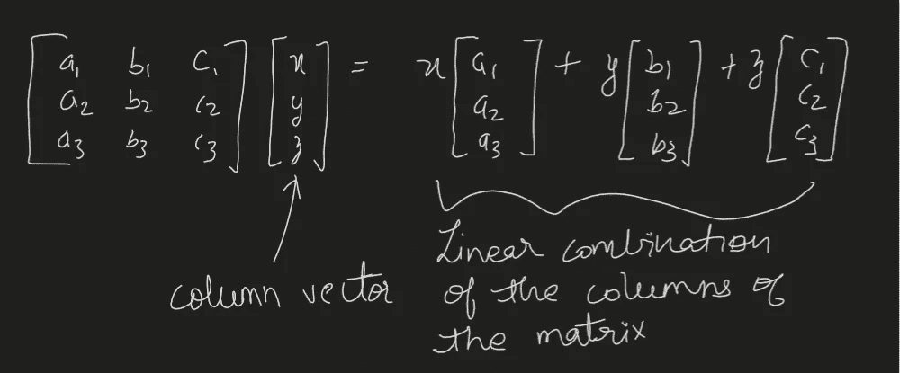
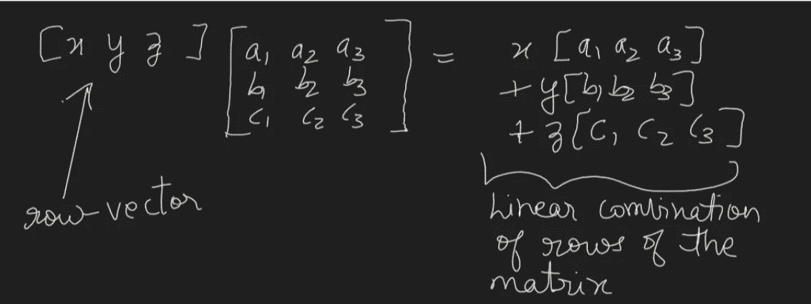
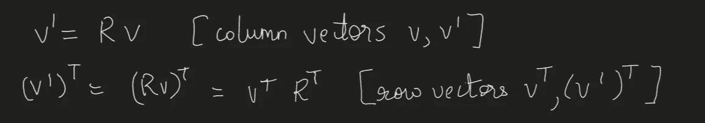
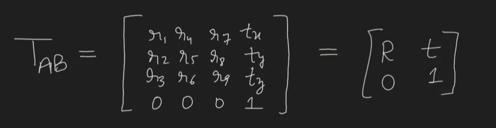
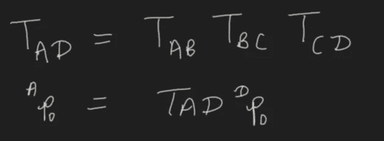
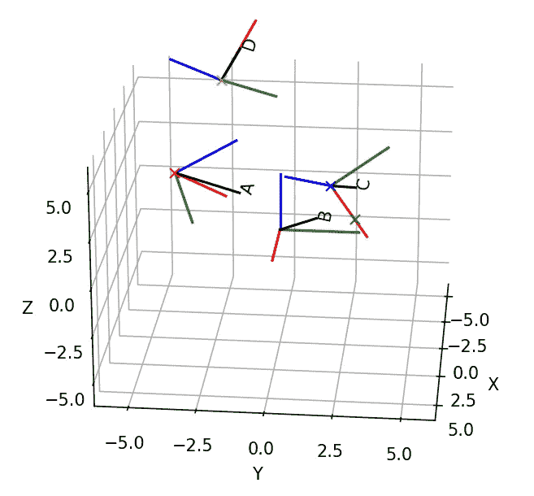
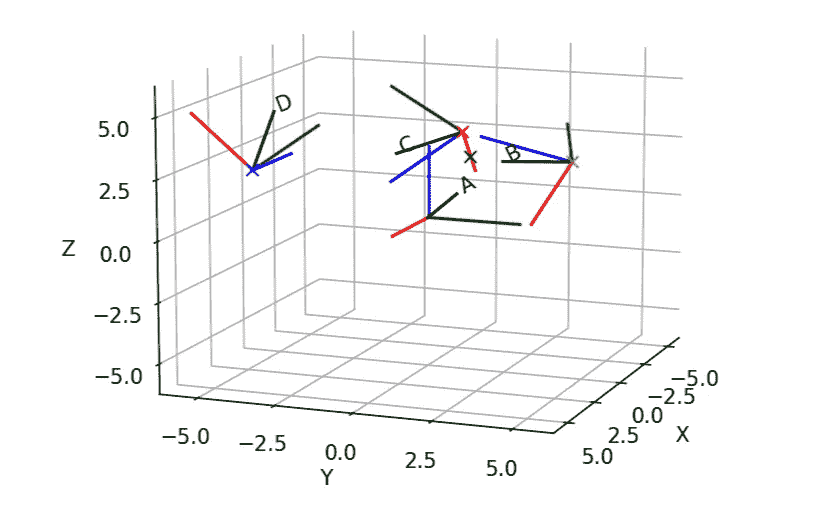

# 转换矩阵的一站式指南

> 原文：<https://towardsdatascience.com/the-one-stop-guide-for-transformation-matrices-cea8f609bdb1?source=collection_archive---------3----------------------->

在 [Unsplash](https://unsplash.com?utm_source=medium&utm_medium=referral) 上由 [eskay lim](https://unsplash.com/@eskaylim?utm_source=medium&utm_medium=referral) 拍摄的照片

我最近一直在学习三维 2D 投影和反投影。我发现的最令人困惑的事情之一是使用欧拉角构建从相机到世界的变换矩阵。尽管旋转作为一个概念很容易理解，但是构建变换矩阵并使用它们可能会非常令人困惑。在本文中，我将解释如何创建变换矩阵，并使用它们从一个参考系转换到另一个参考系。我们还将通过绘制它们来可视化转换和几个样本点。

# 介绍

在计算机视觉、机器人、航空航天等领域。我们需要使用变换矩阵(旋转和平移)从一个参照系到另一个参照系。这是一个非常重要的概念，如果你想用几何计算机视觉和立体视觉(核几何)。然而，就像我最近的经历一样，理解如何使用这些变换并从一个参照系转到另一个参照系可能是一个挑战。首先，我想区分一下参照系和惯例。

# 参考框架:

**它是一种在三维(或多维)空间中测量点的坐标系。它可以相对于其他参考系以任何方式定向和平移任何量。**举个例子，对于自动驾驶汽车，我们可以有汽车参照系、摄像机参照系、IMU 参照系等。但是重要的是要注意，无论数字在不同的帧中如何变化，该点在物理上保持在相同的位置。在不同参照系之间移动的动机是，在一个局部参照系中，你可以测量相对于该参照系的原点和方向的点，这更容易管理。比方说，在机器人前方 1 米、右侧 2 米、上方 3 米的位置，比在一个全球参考系中定义相同的空间，并移动和旋转这些坐标要容易得多。

# 惯例:

这只是 x、y 和 z 值的顺序以及它们与实际物理方向的关系。它不是一个参照系，不应与之混淆。尽管我们需要确保遵循你正在使用的库/应用/方程的惯例，但这与参照系本身没有任何关系。约定的一个例子可以是 NED(北距、东距、下距),这意味着 x 是向前的，y 是向右的，z 是向下的。另一个是 ENU(东，北，上)，这意味着 x 是正确的，y 是向前的，z 是向上的。OpenCV 使用 EDN(东距、下距、北距)约定，这意味着 x 是右，y 是下，z 是前。因此，ENU 系统中有人说(1，2，3)将意味着向右 1 米，向前 2 米，向上 3 米。但是，如果这些数字被插入到 EDN 约定中，而没有适当的旋转，我们最终会得到 1m 右，2m 下和 3m 前，这不是这些数字的意图。**如果可能的话，请在你的代码中只使用一种约定，让事情更清楚。否则，要有清晰的文档来说明遵循了哪些不同的约定，以及在这些约定之间进行转换时采用了哪些特定的轮换。**

# 右手系统 v/s 左手系统

这也是一个需要理解的重要概念。系统的旋向性无非是我们用哪只手从 x 轴和 y 轴的叉积得到 z 轴的方向。

**右手系统:**

**x** x **y = z，其中 x，y，z 为坐标轴的正交单位向量。**将右手手指从 **x** 向 **y** 方向弯曲，拇指指向 **z** 方向，即可得到 z 方向。将我们弯曲的右手沿着 **z 方向放置，将获得正旋转方向。**如果从本系统旋转轴的+ve 方向的顶部看，正旋转是逆时针方向。

旋度和方向的右手法则(来源:[右手法则](https://en.wikipedia.org/wiki/Right-hand_rule)维基百科)

**左撇子系统:**

**x** x **y = -z(右手约定符号)，其中 x，y，z 是坐标轴的正交单位向量。**从 **x** 向 **y** 方向弯曲左手手指，拇指指向+ve **z** 方向，即可得到 z 方向。通过将我们弯曲的左手沿着 **z 方向放置，可以获得正向旋转的方向。**在本系统中，从旋转轴的+ve 方向的顶部看，正旋转为顺时针方向。

左手坐标在左边，
右手坐标在右边。来源:CC BY-SA 3.0，[文件:笛卡尔坐标系 handledness . SVG—Wikimedia Commons](https://commons.wikimedia.org/w/index.php?curid=628183)

# 变换矩阵

我将坚持用齐次坐标来构造变换矩阵。解释这些坐标超出了本文的范围。但主要的一点是，这些坐标允许射影变换表示为 4x4 矩阵。此外，在这个系统中，点和向量(方向)有很好的区分。你可以在这里了解更多:[齐次坐标](https://en.wikipedia.org/wiki/Homogeneous_coordinates)

在本文中，我们不会使用这些来执行 3D 到 2D 的投影，而只是在不同的参考框架之间进行转换。

在开始构造矩阵之前，我将简要地谈谈行和列向量符号以及它们对如何使用变换矩阵的影响。nx1 矩阵称为列向量，1xn 矩阵称为行向量。根据你如何定义你的 x，y，z 点，它可以是列向量或行向量。

对于列向量，我们将旋转/变换矩阵进行预乘，该矩阵采用列主格式。结果是旋转矩阵的列的线性组合。

来源:作者

对于行向量，我们后乘旋转/变换矩阵，它是以行为主的格式。结果是旋转矩阵的行的线性组合。

来源:来自作者

因此，如果你以列主格式构造矩阵，你需要在与行向量相乘之前对旋转矩阵进行转置。

r 是一个 3×3 的旋转矩阵。v 是一个[3x1]列向量。来源:作者

对于本文，我将坚持使用列向量。接下来，我们看看如何构造转换矩阵。我将使用 scipy 库来制作欧拉角的旋转矩阵。你可以在这里阅读这些角度是如何工作的:[T2·德米特里·科斯佳耶夫](/better-rotation-representations-for-accurate-pose-estimation-e890a7e1317f)的更好的旋转表示用于精确的姿态估计并观看这个视频:[欧拉角和欧拉旋转序列](https://www.youtube.com/watch?v=GJBc6z6p0KQ)【精彩的解释！].所以假设你知道你的 B 帧 w . r . t . A 帧的三个欧拉角值，以及 B 帧原点在 A 帧坐标下从 A 帧的平移(tx，ty，tz)。用于从参考系 B 转换到 A 的变换矩阵由下式给出:

来源:作者

注意变换矩阵名称中的 AB 顺序。这是因为这些矩阵是从右向左相乘的。因此，如果我们级联其中的一些，我们就可以从这个约定中知道我们是否遵循了正确的转换顺序。在以下示例中，我们级联三个变换矩阵，将点 p0 从参照系 D 带到参照系 a。请注意，齐次坐标中的点表示为[x，y，z，1](这些坐标的所有缩放版本都是等效的，即[wx，wy，wz，w])。

来源:作者

现在让我们看一下用 python 做这件事所需的代码。我将使用 scipy 构建旋转矩阵，使用 pytransform3d [7]可视化各种变换。首先让我们看看需要导入哪些库。

接下来，我们为几个不同的帧定义变换矩阵。请注意，代码中的名称不遵循书面约定。我用 A2B 来表示，我从参考系 A 到 b，我们用的关键函数是 Rotation，from_euler，它需要一串有效的欧拉角旋转和一列旋转角。您可以用角度或弧度来指定旋转。如果要使用弧度，请设置 degrees=False。我在这段代码中使用了“XYZ”旋转序列。我定义了四个参照系，A，B，C 和 D，它们互相参照。最后，我还定义了几个点，在参考系 A 和 b 中绘制。

我们从这些变换矩阵中构造一个变换管理器，然后绘制点和帧 w.r.t 参考帧 B 和 a。轴的颜色编码是 RGB，分别对应于 XYZ。

结果图如下所示。我们看到框架相互之间的方向是正确的。我们成功地将点从一个参照系转换到另一个参照系，要么使用直接转换矩阵，要么级联两个矩阵。

标绘在“B”参照系中的框架。请注意，原点翻译正确。我们看到点 P [2，0，0]正确地沿着 x 轴在 2 个单位处。注:RGB 对应于 XYZ 轴。(图片来源:作者)

标绘在“A”参照系中的框架。请注意，原点翻译正确。我们看到点 P [2，0，0]正确地沿着 x 轴，在“A”参照系的 2 个单位处。注:RGB 对应于 XYZ 轴。(图片来源:作者)

如果你想看看变换矩阵的实际应用，请查看:[由](/a-hands-on-application-of-homography-ipm-18d9e47c152f) [Daryl Tan](https://medium.com/u/d5d47d10c0e9?source=post_page-----cea8f609bdb1--------------------------------) 撰写的单应性的实际应用。

# 结论

处理变换矩阵是机器人、航空航天、自动驾驶、核几何等领域的基本步骤。在这篇文章中，我们看到了几个概念，即参考系，惯例，右 v/s 左手系统。我们看到了如何在转换矩阵中处理列和行向量。最后，如何在 Python 中创建这些矩阵，并在图形中可视化它们。我希望你喜欢读这篇文章，就像我喜欢写它一样。如果你发现任何错误，或者有任何其他问题或建议，请随时在这里评论或在 [LinkedIn](https://www.linkedin.com/in/msminhas93/) 上给我发消息。

# 参考

1.  [右手法则](https://en.wikipedia.org/wiki/Right-hand_rule)
2.  [SciPy . spatial . transform . rotation—SciPy v 1 . 7 . 0 手册](https://docs.scipy.org/doc/scipy/reference/generated/scipy.spatial.transform.Rotation.html)
3.  [欧拉角](https://en.wikipedia.org/wiki/Euler_angles)
4.  [旋转矩阵](https://en.wikipedia.org/wiki/Rotation_matrix)
5.  [https://phas . UBC . ca/~ ber ciu/TEACHING/phys 206/lections/FILES/Euler . pdf](https://phas.ubc.ca/~berciu/TEACHING/PHYS206/LECTURES/FILES/euler.pdf)
6.  [http://www.cse.psu.edu/~rtc12/CSE486/lecture12.pdf](http://www.cse.psu.edu/~rtc12/CSE486/lecture12.pdf)
7.  [pytransform 3d—pytransform 3d 1.9 文档](https://rock-learning.github.io/pytransform3d/index.html)