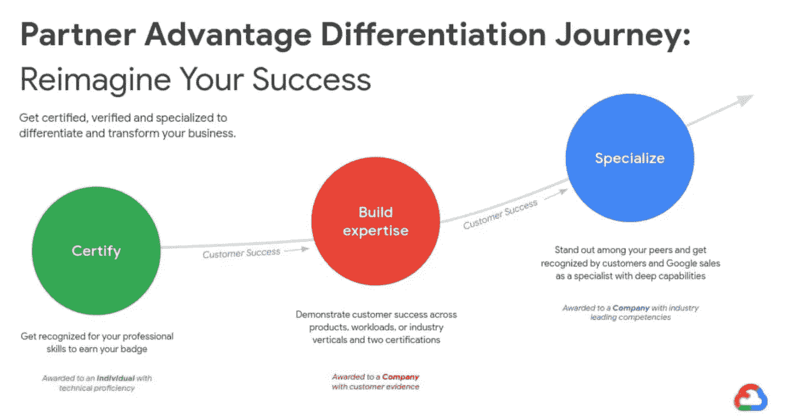
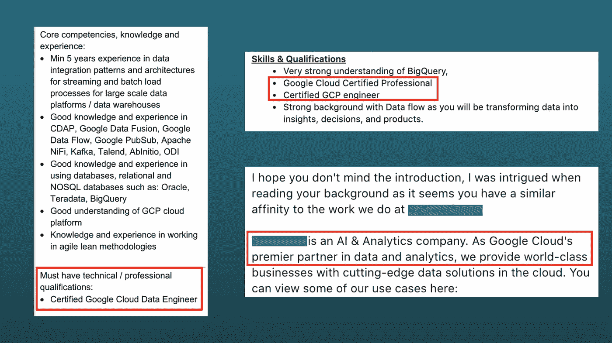

# 能让你在数据工程领域找到工作的在线认证

> 原文：<https://towardsdatascience.com/the-online-certification-that-will-get-you-a-job-in-data-engineering-83540a01a225?source=collection_archive---------10----------------------->

## 招聘人员会找你

路易斯·基根在 [Unsplash](https://unsplash.com?utm_source=medium&utm_medium=referral) 上的照片

> 要得到一份工作，你需要经验。要获得经验，你需要一份工作。

无论你是一名即将进入就业市场的应届毕业生，还是一名希望转行的在职专业人士，你可能都听过或见过上面的说法。这是一个先有鸡还是先有蛋的问题，我们很多人在人生的某个阶段都经历过。

来源:Reddit

对于新毕业生来说，获得第一份工作是他们职业生涯中面临的最大挑战之一。他们渴望、充满活力、充满好奇心，但他们缺乏行业经验，这使得招聘者聘用他们的风险更大，因为招聘者正在寻找更有经验、能够完成工作的候选人。

一些学生指望无薪实习来获得他们感兴趣领域的经验，另一些学生可能会绕道而行，寻找与他们梦想的角色无关的工作，只是为了进入市场(例如，辅导你主修的科目)。

无论你处于什么职位，你可能都考虑过在空闲时间参加在线课程和认证，以更多地研究你感兴趣的领域，无论是数字营销课程、学习 python 基础知识还是机器学习入门。

你观看所有的视频，完成作业，通过测试，获得证书，并将其添加到你的 LinkedIn 个人资料中。听起来熟悉吗？要是有那么容易脱颖而出就好了。

不要误会我的意思，这些都是获得该领域基本知识的绝佳开端，但不足以让你在该领域找到一份工作。原因是这些在线课程不难完成，而且大多数挑战和任务都是有指导的。

没有人会因为你完成了[吴恩达在 Coursera](https://click.linksynergy.com/deeplink?id=y5ucJvNe81w&mid=40328&murl=https%3A%2F%2Fwww.coursera.org%2Flearn%2Fmachine-learning%3Futm_source%3Dgg%26utm_medium%3Dsem%26utm_campaign%3D07-StanfordML-ROW%26utm_content%3D07-StanfordML-ROW%26campaignid%3D2070742271%26adgroupid%3D80109820241%26device%3Dc%26keyword%3Dmachine%2520learning%2520mooc%26matchtype%3Db%26network%3Dg%26devicemodel%3D%26adpostion%3D%26creativeid%3D369041663186%26hide_mobile_promo%26gclid%3DEAIaIQobChMI7uuu2M3s7gIVCLrtCh1pmASfEAAYASAAEgIh9fD_BwE) 上的机器学习课程而聘用你担任数据科学的角色。将近 400 万人注册了这门课程！(除此之外，我向所有对 ML 感兴趣的人推荐这门课程)。

为了更上一层楼，你需要应用这些在线课程中的技能，并开始一个辅助项目来练习和展示你所学到的东西。

然而，如果我告诉你招聘人员正在积极寻找一些证书呢？这些资格将帮助你在开始工作前获得行业知识，并使你的简历对招聘公司的吸引力增加十倍。

让我们来看看。

# **谷歌云专业证书**

[谷歌云认证](https://cloud.google.com/certification)是一系列专业认证，涵盖关键技术工作职能，评估设计、实施和管理方面的高级技能。他们的目标是对在谷歌云平台上获得技术技能和专业知识感兴趣的个人。

截至发稿，谷歌提供了 8 个专业证书:*云架构师*、*云开发员*、*数据工程师*、*云开发员*、*工程师*、*云安全*、*云网络工程师*、*协作工程师*、*机器学习工程师*。

云技能需求量很大。谷歌云技能的需求尤其大，在过去一年里，职位列表中的需求增加了 66.7%。据 Gartner 称，云计算预计到 2021 年将成为价值 3000 亿美元的业务，因此招聘人员正在寻找具备这些云技能的个人也就不足为奇了。

对于每个证书，谷歌建议个人拥有 3 年以上的行业经验，包括 1 年以上的谷歌云经验。要获得认证，你需要通过在线监考考试，考试费用为 200 美元。

毫无疑问，有实践经验是一个优势，但是像我刚从大学毕业一样，没有行业经验也有可能获得认证。我在这里写了一份详细的指南，介绍我是如何准备和通过考试的。

总的来说，认证是您向更大的 IT 市场展示技能以及向招聘人员验证您的云技能和经验的绝佳方式。

# 这有什么大不了的？

> 公司希望他们的新员工获得谷歌云认证的原因是，这使他们有资格获得合作伙伴身份。

作为合作伙伴计划的一部分，谷歌投资于他们的合作公司，展示他们的专业知识，并为他们提供资源，使他们在解决方案、垂直行业、认证、专业化等方面脱颖而出。

对于提供服务(如咨询)的组织来说，这有助于在一个非常拥挤的市场中将其业务与竞争对手区分开来，并将自己标榜为该领域的专家。拥有合作伙伴身份的公司更有可能吸引新客户，因为它们被谷歌视为展示了技术能力和客户成功的公司。

换句话说，他们是谷歌云平台值得信赖的大使。

你可以在这里查看合作公司[的名单。](https://cloud.withgoogle.com/partners/)

作为这一旅程的一部分，寻求合作伙伴地位的雇主要求一些员工获得专业认证(下面的绿色圆圈)，然后他们才能开始积累专业知识并达到专业化。

# 我的经历

当我申请数据工程师职位时，我遇到了许多需要谷歌云认证的招聘信息。现在在 LinkedIn 上快速浏览一下，你会发现许多公司和招聘机构仍然在寻找经过认证的个人。

招聘人员经常通过关键词搜索候选人，所以我收到的职位描述信息完全超出了我的经验和能力，只是因为我勾选了认证。从公司的角度来看，这是一个数字游戏，所以不管经验如何，雇佣任何有资格的人都有助于提高他们的资格。它也不必是一个特定的认证，只要是上面列表中的一个即可。

考的时候全球有 2000 个认证数据工程师，现在有 5000 多个。

我收到的一些信息和工作描述(图片由作者提供)

获得谷歌云认证不仅帮助我在 GCP 建立了数据工程的相关技能，而且作为一名应届毕业生，帮助我的申请在竞争激烈的领域脱颖而出。

最后，我加入了一家专注于数据和分析的咨询公司，后来我发现他们也在与谷歌建立合作关系，我是他们的第一名认证员工。

然而事情并没有就此结束。

入职一个月后，我被要求获得微软 Azure 认证，这样公司才有资格获得金牌合作伙伴资格。因此，我也是微软认证的 Azure 数据工程师，该公司是黄金合作伙伴。

不仅仅是谷歌，其他主要的云竞争对手如微软也有自己的合作伙伴计划，这些公司都在积极寻求加入。微软的合作伙伴还带来了一大堆其他好处，比如资源折扣和介绍新客户。微软也提供比谷歌更多的认证，你可以在这里查看。

许多公司瞄准黄金(图片由作者提供)

直到今天，我还不断收到招聘人员发来的消息，他们在寻找谷歌或微软认证的个人，或者我是否认识我网络中的人。

希望我已经让你相信需求仍然很高，如果在你开始找工作之前有一个在线认证你应该参加，那就是上面列出的那些。

这是你扭转局面，让招聘人员寻找你的机会。

**如果你喜欢这篇文章，何不注册 medium，通过这个链接阅读更多精彩内容。**

[**https://medium.com/@jonathan.moszuti/membership**](https://medium.com/@jonathan.moszuti/membership)

**我已经使用了上面列出的所有资源，并且只推荐帮助我提高技能的产品****