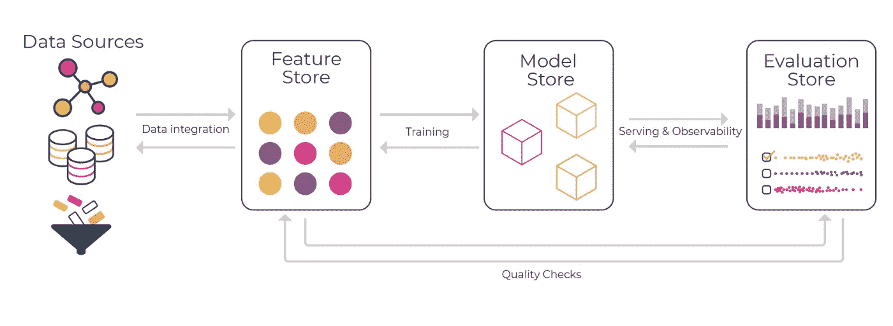
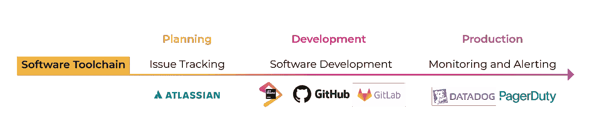
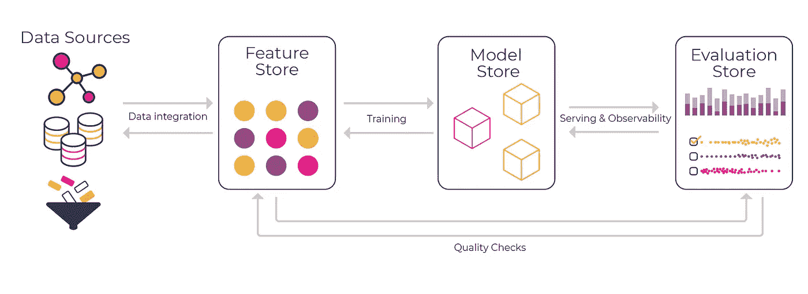

# 您唯一需要的 3 毫升工具

> 原文：<https://towardsdatascience.com/the-only-3-ml-tools-you-need-1aa750778d33?source=collection_archive---------4----------------------->

作者图片

许多机器学习技术已经从概念验证快速发展到为人们日常依赖的关键技术提供动力。在试图捕捉这一新发现的价值时，许多团队发现自己陷入了在产品中生产机器学习的狂热中，而没有正确的工具来成功地做到这一点。

事实是，我们正处于定义构建、部署和迭代机器学习模型的正确工具套件的早期阶段。在这篇文章中，我们将讨论让您的团队在您的产品中成功应用机器学习所需的 3 ML 工具。

# 让我们从过去吸取教训

在我们进入 ML 堆栈推荐之前，让我们快速地将注意力转向软件工程行业是如何确定工具的。一个关键的观察是，没有一个解决方案用于在生产中构建、部署和监控您的代码。

*换句话说，端到端的工具平台并不存在。相反，有一套工具，专注于软件工程生命周期的特定部分。*

作者图片

为了简化软件的创建，必须创建工具来跟踪问题、管理版本历史、监督构建，并在生产中出现问题时提供监控和警报。

尽管并不是每个工具都适合这些类别中的一个，但是这些工具类别中的每一个都代表了创建软件过程中不同的摩擦点，这使得创建工具成为必要。

# **我以为这是关于机器学习的？**

正如开发软件的过程一样，开发机器学习模型的过程有一组广泛的类别，这些类别与研究、构建、部署和监控模型所需的内容相一致。

在这篇文章中，我们将重点关注在解决实验室外应用机器学习的一些最大障碍的过程中出现的基本 ML 工具类别。

要创建一个有效的机器学习工具箱，你真的只需要这三个基本工具:

1.  **特征库**:处理离线和在线特征转换
2.  **模型库**:作为中心模型注册和跟踪实验
3.  **评估商店**:监控和改善模型性能

作者图片

# **功能商店**

首先，让我们深入了解一下 [**功能商店**](https://arize.com/blog/feature-store/) 。为了定义什么是特性库，让我们从特性库应该为您的团队提供什么开始。

**功能存储应该支持什么:**

1.  充当功能转换的中心来源
2.  允许在离线培训和在线服务中使用相同的功能转换
3.  使团队成员能够分享他们的实验转换
4.  为功能转换代码提供强大的版本控制

除了功能商店应该如何为您的团队提供支持之外，这里还有一个必备功能列表，可以帮助您决定哪个功能商店最适合您和您的团队。

**你的特色商店应该有的东西:**

1.  与您的数据存储/湖泊集成
2.  为模型的在线部署提供要素转换的快速方法
3.  将功能转换代码快速轻松地部署到生产环境中
4.  与评估库集成，支持数据和要素质量检查

**推荐:**

[泰克顿](https://www.tecton.ai)

# **模特店**

现在您有了一个存储要素变换的要素存储库，您需要一个工具来对团队的模型创建历史进行分类和跟踪。这就是**模型店**发挥作用的地方。

**模型商店应该支持什么:**

1.  充当所有模型和模型版本的中央存储库
2.  允许每个模型版本的再现性
3.  跟踪模型历史的沿袭

除了这些核心功能之外，还有许多模型存储特性，您可能会发现它们对构建和部署您的模型非常有帮助。

**你的模型店应该有的东西:**

1.  应该能够跟踪模型的每个版本的引用数据集，git 提交，模型的工件(pickle 文件)
2.  应提供要提供的任何型号的最新版本，例如(2.1 版)
3.  维护一致的沿袭，以便在需要时回滚版本
4.  与您的评估库集成，以跟踪模型每个版本的评估，从而精确定位模型回归
5.  与您的服务基础设施集成，以便于模型部署和回滚

**推荐:**

[权重&偏差](https://wandb.ai/site) / [MLFlow](https://mlflow.org/)

# **评测店**

既然您已经将您的模型跟踪并存储在您的模型存储中，那么您需要能够选择一个模型来发布并监控它在生产中的表现。这就是**评测店**能帮上忙的地方。

**评估商店应该支持什么:**

1.  为任何环境中的任何模型(生产、验证、培训)提供聚合(或切片)性能指标
2.  使用基线监控和识别漂移、数据质量问题或异常性能下降
3.  使团队能够将绩效变化与其发生的原因联系起来
4.  提供一个平台，帮助持续交付高质量的模型和改进反馈循环—将生产与培训进行比较
5.  为 A/B 测试模型版本提供一个实验平台

现在将我们的注意力转向评估商店的必备功能，这里有一些使特定评估商店值得考虑的事情。

**你的评价店应该具备的东西:**

1.  存储模型评估:输入、每个模型版本的 SHAP 值和输出，跨环境:生产、验证和培训
2.  基于从评估库获得的基准，自动监控以轻松发现问题
3.  为任何类型的性能分析创建灵活的仪表板—适用于 ML 的 DataDog
4.  与您的要素存储集成以追踪要素漂移
5.  与您的模型存储集成，以获得每个模型版本的模型性能的历史记录

**推荐:**

[阿里斯](https://arize.com)

# **可能适合您的其他工具**

# **数据标注平台:**

让我们退一步说，你刚刚收集了你的数据，这些数据可能有也可能没有地面真相标签。现代统计机器学习模型通常需要大量的训练数据才能表现良好，而用基本事实标签注释足够多的数据以使模型有效的能力可能是一个相当大的挑战。

不要担心，**数据注释平台**将你的数据批量分发到一组分布式的分类器，每个分类器将根据你提供的指令标记你的数据。

**推荐:**

1.  [阿彭](https://appen.com/)
2.  [全自动数据标注服务的规模](https://scale.com/content-language)

# **模型服务平台:**

在许多应用机器学习的情况下，你将需要某种形式的服务平台来将你的模型部署给你的用户。简单来说，这里有一些服务平台应该为你的团队提供的核心特性。

**模型服务平台应该具备什么:**

1.  关于模型服务的访问控制，只有经过选择的一组人才有权更改部署的模型。
2.  如果需要，可以快速回滚到以前部署的模型版本
3.  灵活支持不同的 ML 应用类型。例如，在预测延迟不是问题的情况下，您的服务平台应该允许批量推断来优化计算
4.  与模型商店很好地集成，便于模型推广
5.  与评估存储很好地集成，以实现生产中的模型可观察性。

**推荐:**

[kube flow](https://www.kubeflow.org/)&[algorithm ia](https://algorithmia.com/)

# 人工智能编排平台:

在许多情况下，一个跨端到端生命周期工作并使团队能够编排整个工作流的平台是必要的。这些平台帮助团队从各种来源引入数据，管理培训工作流，存储模型，为模型服务，并连接到监控平台。管理所有这些不同工具的基础设施可能是复杂的，人工智能编排层有助于数据科学家和 ML 工程师专注于交付模型。

建议:

[拼](https://spell.ml/platform)

# **结论**

为工作寻找合适的工具有时会让人感到不知所措，尤其是对于一个新兴的领域。就像今天赋予软件工程师权力的工具一样，将没有端到端的平台来构建、部署和监控生产中的机器学习模型；然而，只需这几个工具，你就能快速有效地将你的模型带出实验室，送到你的客户手中。

鸣谢:
感谢 Josh Tobin 创建了术语评估商店！

## 联系我们

如果这篇博客引起了你的注意，并且你渴望了解更多关于[机器学习可观察性](https://arize.com/platform-overview/)和[模型监控](https://arize.com/model-monitoring/)，请查看我们的其他[博客](https://arize.com/blog/)和关于 [ML 监控](https://arize.com/ml-monitoring/)的资源！如果您有兴趣加入一个有趣的 rockstar 工程团队来帮助模型成功生产，请随时[联系](https://arize.com/contact/)我们，并在此找到我们的空缺职位[!](https://arize.com/careers/)