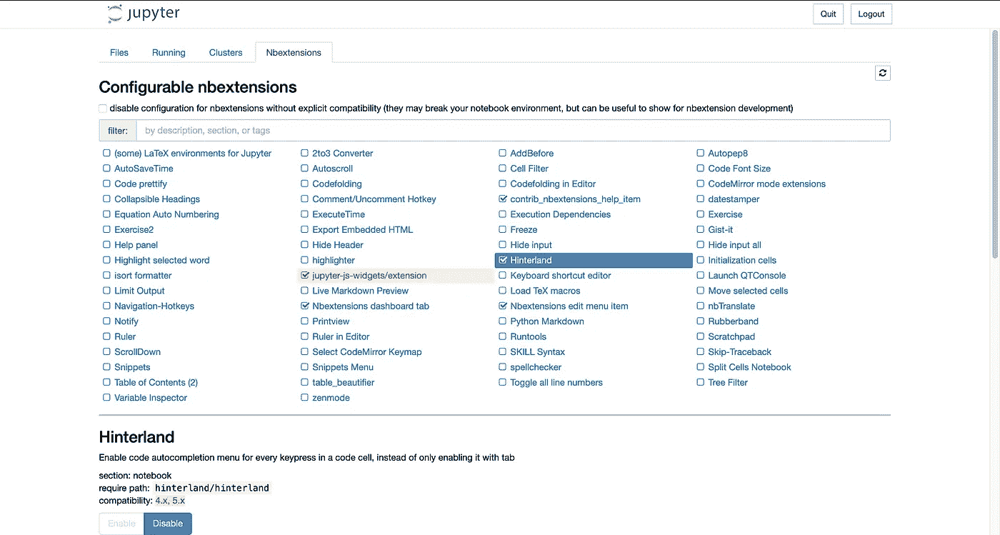

# 您的 Jupyter 笔记本需要的唯一自动完成扩展

> 原文：<https://towardsdatascience.com/the-only-auto-completion-extension-youll-ever-need-for-your-jupyter-notebooks-87bbaecb7126?source=collection_archive---------9----------------------->

## 这是我推荐使用的一款。探索几个简单的步骤来设置它！


内森·杜姆劳在 [Unsplash](https://unsplash.com?utm_source=medium&utm_medium=referral) 上的照片

Python 中最受欢迎的编程接口之一是 Jupyter Notebook 环境，想要在其中启用代码自动完成感觉很自然。

我知道我喜欢经常在 VSCode 中工作，我在笔记本中经常错过的一件事是自动完成我的长 import 语句，这些语句包含我经常忘记的库名(:P)和我的项目中非常重要的变量名！

**进入** : ***腹地*** 扩展！

这个扩展是我用过的最有用的**nb 扩展**之一，它完全按照建议的那样工作。

让我们在笔记本上看看启动和运行的步骤，好吗？

# 用 pip 安装它

nbextensions 包的一行安装是第一步。下面是在您的终端中(希望在您的虚拟环境中)执行此操作的代码:

```
pip install jupyter_contrib_nbextensions && jupyter contrib nbextension install
```

就是这样。现在打开你的 jupyter 笔记本吧！

对于所有的 **pipenv** 用户，请记住您需要做:

```
pipenv run jupyter notebook
```

不仅仅是:

```
jupyter notebook
```

如果您没有在系统中全局安装 Jupyter，那么第二个命令应该不起作用。

好了，我们进入下一步。

# 启用腹地

是的，它不会在您的环境中自动启用。您需要到这里并在 **nbextensions** 选项卡上启用它，该选项卡位于 **Files** 选项卡旁边:



在这里启用腹地！

一旦你完成了，打开一个新的笔记本，让我们来测试它！

# 结束…测试扩展

你现在应该可以正常使用它了，当你写的时候，自动完成提示会一直弹出来。

类似于这样的东西:


你都准备好了！:D

感谢您的阅读！

喜欢我的文章吗？成为 [*中等会员*](https://ipom.medium.com/membership) *继续无限制学习。如果你使用那个链接，我会收取你一部分会员费，不需要你额外付费。这将帮助我支持我的写作努力:)*

此外，这是我所有数据科学文章的代码+资源库。如果你愿意的话，一定要去看看！

我的另一篇基于 jupyter 的文章你可能想读一读，它与这篇文章有关:

<https://pub.towardsai.net/7-awesome-jupyter-utilities-that-you-should-be-aware-of-f3afdb75c2b>  

想要确保您在终端中更高效，同时美化终端吗？这是给你的文章:

</the-easy-way-to-prettify-your-terminal-24da896b031a> 