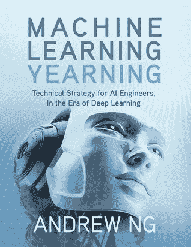

# 你需要的唯一一本书是高级机器学习策略

> 原文：<https://towardsdatascience.com/the-only-book-you-need-to-ace-advanced-machine-learning-strategy-8d48ddbbe73d?source=collection_archive---------3----------------------->

## 剧透:这是吴恩达的杰作，而且是免费的。

图片由 Pchvector 在 Freepik 上提供

> “如果你只看别人都在看的书，你只能想别人都在想的事。”—村上春树。

如果您刚开始接触数据科学，这篇文章可能不适合您。我仍然爱你，并写了你应该阅读的 3 本适合初学者的数据科学书籍，许多初学者都很喜欢。我建议你把这个故事留到以后再说。

但是如果你在这个领域已经呆了足够长的时间会怎么样呢？如果你在初级水平之外寻求更多的知识呢？如果你想快速提升自己成为人工智能领域的领导者，该怎么办？

我听到了。我也有类似的愿望。当我最终在[获得数据科学](/3-lessons-i-learned-a-little-late-in-my-data-science-career-7aeb227292ce)的高级职位时，我的任务是掌控项目的方向。执行项目是一回事，但制定战略和为问题创造解决方案是另一回事。

“技术策略”是人工智能中讨论最少的话题之一。大概是因为业内很少有人有足够的经验和公信力来谈吧。

如果我们想脱颖而出，我们需要超越人群。换句话说，当我们看到像吴恩达这样的人教授“人工智能工程师的技术策略”时，我们应该学习它。

# 吴恩达的机器学习向往

来源: [Goodreads](https://www.goodreads.com/en/book/show/30741739-machine-learning-yearning)

吴恩达开创了人工智能和机器学习的世界。从推出 Coursera 和他著名的机器学习课程，到 Deeplearning.ai 和各种 ai 课程，他教育了很多像我一样自学成才的机器学习工程师。

在所有这些受欢迎的资源中，这本书仍然是一个难得的发现。尚未出版，这本书的草稿已经在他的网站上放了好几年了。

不过你不必等待，在他的网站上注册就可以免费下载 pdf 版本。如果这还不够令人信服，有几个理由让你应该读这本书。

# 它不是你在任何地方都能找到的典型的技术机器学习书籍。

蒂姆·丹宁(Tim Denning)筛选了我的个人资料，告诉我可以在几周内用我已经拥有的所有内容写一本机器学习书。

我从未想过这个问题，但他可能是对的。但我永远也写不出像《机器学习的渴望》这样的东西。见鬼，世界上只有少数人能传递这种智慧。

这本书不是你遇到的典型的教程或动手操作书。这本书更多。它包含了在其他地方很难找到的实用见解。大多数书会教你算法如何工作，但这本书告诉你如何(以及何时)使用它们。

Andrew 写的是技术性的东西，没有太多的理论或编码，更侧重于实用的建议和方法。无论他的写作是多么简单和简洁，这本书是先进的，抓住所有的内容；你需要有这方面的经验。

如果你正在读这篇文章，但是觉得自己还没有到那一步，不要担心。不用急，你可以留着以后用。

# 你被置于每个高级机器学习工程师面临的最实际的情况中。

这本书以一个相关的故事开始。你会觉得安德鲁在直接和你说话。

你想建立一个系统，为爱猫人士提供源源不断的猫图片。你原型化一个神经网络，从任何图片中检测出猫的图片。但是，有一个问题——系统的性能似乎并不令人满意。

离你的用户想要的“世界级”还差得很远。你的神奇团队想出了一打主意。你不知道该遵循哪个想法，该忽略哪个。

有两种情况可能发生——要么你建立了世界一流的 cat 检测平台，要么你走错了方向，浪费了几个月甚至几年的时间。

去年我在建造一个合成数据生成器，一个错误的方向会让我浪费几个月的时间。上个月，我正在构建一个个性化引擎，也遇到了类似的情况。这本书基本上回答了每个首席 ML 工程师都会有的紧迫问题。

不是每个团队成员都会理解你的推理背后的基本原理，这没关系。我建议你与你的初级团队成员分享这本书的部分内容，并在会议期间带领他们阅读简短的章节。

# 如果只要看一遍这本书就能借用多年的资深经验，为什么不呢？

读完这本书后，我领导和设计项目的能力大大提高了。

我的同事们(以一种好的方式)提到，我的经历似乎与我的年轻时代不符——我的秘密就是这样的书。

你有勇气指导这个项目，就好像你以前做过一样。事实上，你的自信来自于你只是在执行从安德鲁那里获得的智慧。

还有谁有他那样的经验和信誉？如果不是他，我可能一开始就不会[开始从事数据科学](/the-4-must-learn-data-science-courses-for-absolute-beginners-9268fd11054c)。

换句话说，你只是通过看一遍书来借用多年的资深经验。我读了两遍。现在它已经牢牢印在我的脑海里了。

帮你自己一个忙，只读第一章。你就知道我在说什么了。

*要获得更多关于进入数据科学、真实体验和学习的有用见解，请考虑* [***加入我的电子邮件好友私人列表*** *。*](https://friends.arunnthevapalan.com/)

*如果你很看重这类文章，想支持我这个作家，可以考虑* [*报名成为中会员*](https://arunnthevapalan.medium.com/membership) *。每月 5 美元，你可以无限制地阅读媒体上的故事。*

<https://arunnthevapalan.medium.com/membership> 