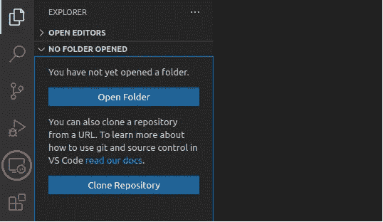
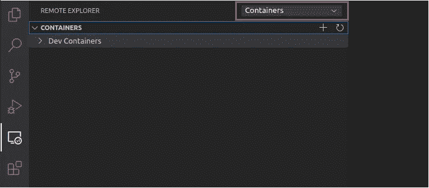

# 您需要的唯一 VS 代码扩展

> 原文：<https://towardsdatascience.com/the-only-vs-code-extension-you-will-ever-need-e095a6d09f24?source=collection_archive---------10----------------------->

## 如果您必须安装一个 Visual Code Studio 扩展，这就是它


图片来自 [Pixabay](https://pixabay.com/?utm_source=link-attribution&utm_medium=referral&utm_campaign=image&utm_content=569153)

[Visual Studio Code](https://code.visualstudio.com/) 是一个免费的、轻量级的、跨平台的代码编辑器。它可能不像 IntelliJ Idea 或 PyCharm 那样是一个成熟的 IDE，但它是一个强大的、不受干扰的工具，拥有专门的粉丝群和蓬勃发展的生态系统。

VS 代码自带对 JavaScript、TypeScript、Node.js 的内置支持，但是你可以扩展它来支持很多其他语言(Python、C++、Go)；大量功能强大的附加组件可以让 VS 代码成为最终的开发环境。

然而，在这个故事中，我认为**你只需要一个 VS 代码扩展。**它将保持您的环境整洁，并且您的项目是隔离的和可维护的。它可以让你在任何地方从事任何项目。一个可以让你与团队中的任何人毫无争议地合作的平台。欢迎来到*远程*开发的美丽世界。

> [学习率](https://www.dimpo.me/newsletter?utm_source=article&utm_medium=medium&utm_campaign=remote_development&utm_term=remote_development_vs_code)是为那些对 AI 和 MLOps 的世界感到好奇的人准备的时事通讯。你会在每周五收到我关于最新人工智能新闻和文章的更新和想法。在这里订阅！

# VS 代码的远程开发

Visual Studio 代码的[远程开发](https://marketplace.visualstudio.com/items?itemName=ms-vscode-remote.vscode-remote-extensionpack)扩展是您在本地 VS 代码设置中需要安装的唯一扩展。该扩展将允许您:

*   在您想要的开发环境中工作；需要更多资源吗？一个特定的 Linux 发行版？专门的硬件？没问题。
*   在隔离的空间中用沙箱保护您的项目，这样项目 x 的依赖项就不会干扰项目 y 的依赖项。
*   与您的团队成员协作或帮助新员工完成入职流程。

实际上，远程开发扩展是不同工具的包装器，您可以根据需要单独安装这些工具:

*   [**远程容器**](https://aka.ms/vscode-remote/download/containers) **:** 通过打开安装在或位于容器内的文件夹，使用基于沙盒容器的应用程序。
*   [**远程 SSH**](https://aka.ms/vscode-remote/download/ssh) :通过使用 SSH 打开远程机器上的文件夹，在任何位置处理源代码。*
*   [**远程 WSL**](https://aka.ms/vscode-remote/download/wsl) :连接到 WSL 1.0 或 2.0，在 Linux 驱动的开发环境中舒适地使用 Windows。

> 注意:远程 SSH 扩展支持 x86_64、ARMv7l (AArch32)和 ARMv8l (AArch64)基于 glibc 的 Linux、Windows 10/Server (1803+)和 macOS 10.14+ (Mojave) SSH 主机。

这个故事将主要描述如何使用远程容器，保持您的开发环境在本地。使用远程 SSH 非常相似，我将跳过远程 WSL，因为它只对 Windows 用户可用。如果你想了解更多关于 Windows 和 WSL 2.0 的内容，请看下面的故事。

</dual-boot-is-dead-windows-and-linux-are-now-one-27555902a128>  

# 使用容器

不要让不同的编程语言、包及其依赖项污染您的本地环境，您可以将您的项目分离到不同的容器中。

这个故事将使用一个简单的 Ubuntu `20.04`图像，它可能是一个项目的基础图像。用于创建该图像的 docker 文件可以像下面这样简单:

在这个 Dockerfile 中，我们从官方的 Ubuntu `20.04`镜像开始，安装我们可能需要的常用 Linux 包，比如`vim`、`wget`、`curl`添加几个环境变量，就万事俱备了。用`docker build`建立这个形象:

```
docker build -t <tag-name> .
```

接下来，要使用这个映像启动一个容器，输入下面的命令，假设您已经将它标记为`ubuntu-base:latest`:

```
docker run -it --name ubuntu ubuntu-base bash
```

`--it`参数指示 Docker 以交互模式启动容器并运行`bash`命令。这很重要。否则，由于 docker 文件中没有指定`CMD`或`ENTRYPOINT`，容器将立即启动和终止。

另一方面，如果你退出容器内的`bash`单元格，容器将再次停止。但这不是问题。我们将看到 VS 代码可以启动停止的容器并连接到它们。

您可以随意使用此基本图像；您可以将它作为您构建的其他 Docker 映像的基础映像，或者直接运行它并手动安装您需要的任何映像。有待观察的是你如何通过 VS 代码连接到它并开始工作。

# 连接到容器

要通过 VS 代码连接到一个正在运行的容器，首先，安装[远程开发](https://marketplace.visualstudio.com/items?itemName=ms-vscode-remote.vscode-remote-extensionpack)扩展。这真的很简单；从左侧面板(`ctrl+shift+x`)中选择`Extensions`选项卡，并搜索远程开发。通常，这是第一个结果，所以选择它并单击安装。几秒钟后，远程开发将作为一个新的选项卡出现在左侧面板中。



远程开发选项卡—按作者分类的图像

要连接到容器，选择它，从顶部的下拉列表中选择`containers`，右键单击您选择的容器，然后单击`Attach to Container`。



附加到容器-作者提供的图像

就这么简单！现在你可以打开集成终端，开始黑了:安装你选择的编程语言，`git clone`你的项目，安装它的依赖项，开发新特性。此外，您现在可以安装更多对这个项目有用的 VS 代码扩展。这些扩展只安装在这个环境中，保持您的本地安装干净。

然而，这通常只适用于本地开发；如果你想要更强大的东西呢？更多内存、CPU 能力还是 GPU？如果你以某种方式构建了 Docker 映像，主要的云提供商，如 GCP，允许你从 Docker 映像启动虚拟机。因此，您可以启动一台与您的本地环境完全相似但功能更强大的远程机器。然后，您可以使用远程 SSH 连接到它，并从您离开的地方继续！

# 序

Visual Studio 代码是一个免费的、轻量级的、跨平台的代码编辑器。大量功能强大的附加组件可以将它变成一个成熟的 IDE，但是安装那些可能只使用一次的扩展是没有意义的。

因此，远程开发可能是您可能需要的唯一扩展。它将保持您的环境清洁和您的项目孤立。它将允许你在任何地方从事任何项目，并允许你与团队中的任何人合作，没有任何麻烦。

# 关于作者

我叫[迪米特里斯·波罗普洛斯](https://www.dimpo.me/?utm_source=article&utm_medium=medium&utm_campaign=remote_development&utm_term=remote_development_vs_code)，我是一名为[阿里克托](https://www.arrikto.com/)工作的机器学习工程师。我曾为欧洲委员会、欧盟统计局、国际货币基金组织、欧洲央行、经合组织和宜家等主要客户设计和实施过人工智能和软件解决方案。

如果你有兴趣阅读更多关于机器学习、深度学习、数据科学和数据运算的帖子，请关注我的 [Medium](https://towardsdatascience.com/medium.com/@dpoulopoulos/follow) 、 [LinkedIn](https://www.linkedin.com/in/dpoulopoulos/) 或 Twitter 上的 [@james2pl](https://twitter.com/james2pl) 。此外，请访问我的网站上的[资源](https://www.dimpo.me/resources/?utm_source=article&utm_medium=medium&utm_campaign=remote_development&utm_term=remote_development_vs_code)页面，这里有很多好书和顶级课程，开始构建您自己的数据科学课程吧！