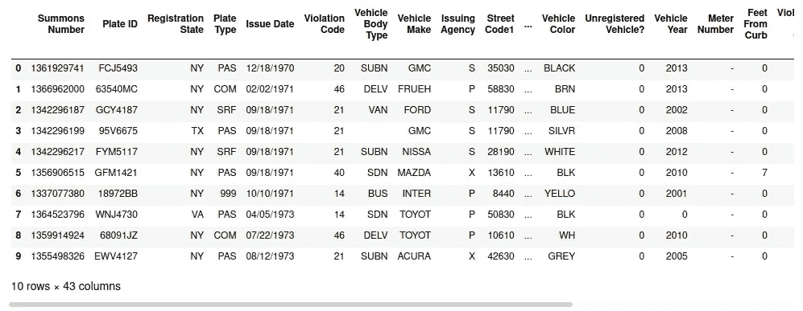
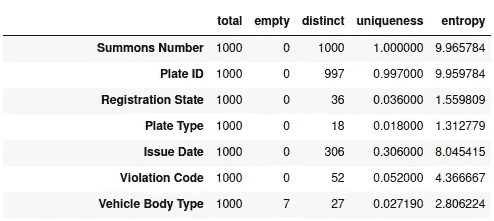
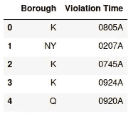
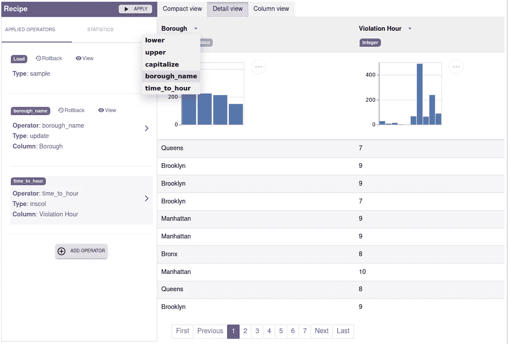
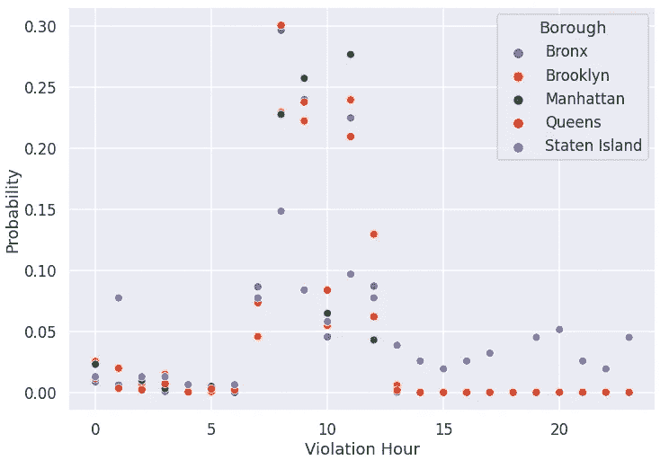

# openclean 开源数据清理库

> 原文：<https://towardsdatascience.com/the-openclean-open-source-data-cleaning-library-9c6b8540794f?source=collection_archive---------34----------------------->

## 将数据清理工具集成到一个环境中，对于数据科学家来说，该环境简单直观

*Heiko müller、Sonia Castelo、Munaf Qazi 和 Juliana Freire 的联合作品*

数据准备仍然是许多数据科学项目的主要瓶颈。2016 年[一项被频繁引用的调查](https://www.forbes.com/sites/gilpress/2016/03/23/data-preparation-most-time-consuming-least-enjoyable-data-science-task-survey-says)发现，数据科学家将 60%的时间花在数据清理和组织数据上。在同一调查中，57%的数据科学家还表示，他们认为数据清理和组织数据是他们工作中最不愉快的任务。

多年来，学术界和工业界开发了许多用于分析、准备和清理数据的工具(见[1，2]中的概述)。这些方法是孤立地、用不同的编程语言开发的，没有标准化的接口。因此，数据科学家很难结合现有的工具并在他们的数据处理管道中重用它们。

受通用机器学习框架(如 [scikit-learn](https://scikit-learn.org/stable/) 、 [TensorFlow](https://www.tensorflow.org/) 和 [PyTorch](https://pytorch.org/) 的广泛采用的启发，我们目前正在开发 **openclean** ，这是一个用于数据分析和数据清理的开源 Python 库。 **openclean** 的源代码[可以在 GitHub](https://github.com/VIDA-NYU/openclean) 上获得。

我们的 openclean 目标有两个。首先，我们旨在为从业者提供一个统一的框架，将开源数据分析和数据清理工具整合到一个易于使用的环境中。通过向大型用户社区提供现有工具，并通过与丰富的 Python 生态系统集成， **openclean** 有可能简化数据清理任务。第二，通过提供一个结构化的、可扩展的框架， **openclean** 可以作为一个平台，研究者和开发者可以贡献他们的技术。我们希望通过将用户、开发人员和研究人员聚集在一起，我们将能够更好地应对处理数据质量的诸多挑战。

**openclean** 有许多特性可以让数据争论变得简单明了。它尤其在以下领域大放异彩:

*   *数据剖析* : **openclean** 附带一个剖析器，为用户提供关于数据质量的可操作指标。它允许用户通过提供从最小-最大频率到唯一性和熵计算的各种数据统计测量，及早发现可能的问题。
*   *数据清理&扯皮* : **openclean** 的操作员是专门为处理数据监管任务而创建的。它们有助于识别和呈现统计异常，修复函数依赖违规，定位和更新拼写错误，并妥善处理丢失的值。
*   *数据丰富* : **openclean** 与 Socrata 开放数据 API 和参考数据存储库无缝集成，使用户能够轻松访问可纳入数据清理流程的标准数据集。
*   *数据来源* : **openclean** 带有一个迷你版本控制引擎，允许用户维护其数据集的版本，并在任何时候提交、签出或回滚更改。

# 纽约市停车违规-数据剖析和数据清理示例

在下文中，我们将使用一个运行示例概述 **openclean** 中的基本操作符和概念。在 **openclean** 资源库中包含了一个 Jupyter 笔记本，其中包含了该示例的[扩展和更详细的版本(安装说明参见](https://github.com/VIDA-NYU/openclean/blob/master/examples/notebooks/Parking%20Violations%20-%20Profiling%20and%20Cleaning%20Example.ipynb)[自述文件](https://github.com/VIDA-NYU/openclean/blob/master/README.rst))。

用于所有示例的数据集是[纽约市停车违规发布—2014 财年](https://data.cityofnewyork.us/City-Government/Parking-Violations-Issued-Fiscal-Year-2014/jt7v-77mi)，其中包含 2014 财年发布的违规。该数据集包含几个数据质量问题，是演示数据分析和数据清理步骤的绝佳示例。数据集包含 900 多万行，压缩后的数据文件大小约为 380 MB(未压缩时约为 1.7 GB)。

# 数据集和流

数据集可通过 [Socrata 开放数据 API (SODA)](https://dev.socrata.com/) 下载。为了下载数据集， **openclean** 包含了一个 SODA 包装器，通过 API 使用它们的唯一标识符提供对所有可用数据集的访问。例如，停车违规数据集具有唯一标识符`jt7v-77mi`。该标识符是数据集 Url[https://data . cityofnewyork . us/City-Government/Parking-Violations-Issued-Fiscal-Year-2014/jt7v-77mi](https://data.cityofnewyork.us/City-Government/Parking-Violations-Issued-Fiscal-Year-2014/jt7v-77mi)的一部分。下面的代码以制表符分隔的 CSV 格式下载数据集，并将其存储在名为`jt7v-77mi.tsv.gz`的本地文件中。

**openclean** 主要用于表格数据集，表示为 [pandas 数据框](https://pandas.pydata.org/pandas-docs/stable/reference/api/pandas.DataFrame.html)。下载数据集文件后，我们可以使用`pandas.read_csv()`功能将其作为数据框打开。这需要将整个数据集读入主存。对于大型数据集，这可能是不可行的，在某些情况下，我们不需要所有的数据。对于这些场景， **openclean** 的数据流操作符允许我们直接对从文件中读取的行流应用数据分析、过滤和转换操作。例如，创建的数据流有一个`head()`操作符，默认情况下，它将从数据集文件中返回前十行作为 pandas.DataFrame。



# 数据剖析

数据概要分析是许多数据分析工作中重要的第一步。分析有助于用户了解数据属性，并发现数据质量缺陷。 **openclean** 支持各种不同的数据分析操作符，这些操作符也可以用来生成关于手头数据的元数据。

我们可以使用默认的列分析器来计算基本的统计数据，例如不同值的数量、缺失值等。对于数据集中的每一列。在下面的例子中，我们使用 1000 行随机样本进行分析。结果是一个分析结果列表(字典)。然后可以使用`stats()`方法将结果摘要作为数据框进行访问。



openclean 被设计成可扩展的，以便于添加新的功能，以及定制数据分析和清理操作符。在前面的例子中，我们可以使用任何实现了[open clean . profiling . base . data profiler](https://github.com/VIDA-NYU/openclean-core/blob/master/openclean/profiling/base.py)类的分析器，而不是默认的分析器。一个例子是[数据集市分析器](https://pypi.org/project/datamart-profiler/)(由 openclean 的[笔记本扩展使用)，与默认的列分析器相比，它提供了更丰富的元数据和更强大的数据类型检测(参见 GUI 中的讨论—与 Jupyter 笔记本集成)。](https://github.com/VIDA-NYU/openclean-notebook)

# 数据集列中的异常值和异常值

一个常见的分析任务是检测数据集中的异常值(异常)。在我们的例子中，我们关注单个列中的异常值。此示例查看列注册状态中的不同值。它显示该列总共包含 69 个值，这比美国的 50 个州还多，甚至比纽约市财政部发布的[州代码列表多两个。](http://www.nyc.gov/html/dof/html/pdf/faq/stars_codes.pdf)

```
1\.  NY  7,029,804
2\.  NJ    878,677
3\.  PA    225,760
4\.  CT    136,973
...
66\.  YT        14
67\.  FO         9
68\.  NT         6
69\.  NF         1
```

识别无效值的一个解决方案是使用车牌州代码的管理列表。参考数据是数据清理的重要工具，而 **openclean** 支持使用不同的参考数据集。为此，我们创建了开源库 [refdata](https://github.com/VIDA-NYU/reference-data-repository) 来提供对网上可用参考数据集的访问。单个数据集由数据维护者托管在他们选择的平台上。用户可以下载数据集的副本供本地访问。

[官方的车牌州列表](http://www.nyc.gov/html/dof/html/pdf/faq/stars_codes.pdf)有 67 个值(包括美国的 50 个州，加拿大的省和地区，墨西哥，美国政府的车辆)。在下文中，我们将展示如何使用 openclean 的参考数据存储库来帮助识别参考列表中没有出现的*注册状态*列中的两个值。我们首先加载包含注册状态代码正式列表的数据集(`auto_download`标志确保如果数据集不存在于本地存储库中，它将被下载)。您可以使用`refdata.repository().find()`获得可用数据集的完整列表。加载数据集后，我们在 code 列中得到一个不同值的列表。如果您想获得包含整个数据集的数据框，可以使用`df()`。结果显示 *99* 和 *PR* 是引用数据集中没有出现的两个值。

```
11\. 99     38,080
60\. PR        211
```

[完整笔记本](https://github.com/VIDA-NYU/openclean/blob/master/examples/notebooks/Parking%20Violations%20-%20Profiling%20and%20Cleaning%20Example.ipynb)包含额外示例，展示如何使用 scikit-learn 中的[统计异常值检测方法识别异常，这些方法可在 **openclean** 中访问。](https://scikit-learn.org/stable/modules/outlier_detection.html)

# 数据标准化

数据标准化是另一项重要的数据准备工作。相同值的不同表示在许多数据集中是常见的，例如，由手动数据输入期间的拼写错误引起的。在下文中，我们展示了识别这种不同表示的两种方法:(1)聚类，以及(2)违反函数依赖。

## 关键冲突聚类

**openclean** 提供基于相似性对值进行分组的功能。该功能改编自 [OpenRefine 集群](https://github.com/OpenRefine/OpenRefine/wiki/Clustering-In-Depth)。主要思想是识别不同但可能是同一实体的替代表示的值的集群。

**openclean** 中包含的一种聚类算法是关键冲突聚类。键冲突方法的主要思想是为每个值(即一个键)创建一个替代表示，然后根据它们的键对值进行分组。 **openclean** 上的默认密钥生成器是从 [OpenRefine](https://github.com/OpenRefine/OpenRefine/wiki/Clustering-In-Depth) 采用的[指纹](https://github.com/VIDA-NYU/openclean-core/blob/master/openclean/function/value/key/fingerprint.py)。

在这个例子中，我们来看一下街道列，它包含发生停车违规的街道名称。由于不同的缩写、街道号码的不同表示等，街道地址列可能非常嘈杂。(例如 *5 大道*vs*第五大道*vs*第五大道*)。我们首先考虑由于不同的大写字母而导致的值的差异。然后，我们使用默认的键冲突聚类来生成街道名称的聚类，这些街道名称可能是同一条街道的不同表示。

下面我们展示了包含在生成的关键碰撞簇集中的一个簇。括号中的数字表示数据集中值的出现频率。

```
W 125 ST (x 3365)
W 125    ST (x 1)
W. 125 ST. (x 1)
W .125 ST (x 5)
W  125 ST (x 2)
W 125  ST (x 1)
W. 125 ST (x 3)
```

这个例子表明，默认的指纹密钥生成器已经提供了一些有希望的结果。然而，该方法遗漏了我们在美国街道地址列中发现的许多常见情况。几个例子是:

*   街道类型的不同缩写，例如*125 St*vs*125 Str*vs*125 Street*。
*   街道编号和街道类型之间缺少空格，例如 *125St* 对 *125 St* 。
*   街道编号的文本表示，例如*第五大街*对*第五大街*对*第五大街*。

为了解决这些问题，openclean 的[地理空间扩展包包含一个专门的密钥生成器和值标准化器，如下所示。例如，如果您想创建自己定制的密钥生成器，可以看看](https://github.com/VIDA-NYU/openclean-geo)[open clean . function . token . base . tokens](https://github.com/VIDA-NYU/openclean-core/blob/master/openclean/function/token/base.py)类。

下面的代码使用定制的`USStreetNameKey`键生成器，并显示了为 *West 125 Street* 生成的集群中的一些值。总的来说，该分类包含 36 种不同的街道名称表示。该分类明显大于只有七个值的前一分类。这显示了 **openclean** 在使用领域特定功能进行定制方面的优势之一。

```
W 125 ST (x 3365)
W 125    ST (x 1)
W 125 STREET (x 451)
WEST 125 ST (x 522)
WEST 125TH ST (x 81)
W 125TH ST (x 11611)
WEST 125 STREET (x 354)
W 125 TH ST (x 18)
WEST 125TH STREET (x 73)
W 125TH STREET (x 169)
```

## 违反函数依赖关系

识别可能的不同表示的另一种方法是检测违反数据约束的值集。例如，*车牌 ID* 和*登记状态*的组合应该唯一地识别一辆车。对于每辆车，我们假设车辆颜色在一个财政年度内不会改变。因此，【*车牌 ID* 、*登记状态*决定*车辆颜色*的功能相关性应该成立。这种依赖性的违反指向相同颜色值的不同表示。请注意，即使这种依赖性并不是在所有情况下都成立，我们发现的大多数违规行为确实指向同一颜色的不同表示，而不是车辆颜色发生变化的情况。

下面是违反函数依赖的元组组的三个例子。在两种情况下，似乎(*白色*、 *WH* )和(*棕色*、 *BR* )代表相同的颜色，也就是说，给我们一个可能的映射指示，以标准化车辆颜色。第三个例子显示了这种方法的局限性，蓝色和棕色不太可能是同一种颜色。

```
Plate ID State Vehicle Color
85134MC  NY    WHITE
85134MC  NY    WH
85134MC  NY    WH
85134MC  NY    WHITE

Plate ID State Vehicle Color
93310JT  NY    BROWN
93310JT  NY    BROWN
93310JT  NY    BR
93310JT  NY    BROWN
93310JT  NY    BROWN

Plate ID State Vehicle Color
49744JG  NY    BLUE
49744JG  NY    BROWN
49744JG  NY    BROWN
```

# GUI —与 Jupyter 笔记本的集成

数据分析和清理本质上是探索性的任务。在许多情况下，用户需要可视化数据和分析结果(统计数据)，以更好地了解数据属性和现有的质量问题，或者可以通过检查机器学习模型的预测来识别数据质量问题。许多现有的清理工具，如 [OpenRefine](https://openrefine.org/) 或 [Trifacta Data Wrangler](https://www.trifacta.com/) 都带有图形用户界面(GUI ),使用户更容易浏览和清理他们的数据。

openclean 可以在许多不同的环境中使用，包括 Jupyter 笔记本电脑，而不是依赖于一个专用的 GUI。在 Python 或笔记本环境中工作允许用户更容易地将数据清理任务与其数据科学管道集成。除了利用现有库的能力， **openclean** 还提供了一个类似电子表格的 GUI，使用户能够可视化 Jupyter 笔记本中的数据并与之交互。

为了利用电子表格 GUI，被操作的数据集需要在[open clean . engine . base . open clean engine](https://github.com/VIDA-NYU/openclean-core/blob/master/openclean/engine/base.py)对象的控制下。该对象协调 Javascript 前端和 openclean 后端之间的通信。它还维护所有应用的操作符的出处信息，并允许用户查看数据集以前的快照和回滚操作。

在这个例子中，我们来看看在街道清扫期间一天中什么时候更有可能收到停车罚单([违章代码 21](https://www1.nyc.gov/site/finance/vehicles/services-violation-codes.page) )，以及纽约市的五个区之间是否存在差异。我们首先选择感兴趣的数据，然后将数据框加载到数据库引擎对象中，该对象将所有数据集快照具体化为本地文件系统上的文件夹中的文件。数据库中的每个数据集都由唯一的名称标识(在我们的示例中为*street _ cleaning _ violations*)。



县代码和区名之间有 1:1 的映射关系，我们可以用它来修改数据，以便为区列获得更有意义的值。详情请看[全笔记本](https://github.com/VIDA-NYU/openclean/blob/master/examples/notebooks/Parking%20Violations%20-%20Profiling%20and%20Cleaning%20Example.ipynb)。我们还将违规时间转换为 24 小时值。这可以使用下面的用户定义的`time_to_hour24`函数来完成。在这个例子中，我们还展示了如何向数据库对象注册函数。然后，用户可以在电子表格视图中使用所有注册的函数，并且可以将这些函数应用于数据集列。 **openclean** 还支持注册功能的具体化，这使得在不同的笔记本电脑中重复使用这些功能或在受信任的用户之间共享这些功能成为可能。



电子表格视图为数据分析和探索提供了易于使用的可视化效果。它显示每个列的分析结果，包括推断的数据类型和统计信息，如平均值、标准偏差和唯一值，以及不同的详细信息级别(紧凑视图、详细视图和列视图)，以及列值和推断的列类型的直方图。

GUI 允许用户使用注册的函数在电子表格上应用变换运算符。应用函数的历史显示为电子表格视图的一部分，即配方。在这个例子中，我们使用了一个样本。配方一旦完成，就可以应用于整个数据集，或者使用应用按钮，或者在用户完成电子表格视图后检查整个数据集时。

为了结束我们的示例，我们演示了如何使用现有的 Python 可视化包(例如，本例中的 [seaborn](https://seaborn.pydata.org/) )来创建一个图表，显示在纽约市五个区中的每一个区，在一天的不同时间收到停车罚单(违章代码 21)的可能性。正如人们所料，这些罚单经常在上午发出，尽管在所有行政区，这种情况在上午 10 点发出的可能性似乎要小得多，这需要进一步调查，以了解这是否是由数据质量问题引起的。



# 摘要

这篇文章概述了 **openclean** 中的思想和基本操作符，这是一个用于数据清理和分析的开源 Python 库。 **openclean** 在一个简单直观的环境中集成了数据分析和清理工具。我们将 **openclean** 设计成可扩展的，并使其易于添加新功能。通过这样做，用户不仅可以更容易地访问最先进的算法来处理数据，还可以让研究人员整合他们的工作并评估其在实践中的有效性。在未来的帖子中，我们将讨论感兴趣的开发人员和研究人员如何将他们的数据分析和清理算法集成到 **openclean** 中。

要试用 **openclean** ，请查看 [GitHub 库](https://github.com/VIDA-NYU/openclean)和示例笔记本。

# 承认

这项工作得到了 DARPA D3M 计划、国家科学基金会 OAC 奖-1640864 和 OAC 奖-1841471 以及 NYU·摩尔·斯隆数据科学环境的部分支持。

# 参考

[1] Ziawasch Abedjan、Lukasz Golab 和 Felix Naumann。剖析关系数据:一项调查(2015)。VLDB 日报，24，4。

[2]马兹哈尔·哈米德和费利克斯·瑙曼。数据准备:商业工具调查(2020)。西格蒙德记录。49, 3.

*最初发表于*[*【http://github.com】*](https://gist.github.com/3534ee5be4fe39ba5c509423dcfee9cb)*。*