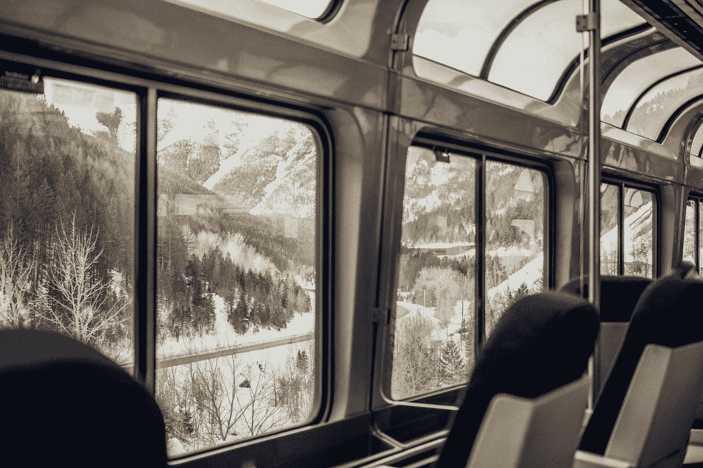
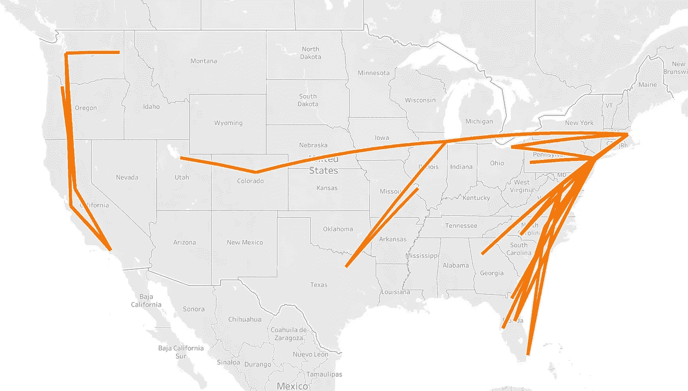
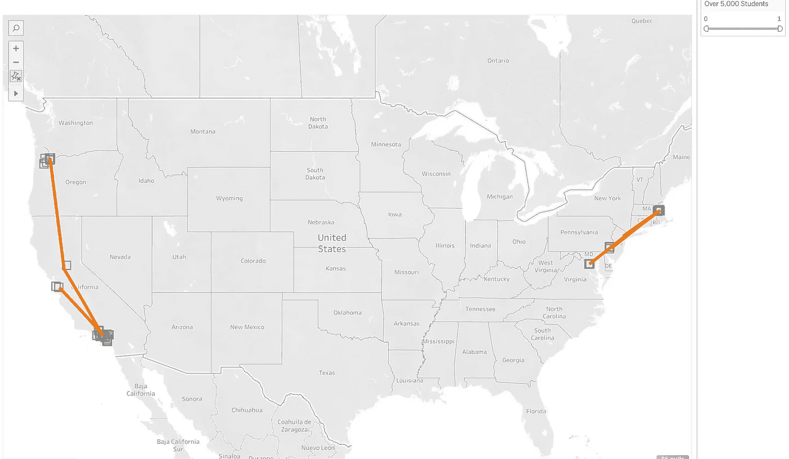
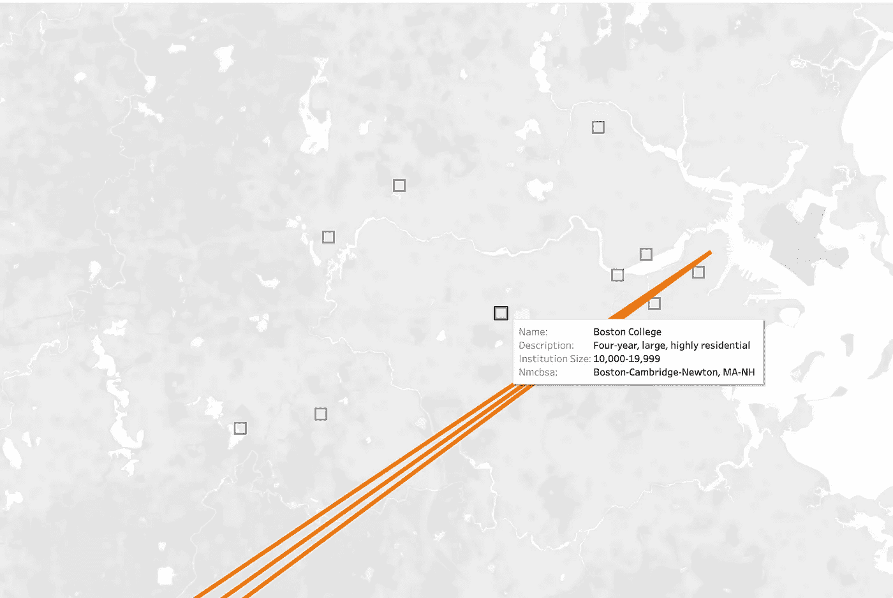

# 美铁内部的机会:美国的铁路

> 原文：<https://towardsdatascience.com/the-opportunity-within-amtrak-americas-railroad-b9c38ee9b8b8?source=collection_archive---------26----------------------->

## 使用交互式 Tableau 地图定位美国国家铁路客运公司的未来客户

迈克·彼得鲁奇在 [Unsplash](https://unsplash.com?utm_source=medium&utm_medium=referral) 上的照片

[互动并探索本文中的动态地图](https://public.tableau.com/app/profile/nina7004/viz/AmtrakOpportunity-MediumLink/Story1#1)

# 这个项目是如何开始的

每年节假日前后，我都会买一张从丹佛到中西部的往返机票回家。今年，怀着对气候焦虑的愉快心情，我试图找到限制我的航空旅行的方法，并决定登上 19 个小时的美国国家铁路客运公司火车回家过圣诞节。这让我想到:我一定不是唯一一个愿意增加旅行时间以减少环境影响的人。Grist 发现，在过去的 12 个月里，谷歌对“气候焦虑”的搜索量上升了 565%，对“我能为气候变化做些什么”的搜索量也出现了类似的飙升。最近一项针对全球 10，000 名年轻人的研究发现，三分之二的人对气候变化感到悲伤、害怕或焦虑。

在这种背景下，事实上，我不是唯一一个，我决定将我的第三个数据科学训练营项目集中在美国国家铁路客运公司——一个具有丰富潜力的低碳旅行选择。

# 美国国家铁路客运公司的挑战

这个来自 [METIS](https://medium.com/u/d18bcb7f0383?source=post_page-----b9c38ee9b8b8--------------------------------) bootcamp 业务模块的项目促使我们选择一个现实的业务问题，用数据驱动的解决方案来解决。美国国家铁路客运公司在很大程度上依赖政府补贴，尤其是自从 COVID 事件以来，乘客数量下降了 95%。该公司的预算非常紧张，每年都不可预测。该预算被分配给各种紧急问题—陈旧和不稳定的基础设施、人员配备、COVID 预防措施，当然还有财务支持和业务发展。考虑到这一点，我格外注意让我的方法变得现实——没有多余的花里胡哨，只有一个以低成本执行的可靠的数据驱动的策略。

为了在他们从 COVID 恢复后发展业务，美国国家铁路客运公司表示[近期目标](https://www.amtrak.com/content/dam/projects/dotcom/english/public/documents/corporate/businessplanning/Amtrak-Service-Line-Asset-Line-Plans-FY21-26.pdf)是吸引更多的骑手，尤其是年轻骑手。我相信他们有办法做到这一点，尽管他们财政紧张，通过向新的受众展示全新的信息。

# 为什么是美国国家铁路客运公司？

就能源效率而言，美国国家铁路客运公司比航空和汽车旅行更有优势。在他们的[五年计划](https://www.amtrak.com/content/dam/projects/dotcom/english/public/documents/corporate/businessplanning/Amtrak-Service-Line-Asset-Line-Plans-FY21-26.pdf)中，美国国家铁路客运公司声称他们比汽车旅行节能 47%，比飞机旅行节能 36%。他们继续设定减少排放的目标，并推出了新的“Acela”列车，其排放比车队中的其他列车更少。美国国家铁路客运公司还有许多便利设施，可以帮助说服潜在的年轻骑手选择更长的旅行时间——Wifi、食物、充足的空间、移动路线跟踪和最小的安全障碍。

那么，为什么美国的年轻人不涌向火车站呢？我只能推测一个普遍的答案，但我可以将我个人延迟使用美国国家铁路客运公司归因于缺乏意识。此外，在访问美国国家铁路客运公司的网站时，我并不清楚这是一个环境可持续的选择。

# 策略是这样的。

我的假设是，针对有气候意识的年轻航空旅客的环保广告将增加美国国家铁路客运公司的乘客量和收入。利用美国航空旅行、美国气候观点和学院/大学详细信息的各种数据集，我能够深入到一个小的特定人群，并以此为基础进行以气候为重点的广告宣传。

# 第一步:确定受欢迎的航线

(只是注意——接下来的几节附有交互式 Tableau 地图，不能在此嵌入。要动态地探索它们，请访问[这个链接。](https://public.tableau.com/app/profile/nina7004/viz/AmtrakOpportunity-MediumLink/Story1#1))

首先，我关注的是美国国家铁路客运公司有明显潜力从航空公司抢走用户的航线。使用 2017 年至 2019 年的[运输统计局航空市场数据集](https://www.transtats.bts.gov/Fields.asp?gnoyr_VQ=FHK)，该数据集每年对 10%的航班进行采样，我根据乘客数量确定了最受欢迎的美国航空目的地对，而不考虑路线的方向。然后，我筛选了这些路线——要考虑试点，它们必须短于 1000 英里，并且由现有的美国国家铁路客运公司站在 24 小时或更短的时间内提供服务。以下是符合这些标准的 32 条热门航线:

由现有美国国家铁路客运公司基础设施提供服务的受欢迎的航空旅行路线。图片作者。点击查看互动地图[。](https://public.tableau.com/app/profile/nina7004/viz/AmtrakOpportunity-MediumLink/Story1#1)

有趣的是，这些线路中的大部分是由美国国家铁路客运公司的“长途”线路提供服务的，这是在 COVID 期间被降低优先级的业务部门。随着它们继续复苏，这些长途线路可能会带来比以前想象的更大的机会。

# 第二步:找到容易接受的听众

随着高潜力路线的确定，重要的是要确保我们的广告将针对容易接受以气候为重点的信息的人群。美国各地对气候变化的看法大相径庭，我能够利用 2020 年[气候观点研究](https://climatecommunication.yale.edu/visualizations-data/ycom-us/)来衡量我所经过的地区的人口心态。我把注意力集中在研究中三个同意/不同意的陈述上:全球变暖正在发生，我担心全球变暖，公民应该为解决全球变暖做更多的事情。对于每一个地理区域，我将人口与这些陈述的相应国家平均值的距离加在一起。例如，“全球变暖正在发生”的全国平均支持率为 72%。芝加哥地区显示了几乎 77%的一致性，我将他们额外的百分点合并为离陈述平均值的距离总和(对于芝加哥，三个选择的陈述的总和为+13.27%)。下图中较暗的区域显示了高于平均水平的一致性。要了解这一点，请在这里与地图[互动](https://public.tableau.com/app/profile/nina7004/viz/AmtrakOpportunity-MediumLink/Story1#1)。

然后我覆盖了仍在运行的美国国家铁路客运公司路线。我们可以看到，对于我们的一些航线，如芝加哥到丹佛，这两个目的地更有可能有接受气候信息的人口。而其他路线，如芝加哥到达拉斯，有一个目的地报告不太担心气候变化，可能更好地服务于一个不同焦点的广告活动。在这一点上，我也排除了一些长度的额外路线，只保留了 22 小时以下的路线。被排除的路线在下面用灰色标出。

气候变化意见数据显示，一些受众可能更容易接受关注气候的美国国家铁路客运公司广告。图片作者。在此与地图[互动。](https://public.tableau.com/app/profile/nina7004/viz/AmtrakOpportunity-MediumLink/Story1#1)

# 步骤 3:深入到试点人群

虽然所有的橙色路线*可能*都很有前途，但请记住，我们的预算非常紧张且不可预测。开始时，我们的广告难以置信地瞄准一小部分人，这将是最有利的。为了找到这些人，我调出了我们选择的每个地区的[住宿学院&大学数据](https://educationdata.urban.org/data-explorer/colleges/)。外州的大学生一般每年至少需要离开校园两次，我们有机会说服他们乘火车回家。在我们路线目的地的潜在学校中，我只选择了那些新生中至少有 5%是美国国家铁路客运公司路线另一端的州居民的学校。例如，伊利诺伊州有许多潜在的学校，但仔细观察后，很少有伊利诺伊州的大学生是科罗拉多州的居民，因此不需要美国国家铁路客运公司到丹佛的服务。

当我们只考虑学生需要选择美国国家铁路客运公司路线的学校时，我们总共有 49 个校园可以在假期前进行广告宣传。如果人数太多，我们可以通过筛选学生人数超过 5000 人的学校来提高投资回报率——总共 23 个校区。以下是我们对试点路线和校园的最终建议，其中校园用正方形表示。

试点气候广告活动的最终路线和学校建议。图片作者。在这里与这张地图[互动。](https://public.tableau.com/app/profile/nina7004/viz/AmtrakOpportunity-MediumLink/Story1#1)

为了进行快速的案例研究，以波士顿市为例。波士顿有许多学校，其中至少有 5%的新生居住在新泽西、DC 和宾夕法尼亚——我们选择的路线的目的地州。这些学生可能会开车或乘飞机回家，随着对美国国家铁路客运公司的环境影响和便利设施的更多了解，他们可能会被说服改乘铁路。

推荐试点校园的波士顿市。这些学校至少有 5%的新生来自我们路线终点的地方(新泽西州、DC、宾夕法尼亚州)。图片作者。在此与此地图[互动。](https://public.tableau.com/app/profile/nina7004/viz/AmtrakOpportunity-MediumLink/Story1#1)

# 接下来呢？

为了衡量这个项目的成功，我希望在我们选择的地区，18-35 岁的乘客增加 5%。鉴于试点和潜在的 A/B 测试的成功和失败，我们可以重新评估、重复和继续前进。然而，这里也有一个更复杂的解决方案的大好机会。

为了获得关于谁可能接受该信息的额外信心，美国国家铁路客运公司可以在预订购买时收集人口统计和以前的旅行模式数据(例如，年龄、新/老客户，如果这是你第一次来美国国家铁路客运公司，是什么促使你转向铁路旅行？).利用这些数据，我们可以建立一个预测模型，以了解哪些特征更有可能让人们转向铁路旅行。以这些数据为基础，我们可以改进上面的过程，以更准确地定位试点人群。

# 外卖食品

美国国家铁路客运公司正处于复苏和增长的关键时刻。无论是预测建模还是更基本的数据映射，美国国家铁路客运公司都有很大的潜力来增加乘客量，同时将美国的旅行习惯转向低碳未来。

*感谢*[*Maxen Haveles*](https://twitter.com/mhaveles?ref_src=twsrc%5Egoogle%7Ctwcamp%5Eserp%7Ctwgr%5Eauthor)*对本文的反馈。要浏览我的项目资源库，* [*请访问此链接。*](https://github.com/ninaksweeney/amtrak-americas-railroad)