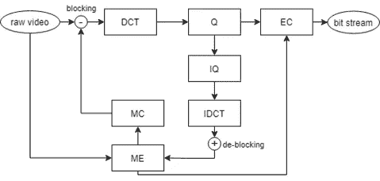
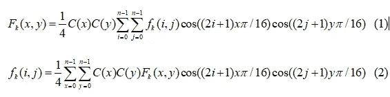
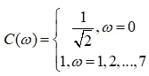
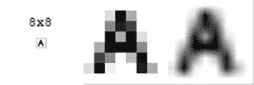
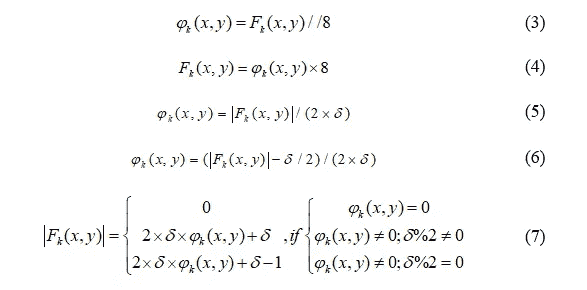
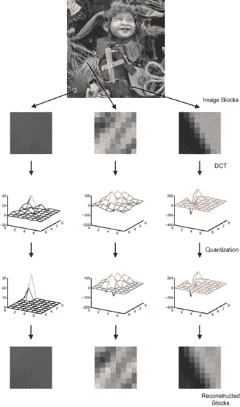
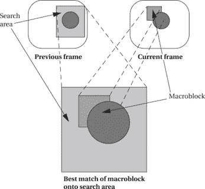
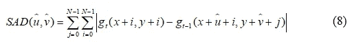
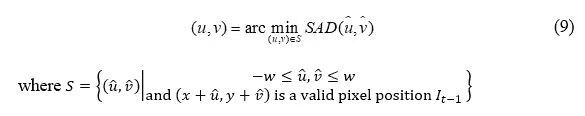
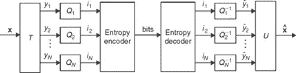

# 视频编码技术综述

> 原文：<https://towardsdatascience.com/the-overview-of-video-coding-technique-f650aed6c6a4?source=collection_archive---------16----------------------->

## 关键词-视频编码，视频压缩，图像压缩

视频编码是一种用于压缩和解压缩数字视频信号的技术。在视频压缩中，对摄像机记录的原始视频进行处理。通过压缩处理，视频大小显著减小。为了评估压缩过程的效率，选择了压缩比(CR)值。CR 值越高，压缩过程的效率越好。此外，同样重要的过程是解压缩视频数据。对压缩的结果执行解压缩。为了评估该解压缩过程的质量，选择了峰值信噪比(PSNR)值。该度量表示原始视频和解压缩视频之间的比较。PSNR 指数与解压缩视频的质量成比例。本文详细研究和评估了视频压缩技术。

图 1。视频编码技术概述流程图

图 1 是视频编码技术的概述流程图。在各种视频编码技术中，有一些压缩算法(离散余弦变换(DCT) /逆离散余弦变换(IDCT)；量化(Q) /逆量化(IQ)*；*运动估计(ME) /运动补偿(MC)；熵编码(EC))被大多数视频编码标准所共享。

遵循图 1 中的结构，本文回顾了每一个压缩函数，它们是变换函数(DCT/IDCT 和其他相关算法)、量化函数(Q/IQ)、熵编码函数(游程长度、霍夫曼编码和其他相关方法)。

# 1.变换函数

变换功能用于将图像/帧数据从空间域转换到频域。本论文集中于已经讨论了五年的最新和最热门的技术。因此，选择 H.264 和 HEVC 进行深入分析。在一般的视频编码技术和 H.264，特别是 HEVC 中，变换基函数是从 DCT [1]中导出的。

**定义:**离散余弦变换是对空间域中的图像像素应用一种技术，将它们变换到可以识别冗余的频域[2]。

在视频压缩中，帧被分成大小从 4*4 到 64*64 的块。一种图像压缩技术— JPEG [3]将图像分成 8*8 个块。然后，对每个 8×8 块应用二维离散余弦变换(DCT)。等式(1)是离散余弦变换函数。

在视频解压缩中，对 DCT 系数块应用逆离散余弦变换(IDCT)。等式(2)是 IDCT 函数。

其中 f_k 和 F_k 分别是像素值和 DCT 系数，是块索引，并且

未压缩/原始以及无损压缩数字图像需要高存储器和带宽。DCT 大大减少了内存和带宽的数量。图 2 是 DCT 系数的一个例子。

图二。DCT 系数示例[4]

在图 2 中，左边的图像——明显是一个字母——是像素值。右边的图像——模糊的图像——是 DCT 系数。

在 HEVC 标准的视频编码 H.264 中，对每一帧应用 DCT。在视频帧内编码中，DCT 应用于像素值。此外，在帧间编码中，DCT 是根据残差值计算的。而且，IDCT 是将 DCT 系数逆变换为图像像素值。在图 8 中，对帧像素值的每个块使用 DCT 函数；IDCT 在 IQ 函数之后应用。

# 2.量化函数

**定义:**量化是将一个值表示为一个小数位数固定的数的必然结果[5]。

在视频编码中，根据 DCT 系数，量化标度码被量化矩阵逐元素分割，并对每个结果元素进行舍入。量化参数( )决定了将变换后的系数与有限的一组步长相关联的步长。在视频编码中，该值与 CR 成正比，与 PSNR 值成反比。对于 DC 值——在两个维度上具有零频率的值，等式(3)和(4)是量化，并且逆量化公式被应用于变换的信号。另一方面，等式(5)和(6)是利用 AC 值进行帧内和帧间编码的量化公式，剩余的值具有非零频率。等式(7)是标准中使用的逆量化公式。

其中*δ*是量化参数，F_k_(x，y)是 DCT 变换后的信号，并且是块索引。在视频编码中，DC 是值 x=y=0，AC 是{(0，1)，…，(n，n)}的值(x，y)成员，n 是块大小。

图 3 显示了应用于灰度图像的 DCT/Q/IQ/IDCT 流的示例。原始图像被分成 8×8 的块。每个块通过一个接一个的步骤进行编码:第一步是 DCT 变换；然后，用 Q 函数对 DCT 系数进行量化。图形底部块由 IQ 和 IDCT 函数重建。

图 3。DCT 和 Q 流的例子[6]

在视频编码中，图 3 中的流程应用于帧内编码过程的每一帧。此外，对于帧间编码处理，运动估计处理应用于 P 帧。

# 3.运动估计和运动补偿

本小节介绍运动估计(ME)和运动补偿(MC)功能，它们是帧间编码的最重要部分。视频编码使用运动来根据一帧对另一帧进行编码。运动估计使用块运动估计技术的概念，其通过其它帧的修改形式来编码帧数据。图 4 显示了运动估计概念。概念目标是找到两个帧中区域之间的最佳匹配。

图 4。运动估计的概念[7]

运动估计的输入是宏块和搜索区域。ME 执行使用搜索算法计算运动矢量的块运动估计。

对我来说，视频序列中的当前帧(I_t)被分成不重叠的像素块。对于当前帧中的每个块，确定前一帧(I_t-1)中尺寸的搜索窗口(S)内的最佳匹配块，其中是最大允许位移。当前帧中的模板块和前一帧中的最佳匹配块之间的位置差称为运动矢量(MV)。

最简单和最基本的搜索方法是使用全搜索(FS)算法。FS 包括处理搜索范围内的所有像素，以通过成本函数找到最佳块匹配。在 H.264 和 HEVC 中，选择 SAD 是因为它比其他成本函数使用更少的资源，同时还具有较低的失真，因此是可接受的[8][9]。等式(8)考虑当前帧中位置(x，y)处的模板块和前一帧(I_t-1)中位置(x+u^，y+v^)处的候选块。

其中 g_t(。)是当前帧 I_t 中的像素值，g_t-1(。)是前一帧 I_t-1 中的像素值。

(u，v)中的运动向量(MV)被定义为等式(9)。

# 4.熵编码

**定义:**熵编码是一种与介质具体特性无关的无损数据压缩方案。熵编码为输入中的每个唯一符号创建并分配一个唯一的前缀码[10]。

图 5。图像/视频压缩中的熵编码[10]

图 5 显示了图像/视频压缩过程中的熵编码，这是编码器中的最后一步，也是解码器中的第一步。对来自每个宏块的量化结果执行熵编码。因此，熵编码是对 CR 和 PSNR 值产生显著影响的重要步骤。

# 参考资料:

[1] D. R. Bull，“视频编码标准”，载于*通信图片*，爱思唯尔，2014 年，第 411–449 页。

[2] B .(编辑).(2006).D. C. T. (DCT) B.-E. of M .(第 203-205 页)。美国 https://doi.org/10\. 1007/。-387–30038–4 _ 61 Furht，“离散余弦变换(DCT) BT —多媒体百科全书”，B. Furht，编辑。马萨诸塞州波士顿:斯普林格美国出版社，2006 年，第 203-205 页。

[3] I.-T. R. T.81，“ISO/IEC 10918-1:信息技术-连续色调静态图像的数字压缩和编码-要求和指南。”第 186 页，1994 年，访问日期:2021 年 1 月 30 日。【在线】。可用城市:https://www.iso.org/standard/18902.html.

[4]“文件:Letter-a-8x8.png —维基共享。”https://commons.wikimedia.org/wiki/File:Letter-a-8x8.png(2021 年 7 月 12 日访问)。

[5] R. A. Cottis，“用于腐蚀监测的电化学噪声”，*技术。科罗斯。莫尼特。*，第 86–110 页，2008 年 1 月，doi: 10.1533/9781845694050.1.86。

[6] D. R. Bull，“视频编码简介”，第 5 卷，第 3–26 页，2014 年 1 月，doi:10.1016/B978–0–12–420149–1.00001–6。

[7] M. Wolf，“网络和多处理器”， *Comput。作为组件*，第 409–457 页，2012 年 1 月，doi:10.1016/B978–0–12–388436–7.00008–8。

[8]郑俊杰，赵力宇，郭杰峰，陈，董东辉，“超高清视频编码中可变块大小运动估计的硬件高效块匹配算法及其硬件设计”， *ACM Trans .德斯。Autom。电子。系统。*，第 24 卷，第 2 期，第 1–21 页，2019 年 1 月，doi: 10.1145/3290408。

[9] M. Nagaraju、S. K. Gupta、V. Bhadauria 和 D. Shukla，“用于 HEVC 运动估计的高效混合并行流水线 SAD 架构的设计和实现”，载于电气工程讲义*，2021 年，第 683 卷，第 605–621 页，doi:10.1007/978–981–15–6840–4 _ 50。*

*[10]陆志明、郭世志，“简介”，载于*图像中的无损信息隐藏*，新进展，2017 年，第 1–68 页。*