# 论文:《客户终身价值预测的深度概率模型》

> 原文：<https://towardsdatascience.com/the-paper-a-deep-probabilistic-model-for-customer-lifetime-value-prediction-eb5d61a83ecd?source=collection_archive---------3----------------------->

## 贯穿论文的神经网络结构和损失函数

## **内容**

*   **关于**
*   **论文概述**
*   **深潜:架构-输出层**
*   **深潜:ZILN 损失**
*   **总结**

# 关于

预测客户的终身价值(LTV)可能是一项相当具有挑战性的任务。王、刘和苗建议使用[一个混合损失的神经网络](https://research.google/pubs/pub48791/)来处理新客户流失和终身价值建模的复杂性。

在这篇博文中，我们将看看他们提出的解决方案，并探讨他们想法背后的推理过程。第一部分简要总结了生命周期价值建模的重要性和挑战。它还着眼于王，刘和苗如何处理这些问题，并快速浏览他们的论文的结果。然后，第二部分深入研究他们选择的架构，特别是输出层。最后，最后一节更详细地介绍了建议的损失函数。

这篇文章无意做深入的数学解释；而是旨在为论文提供一个更高层次、更容易理解的解释。

# 论文概述

为什么终身价值和流失很重要？对客户未来购买行为的准确洞察可以支持各种运营和战略业务活动。例如，它可以根据客户的 LTV 对客户进行细分，并针对特定的客户群提供不同的优惠和忠诚度计划，从而提高资源使用效率，从而帮助公司留住客户。

图 1 显示了一个典型的偏斜 LTV 分布。LTV=0 的大量统计数据表明，有很大比例的顾客曾有过不愉快经历(他们购买了一种产品，然后就再也没有回来过)。为了更好地显示回头客，x 轴显示为(LTV+1)的对数。这表明，回头客的终身消费之间的范围变化很大。一小部分高消费人群有时可以占据大量的业务收入。这种一次性消费人群占很大比例、少数消费群体相当庞大的分布对传统的均方误差方法提出了挑战。你会在下面深入他们的损失函数的章节中看到更多的细节。

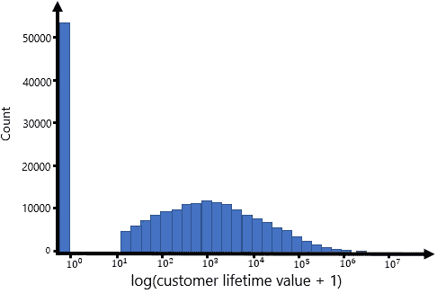

图 1 |作者图片，灵感来自论文中的[图 1](https://research.google/pubs/pub48791/)

通常，LTV 和流失建模是分开进行的(图 2，左)。然而，王、刘和苗的方法允许他们同时处理客户流失和 LTV 预测(图 2，右)。

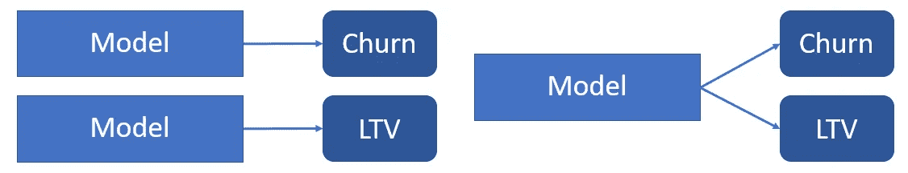

图 2 |作者图片

他们建议使用“零点质量和对数正态分布的混合物”，称之为零膨胀对数正态分布(ZILN)，而不是分别研究 LTV 和流失分布。然后，他们通过取 ZILN 分布的负对数似然来导出混合损失，然后用它来训练他们的神经网络同时完成这两项任务。信息太多？别担心。我们将在下面更详细地了解什么是损失函数以及 ZILN 是如何工作的。你现在应该做的是，你可以用一个模型来预测两个任务:客户流失和 LTV。

王、刘和苗测量他们的方法在两个子任务上的性能。虽然流失预测实现了与经典二元分类损失相当的性能，但他们的 LTV 预测任务在三个不同的评估指标上优于传统的均方误差(MSE)方法。我们不会在这篇文章中剖析他们的评估指标，但是如果你想更多地了解他们的结果，你可以看看他们的论文。

# 深入探讨:架构—输出层

如上所述，王、刘和苗在他们的模型中使用了神经网络。他们选择了一个简单的前馈神经网络，第一个隐藏层有 64 个单元，第二个隐藏层有 32 个单元。参见下面的图 3。这些隐藏单元使用 ReLu 激活功能。数字输入被直接输入，而分类输入被编码为嵌入。我们将集中在输出层，因为这些单元对我们将在下面讨论的损失函数是有意义的。

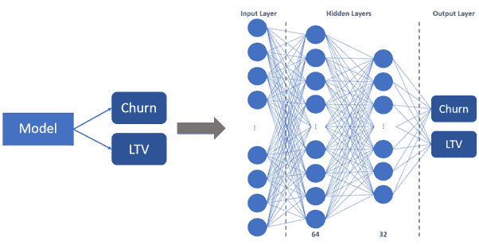

图 3 |作者图片

输出层有一个单元 **p** 来预测某人是否搅拌的概率。用于表示该概率的激活函数是 sigmoid 函数。该函数适用于输出概率，因为其输出值的范围在 0 到 1 之间。典型的阈值是 0.5。低于 0.5 的预测将是仍然活着的客户，而高于 0.5 的预测将被预测为被搅动。请参见下面的图 4。

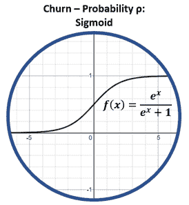

图 4 |作者图片

另一方面，LTV 需要两个单位。一个单元预测一个 [**位置参数**](https://en.wikipedia.org/wiki/Location_parameter) **μ** ，另一个单元预测一个 [**比例参数**](https://en.wikipedia.org/wiki/Scale_parameter) **σ** 。然后，我们使用这两个参数来定义一个完整的预测分布，这反过来为我们提供了一个与我们的预测相关的不确定性度量(不确定性可以通过使用我们的预测分布的分位数来估计)。这两个输出μ和σ **不应被误认为** **与更熟悉的平均值**和正态分布的标准偏差。

μ单位在范围或符号方面没有限制。因此，王、刘和苗选择对μ使用恒等函数。这意味着它只是输出神经网络μ单位的预测值，而不通过激活函数运行它。

比例参数σ应该只能返回正输出。像指数这样的普通函数可以解决这种正约束，但由于其急剧增长，很容易导致[爆炸梯度](https://www.analyticsvidhya.com/blog/2021/06/the-challenge-of-vanishing-exploding-gradients-in-deep-neural-networks/)。王、刘和苗选择了一个没有指数函数那样急剧增长的 softplus 激活函数。然而，当训练他们的模型时，单独的 softplus 似乎不足以避免这种不稳定性，所以他们还应用了[渐变剪辑](/what-is-gradient-clipping-b8e815cdfb48)。

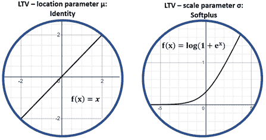

图 5 |作者图片

输出层最终看起来如图 6 所示。**流失**只需要一个概率值 **p** ，而 **LTV** 既有 **μ** 又有 **σ** 。通过学习使用一个模型来表示多个任务(客户流失和 LTV ),这个网络的中间层学习更好地概括每个子任务。如果你想了解更多这方面的内容，请阅读这里的多任务学习。

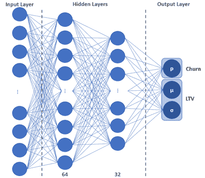

图 6 |作者图片

# 深潜:零损失

为了训练这个网络，我们最小化神经网络的预测和来自数据的实际目标值之间的误差。在我们的例子中，这意味着我们将预测的流失概率与实际流失值进行比较。这种性能测量被称为损失。

根据你想要达到的目标，你使用不同的损失函数来优化你的神经网络。假设上面的架构结合了两个任务，我们将需要一个为每个子任务定制的损失函数。

两种常见的损失函数是二元交叉熵(BCE)损失和均方误差(MSE)损失。BCE 用于二元分类任务，在这种任务中，您试图预测某事是真还是假；意味着只有两种状态。在我们的情况下，这将是是否有人搅拌或没有。然后是 MSE，这是回归问题中常用的损失，在这种情况下，你试图预测一个连续的值，如工资，股票或在我们的情况下，LTV。

## 二元交叉熵损失——流失

对于神经网络的搅动任务，王、刘和苗使用 BCE 损失:

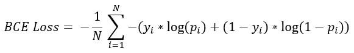

yᵢ是真正的目标值(1 代表客户流失，0 代表无客户流失)，pᵢ是 yᵢ=客户流失的预测概率，而(1-pᵢ)正好相反(无客户流失)

在我们的例子中，目标是正确地分类客户流失(类别 1)和无客户流失(类别 0)。我们需要一种方法在一个函数中处理这两个类，并对错误的预测施加更高的惩罚。这是通过仅激活损失函数的一部分，同时保持另一部分去激活来实现的。使用对数可以使错误的预测产生更大的误差。让我们看一个例子来阐明这一点。

为了简单起见，我们只看一个观察值，其中我们有属于类 1 的真实观察值(搅动，y₁=1)，这移除了求和，我们剩下:

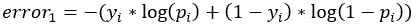

现在让我们假设我们的模型预测这个观察结果以 0.95 的概率被搅动(p₁=0.95).这意味着我们的观察会产生以下误差:

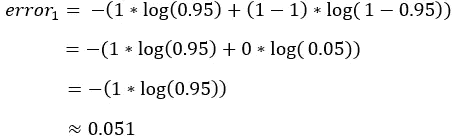

这表明只有等式的第一部分被激活，另一部分(乘以 0)被抵消。因此，我们只剩下概率的 log()了，当 pᵢ接近 1 时，它给出了很小的损失值，当我们的概率越接近 0 时，损失值就越大(就像我们预测错误的类别一样)，见下图 8(左)。在我们的例子中，我们的概率为 0.95，因此我们的观察结果的误差值为 0.051。相反，如果我们的真实值现在是 0 而不是 1，那么损失函数的另一部分激活，如果我们仍然预测它是以 0.95 的概率流失(=1)，那么我们最终会有 2.966 的大误差，见下面的图 9(右)。

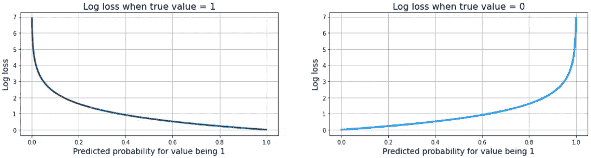

图 7 |作者图片

下面的表 1 的前两行总结了这个例子。此外，该表还显示了损失函数在预测值为 0 且 pᵢ=0.01.为 0 的相反情况下的表现

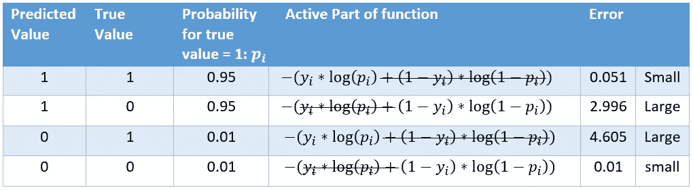

表 1 |作者图片

这个例子应该给你一个大概的概念，为什么 BCE 在你预测一个类或者另一个类的任务中工作得很好。错误预测的误差如此之大，将迫使模型学习更好的表示方法，从而将模型预测性能的总体误差降至最低。

## 对数正态损失— LTV

如上所述，不是预测网络的 LTV 任务的单点估计，而是优选具有完整的预测分布。该分布可以让我们了解观测点在我们预测的 LTV 值周围的分布情况。王、刘和苗建议采用对数正态分布。上述两个参数μ和σ描述了分布的概率密度函数(PDF):

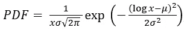

请参见下面的图 8。这种对数正态分布与典型的 LTV 数据非常相似:它是右偏的，从零开始，一直到正无穷大。因此，神经网络学习对数正态分布的参数是有意义的。

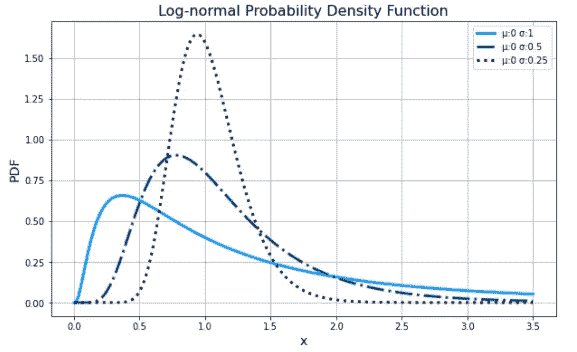

图 8 |作者图片

我们可以通过取对数正态分布的负对数似然来获得对数正态损失，见下面的损失函数。我们不会经历推导损失的步骤。主要思想是简单地将对数正态损失与经典的 MSE 损失进行比较，看看它与 MSE 有何不同。

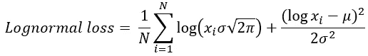

xᵢ是我们的实际真值，μ & σ是对数正态概率分布的估计参数，n 是样本数

相对于 MSE 损失:

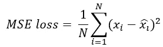

xᵢ是我们的实际真值，xᵢ是预测值，n 是样本数

我们来看几个例子。第一个例子将向我们展示这些损失在小预测值和大预测值上的差异。第二个例子将向我们展示当预测被高估或低估时它们是如何不同的。

***【对数正态】看起来更像是相对的***

我们有一种情况，对数正态分布的真实中值是 20，另一种情况，真实值是 20，000。下表比较了 MSE 损失和对数正态损失(具有两个不同的σ值)。我们可以看到， **MSE 惩罚高消费人群**(案例 2，损失:16，000，000) **比低消费人群(案例 1，损失:16)更严厉****。尽管与真实值的相对偏差相同，但情况 2 中的损失是情况 1 的 1，000，000 倍。**

**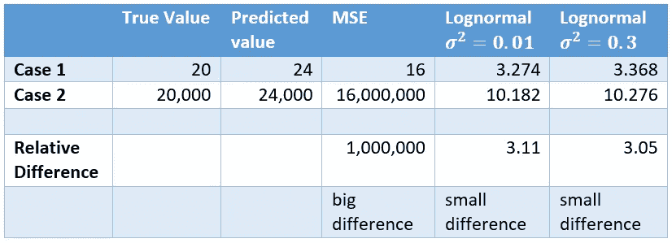**

**表 2 |作者图片**

**鉴于高价值客户通常比普通客户花费更多的数量级，MSE 不太适合这个问题。这将对我们的高价值客户的预测误差造成过度惩罚。另一方面，对数正态分布将普通消费客户的小差异视为高价值客户预测的大差异。**

*****对数正态分布低估多于高估*****

**这里，两种情况的真实值都是 20，但是在情况 1 中，我们低估了 6，而在情况 2 中，我们高估了 6。下表再次比较了两种情况下的不同损失。我们可以看到，MSE 对低估和高估的惩罚是一样的，而对数正态损失对低估的惩罚多于高估。**

**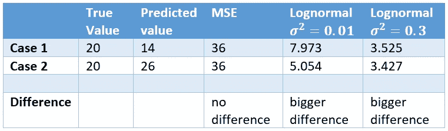**

**表 3 |作者图片**

**下面的图 9**显示了这种不对称行为。虽然 MSE 在最小值附近是对称的，但它表明对数正态损耗随着σ的增加而变得更加不对称。****

****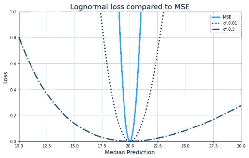****

****图 9 |作者图片，灵感来自[文中图 2](https://research.google/pubs/pub48791/)****

****到目前为止，我们已经根据损失函数的中值对其进行了研究。中位数被定义为 exp(μ)，这意味着我们在损失函数中使用μ=log(x)。然而，王、刘和苗建议将作为对数正态分布的平均值进行预测，即:****

****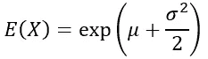****

****这意味着我们在损失函数中用 log(x)-σ /2 代替μ。损失仍然以与上述相同的方式表现。这造成的唯一区别是我们的预测偏向一个更高的数字。σ越大，我们预测的 LTV 就越高。例如，如果我们的真实值是 20，我们完美地预测了μ单位，但σ为 0.3，那么我们预测的 LTV 将大约为 23.2。σ仅为 0.01 的相同值将为我们提供大约 20.1 的 LTV 预测值(非常接近我们的真实值)。我们可以在下面的图 10**中看到最小预测值的变化。******

******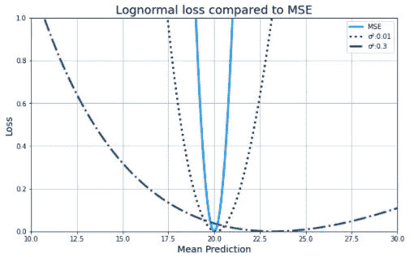******

******图 10 |作者图片，灵感来自论文中的[图 2](https://research.google/pubs/pub48791/)******

******使用对数正态分布时，均值和中值都是可行的方法。但是我们什么时候用对数正态代替 MSE 呢？当我们的真实值(LTV)的范围很大时，对数正态损失应被视为对 MSE 更有利，因为我们不希望大值受到更多惩罚。******

## ******零膨胀对数正态(ZILN)损失—流失和 LTV 一起******

******既然我们已经分别研究了不同的任务，那么得到 ZILN 混合物损失的最后一步是简单明了的。它只是上面两个损失的线性组合。参见下面的图 11。******

******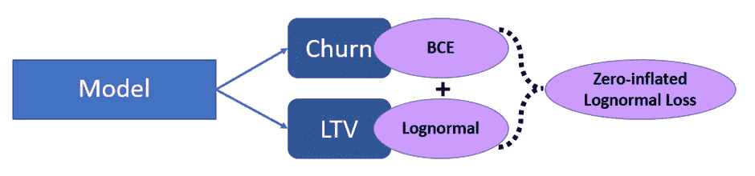******

******图 11 |作者图片******

******王、刘和苗假设每个子任务的权重相等，因此损失函数最终看起来如下:******

******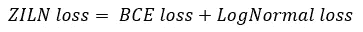******

******这意味着我们最终通过简单地最小化两个损失函数(BCE 和对数正态损失)的和来训练神经网络。******

# ******摘要******

******在这篇博文中，你已经看过了这篇文章:*客户终身价值预测的深度概率模型*，它提出了 LTV 建模的多任务方法。您研究了他们建议的输出单位以及相关的 BCE 和对数正态损失函数，这些函数结合起来会导致他们建议的 ZILN 损失。这种方法的好处是:******

*   ******拥有 LTV 预测分布，而不是单点预测(这使您能够洞察预测的不确定性)******
*   ******由于多任务学习方法，对客户流失和 LTV 建模有更好的概括******
*   ******减少围绕构建、培训和维护两个独立模型的工程工作******

******这篇文章没有涉及的是如何将结果与其他模型进行比较，或者如何将这个模型应用到用例中。鉴于他们的[代码](https://github.com/google/lifetime_value)可以在线获得，您应该能够使用它来模拟新客户的期望，或者使用 RNN 或 LSTM 等顺序神经网络架构来修改它以模拟随着时间推移的生命周期 ***。*********

****参考****

****[1] X 王，T 刘，J 苗，[客户终身价值预测的深度概率模型](https://research.google/pubs/pub48791/) (2019)，谷歌研究出版物****

*****脚注*****

*****对于从相同的最小 y 值开始的所有损失，减去每个损失本身的最小值，这就是 y 轴值不同于上表中直接损失计算的原因。*****