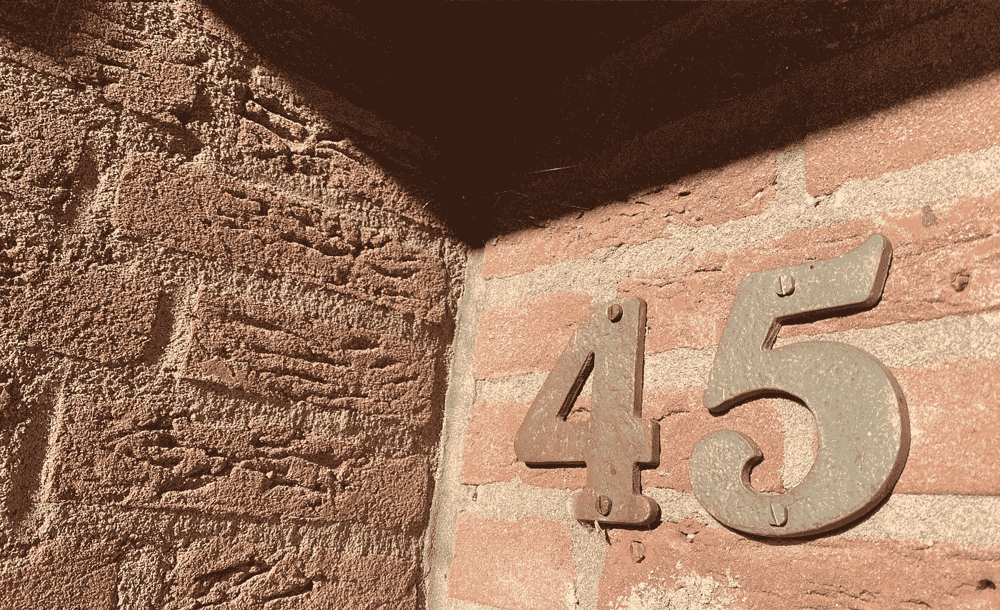

# 个人信息保护中的悖论

> 原文：<https://towardsdatascience.com/the-paradox-in-protecting-personal-information-80fb2ebfa57?source=collection_archive---------54----------------------->

## *这是一个关于我们在数字世界中如何不同于在现实世界中保持相同标准的故事*

上周末，当我和父亲走在马斯特里赫特的街道上时，他注意到了名牌是如何从房子里消失的。以前，大多数人都把自己的名字挂在门上。这一定让他很困扰，因为这是他第二次提到它。两周前我们在城里散步时，他也说过同样的话。你认为这是为什么？“我问。”我想是隐私问题，”他回答道。这让我开始思考。如果是关于隐私问题，这是一个相当有趣的悖论。

没有名字的数字—作者图片

## 为什么名牌正在消失？

名牌有时还是会出现。当他们这样做的时候，通常是闭门造车。就像有双扇门和一个门厅的公寓。这些主要是帮助邮递员和访客按正确的门铃，因为门铃太多了。在公寓大楼里，由大楼的管理人员安排一个名字标志通常是强制性的。

在网上搜索名牌会找到许多出售名牌的商店。考虑到供应量，这意味着它们肯定还有市场。人们喜欢他们为自己的家提供的个人风格，这有助于访问者更好地找到你，也有助于邮件发送者更好地处理不完整的地址。

进一步挖掘，我偶然发现一个论坛，有人在论坛上提出(2016 年)没有名牌的人一定有所隐瞒。考虑到近年来它们消失的速度，这种情况不能再继续下去了。除非每个人都有所隐瞒？

买名牌不是一次性的。它们可能会随着时间而改变。当你结婚，或者当你有了孩子，你可能想改变你的姓或名字牌上提到的名字。也许成本和麻烦对于附加值来说太大了？

在我遇到的所有论坛中，人们确实会回到隐私问题上来。就像名牌显示你是一个独居的女人所带来的风险。或者任何一个陌生人都有可能来到你的门前并知道你的名字。或者有不良企图的人可能会使用您的个人信息来欺骗您…

在物理世界里谨慎，但是数字世界呢？—作者图片

## 考虑隐私风险

我想知道的是，为什么我们在物理世界中善于保护我们的个人信息，但在数字世界中却不坚持同样的标准。

大多数网站让你接受他们的 cookies，反过来在互联网上跟踪你。尽管法律法规要求网站必须征得访问者的许可才能存储隐私敏感的 cookies，但他们设计的许可屏幕让你在意识到之前就点击“全部接受”。在不知道自己接受了什么的情况下。

当网站或应用程序提供“免费”服务时，我们似乎很乐意分享他们的个人信息:包括我们的姓名和地址。虽然我们不知道他们用我们的信息做什么。它将落在谁的手中。更不用说使用我们的个人信息创建的客户档案、大数据分析和算法了。

更糟糕的是，在很多情况下我们甚至没有选择。我们不得不与组织分享我们的个人信息，但我们并不能真正保证这些信息会被谨慎对待。以荷属 GGD 为例。为了进行 COVID 测试，他们收集了包括社会安全号码在内的个人信息。然后，他们发生了数据泄露。接受过 COVID 检测的人的个人信息在互联网上以很低的价格出售。不仅仅是他们的名字和地址，还有社会保险号。

那个陌生人可能无法通过走过你的家来获得你的个人信息，但很可能在互联网上获得。不仅仅是你的地址和名字。

## 结论

姓名标志正在从家庭中消失。即使在小村庄，它们也变得越来越不常见。如果隐私问题是它们消失的原因，那么为什么物理和数字世界会有这样的双重标准？下次你在网上被问到你的个人信息时，问问你自己，如果有人到你家来问你，你是否会轻易分享。如果你继续在网上分享个人信息，也许可以考虑把名字牌带回你家。这可能对你所在社区的社区建设有好处。

## 参考

rijksoverheid(2021 年 2 月 2 日)，*数据泄露 GGD*[https://www . rijksoverheid . nl/documenten/kamerstukken/2021/02/02/kamerbrief-in zake-stand-van-zaken-datalek-GGD](https://www.rijksoverheid.nl/documenten/kamerstukken/2021/02/02/kamerbrief-inzake-stand-van-zaken-datalek-ggd)