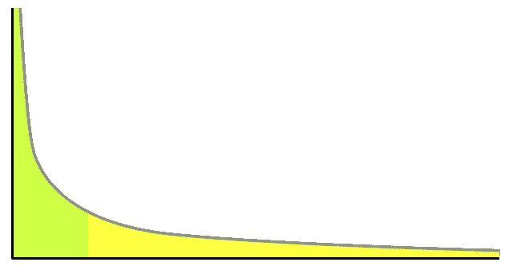

# 帕累托原则—作为一名数据科学家，有效地花费时间和精力

> 原文：<https://towardsdatascience.com/the-pareto-principle-spending-time-and-energy-effectively-as-a-data-scientist-8d48f7cc2b0f?source=collection_archive---------22----------------------->

## 一小部分努力会带来大部分回报

帕累托原则指出，对于各种各样的情况，大约 80%的结果是由大约 20%的原因造成的。

事实证明这是广泛适用的，无论是你如何看待数据，还是你如何思考项目。

在 [Unsplash](https://unsplash.com?utm_source=medium&utm_medium=referral) 上由 [Austin Distel](https://unsplash.com/@austindistel?utm_source=medium&utm_medium=referral) 拍摄的照片

例子包括:

*   大约 80%的错误报告通常是由大约 20%的错误引起的
*   约 80%的医疗保健成本通常是由约 20%的患者造成的
*   约 80%的用户交互通常来自约 20%的用户
*   大约 80%的项目价值通常来自前 20%的努力

确切的百分比最终实际上是 80%还是 20%并不重要——存在差异或多或少极端的情况。要记住的重要一点是，很常见的情况是，一小部分原因导致了大部分影响。**这应该是一个指导原则，无论是在考虑你如何建立你的机器学习模型的时候，还是在考虑你如何花费时间的时候。**

一个权力分布，展示了分布的顶端有多大的影响力。图片由 [Hay Kranen](http://www.haykranen.nl/) / PD 在[维基媒体](https://commons.wikimedia.org/wiki/File:Long_tail.svg)

# 帕累托原理与建立机器学习模型

机器学习模型的大部分性能通常来自于少量的努力。如果你想最大化你作为数据科学家的影响力，最好是创造许多最低可行的产品，而不是试图制造一个完美的产品。如果你用 20%的努力获得了大部分的价值，那么把前 20%的努力花在一堆不同的项目上，并产生更广泛的影响，可能会比花所有的时间去完善一个项目更好。让我们看看这可能出现的几个具体地方。

## 特征

通常很少有特征完成模型的大部分工作。有一种倾向，[特别是在经验较少的人当中，寻找任何可能相关的数据，并将其投入机器学习模型](/organizational-data-illiteracy-kills-data-science-teams-b1fe1a630053)。虽然包含数据是一个好主意，但是如果争论和添加额外的功能需要花费时间，你应该质疑它是否值得。你可能已经添加了最有影响力的功能，现在已经到了收益递减的时候了。

通常是几个最直接相关的特性完全决定了模型的性能。

以预测谁最有可能将图书馆的书过期为例。您可以使用关于图书类型的各种信息，也许是借阅者居住的社区，并根据借阅的图书提出一些创造性的功能来添加到模型中。但几乎可以肯定的是，主要特征都涉及一件事:借书人的还书历史。如果他们过去曾按时还书，他们就不太可能保留一本过期的书。如果他们曾经归还过过期的东西，他们下次更有可能过期。

这一点很重要，因为通常最简单、最容易使用的功能才是最有影响力的。根据不同的用例，花费大量时间访问创建其他功能所需的数据可能不会[提高多少商业价值](/calculating-the-business-value-of-a-data-science-project-3b282de9be3c)。

## 调整模型

超参数调优非常好——借助一点计算能力，您通常可以从模型中获得一些“免费”的额外性能。

但是，很容易花太多时间在上面。每当我看到一个学生学习超参数调优，他们通常会感到失望，在所有的时间和精力之后，它只对性能产生了微小的影响。通常，这是因为模型非常智能——在这一点上，大多数包为大多数应用程序使用合理的默认超参数，开箱即用也相当好。

超参数调优可能会提高一点性能(或者，如果缺省值恰好对您的特定问题非常不利的话，可能会提高很多)。但是你很快就达到了收益递减点。再次强调帕累托原则——你的第一点努力通常会让你成功。

您可以通过简单的超参数扫描快速建立并运行模型。如果你有一个管道可以运行一个大的超参数扫描并为你解决问题，这很好，但如果你缺乏计算资源来轻松设置并忘记网格搜索，这可能是值得的。如果模型非常重要，或者如果您稍后有一些停机时间，您可以随时返回并尝试针对问题进行更多的超参数调整。但是，当您可以转到下一个项目时，花费数周或数月来调整简单模型的超参数通常是没有意义的。

# 结论

帕累托原则是一个重要的指导原则:通常，在数据科学和生活中，少数人的努力将获得大多数的结果。作为一名数据科学家，你的时间是宝贵的，确保你明智地使用它。有时候，一种聪明的懒惰是完成事情的最好方式。

**您可能感兴趣的其他文章**

 [## 组织数据盲扼杀了数据科学团队

### 数据的成本在领导层显得幼稚

towardsdatascience.com](/organizational-data-illiteracy-kills-data-science-teams-b1fe1a630053)  [## 自动化机器学习不应该让数据科学家担心

### 这些工具只做数据科学中简单的部分

towardsdatascience.com](/automated-machine-learning-shouldnt-worry-data-scientists-9a54dfef0491)  [## 计算数据科学项目的商业价值

### 性能度量不能告诉你你想知道的:一个项目实际上有多大价值

towardsdatascience.com](/calculating-the-business-value-of-a-data-science-project-3b282de9be3c)