# 深度学习的过去、现在和未来

> 原文：<https://towardsdatascience.com/the-past-present-and-future-of-deep-learning-adb4d60eaf24?source=collection_archive---------35----------------------->

## 一个关于深度学习从研究人脑到构建复杂算法的演变的小故事

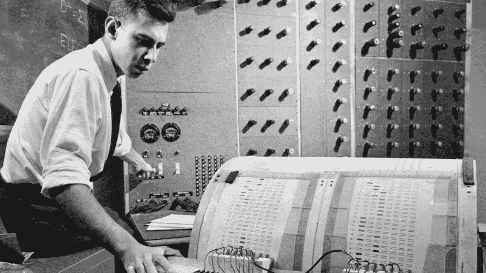

弗兰克·罗森布拉特正在研究感知器(来源:[康奈尔纪事报](https://news.cornell.edu/stories/2019/09/professors-perceptron-paved-way-ai-60-years-too-soon)，稀有和手稿收藏部门)

TLDR；在这篇博客中，你将学习深度学习(DL)的理论方面以及它是如何发展的，从对人脑的研究到构建复杂的算法。接下来，您将看到一些由著名的深度学习人员进行的研究，他们当时在 DL 的领域播下了树苗，现在它已经长成一棵巨大的树。最后，将向您介绍深度学习已经站稳脚跟的应用和领域。

# 深度学习:简史

在过去的十年里，没有其他技术比人工智能更重要。斯坦福大学的 Andrew NG 称之为 ***【新电】*** ，包括谷歌、微软和苹果在内的几家科技巨头已经改变了他们的商业战略，成为“人工智能优先”的公司。我们应该感谢深度学习带来的这一切。在开始之前，我们先了解一下 DL 是什么，以及其炒作背后的原因。

深度学习是人工智能的一个子集，是一种使用多个人工神经网络层提取和转换数据的计算机技术。这些层包含一组以特定状态存在的人工神经元。当数据被发送到这些层中时，每一层都从前面的层中获取输入，并逐步完善它们。然后，这些层通过算法进行训练，不断减少误差并提高预测的准确性。通过这种方式，网络学会执行特定的任务。

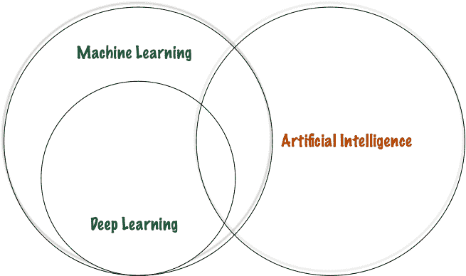

人工智能的类别(图片由作者提供)

与传统的人工智能和机器学习(ML)算法相比，DL 速度较慢，但更直接、更强大。因此，它们被用于不同的领域，从医学、科学、社会、制造、供应链、机器人等等，并且基于一种创新的模型:神经网络。如果你想知道 DL 可以追溯到什么时候，让我告诉你，它毕竟不是新的；它从 20 世纪 40 年代就存在了。让我们挖掘历史，看看这些是如何不时演变的。

## 麦卡洛克-皮茨模式

神经网络是由芝加哥大学的两位研究人员沃伦·麦卡洛和沃尔特·皮茨在 1944 年首次提出的，他们在 1952 年作为第一个认知科学系的创始成员搬到了麻省理工学院。他们的研究名为“[神经活动内在思想的逻辑演算](https://www.cs.cmu.edu/~./epxing/Class/10715/reading/McCulloch.and.Pitts.pdf)”，目的是了解大脑如何通过使用许多相互连接的细胞产生高度复杂的模式。同样的理论已经帮助他们使用电子电路模拟了一个简单的神经网络，这个神经网络是由一个真实的神经元激发的。根据学者们的说法，这篇论文被认为是人工神经网络的开端，尽管存在不同的意见和问题。

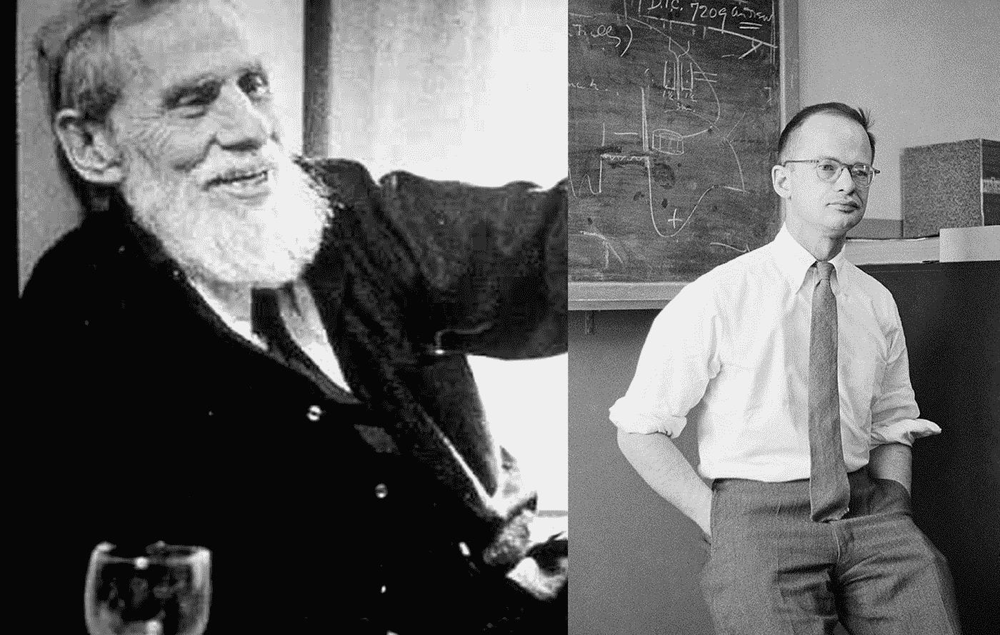

***沃伦·麦卡洛克和沃尔特·皮茨(维基共享)***

神经元的结构以它们命名为“MCP(麦卡洛克皮茨)神经元”MCP 神经元通常被称为 ***线性阈值门*** ，因为它将输入分为两个不同的类别。数学上，线性阶跃函数定义为:

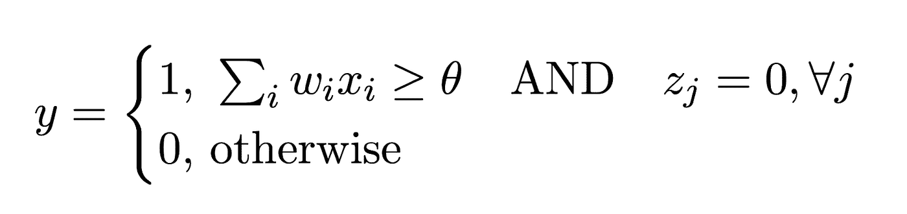

线性阈值门的数学定义(图片由作者提供)

*   ***y*** 表示输出
*   ***xi*** 代表输入信号
*   ***wi*** 代表一个神经元对应的权重
*   ***Zj*** 代表抑制输入
*   ***θ***代表阈值

该函数被设计成任何抑制性输入的活动在任何时间点都完全阻止神经元的兴奋。

下图是伊藤·川口的线性门槛门。

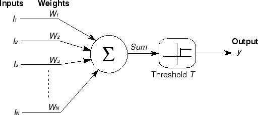

*伊藤·川口的线性门槛门的象征性插图*

## **赫布边学习法则**

1949 年，在 MCP 模型发明 6 年后，Donald O. Hebb 在他名为“**的研究中强化了神经元的概念。由于他对深度学习的重大贡献，他也被称为神经网络之父。**

**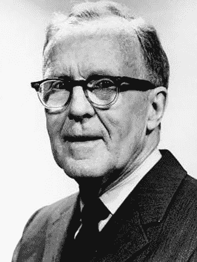**

**唐纳德·赫布(SRC: UBC 开放收藏)**

**现在让我们看看赫布边规则是关于什么的；它指出，两个单元之间的联系应该随着这两个单元同时出现的频率的增加而加强。**

**为了理解这个规则，这里有一段摘自他的书的摘录，**

***“当细胞 A 的轴突足够接近以激发细胞 B，并重复或持续地参与激发它时，在一个或两个细胞中发生一些生长过程或代谢变化，从而作为激发 B 的细胞之一的效率增加。”***

**上述陈述描述了神经元活动如何影响神经元之间的连接，即突触可塑性。它提供了一种算法来更新神经网络中神经元连接的权重。总结他的研究，以下是从希伯恩学习机制中得出的三个主要结论:**

1.  **神经网络中神经元连接之间的信息以权重的形式存储。**
2.  **权重的更新与神经元的激活值的乘积成正比。**
3.  **随着学习的进行，弱连接神经元的同时或重复激活逐渐改变强度和模式，导致更强的连接。**

## ****感知器****

**1957 年，在 MCP 模型和 Hebbian 规则成功后，心理学家 Frank Rosenblatt 提出了第一个可训练的神经网络，称为**感知器**。后来，他用感知器构造了一个电子装置，显示出根据联想主义进行学习的能力。**

**感知器的设计类似于现代神经网络，只是它只有一层，在输入层和输出层之间，用可调的权重和阈值将输入分为两种可能的输出类别。**

**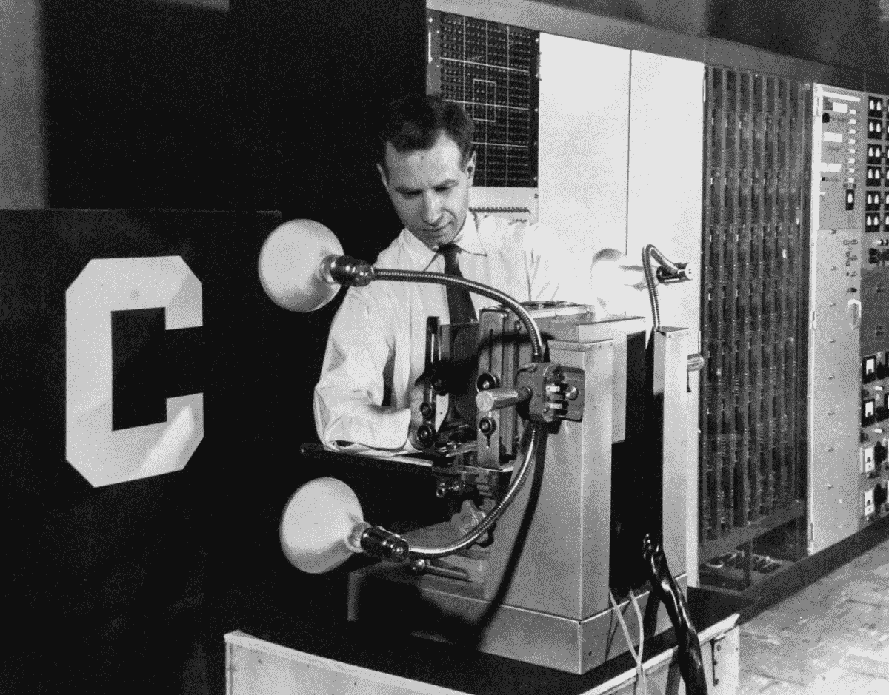**

***罗森布拉特和感知机(维基共享资源)***

**他的大部分研究主要受到人类视觉环境的启发；让我们看看如何！**

**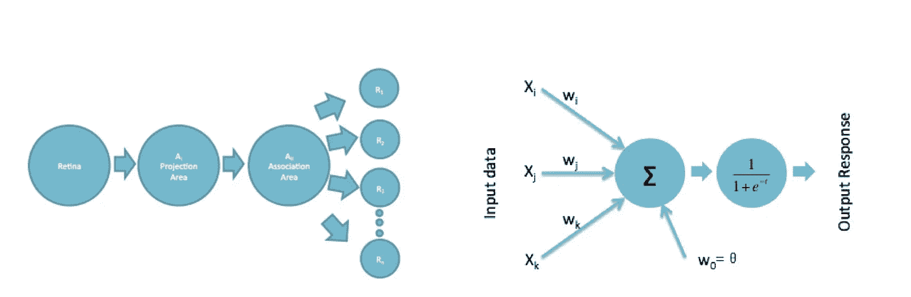**

**左:在(罗森布拉特，1958 年)中的感知器的组织图，右:现代机器学习文献中的典型感知器(Src: [关于 DL](https://arxiv.org/pdf/1702.07800.pdf) 的起源)**

**左边的图像解释了罗森布拉特感知机。它有四个单元，分别是感觉单元、投射单元、联想单元和反应单元。当输入被发送到视网膜时，信息被发送到投射区，然后投射区前进到感觉单元，然后传递到联想单元。该结构类似于现在神经网络中感知器的结构，如右图所示。**

**可以假设感知器与 MCP 模型非常相似；但是，主要区别如下:**

**在感知器中，神经元接受一个与突触权重相关的额外常数，称为偏差(b)。可以认为是对激活阈值的否定。**

*   **突触权重不局限于一或正。因此，一些输入可能具有抑制性影响，从而允许一些输入比其他输入更多地影响神经元的输出。**

**在数学上，感知器所依赖的人工神经元的非线性由下式给出:**

****

**作者图片**

**不管公式是什么，感知器(和许多其他线性分类器)的判定边界由下式给出:**

**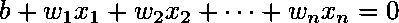**

**作者图片**

**或者，我们可以给出如下简洁的数学符号:**

**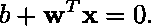**

**作者图片**

**这里有一个感知器的现代插图，解释了权重和偏见是如何与神经元联系在一起的:**

**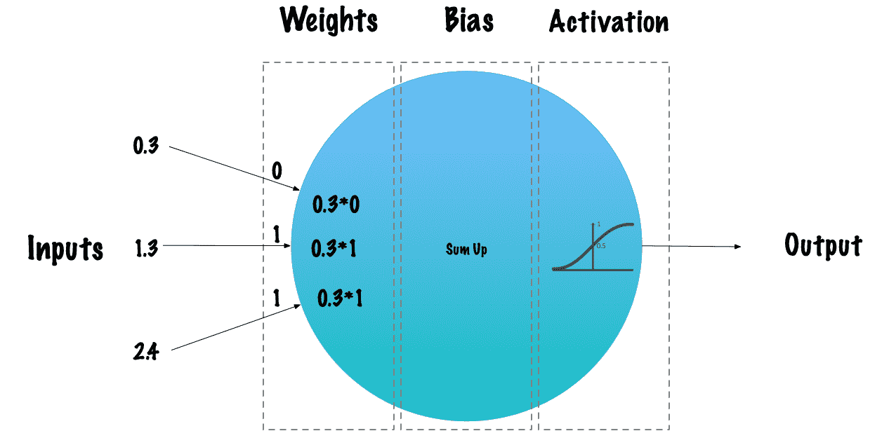**

**作者图片**

## ****反向传播****

**反向传播学习技术是深度学习领域的重大突破之一。这种算法是在 20 世纪 70 年代引入的。然而，直到 1986 年大卫·鲁梅尔哈特、杰弗里·辛顿和罗纳德·威廉姆斯发表了著名的研究论文《通过反向传播错误学习表征》，它的重要性才被充分认识。**

**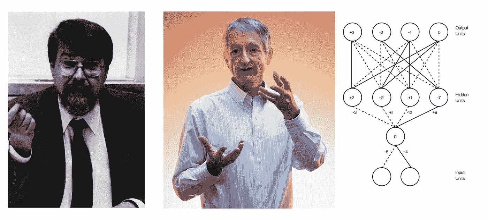**

***从左到右:大卫·鲁梅尔哈特·杰弗里·辛顿，国家队，前后传球(维基共享资源)***

**如果没有有效的神经网络反向传播技术，将深度学习网络训练到我们今天看到的深度将是不切实际的。反向传播可以被认为是现代神经网络和深度学习的基础。**

**该算法用于使用称为链规则的方法有效地训练神经网络。简而言之，在通过网络的每次正向传递之后，反向传播执行一次反向传递，同时调整模型的参数(权重和偏差)。反向传播的核心是关于网络中任何权重 w(或偏差 b)的成本函数 c 的偏导数∂C/∂w 的表达式。**

**"为什么对反向传播算法使用导数？"。**

1.  **特定输入 x 的成本函数 C 的梯度是 C 的偏导数的向量。**
2.  **利用这个成本函数的梯度，我们可以测量关于投入量变化的输出值的敏感性。换句话说，利用这个导数，我们可以理解成本函数的方向。**
3.  **总之，梯度显示了参数 w(或 b)需要改变多少(正向或负向)来最小化 c。**

**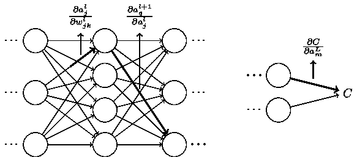**

***显示如何计算渐变的图像(*[*src*](http://neuralnetworksanddeeplearning.com/chap2.html)*)***

**到目前为止，我们已经看到了深度学习先驱们做出的一些重要贡献。下图让我们对这个领域自 20 世纪 40 年代以来的发展有了一个总体的了解。正如我们所看到的，时间表非常紧凑，在一篇博文中涵盖所有这些内容是完全不现实的。如果你仍然有兴趣详细了解这一点，我建议你阅读这篇名为“**关于深度学习的起源”**的非凡研究，作者是王和比丘拉吉。**

**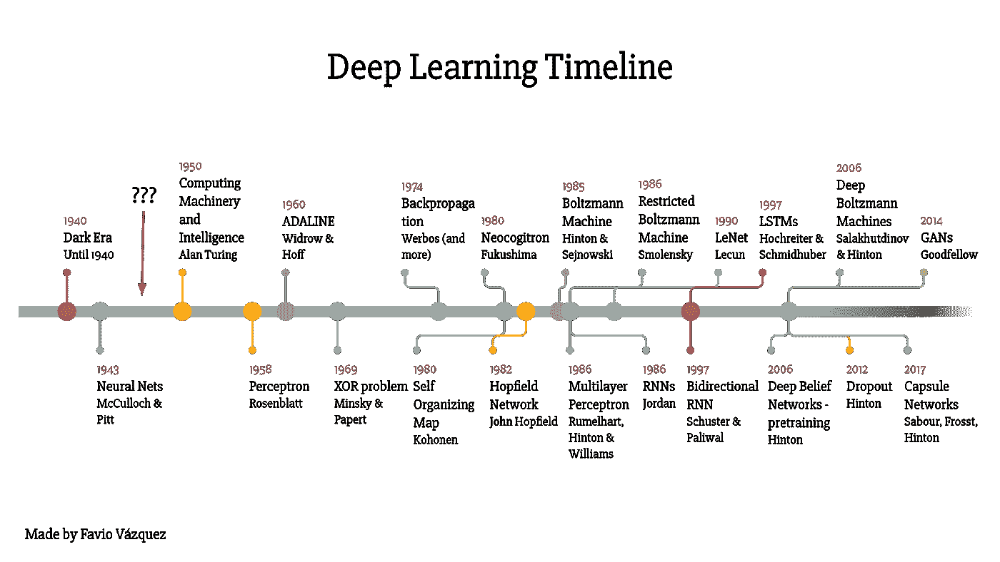**

***感谢* [*法维奥·巴斯克斯*](https://medium.com/u/e8ec6fa4d7d4?source=post_page-----37a3ec09038a--------------------------------) *这张令人敬畏的照片！***

**现在，让我们看看深度学习是如何发展到不同领域的，以及它们迄今为止各自的应用。**

# **深度学习的领域和应用**

**现在的技术进步在很久以前是无法比拟的。我们从未想象过人性化的计算机、自动驾驶汽车以及医疗程序的改进。但是今天，随着深度学习的力量，这些成为了我们日常生活的一部分。现在让我们进一步了解深度学习跨领域的应用。**

*****计算机视觉*** : CV，简而言之就是提供帮助计算机“看”和理解图像、视频等数字内容的技术。下面是 DL 在计算机视觉中的一些应用。**

*   **面部识别和鉴定**
*   **卫星和无人机图像**
*   **图像搜索优化**
*   **图像超分辨率和着色**
*   **引导自主车辆识别道路、行人、信号灯等。**

*****自然语言处理(NLP):*** NLP 有助于理解与语言相关的复杂性，可能是句法、语义、音调差异、表达，甚至是讽刺。随着计算能力的提高，深度学习现在也能够识别和理解人类语言。像 Siri，Google Voice 这样的 AI 助手主要依靠 NLP 来处理信息。下面是它的几个应用。**

*   **语音识别**
*   **命名实体识别(识别名称、位置、地址和可能移动的文本)**
*   **聊天机器人(问答)**
*   **社交媒体上的情绪和情感检测**

*****医学和生物学:*** 医学和生物学的进步，提供了海量的数据，如医学图像、基因信息、蛋白质序列等等。利用这些数据，正在开发几种基于深度学习的算法，这些算法被广泛用于生产，帮助医生、科学家和放射科医生。下面是一些通过 DL 取得突破的应用程序:**

*   **医学图像分类(CT、MRI、X 射线图像)**
*   **肿瘤分割**
*   **蛋白质折叠和药物发现**
*   **临床文本处理**

*****游戏:*** DL 彻底改变了以前的游戏方式。DL 算法现在可以通过适应玩家的情绪和心理状态来与人类对战。感谢强化学习带来了试错学习的概念。**

****

***OpenAI 模型对战人类(来源:*[*open ai*](https://openai.com/blog/openai-five/)*)***

**下面是一些广泛使用的应用程序:**

*   **玩 NPC 的(不可玩角色)-机器人**
*   **模拟复杂的相互作用**
*   **视频图形处理**
*   **游戏宇宙创造**

## **参考资料:**

*   **[解释:神经网络](https://news.mit.edu/2017/explained-neural-networks-deep-learning-0414#:~:text=Neural%20networks%20were%20first%20proposed,the%20first%20cognitive%20science%20department)**
*   **[用于反向传播的多线程软件模型](https://www.proquest.com/docview/304650983)**
*   **[感知器:大脑中信息存储和组织的概率模型](https://citeseerx.ist.psu.edu/viewdoc/download?doi=10.1.1.335.3398&rep=rep1&type=pdf)**
*   **[关于深度学习的起源](https://arxiv.org/pdf/1702.07800.pdf)**
*   **[罗森布拉特的感知机，第一个现代神经网络|作者 Jean-Christophe B. Loiseau](/rosenblatts-perceptron-the-very-first-neural-network-37a3ec09038a)**

**感谢阅读！**