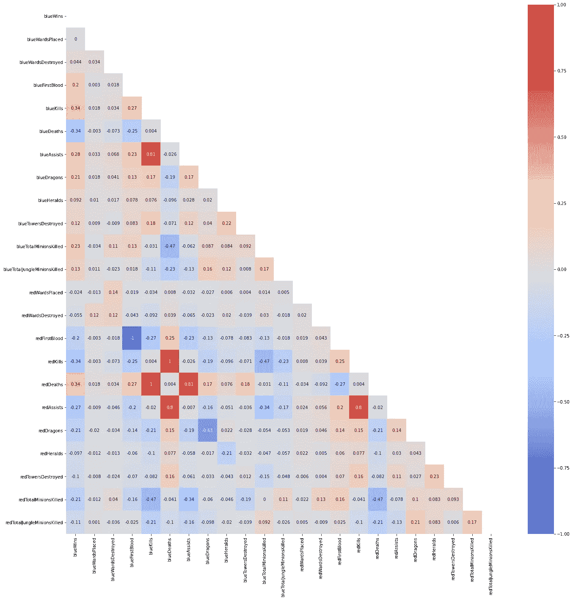
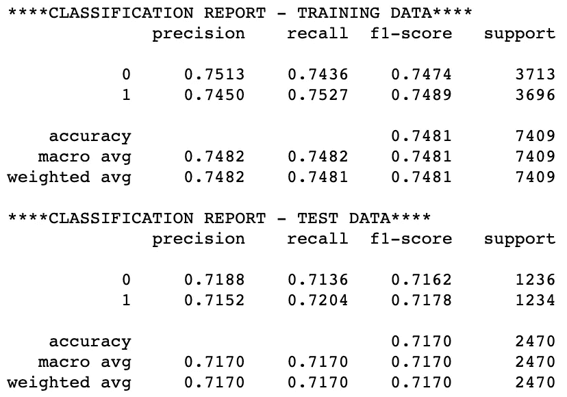
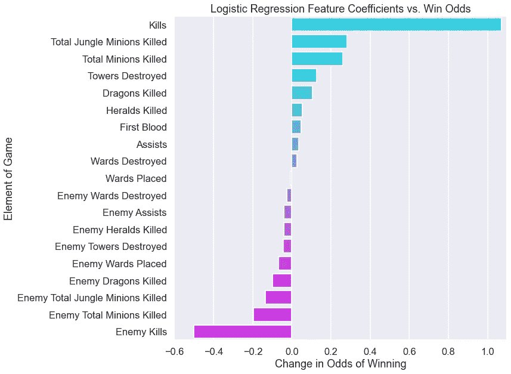
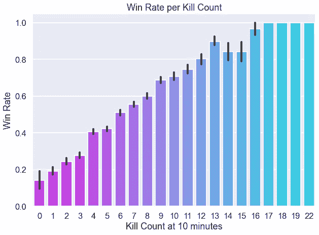
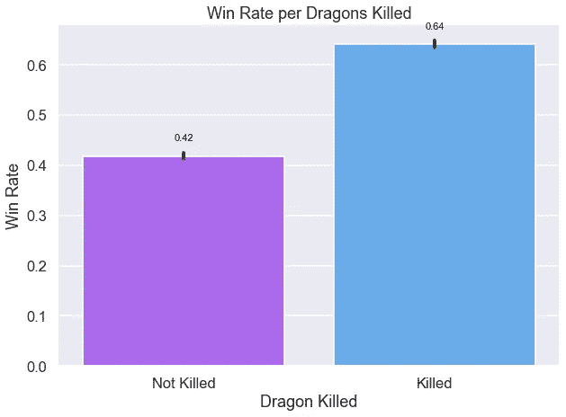

# 利用机器学习理解英雄联盟

> 原文：<https://towardsdatascience.com/the-path-to-a-victorious-league-of-legends-match-40d51a1a089e?source=collection_archive---------12----------------------->

## *特征系数和重要性分析*

照片由[艾拉唐](https://unsplash.com/@elladon?utm_source=medium&utm_medium=referral)在 [Unsplash](https://unsplash.com?utm_source=medium&utm_medium=referral) 拍摄

现在，我已经进入了数据科学训练营的第四个也是最后一个模块，我终于掌握了足够的知识，能够创建各种机器学习分类器。作为一个狂热的游戏玩家，我自然选择专注于我的第一个机器学习项目的电子竞技主题数据集。我选择的特定数据集是我在 Kaggle 上找到的一个[英雄联盟比赛结果预测分类数据集](https://www.kaggle.com/bobbyscience/league-of-legends-diamond-ranked-games-10-min)。

## 规划我的方法

用于我们分析的数据集包含 9，879 个 10 分钟标记的快照，具有冠军杀戮、小黄人、龙、传令官等特征。从高排名(钻石级到大师级)竞技英雄联盟比赛。

发现这个数据集后，我最初的目标是创建一个现场下注预测器，它可以根据任何职业比赛前 10 分钟的数据预测职业英雄联盟比赛的结果。然而，因为我们的数据集是从单人队列比赛中收集的，这不会是职业比赛如何进行的最理想的指标。

尽管如此，由于钻石以上的等级通常被认为是高水平的游戏，如果我可以创建一个具有良好预测能力的模型，就有可能提取对游戏结果最有影响的特征的洞察力，目的是为任何寻求提高他/她的表现的英雄联盟玩家提供具体的建议。虽然我认为我已经知道了游戏的哪些方面是重要的，但我从未超过银牌肯定是有原因的…我想，“至少，也许通过这种数据驱动的方法，我可以发展自己对游戏的理解，最终达到更高的等级？”

在我的建模和分析结束时，使用逻辑回归预测比赛前 10 分钟的结果，我能够达到接近 73%的准确率，而使用 XGBoost 随机森林模型预测结果的准确率不到 72%。这很好，并且表明从职业比赛中收集数据可能是值得的，以潜在地获得一些对现场下注场景有意义的预测。更重要的是，因为我能够创建一个具有良好预测能力的模型，所以有可能提取关键的洞察力，了解游戏的每个元素对比赛结果的影响程度。

在我的 [GitHub 页面](https://github.com/ds-papes/dsc-phase-3-project)上，您可以随意跟随完整的深度代码和分析。

# 分析

## 准备数据

由于数据集没有任何空值或重复值需要处理，清理过程相对容易。此外，大约 50%的观察结果是成功的，剩下的 50%是失败的。这完全消除了必须解决阶级不平衡的问题。现在，尽管在几个列中有异常值，我们将在我们的分析中保留它们，以便检查某些特征中的极端爆发如何对比赛的结果产生影响。

为了保持我们的机器学习模型的可解释性，我们将通过移除总黄金和经验等聚合特征，并仅包括玩家可以直接改进的游戏方面的个别特征，从原始特征的子集创建数据框架。

现在，让我们来看一下要素的关联热图，在使用逻辑回归模型之前，我们目前必须检查是否存在任何可能需要解决的多重共线性。

我们可以看到，尽管我们在创建此热点图之前从数据框中移除了聚合要素，但在 redFirstBlood、redKills 和 redDeaths 中仍然存在高度多重共线性。我们可以通过完全删除这些列来解决这个问题，因为直观上这些特性分别由 blueFirstBlood、blueDeaths 和 blueKills 封装。另外，请注意，我们的目标变量是 blueWins，这意味着我们关注的是通过摧毁红队的基地来影响蓝队获胜可能性的特征。

一旦我们删除这些列，我们会得到:

好多了。尽管 redAssists 和 blueAssists 确实与 blueDeaths 和 blueKills 有较高的相关性，但我们将把这些特征留在我们的数据框中，因为相关系数不是太高，而且助攻对比赛结果的影响对我们的整体分析仍然很重要。

## 建模

对于建模过程，我们通过一系列网格搜索进行迭代，以微调每个模型的超参数，同时解决可能存在的任何欠拟合或过拟合问题。现在，让我们看看逻辑回归模型的结果:

对于逻辑回归来说还不错！我们可以看到，在训练数据上，我们的宏观召回分数是 0.7215，在我们的测试数据上，我们的宏观召回分数是 0.7275，这意味着对于真正的胜利和失败，我们的模型正确预测了 72.75%。我们也不存在合身不足或合身过度的问题。

让我们将这些结果与 GridSearched XGBoost 随机森林模型的结果进行比较:

尽管我们使用了多个网格搜索来提高我们的召回分数，但我们可以看到分数的提高很小，我们在测试数据上的分数仍然略低。然而，由于我们确实有一个与我们的逻辑回归相似的分数，我们现在可以检查我们的 XGBoost 模型的特征重要性如何与我们的逻辑回归模型的特征系数相比较。

因为我们显示的单位是赔率的变化，所以我们可以将上述每个特征的标准差增加解释为 1，从而导致获胜赔率相应的百分比增加或减少。

## 解释结果

从上面的柱状图我们可以看出，我们的两个模型都将杀戮、死亡和助攻列为对比赛结果影响最大的因素。当我们创建一个杀死数与胜率的条形图时，我们可以看到 10 分钟标记的杀死数与最终胜率之间有明显的相关性。杀死的标准偏差是 3，所以我们可以将此解释为增加 3 次杀死导致胜算增加超过 100%。

在杀戮之后，我们看到这两个模型都认为龙的重要性明显高于传令官。因为龙的标准差是 0.48，所以我们可以把这理解为一次杀龙导致胜算增加 20%。

从这个条形图中，很容易看出，取决于团队是否在前 10 分钟内保护好龙，胜率有大约 22%的差异。

最后但同样重要的一点是，让我们来看看平均客户满意度的胜败对比:

任何休闲或竞技的英雄联盟玩家都应该知道，不需要像我们这里一样进行深入的数据分析，CS 是游戏中至关重要的一部分。我们的特征重要性和系数明确地将杀死小兵列为对比赛结果有很大影响的等级，但是我们的数据也显示在 10 分钟内杀死的小兵总数有大约 10 的差异。如果我们把它分成三个车道，每 10 分钟只有 3 个小黄人的差别。考虑到在比赛的前 10 分钟，每条通道总共有 107 只小黄人产卵，每条通道 3 只小黄人似乎没有太大的区别。一个被杀死的小兵的标准差接近 22 个小兵的事实进一步加强了这一概念，这意味着 CS 的增加将增加大约 25%的获胜几率。因此，我们可以看到，尽管我们的模型将 CS 列为在预测结果中具有高度重要性，但在这一特征中存在许多变化，因此很难准确地说出当我们增加一定数量的被杀死的小兵时，获胜的几率会增加多少。

# 最后

值得注意的是，这两个模型的准确率都没有超过 73%，我们所拥有的还远远不是比赛结果的完美预测。这意味着不可能肯定地得出上述发现是 100%真实的结论。

我们的发现表明，类似的分析也可以应用于从职业比赛中收集的数据，并且关于特定球队及其球员的额外信息可能会潜在地导致更好地执行预测分类器。

也就是说，我们的逻辑回归和 XGBoost 随机森林模型从这个分析中确实为任何寻求攀登排名的英雄联盟玩家提供了可操作的见解。通过使用逻辑回归模型中的特征系数，我们可以大致了解当我们增加每个特征时，获胜的几率会发生多大的变化。

虽然我被困在白银的原因可能纯粹是由于诅咒控制机制，但我相信我对游戏元素的理解的提高至少会让我更好地理解我的比赛结果。