# 完美洗牌

> 原文：<https://towardsdatascience.com/the-perfect-shuffle-aa388ad1ffd1?source=collection_archive---------16----------------------->

## [思想和理论](https://towardsdatascience.com/tagged/thoughts-and-theory)

## 调查 faro 洗牌背后的数学，同时回答以下问题:将一副牌恢复到原始顺序需要多少次完美的洗牌？

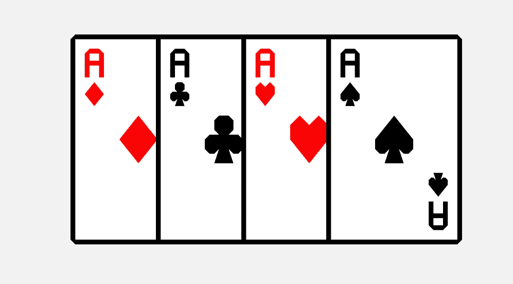

作者图片

两年前，我偶然发现了一副工匠扑克牌。看起来光滑的霓虹灯红色口音，我买了它没有太多的想法。我从来没有特别擅长处理卡片，扇动卡片或做法罗洗牌对我来说是一个有点挣扎。但那副全新的牌给了我足够的虚假信心，让我再次尝试掌握它。

进步是渐进的，但我越来越被一副简单纸牌的神秘所吸引。这是我经历了一个[*r/shower thoughts*](https://www.reddit.com/r/Showerthoughts/)*的时刻。*

> ***我要完美地洗牌多少次才能让它回到原来的顺序？***

*正如你可能预测的那样，我没有达到可以轻松地将 52 张牌完美地洗牌 8 次的水平，无法计算出需要洗牌的次数才能将它恢复到原来的顺序。最后，我写了一个简单的脚本来帮我洗牌。*

*我将这些发现绘制在线图上*(图 1)* ，立即引起我注意的是出现的模式。*

*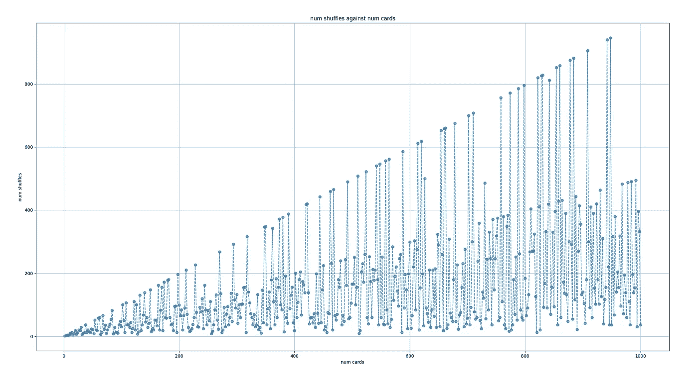*

*图 1 恢复一副牌所需的洗牌次数(图片由作者提供)*

*我无法解释为什么一副 384 张牌只需要 **14 次洗牌**，而一副 54 张牌需要 **52 次洗牌**。另一个有趣的图案是图形的“峰值”,完美地形成一条直线。事情开始变得有点复杂了…*

*我走上 [*r/math*](https://www.reddit.com/r/math/comments/azgq4z/number_of_faroshuffles_to_return_a_deck_of_cards/?utm_source=share&utm_medium=web2x&context=3) 希望找到答案。它收到了一些冗长的解释(对此我很感激),提到了*模函数*和*二进制幂。有了基本的高中数学知识，我努力理解答案背后的直觉，慢慢地就听其自然了。**

*快进到今天，当我在 [*代码*](https://adventofcode.com/2020) 降临的最后一天工作时，我在那里遇到了 [**【离散对数问题】**](https://en.wikipedia.org/wiki/Discrete_logarithm) 。**欧拉的全等函数*φ(n)***在我试图求解 DLP 的时候，出现了一个重要的概念。*

> *全宿函数*φ*(n)，也称为欧拉全宿函数，定义为与 n 互质(即不包含任何共同因子)的正整数< =n 的个数。*

*在搜索 totient 函数时，我弹出了一个解释页面，上面有一个针对正整数范围的 totient 函数的线图*(图 2)* 。一种似曾相识的感觉压倒了我，我认出了熟悉的模式。*

*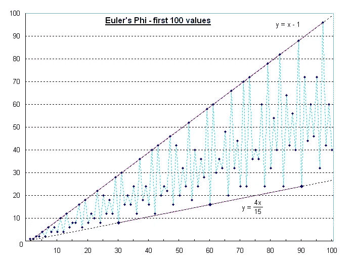*

*图 2 图片来自[维基共享](https://commons.wikimedia.org/wiki/File:EulerPhi100.PNG)*

*这个函数有点类似于恢复一副 *n* 牌所需的洗牌次数之间的关系。我的脑海里立即开始形成假设，确信完美洗牌的秘密与**离散对数**和**全能函数**有关。*

# *法罗洗牌*

*在我开始计算之前，让我们来看看“完美”/faro 洗牌意味着什么。*

*要进行法罗洗牌，你首先要把这副牌分成两等份，然后一次交织一张牌，再把它们组合起来。*

*许多人不需要太多的思考就可以表演法罗洗牌，而且做起来也相对容易(两年后，我还是和以前一样糟糕)，然而，许多人不会注意到实际上有两种不同类型的法罗洗牌。*

## *洗牌出局*

*向外洗牌会将原来的顶牌和底牌保持在原来的位置。*

*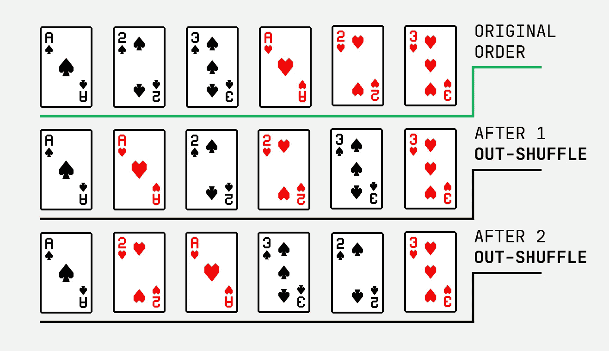*

*无序播放(图片由作者提供)*

## *混洗*

*内洗牌会将原来最上面的牌移到第二张，将原来最下面的牌移到倒数第二张。*

*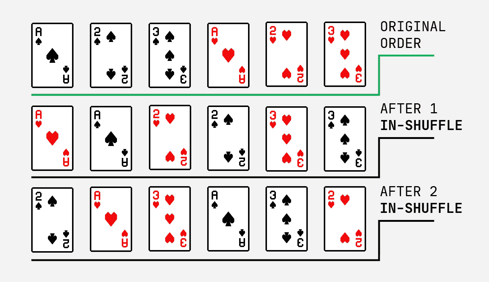*

*无序播放(图片由作者提供)*

*我猜你现在会意识到，直觉上不同类型的法罗洗牌将需要不同次数的洗牌来恢复牌组的原始顺序。*

*为了巩固这种直觉，我们必须用数学的方式来表达法罗洗牌。*

# *洗牌之后会发生什么？*

*让我们先来看看洗牌的结果，以及在一次洗牌后每张牌的位置会如何变化。*

## *洗牌出局*

*我们首先用一个**零索引编号系统**标记每张卡片的位置。该副牌中的第一张牌将位于位置 *0* ，而该牌的最后一张牌将位于位置 *N-1* ，其中 *N* 代表该副牌中的牌总数*。**

*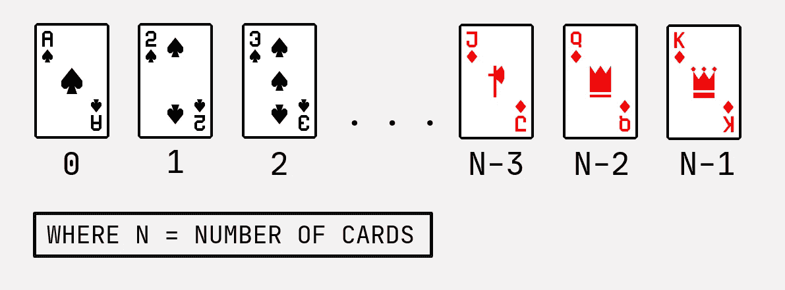*

*零索引数字系统(作者图片)*

*由于我们需要将这副牌分成 2 等份，如果我们使用 *n* 修改符号会更有用，其中 *n* 表示每个等份中的牌的数量。*

*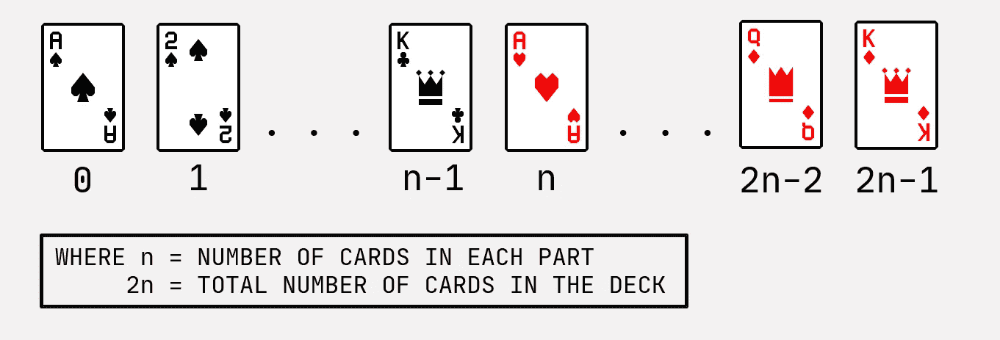*

*作者图片*

*位置`0, 1,..., n-2, n-1`属于前半部分，第一张牌的位置值为 *0* ，最后一张牌的位置值为 *n-1* 。类似地，位置`n, n+1,..., 2n-1, 2n-1`属于后半部分，其第一张牌的位置值为 *n* ，而其最后一张牌的位置值为 *2n-1。**

***这种修改后的符号允许我们将牌分成两个不同的部分，为我们在模拟洗牌时提供了更自然的表达。***

*由于该副牌的顶牌和底牌的位置不变，在一次洗牌后，只有该副牌的内侧部分的位置会改变。*

*我们可以这样想象一次洗牌后每张牌的最终位置:*

*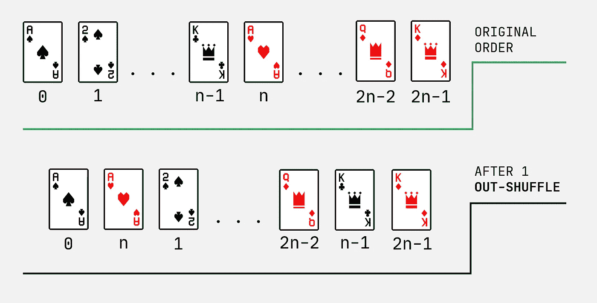*

*作者图片*

*现在牌已经交织在一起了，对于每一次洗牌，我们可以用这个模式来决定每张牌的位置(稍后会有更多的介绍)。*

## *混洗*

*按照相同的零索引编号系统，我们可以像对出洗牌一样表达一副牌的入洗牌的结果。*

*在一次洗牌后，所有的牌都将经历一次位置的改变，这与洗牌不同。*

*in-shuffle 的结果可以表示如下:*

*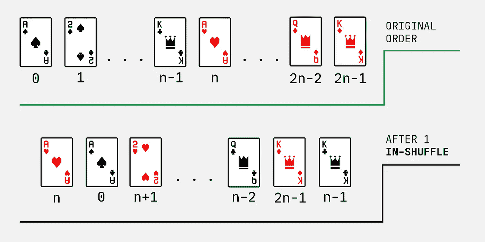*

*作者图片*

*原来最上面的牌变成从上面数的第二张牌，原来最下面的牌变成从下面数的第二张牌。*

# *我们能把这浓缩成一个优雅的方程式吗？*

*洗牌有一个明确的模式，毕竟，直觉告诉我们，它只是把一半的一张牌放在另一半的一张牌上面。*

*两种洗牌方式的交织运动肯定可以浓缩成一个优雅的方程式。*

## *洗牌出局*

*为了简单起见，让我们用一副 6 张牌来形象化地表示出洗牌。*

*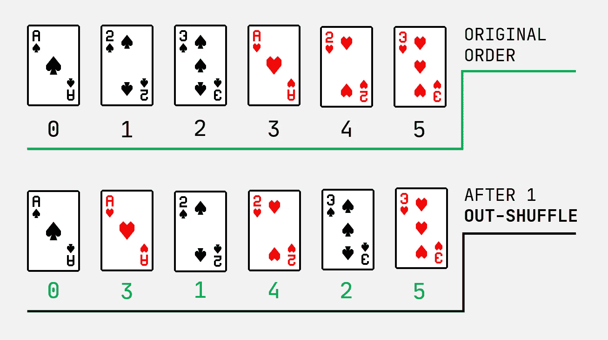*

*作者图片*

*经过一次洗牌后，**位置的原牌 *1* 移动到位置*2*T5，而**位置的原牌 *2* 移动到位置 *4*** 。如果你马上注意到这个模式，那么说也许在一次洗牌后，位置随着一个函数*2×原始位置而改变是不会错的。*然而，当你检查其他卡片时，你意识到它并不适用于所有的卡片，尤其是后半部分的卡片。***

*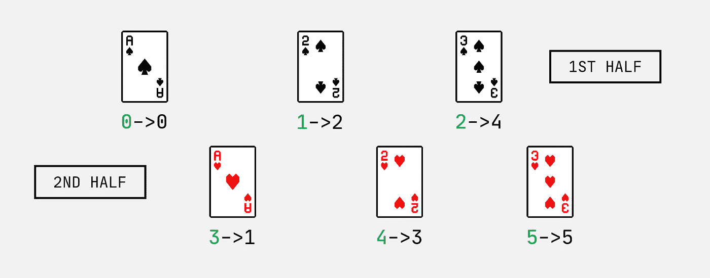*

*作者图片*

***函数*2×原始位置*在前半段运行良好的原因是，结果直接等于出洗牌后前半段中单张牌之前的牌数。***

*事实上，我们可以认为后半部分的卡片也是如此，只是不太明显。一次洗牌的交织运动对牌的两半都是一样的，因此，如果*2×原始位置*的函数足以确定前半部分牌的最终位置，也许我们正好处于一个一般等式的顶点。*

*同样的交织运动发生在卡片的后半部分，但是函数*2×原始位置*给了我们一个超过最大位置的最终位置。如果我们只是把它“包”起来会怎么样？*

*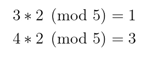*

***通过应用模运算符，我们将函数*2×原始位置*的结果“包装”起来，这样我们就能够在后半部分得出纸牌的正确位置。***

*将额外的模运算符添加到函数*2×原始位置*中，得到了我们一直在寻找的通用(并且相当优雅)方程。*

*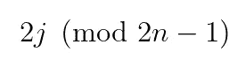*

*其中 j 是卡片的原始位置*

## *混洗*

*我们也可以采用同样的 6 张牌实验来形象化洗牌。*

*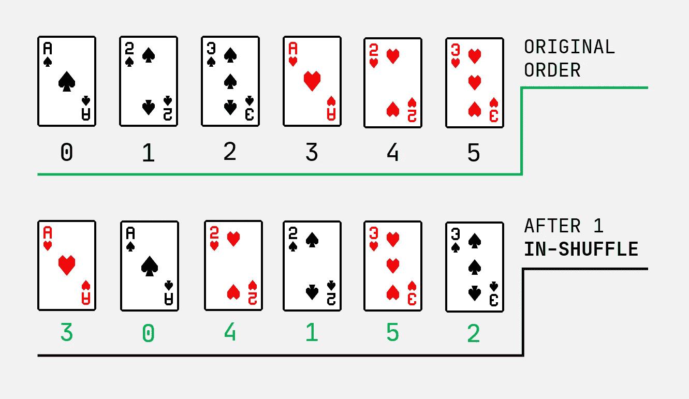*

*作者图片*

*在一次洗牌后，我们看到顶牌和底牌的位置发生了变化。**位置 *0* 的原卡移动到*1*位置，而**位置 *1* 的原卡已经移动到*3*位置。*****

*在这一点上，你意识到我们刚刚发现的等式显然不适用于 in-shuffle。**但是如果我们简单地在它后面加一个 *+1* 会怎么样呢？***

*你又兴奋了，所以你开始在卡片的后半部分测试它…*

*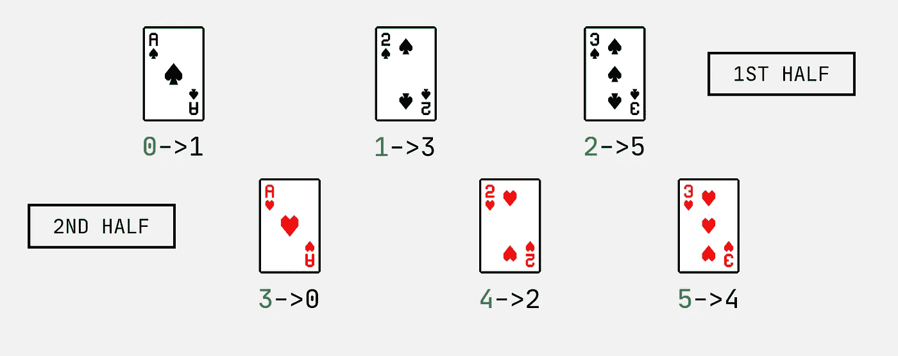*

*作者图片*

*失望之余，你意识到`2j mod (2n-1) + 1`对卡的后半部分不会一概而论。但是如此坚定之后，你发现`2j-1 mod (2n-1)`在后半段有效。用一个条件函数来表示单一的混洗操作开始变得混乱了。*

***出洗牌的交织动作和入洗牌的交织动作之间的唯一区别是一半的牌“走在”另一半的上面。在外洗牌中，牌的前半部分放在后半部分的上面，反之亦然。***

*直觉上，内洗牌和外洗牌的一般等式应该没有太大区别。*

*我们知道，在外洗牌中，等式`2j mod (2n-1)`将给出洗牌后某张牌之前的牌数。它也方便地等于卡片的最终位置。**这部分是因为零索引编号系统的良好特性。***

*按照同样的思路，我们需要一个包含这些属性的等式来进行混洗。**零基索引系统效果不佳，但一基索引系统呢？***

*使用基于一的索引系统:*

*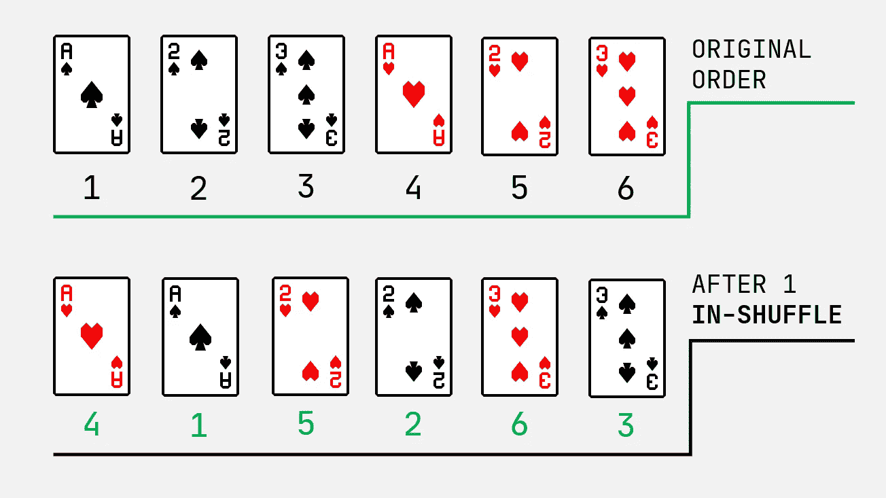*

*作者图片*

*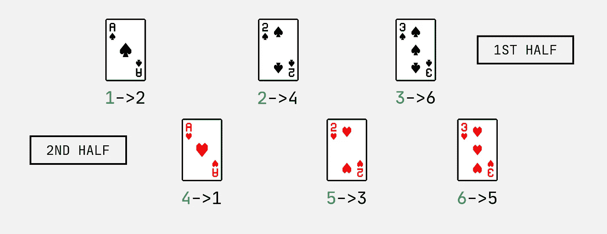*

*作者图片*

*仅仅改变索引系统还不够。我们需要重新考虑如何修改我们的“包装”逻辑/模操作数。*

*因为我们使用的是以 1 为基础的索引系统，所以我们的通用等式不应该产生零值。做一个简单的测试，如果我们将我们的模操作数指定为 *6* ，如果我们使用等式`2j mod (2n)`其中 *2n* 是最后一张牌的位置，那么位置 *4* 处的原始牌将具有最终值 *0* 。*

*因此，为了维护基于 1 的索引，我们的模操作数应该改为 ***2n+1*** 。*

*把所有的东西拼凑在一起，我们现在得到了一个通用的(同样优雅的)内混洗方程。*

*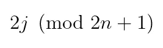*

*其中 j 是一张卡从 1 开始的原始位置*

# *多次洗牌*

*现在我们有了表示内洗牌和外洗牌的等式，让我们找出在 *n* 洗牌后一张特定的牌将被放置在哪里。*

*本质上，这是我们正在解决的一个简单的递归问题。*

*编写一个简单的 python 脚本来运行这个递归将是一个简单的任务(简单地增加 large *n* 的堆栈大小)，然而，通常理解正确的数学概念而不是强力递归会给我们带来无与伦比的性能提升。*

## *模运算*

*当我们手动写出递归时，我们可以感觉到我们的脚本将会做什么*

*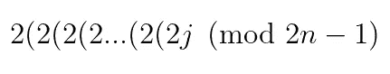*

*其中 j 是卡片的起始位置*

*前一个操作的结果将被输入到下一个操作中，重复这个循环，直到该副牌已经完成 *n* 次洗牌。执行时间肯定不会很长，但是让我们试着简化一下，给它一点提升。*

*让我们把范围缩小到仅仅是 ***2* 出洗牌**:*

*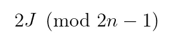*

*其中 J 是一次洗牌后牌的位置*

*通过应用模运算 的 [**模乘性质** **，我们可以将上面的等式展开为下面的形式。**](https://brilliant.org/wiki/modular-arithmetic/#:~:text=Properties%20of%20multiplication%20in%20modular,(modN).)*

*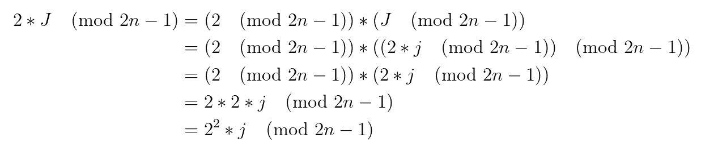*

*通过对 k*混洗进行求解，我们将得到一个具有非常方便的性质的方程。**

*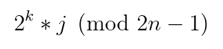*

*在 k **洗出**后，获得原始位置为 *j* 的牌的最终位置的功能*

*我们刚刚击败了递归！*

*上面的例子利用了外混洗，但是由于内混洗只是在模操作数方面有所不同，我们可以用同样的方式简化它的等式。*

*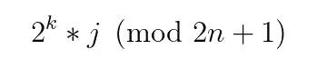*

*在 k **之后得到原始位置为 j 的牌的最终位置的功能-洗牌***

# *回到原来的问题…*

*既然我们已经对 faro-shuffle 进行了相当多的分析，让我们将注意力转移回我们要解决的问题上。*

> *将一副牌洗回原来的顺序需要多少次法罗洗牌？*

*我们探索了用数学方法表达两种不同类型的 faro 洗牌的方法，并查看了帮助我们计算出在 *n* 次洗牌后一张牌会在什么位置的等式。到目前为止，我们已经从一个单独的卡片层面看了这个问题，下一步是把它推广到整个卡片组。*

*当每张牌都回到原来的位置时，一副牌就回到原来的顺序。*

*将这种直觉转化为数学术语，我们得到以下结果:*

*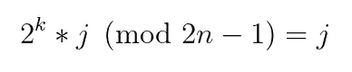*

*将一副牌恢复到原始顺序所需的洗牌次数(用 k 表示)*

*通过进一步应用模算术的相同模乘特性，我们看到了一个**离散对数问题*的最初迹象。****

*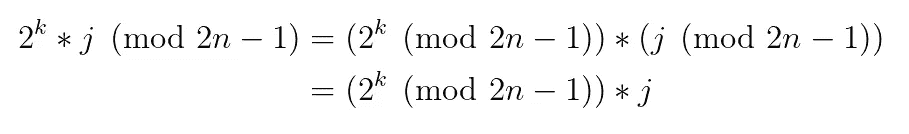*

***我们看到，我们现在能够独立于牌的原始位置来处理洗牌操作。**更棒的是，洗牌操作模型经过了**离散对数问题**。*

*我们终于找到了！*

*只关注洗牌操作将给出一个略显简洁的方程来求解:*

*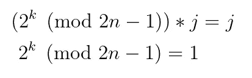*

*现在，这个等式似乎很难解决，暴力似乎是唯一可行的方法。我不想做那些试错的工作，所以我心中的愤世嫉俗者决定不洗牌。*

***当 *k = 1* 时，我们不用做任何繁琐的工作就能完美地满足方程。***

*毕竟，即使是人工智能算法有时也认为这是赢得游戏的最佳方式。虽然从技术上来说，这是一个完全可以接受且符合逻辑的答案，但它对这个问题没有任何价值。*

*这假设我们可能需要设置一个重要的约束， **k 必须至少为 1。***

# *求解 DLP*

*我们可以进一步简化方程，将其推广为一般的离散对数问题。简单回顾一下，*2n-1*&*2n+1*的模操作数与我们选择的索引系统非常接近，分别用于模拟出混和入混。然而，当试图将手头的问题简化为一般的 DLP 时，形式*2n-1*&*2n+1*没有数学上的重要性。我们可以简单地用一个**正整数 X** 来表示它们。*

*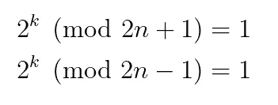**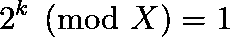*

*其中 X 可以代表 2n+1 或 2n-1*

*有很多方法可以解决 DLP，无论是使用蛮力还是[小步快走(BSGS)算法](https://en.wikipedia.org/wiki/Baby-step_giant-step)。你也可以通过实现[poh lig–Hellman 算法](https://en.wikipedia.org/wiki/Pohlig%E2%80%93Hellman_algorithm)来加快速度。*

*我不会详细讨论 DLP 或解决它的各种方法，因为它本身值得另一篇文章来讨论。但是为了完整起见，我包含了一个用 python 写的 BSGS 的简单实现，我用它来求解这个方程。*

# *回到图表*

**

*作者图片*

*这个线图是通过手动模拟洗牌操作生成的。在将 faro 洗牌浓缩成一个“简单的”DLP 之后，我们现在可以验证我们的新方法是否对应并且工作良好。*

*我将解决 DLP(橙色线)的结果叠加在手动模拟(蓝色色调)的结果之上。*

*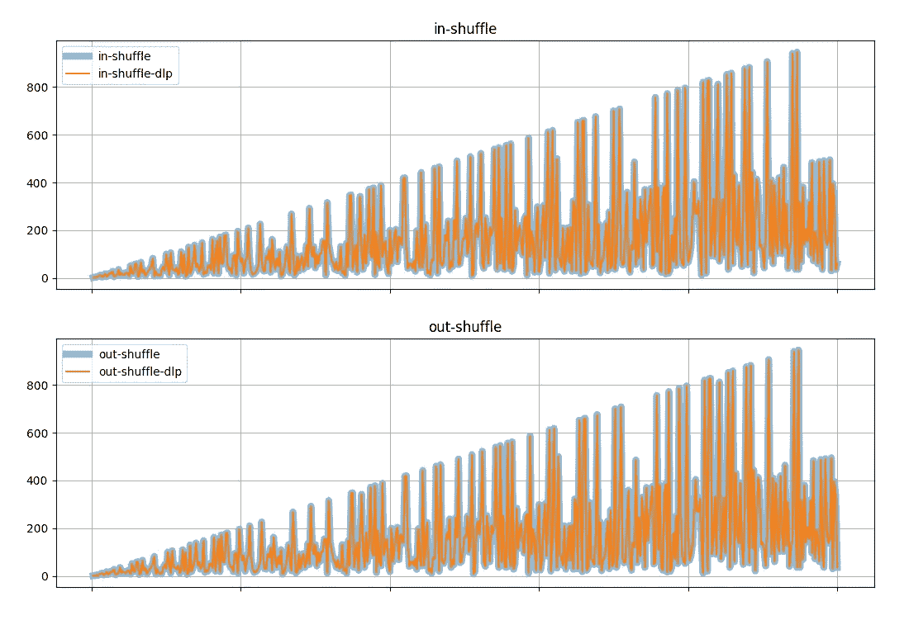*

*作者图片*

*我们可以看到它排列得非常完美，并且它充当了我们已经成功地将该问题建模为离散对数问题的视觉和定量证明。*

*你可能已经意识到的另一件事是，从观察绘制的图表来看，进出洗牌所需的洗牌次数似乎是相同的。这可能有点违背我们的直觉，因为它们实际上仍然是不同种类的洗牌。*

*当我们比较这两个线图时，我们发现实际上有一个很小的有趣的区别。*

*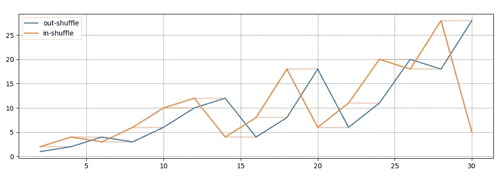*

*作者图片*

*红线标记了需要相同次数洗牌才能将一副牌恢复到原来位置的点。有趣的是，所需的内洗次数的线图似乎“落后于”外洗次数的线图。仔细观察，我们可以看到 *N 张*牌所需的**外洗牌次数与 *N-2 张*牌所需的内洗牌次数相同，**有效地使内洗牌比外洗牌落后“一步”。*

*关键的直觉来自我们之前检查过的一个重要细节。*出洗牌并不影响该副牌的顶牌和底牌，它只是改变它们之间的位置，而不是所有的牌在入洗牌中改变它们的位置。**

***但是在洗牌过程中，顶牌和底牌中间的牌是如何被洗牌的呢？***

*回到我们使用的 6 张牌的例子，让我们进一步分解出洗牌。*

*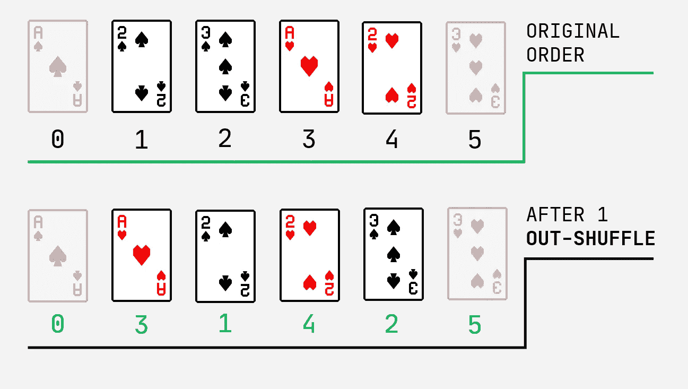*

*作者图片*

*忽略顶部和底部没有改变位置的卡片，我们看到中间部分以一种奇怪的熟悉的方式洗牌。*

*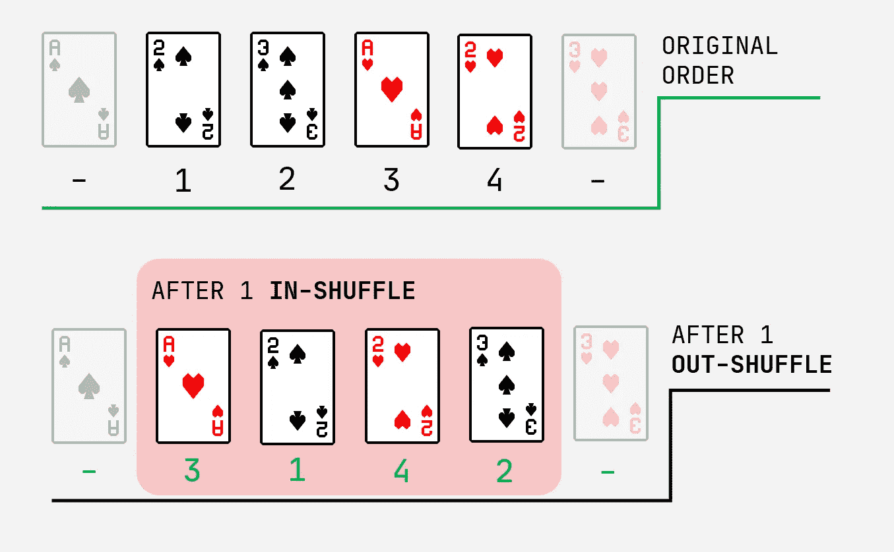*

*作者图片*

*分离出牌的中间部分，我们意识到在洗牌后，它的所有位置都会改变。这类似于内洗牌，当我们仔细观察它的位置如何变化时，它与内洗牌相同**。***

> ***每次出牌本质上都是在顶牌和底牌之间的一次入牌。***

*我想说出洗牌基本上是由入洗牌组成的，只是在末尾增加了两张在这个过程中不会被洗牌的额外的牌，这样说不会不恰当。*

# ***但是等等……那些山峰呢？***

**

*作者图片*

*在我展示的图表中，一个引人注目的细节是当我们洗牌到一定数量的牌时会出现“峰值”。“峰”和“谷”是为什么一副 54 张牌需要 **52 次洗牌**才能恢复其顺序，而一副 384 张牌只需要 **14 次洗牌**的原因。至少可以说，这是不直观的，但是也许研究一下**欧拉的全能函数*φ(n)***可以给我们一个起点。*

*当我们画出这个函数时，我们看到了相同的“峰值”模式。另一个要注意的有趣的点是“峰值”形成一条直线。*

**

*图片来自[维基共享](https://commons.wikimedia.org/wiki/File:EulerPhi100.PNG)*

**to entint 函数给出了给定整数 n 之前的正整数的数目，这些正整数是***到 n 的互质数*【峰值】对应的质数为***【φ(n)= n-1****。*因此，直线遵循一条 *y = x -1* 线的形状。**

**也许这和我们的洗牌问题有关。**

**我们知道我们可以把洗牌问题浓缩成一个 DLP，事实上，一个非常特殊的 DLP。**

**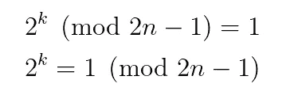**

**碰巧的是 [**欧拉定理**](https://en.wikipedia.org/wiki/Euler%27s_theorem) 有着相对相似的形式，并且给了我们一个更好的概念，即全能函数如何与我们的洗牌问题相联系。**

**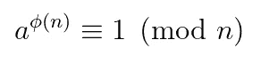**

**欧拉定理**

**让我们来看看为什么一副 54 张牌需要 52 次洗牌。**

**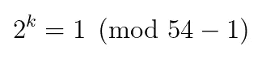**

**很明显，当我们输入数字时，我们的模就变成了一个质数。根据欧拉定理，指数是模的渐近函数的结果。**由于 53 是质数，所以会有*53–1*个正整数与其互质，导致指数为 52。****

**这也扩展到内混洗，只要模是质数并且符合欧拉定理，我们得到一个指数，它对应于所需的混洗次数，即*模 1。***

****作为一个总的结论，因此“峰值”是在一副牌中的牌的数量产生一个素数模的点上，无论是在洗牌中还是在洗牌中。****

**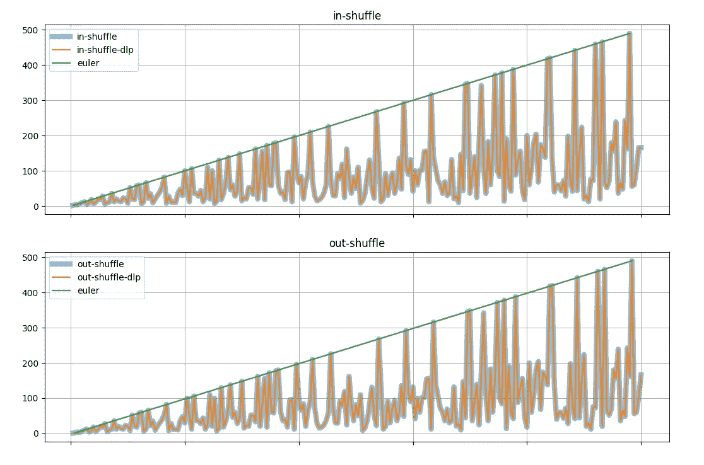**

**作者图片**

> **我们现在已经破解了完美洗牌的内部运作**

**这是我写第一篇文章的一次有趣尝试，它确实有助于巩固我对手头主题的理解。你也会很高兴地知道，红色的霓虹灯牌现在在我的桌子上占据了一个永久的位置，既是一个坐立不安的玩具，也是花一些时间深入挖掘简单事物的灵感来源。**