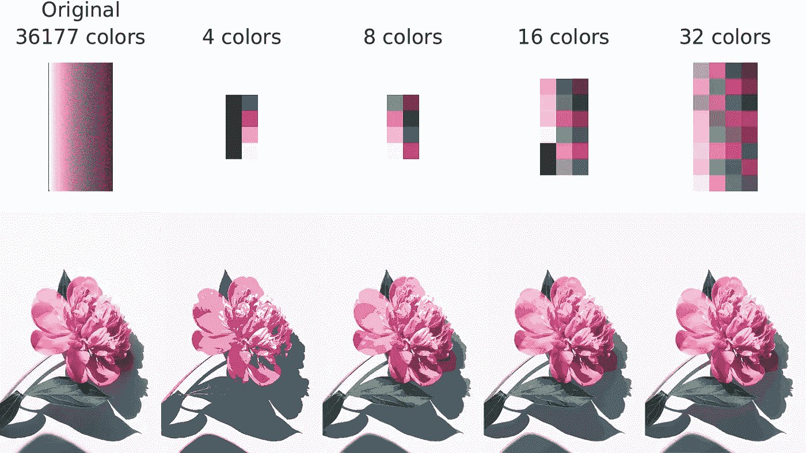
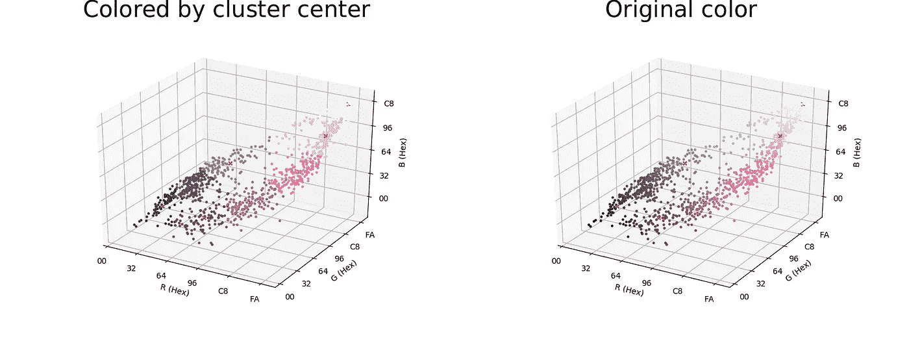
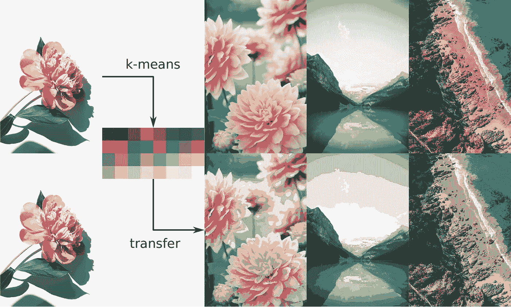
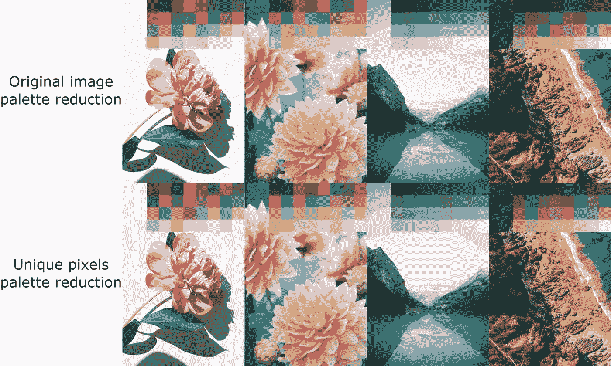
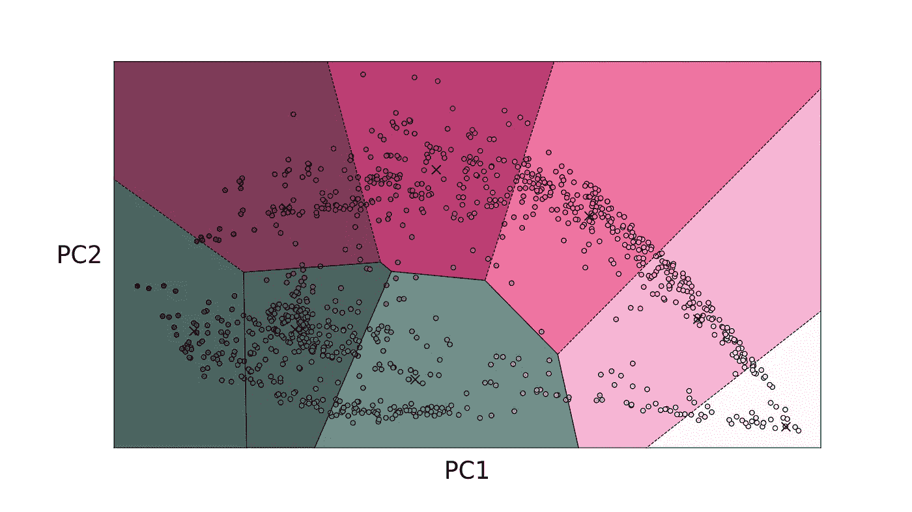
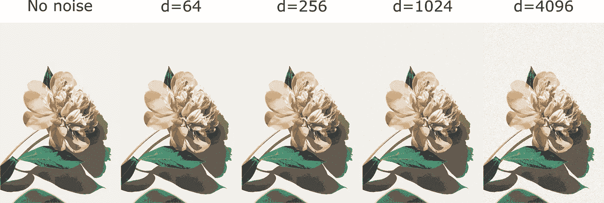
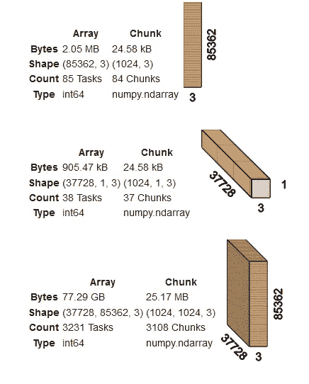
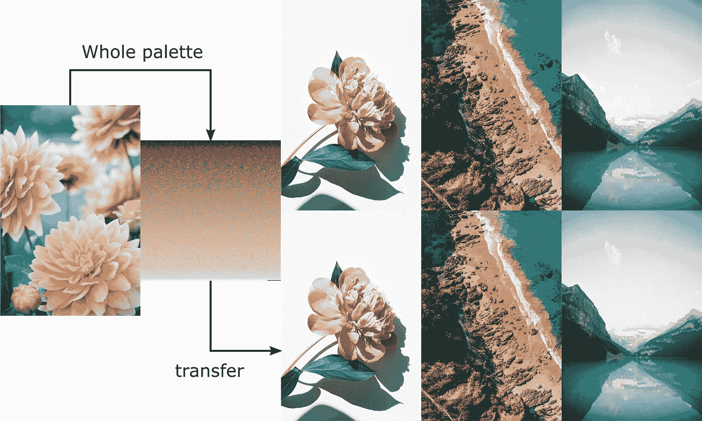
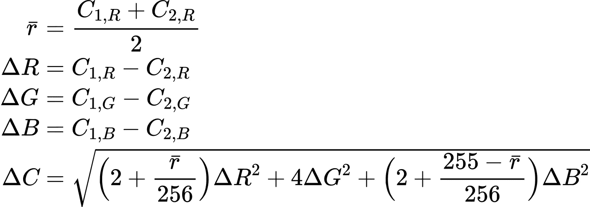
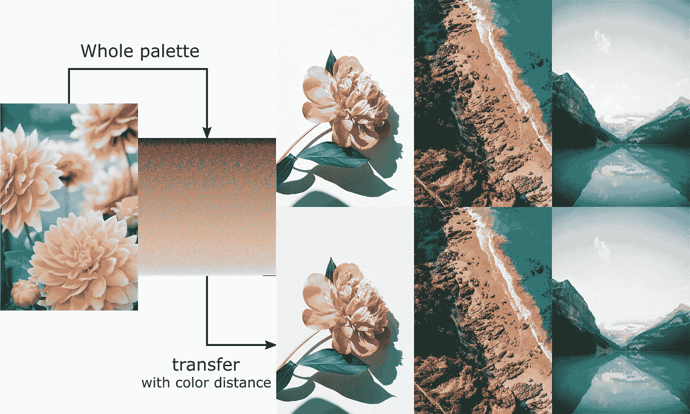

# 调色板转移的危险

> 原文：<https://towardsdatascience.com/the-perils-of-palette-transfer-f2739b5e4d2c?source=collection_archive---------42----------------------->

## [实践教程](https://towardsdatascience.com/tagged/hands-on-tutorials)

## 探索 Python 中算法重新着色的深度


[斯蒂夫·约翰森](https://unsplash.com/@steve_j?utm_source=medium&utm_medium=referral)在 [Unsplash](https://unsplash.com?utm_source=medium&utm_medium=referral) 上拍照

几个周末前，我想重温一下我的聚类技术。我记得——在大学的图像处理课上——你可以将图像中独特颜色的数量减少到几个颜色，同时保留重要的颜色。这是通过对图像中像素的 RGB 值进行 k 均值聚类来实现的。简化调色板中需要的颜色数量是 k 均值聚类中的 k 值；换句话说，就是你的图像在 RGB 空间中的聚类中心的数量。

在视频游戏图形的旧时代，如果需要在内存有限的设备上渲染图像，这一点尤其有用。通过减少调色板，可以符合 [PAL 或 SECAM 等有限的调色板。](https://en.wikipedia.org/wiki/List_of_video_game_console_palettes)由于整个调色板只分配了 8 位或 16 位(对比现在普遍存在的 24 位 RGB)。今天的使用？嗯，如果你特别怀念低位图形的艺术性，或者构建一些在 LED 矩阵上显示的东西，这可能是一个用例。

在玩的时候，我漫不经心地想:“如果我们把一个图像的简化调色板转移到另一个图像上，会怎么样？”这是一个看似无关紧要的问题，扩展了我对颜色和并行处理工具箱的知识。在本文中，我将解释如何完成**调色板转移**这一人工任务，以及如何更进一步。准备使用`numpy`、`scikit-learn`和`dask`的工具。在一个[准备好的 Colab 笔记本](https://colab.research.google.com/drive/1v8GqrfL-1KKYj39F5Sd_a_nRPUtuYuMI?usp=sharing)上寻找代码，它包含了本文中解释的所有内容。

# 基于 k 均值聚类的调色板简化

因此，在做任何事情之前，让我们先确定一些定义。我所说的**调色板**指的是图像中的一组 RGB 像素值。对于一幅小的摄影图像来说，这个数字通常是数万。**调色板减少**是图像的原始调色板的子集的算法选择，并将原始调色板中的所有像素值映射到减少的调色板中最接近的值。

代码相对简单:对图像的所有像素运行 k-means 聚类，得到的聚类中心就是你简化的调色板。我们必须小心，因为聚类中心不是`np.uint8`类型，而是`np.float64`类型。当我们调用`kmn.predict(src)`时，输出值都是浮点数。对此的简单解决方案是将这些值四舍五入为最接近的整数，并在显示之前将其转换为`np.uint8`类型。下面是一个简化的调色板类的样子:

这个类的定义非常简单:它包含简化调色板中的颜色数量和一个`sklearn.clustering.KMeans`实例。首先，我们有一个预处理函数，确保图像为`KMeans`操作整形(双关语)。整形将三维矩阵*W*×*H*×*C*改造成二维矩阵 *WH* × *C* ，其中 *W* 是图像的宽度， *H* 是图像的高度， *C* 是三个 RGB 颜色通道。然后，`KMeansReducedPalette.fit()`函数作为`KMeans.fit()`函数的包装器，在 RGB 空间中创建聚类中心。最后，`recolor()`函数将图像的原始调色板转换为适合图像的缩小调色板。让我们看一些调色板减少的例子:



一朵花的不同层次的调色板减少。 [Olia Gozha](https://unsplash.com/@olia?utm_source=medium&utm_medium=referral) 在 [Unsplash](https://unsplash.com?utm_source=medium&utm_medium=referral) 上的原始照片

很漂亮，对吧？即使减少了调色板，图像仍然有很多魅力。我得说，这很能说明摄影师的水平。可视化这些集群的一种方法是将它们散点图出来。我们这里的数据是三维图像的唯一 RGB 值:每个颜色通道一个维度。这非常适合 3D 散点图:



Gozha 的花在 RGB 空间中的 1000 种随机颜色的散点图，其中 8 个质心标有红色十字

在 8 种颜色中，有相对松散的聚类，但是将质心着色的聚类与原始颜色进行比较，我认为这些聚类非常好。虽然有一些浅绿色被染成灰绿色，但是颜色不会相差太远。点越多，聚类就越能代表突出的颜色。

# 减少调色板转移

现在，让我们解决第二个问题:将一个图像的简化调色板转移到另一个图像中。事实证明，这相对容易，除了将目标图像传递到调色板`recolor()`函数中，我们不需要任何进一步的编程。让我们来看看一些转移:



将 Gozha 的花的简化调色板转移到其他图像上。从左至右，原图由[MIO·伊藤](https://unsplash.com/@mioitophotography?utm_source=medium&utm_medium=referral)、[丹尼尔·罗](https://unsplash.com/@danielroe?utm_source=medium&utm_medium=referral)、[卡莱斯·拉巴达](https://unsplash.com/@carlesrgm?utm_source=medium&utm_medium=referral)在 [Unsplash](https://unsplash.com?utm_source=medium&utm_medium=referral) 上

这里所发生的是，新图像中每个像素的距离是针对缩减的调色板(即聚类中心)来测量的。然后，传输像素的 RGB 值与调色板中最近的聚类中心进行交换。这就是为什么在源图像没有很多颜色，或者减少的调色板太小的情况下，我们会在整个图像中获得一些卡通般的效果。这是因为传输图像中的颜色没有得到足够好的颜色来交换，而是采用最近的聚类中心，尽管它距离传输像素值非常远。

# 调色板转移实验

在继续之前，让我们对此进行一点试验。我们基于图像中的所有像素进行聚类，但实际上，并非所有像素都是唯一的。在图像的特定区域周围，可能有数十或数百个相同的像素 RGB 值(特别是对于静态背景、天空等)。自然地，这将使图像中更丰富的颜色周围的聚类中心倾斜；这些颜色会立即出现在原始图像中，使它们在视觉上突出。有趣的是，让我们只对图像中的独特像素(而不是所有像素)进行聚类，并给它们平等的机会。我们将创建一个新的类来实现这一点:

新类继承了`KMeansReducedPalette`类，这使得事情变得更加简单:我们添加到`KMeansReducedPalette`的任何进一步的功能都将包含在`UniqueKMeansReducedPalette`类中。`fit()`函数被覆盖，以使调色板适合图像中的一组唯一像素。这并没有给整体计算增加太多，因为 k-means 聚类花费了 *O* (nk)时间，这比寻找唯一像素更昂贵，对于具有 n 个像素的图像，寻找唯一像素仅花费 *O* (n)。让我们比较一下结果:



不同图像上整体图像调色板缩小和独特像素调色板缩小的比较

从远处看，有非常小的差异:在简化的调色板中似乎有大约相同的颜色分布，这可以归因于 k-means 聚类算法的初始条件。

在我看来，颜色的质量有细微的差别。与更加柔和的独特像素的聚类相比，在整个图像上的聚类导致略微更加饱和的减少的调色板。与底部的行相比，顶部的行有更微妙的对比。我将此归因于独特颜色空间中的聚类结果:本质上是对某个轨迹周围的像素值进行平均，而不对更普遍的颜色进行加权。

我们可以对颜色度量进行数值分析来验证这一点(我已经这样做了，没完没了地做了)，但这将偏离本文的初衷太远，因为本文只是对调色板转换进行实验，所以我将把这作为一个练习留给你们当中有勇气的人。下面是我通读的一些资源:[色觉](http://www.huevaluechroma.com/082.php)，[色度计算](http://www.huevaluechroma.com/082.php)。

# 多彩的随机漫步

让我们再来看看 k-means 聚类的结果。在聚类之后，为我们提供了 k 个聚类中心，这些聚类中心确定了它周围的其他像素的标签。如果一个点与所有其他质心相比靠近一个质心，则该点被分组到该质心中。本质上，这在数据空间中创建了 k 个分区；其边界可以使用 Voronoi 图可视化。在前面的散点图中，我们可以部分看到 3D 空间中分区的边界。由于绘制 3D Voronoi 图是困难的，让我们转向主成分分析，减少空间到 2D 和绘制 Voronoi 镶嵌。



基于 PCA 分解的 2D 果扎花 8 簇 RGB 像素 Voronoi 镶嵌

从图中可以清楚地看出，分区是 2D 几何多边形。在原始的 3D 空间中，这些分区将是 3D 多面体。此外，PCA 对一些点“撒谎”，尤其是在边界处，因为这些点已经被向下投影到较低的维度(因此丢失了信息)。*尽量不要仔细查看 2D 芙诺以图*。

知道了边界，我们可以在分区内随机选择 RGB 值作为新图像的重新着色，而不是仅仅依赖质心的 RGB 值。这给了我们更多的改变图像颜色的方法。因为我们已经有了质心，我们可以从那里开始，一小步一小步地达到随机的 RGB 值。这个过程被称为**随机行走**。

## 随机漫步变体 1:到处漫步

让我们来理解随机游走的一种变化，它在任何 RGB 方向上移动 1 个强度单位。这种随机漫步有可能探索全部 16，777，216 种颜色(如果你走足够多的步)。让我们把这个编码起来:

从 k-means 形心开始的无处不在的随机游走重新着色

`random_walk_recolor()`函数获取一幅图像和离开聚类中心的最大步数。首先，我们对像素重新着色，就像我们在`recolor()`函数中所做的那样，它被存储为起始点(`start`)。然后，我们初始化一个差异数组(`diff`)，它将确定每个颜色通道与起始点的距离。

然后，我们循环到我们想要走的最大步数，并在单个通道中随机行走 1 个单位。这存储在`walk`中:我们使用`np.eye()`和`np.random.randint()`为每个像素随机索引一个 3x3 的单位矩阵。例如，具有 9 个像素的图像:

```
walk = [[ 0, 0, 1],         
        [ 0, 0, 1],         
        [ 1, 0, 0],
        [ 0, 1, 0],
        [ 0, 0, 1],
        [ 0, 1, 0],
        [ 1, 0, 0],
        [ 1, 0, 0],
        [ 1, 0, 0]]
```

然后，我们需要使用集合`{-1, 1}`上的`np.random.choice()`随机选择行走的符号(正向或负向),然后将行走数组转换为:

```
walk = [[ 0, 0, 1],
        [ 0, 0,-1],
        [-1, 0, 0],
        [ 0,-1, 0],
        [ 0, 0, 1],
        [ 0,-1, 0],
        [ 1, 0, 0],
        [-1, 0, 0],
        [-1, 0, 0]]
```

最后，我们将行走添加到`diff`数组中。如果我们重复这个过程足够多次，我们会得到一些随机分布的步数，这些步数最多是我们想要的最大步数。最后的随机行走`diff`可能是这样的，最大步长为 3:

```
walk = [[ 0, 0, 1],
        [ 0, 0,-2],
        [-1, 1, 0],
        [ 0,-1,-1],
        [ 0, 0, 3],
        [ 0,-1, 0],
        [ 2, 0, 1],
        [ 0, 0, 0],
        [-1,-1, 1]]
```

由于随机行走的随机性，我们甚至可能不会离开群集中心；然而，这对于大的步长来说是极不可能的。最终的重新着色只是 k-means 重新着色的起点加上行走。在不同的转印图像上使用 32 色调色板对不同的步长值重新着色会是什么样子？对于这个例子，我将把拉巴达海边的调色板转移到戈扎的花上。


不同最大行走距离下的噪声随机行走

好吧，看起来我们只是对它应用了一些噪声，但是我们保持了一般的传输。在非常高的距离上，噪音确实变得相当大。但还是很酷。

## 随机漫步变体 2:邻域漫步

第一个随机游走变体不能保证访问原始图像中的唯一像素。事实上，它甚至可能超越我们前面提到的划分的界限。如果我们只想绕过邻近的像素到达聚类中心呢？此外，我们希望留在一个分区内；我们现在不想在错误的街区游荡，是吗？

为了找到与质心相邻的随机像素，我们需要计算聚类中每个像素到质心的距离，并随机选取最接近的邻居，直到某个最大行走步数。在这个特定的场景中，我们可以做的一个优化是预先计算这些距离，因为一旦聚类完成，它们将永远不会改变。

这里的策略是在`fit()`阶段对每个聚类中的所有像素到其最近质心的距离进行计算，根据像素到质心的距离以升序对像素进行排序，并存储它以便以后使用。下面是代码:

这样做的目的是遍历调色板中的聚类数，并存储每个像素到聚类中心的距离。首先，我们从原始图像中获取当前聚类中的所有像素(`pixels_ci`)，并计算到聚类中心的欧几里德距离(`distances_ci`)。然后我们使用`np.argsort()`来获得距离的排序索引，然后用它来索引`pixels_ci`。现在我们只剩下一个像素矩阵，按照距离的升序排列。

要进行随机行走，我们只需选择一个最大索引值的随机数(该随机数代表步数)。我们还需要确保索引不超过集群的大小。下面是用邻域随机游走重新着色的代码:

代码相对简单:我们首先像对其他随机漫步一样重新着色，然后遍历每个聚类并选择一个随机的最近邻居。我们使用`np.random.randint()`生成随机索引来选择最近的邻居。由于随机函数在`max_steps`达到最大值，我们不会探索排名在`max_steps`值以下的邻居。此外，将最大随机数设置为`n_neighbors`和`max_steps`之间的最小值，可以确保您在邻域范围内。产生的随机游走如下所示:



不同最大步行距离的嘈杂街区步行

在较低的距离上，噪音要细微得多，不易察觉。噪声的“语义”也更合理:它不会偏离原始像素所要表现的太远。这几乎就像你从一个坏传感器或一些高 ISO 值的 DSLR 得到一张照片。不错！

# 整个调色板转移

我们看到的所有技术都是在转移之前减少调色板。可以说，这是一个更容易进行的转换，因为我们只需要将 n 个像素与 k 个聚类中心进行比较。如果相反，我们想做一个所有独特的像素调色板转移？嗯，如果我们假设源图像和传输图像中的调色板大小相等，我们将需要进行 *O* ( *n* )比较，以找到传输图像和源图像中最近的像素。

这是有问题的:我们 320×480 像素的工作图像具有 10⁵独特像素的数量级。在计算期间，成对比较将产生数量级为(10⁵)或 10 ⁰的矩阵。很明显，除非你有大容量的内存(而大多数商用电脑都没有)，否则这是不适合内存的。我们可以使用循环，但是 Python 循环是出了名的慢。

如果我们部署某种形式的矢量化计算(比循环更快)和数组分块，就可以实现理想的折中。**分块**将一个大的矢量化计算划分成更小的可管理的计算，并收集这些部分以形成最终的输出数组。库`dask`是 Python 中一个流行的实现，它允许我们这样做，同时保持代码中的`numpy`语法风格。`dask`也支持并行化，这意味着我们可以将这些计算潜在地推迟到不同的机器上，或者完全利用计算机的所有内核。代码如下所示:

整个调色板传输类都有一个非常基本的构造函数。构造函数需要一个块大小值(默认为 1024)。这在小型计算机中权衡了计算内存和并行化，但是如果您有更多的内存，您可以调整到更大的值。拟合步骤只是存储图像中所有唯一的像素。我们只取源图像中的唯一像素来最小化计算，因为我们可以将传输图像中的所有像素映射到源像素的子集。这个映射将在我们执行`recolor()`时创建。

该类的核心是`recolor()`函数。首先，我们对传输图像进行预处理，并收集所有独特的像素。然后我们为源图像和传输图像中的独特像素创建一个`dask.array.core.Array`对象。转移图像被整形为 3D 阵列，用于成对差异计算的矢量化。

## 计算负担

让我们在这里停下来，理解我们正在承受的计算负担。`dask`具有在笔记本环境中可视化分配给计算步骤的内存的特征。如果您为源和传输图像放置以下代码:

我们在笔记本输出单元格中显示了以下图像:



Dask 可视化的成对差分计算和分配 77GB 的过程！

显然，源和转移独特像素的`dask`阵列占用很少的内存。然而，当我们执行成对差异时，我们需要分配 77.29 GB 的内存。在传统的 NumPy 设置中，这要么会崩溃，要么 NumPy 会产生一个错误消息，说它不能分配那么多内存。此时`dask`因其分块能力而大放异彩，能够在不实际分配所有内存的情况下计算如此庞大的数组。

## 减轻负担

最终，我们不需要成对的距离，我们只需要到源像素距离最小的传输像素。回到代码，我们执行欧几里德距离计算，并且仅保留与源像素具有最小距离的传输像素的索引，从而留下小得多的输出数组。

为了实际运行计算，我们必须调用`idxs_da.compute()`，我们将利用`dask`自带的内置`ProgressBar()`来显示计算的进度。一旦我们计算了索引，我们就创建了从一个 RGB 源像素到最近的 RGB 传输像素的字典映射。Python 字典使用散列法，这意味着查找非常快(理论上，它需要恒定的时间)。最后，为了传递像素，我们循环传递图像中的所有像素，并使用像素映射来交换 RGB 像素值。

让我们来看一些转移！这一次我将使用伊藤的花，并将调色板转移到其余的图像。



整个调色板从一个图像转移到其他三个图像

漂亮的输出。传输的图像具有更自然的色彩，更少的块状，看起来与原始图像非常相似。在做这个转移的时候，我不禁注意到 Gozha 的花真的可以有一些更好的转移。伊藤的花中肯定有一些粉红色或红色，这对于转移来说会更好，但可能太远了。我没有意识到的是我们方法的弱点:欧几里德距离。

# 更好的色彩距离

问题是:欧几里德距离假设颜色均匀分布在 255×255×255 的 3D 立方体周围。这些点之间的距离将决定颜色之间的距离。然而，*感知*，我们感知的距离不同。“一种红色到另一种红色有多远？”这是一个非常深奥的问题，但它足以说欧几里得距离不做我们不同的感知正义。

所以我在网上寻找一个距离测量的答案，这个距离测量计算简单，但在某种程度上还是可行的。[本网站](https://www.compuphase.com/cmetric.htm)详细介绍了使用 RGB 空间计算更“正确”的感知色彩距离。我将把论述留给网站本身，但总之，作者在转换到另一个色彩空间(如 YUV 或 CIELAB)和考虑影响距离测量的修正因素之间进行了妥协。此外，就算法得出的距离值而言，它“更稳定”。距离计算如下(根据现场改编):



颜色距离方程改编自[本站](https://www.compuphase.com/cmetric.htm)

在等式中， *C* 是像素的 RGB 向量，下标数字表示我们指的是哪个像素(比较像素 1 和像素 2)，下标字母是像素的颜色通道。该计算首先对两个像素之间的红色值进行平均。然后，我们计算像素的每个颜色分量之间的差异。最终距离基本上是加权欧几里德距离，对于每个颜色分量，权重被不同地确定。

我们可以将利用一些位运算技巧的网站代码改编成 Python。作为参考，下面是网站上的 C++函数定义:

## 关于计算的评论

为了保持计算快速，我将放弃平方根在最后不中断距离计算。这是因为平方根是所有正数的单调递增函数。因为*δC*的平方根中的值总是正的，所以我们需要比较来获得最接近的像素就是平方根中的求和项。此外，由于我们使用了`dask`，我们也需要对矢量化进行编码。注意，我们将类型转换为`np.long`类型，这样我们就可以处理*δR*、*δG、*和*δB*的平方。

如果你能把上面的 C++代码和原始方程联系起来，我希望代码是不言自明的。其要点是，我们对每个颜色通道之间的差异计算进行了矢量化，并且还实现了每个原始代码的位运算。输出是什么样的？



使用颜色距离的整体调色板转移

这为 Gozha 的花创造了一个奇迹，一个更红的色调现在被转移，而不是欧几里得距离给出的温和的棕褐色。除此之外，拉巴达的海边和罗伊的山的颜色是差不多的，在色调上有非常细微的差别，但没有什么突出的。我把这个留给你:我们对颜色的视觉感知肯定不同于我们选择来体现它们的数据结构。

# 结论

这就是我在调色板转移。我喜欢做像这样有趣的周末项目，并把它们完整地记录下来。这个调色板转移练习给了我一个机会，让我以编程的方式探索我的古怪想法，并且发现新工具和学习新技能。

我未来的主要探索是颜色的数字表现有多复杂。色彩空间非常有趣，有很多我还没有完全理解。然而，我希望你能像我写这篇文章一样喜欢阅读它。下次见！