# 数据科学的好处:我如何在都柏林找到我的新家

> 原文：<https://towardsdatascience.com/the-perks-of-data-science-how-i-found-my-new-home-in-dublin-5ff84fc97ec4?source=collection_archive---------0----------------------->

## [实践教程](https://towardsdatascience.com/tagged/hands-on-tutorials)

## 一名数据科学家寻求在高需求/低报价市场中找到一处房产

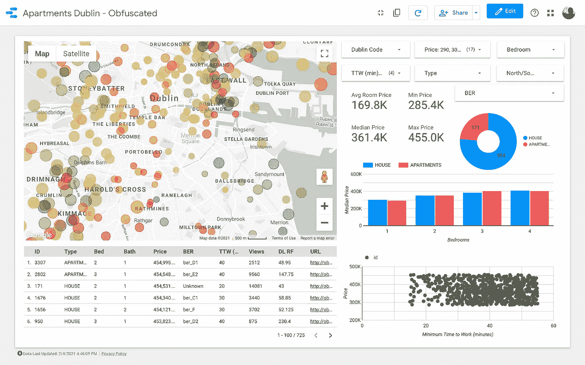

我一直很羡慕一些专业人士，他们的专业知识可能会对日常生活产生**影响**。想想水管工、牙医或厨师:他们的技能和资格是不错的额外津贴，不仅仅是在工作中。

作为数据科学家和软件工程师，优势通常不太明显；是的，我知道如何与技术打交道，但我的工作通常倾向于业务部门，所以要找到有趣的家庭规模的用例有点困难。

当我和妻子决定在都柏林购买我们的新家时，我立刻看到了让自己变得有用的机会！

```
· [High Demand, Low Offer](#9259)
· [Data Cravings](#592b)
· [From the Idea to the Tool](#4376)
  ∘ [Basic Data](#26ec)
  ∘ [Enhancing the Data](#dd5f)
  ∘ [Google Data Studio](#e437)
· [Some Implementation Details (Before the Fun Stuff)](#4466)
  ∘ [Address Geocoding](#465a)
  ∘ [Estimating the Time-on-Market](#0873)
· [The analysis](#ec9f)
  ∘ [Insights](#1e86)
· [Conclusion](#9d4c)
· [Follow me on LinkedIn and Medium](#410e)
```

> **下面的数据不是刮取而来，是使用** [**这个脚本**](https://gist.github.com/aialenti/1575319259aecf36c7ca9c4f42115062) **生成的。**

# 高需求，低报价

为了理解我需要搬家的理由，回顾一下我在都柏林房地产市场的个人经历是很有用的。我必须承认，作为买家，解决这个问题并不容易:市场需求超高(得益于近年来爱尔兰经济的良好表现)，房价高得令人难以置信；欧盟统计局的一份[报告显示，与欧盟相比**爱尔兰在 2019 年的住房成本最高(比欧盟平均水平高出 77)**。](https://ec.europa.eu/eurostat/cache/digpub/housing/bloc-2a.html?lang=en)

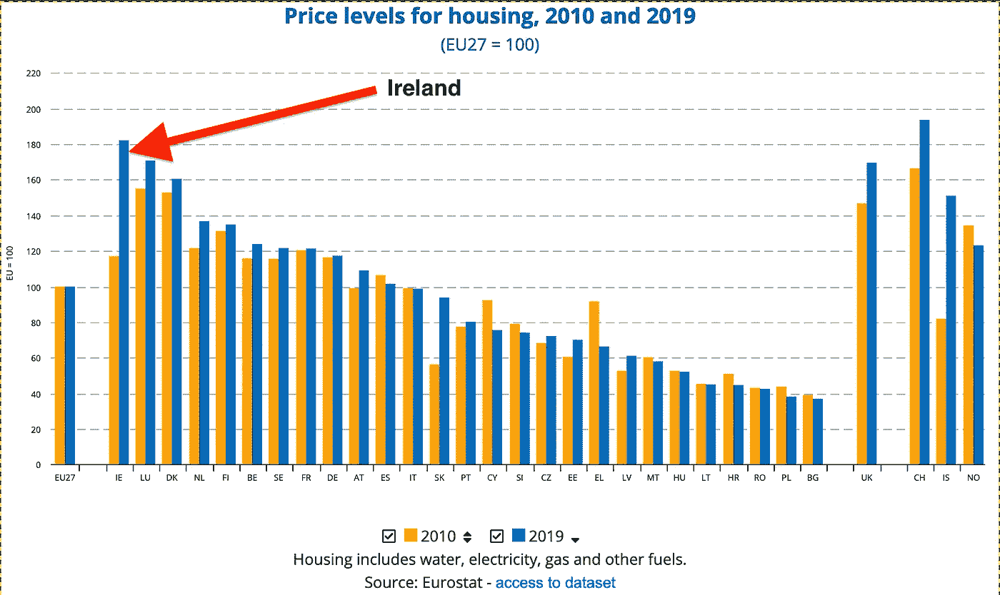

这个图表的后果？

1.  **符合我们预算的房子很少**，在城市的高需求区就更少了(即*不完全脏乱的通勤*)。
2.  二手房的质量有时很差，因为业主在出售之前对装修没有什么经济利益。待售的房屋通常能源等级低，管道差，电力系统差——翻译:买家需要在已经很高的购买价格上再增加一些装修费用。
3.  销售基于竞价系统，几乎每次竞价都超过最初的要价。据我所知，这对于新建筑来说是不正确的，**但它们远远超过了预算***，所以我们根本没有探索这一部分。*

*我可以想象世界各地的许多人都会对此感同身受，**因为许多大城市的情况可能都是类似的**。*

*像所有找房子的人一样，**我们想在完美的地方找到价格合理的完美房子**。让我们看看**数据科学**如何帮助我们的搜索！*

# *对数据的渴望*

*任何数据科学项目都需要一些数据收集步骤，对于这个特定的应用程序，**我正在寻找某种包含市场上所有可用属性的资源**。对爱尔兰来说，这意味着两种类型的网站:*

1.  ***每一家房地产中介公司***
2.  ***聚合器***

*两者都是非常有用的工具，它们让卖家和买家的生活变得更加容易。不幸的是，UI 及其提供的过滤功能并不总是提取信息和进行属性比较的最有效方法；一些用类似谷歌的搜索引擎很难回答的问题:*

*   *我的通勤需要多长时间？*
*   ***特定区域内有多少房产？—** 在经典网站上，可以比较不同的城市区域，但这些区域通常覆盖数平方公里，不够细致，难以理解，例如，某条特定*路* 的报价*高得难以接受*。大多数网站都提供地图，但这些地图的信息量并没有想象中的大。*
*   *房子周围有多少便利设施？*
*   *给定一套房产，**平均要价是多少？***
*   ***物业上市多久了？**此信息(如果有)可能不可靠，因为地产代理可能已经删除并重新创建了房源。*

***以一种对买家更友好的方式重新组织用户界面(加上一些数据增强)**，使我们的整体找房子体验更加流畅，并允许我们发现**一些非常有趣的见解**。*

# *从想法到工具*

## *原始数据*

*第一步是编写一个 scraper 来收集一些基本信息:*

*   ***物业原始地址***
*   ***当前要价***
*   ***链接到酒店的网页***
*   ***基本特征**，比如房间数量、浴室数量、能源等级*
*   ***房屋列表的浏览次数**(如果有)*
*   ***房子的类型** —房子？公寓？新建筑？*

*这差不多是我能从网上得到的所有数据。为了提取更多有见地的知识，我需要增强这个数据集。*

## *增强数据*

*谈到**的房子，我的主要卖点是通勤**方便，对我来说“*通勤*方便意味着**上门时间小于或等于 50 分钟**。为了进行计算，我决定使用谷歌云平台:*

1.  ***使用地理编码 API** ，我使用属性 address 检索纬度和经度坐标。*
2.  ***有了方向 API** ，我计算了房子位置和工作地点之间的步行和公交门到门距离。(*注:***骑车的时间大约是***步行时间的 1/3*)***
3.  **使用 Places API ，我检索了每个酒店周围的便利设施(特别是我们感兴趣的药店、超市和餐馆)。 ***注意:地方 API 很贵；对于一个包含 4000 栋房屋的数据库，您需要处理 12000 个请求才能获得三种类型的便利设施。出于这个原因，我将这些数据从我的最终仪表板中删除。*****

**除了地理信息，我的另一个有趣的问题是:**该房产上市多久了？**如果业主试图出售房产的时间太长，这**不是一个积极的信号**:该地区或房子本身可能有问题**，或者要价可能太高**。
另一方面，如果一处房产刚刚被出售，你需要考虑到**业主不会按照他们得到的第一个报价去出售**。不幸的是，这些信息很容易隐藏或“伪造”。**通过一些基本的机器学习，我通过简单地使用具有一些其他功能的列表的视图来估计这个数量。****

**最后，我用**一些实用字段**增强了数据集，以使过滤更容易(例如，添加一个价格范围列)。**

## **谷歌数据工作室**

**一旦我对我的增强数据集感到满意，**我想创建一个强大的仪表板**。我为任务选择的数据可视化工具是 **Google Data Studio** 。这个软件有一些缺点(例如，它的功能非常有限)，但也有一些优点，它是免费的，基于网络的，可以读取来自谷歌工作表的数据。下面的图表总结了整个工作流程。**

**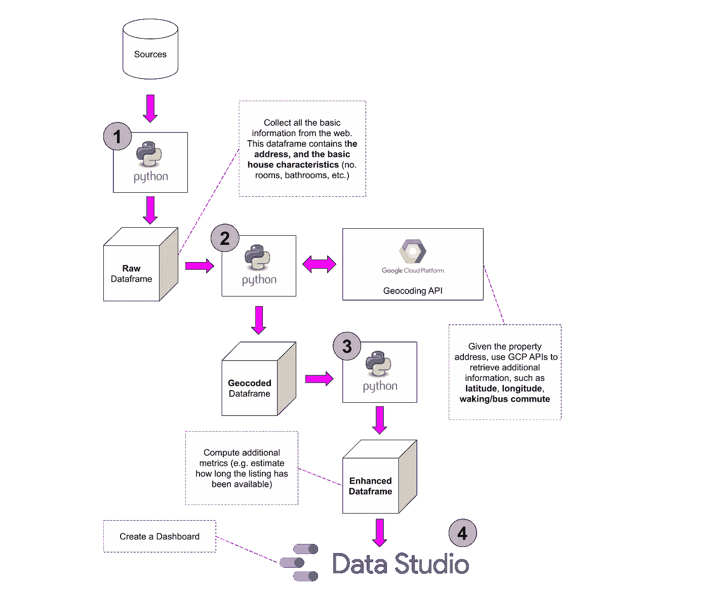**

# **一些实现细节(在有趣的东西之前)**

**老实说，**实现非常容易，真的没有什么新的或特别的:只是一堆收集数据的脚本和一些基本的 Pandas 转换**。唯一值得强调的部分是**与谷歌 API**的交互，以及**对房产上市时间的估计**。**

> ****下面的数据不是刮取来的，是使用** [**这个脚本**](https://gist.github.com/aialenti/1575319259aecf36c7ca9c4f42115062) **生成的。****

**让我们看看原始数据:**

**正如我所料，该文件包含以下几列:**

*   **`**id**`:列表的标识符**
*   **`**_address**`:物业的地址**
*   **`**_d_code**`:都柏林区号。每个都柏林地区由一个格式为`D<number>`的代码标识。**当** `**<number>**` **为偶数时，地址位于利菲**(切割城市的河流)**的南边，如果为奇数，地址位于河流**的北边。**
*   **`**_link**`:链接到已检索列表的原始页面。**
*   **`**_price**`:房产要价欧元。**
*   **`**type**`:属性类型(`HOUSES`、`APARTMENTS`、`NEW HOUSES`)。**
*   **`**_bedrooms**`:卧室数量。**
*   **`**_bathrooms**`:卫生间数量。**
*   **`**_ber_code**`:标识能量等级的代码，越接近字母 A，能量等级越好。**
*   **`**_views**`:列表获取的视图(如果有)。**
*   **`**_latest_update**`:更新或创建列表时(如果可用)。**
*   **`**days_listed**`:这是一个计算字段，是我收集数据的日期与`_last_update`列之间的差值。**

## **地址地理编码**

**这个想法是把这些东西放在地图上，并启用地理定位数据的力量。为此，让我们看看如何使用 Google API 获得**纬度和经度**。**

**如果你想尝试这一点，你需要一个谷歌云平台帐户，你可能想[按照指南获取一个 API 密钥，并启用适当的 API](https://developers.google.com/maps/documentation/geolocation/overview) 。正如我之前所写的，对于这个项目，我使用了[地理编码 API](https://gist.github.com/aialenti/18b30eecdc8cbc333d6e3e43693f1b78) s、[方向 API](https://cloud.google.com/maps-platform/routes/?utm_source=google&utm_medium=cpc&utm_campaign=FY18-Q2-global-demandgen-paidsearchonnetworkhouseads-cs-maps_contactsal_saf&utm_content=text-ad-none-none-DEV_c-CRE_397052992685-ADGP_Hybrid%20%7C%20AW%20SEM%20%7C%20SKWS%20~%20Routes%20%7C%20EXA%20%7C%20Directions%20API-KWID_43700049595992223-kwd-445998650766-userloc_1007850&utm_term=KW_directions%20api-ST_directions%20api&gclid=CjwKCAiAxeX_BRASEiwAc1QdkdVb470bRzIM_td7NiwqolJjURJ-gT0OTWD-Olu3O2HkNjM8SpYeZRoCaoQQAvD_BwE) 和[地点 API](https://developers.google.com/places/web-service/overview?utm_source=google&utm_medium=cpc&utm_campaign=FY18-Q2-global-demandgen-paidsearchonnetworkhouseads-cs-maps_contactsal_saf&utm_content=text-ad-none-none-DEV_c-CRE_397052992532-ADGP_Hybrid%20%7C%20AW%20SEM%20%7C%20SKWS%20~%20Places%20%7C%20EXA%20%7C%20Places%20API-KWID_43700049595992202-kwd-332054283724-userloc_1007850&utm_term=KW_places%20api-ST_places%20api&gclid=CjwKCAiAxeX_BRASEiwAc1Qdka6FD6ric2izod5DyqmIpewr8-vNsGA_2kTG4bGl_i7oYK0fL58HBxoCI2MQAvD_BwE) (因此，当您创建 API 键时，您需要启用这些特定的 API)。下面的代码片段来与云平台进行交互。**

## **估计上市时间**

**让我们关注下面的数据:**

**正如您在这个示例中看到的，与属性相关联的查看次数并没有反映在列表已经存在的天数中:**例如，带有** `**id=47**` **的房子有大约 25k 次查看，但是显然已经列出了我下载数据的确切日期。****

**然而，并不是所有的属性都存在这个问题；在下面的示例中，查看次数与列出的天数更加一致:**

**我们如何利用上面的知识？简单:**我们可以使用第二个数据集作为模型的训练集，然后我们可以应用到第一个数据集！****

**我尝试了两种方法:**

1.  ****获取“一致的”数据集，并计算每天的平均浏览量**，然后我将该平均值应用于“未知的”数据集。这种解决方案并非完全不合理，但它有一个问题，所有的房子都放在同一个桶里:**很可能一个价值 1000 万欧元的房子每天的浏览量会更少，因为这个预算是为一小部分人保留的**。**
2.  ****在第二个数据集上训练随机森林模型，并将其应用于第一个数据集**。**

**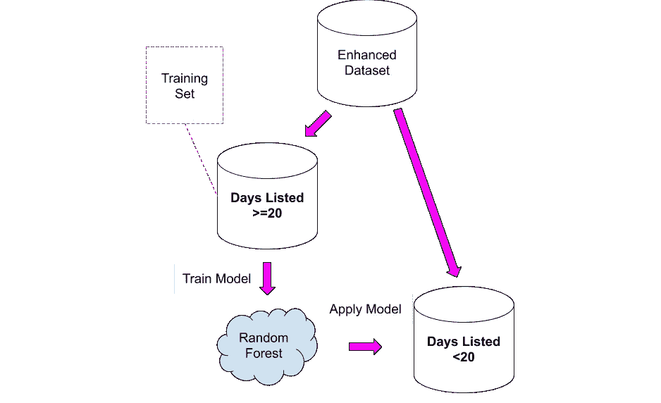**

**需要非常仔细地阅读结果，因为知道**新列将是真实值的粗略近似值:** **我将它们用作一个起点，以便更深入地挖掘一些看起来有些奇怪的属性。****

# **分析**

**女士们先生们:最后的仪表板。如果你想玩这个 [**就点击这个链接**](https://datastudio.google.com/s/qKDxt8i2ezE) 。**

> **注意:Google Data Studio 将允许在介质上嵌入报告(正如你在我写的另一篇文章中看到的[)。不幸的是，谷歌地图模块在嵌入文章时无法工作，所以我需要使用截图。](/how-to-train-your-unicorn-b6b4f4d50aa2)**

**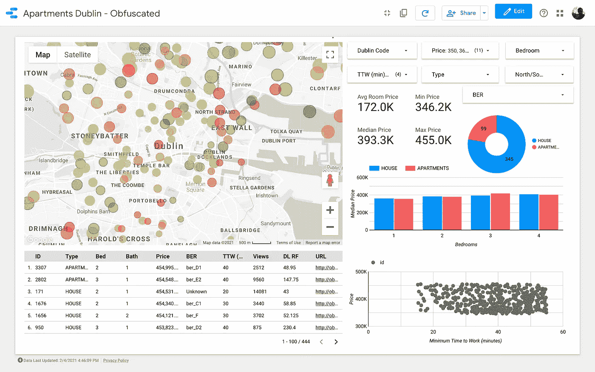**

**[https://datastudio.google.com/s/qKDxt8i2ezE](https://datastudio.google.com/s/qKDxt8i2ezE)**

****地图是仪表盘最重要的元素**。气泡的颜色取决于房屋/公寓的价格，并且**颜色仅考虑可见属性**(与右上角的过滤器匹配的属性)；大小表示上班距离:**气泡越小通勤距离最短**。**

****图表旨在分析要价如何根据某些特征**(如建筑类型或房间数量)而变化；散点图，试把**通勤与要价**联系起来。**

**最后，用原始数据做一个表格(`DL RF`代表“天列出的随机森林”)。**

## **洞察力**

**让我们深入实际分析，看看我们能从仪表板中获得什么样的见解。**

**该数据集包含大约 4000 所房屋和公寓:当然，我们无法组织对每一所房屋和公寓的查看，因此**我们的任务是确定一个记录子集，其中必须包含一个或多个我们想要竞标的房产。****

**首先，我们需要细化我们的搜索标准。例如，假设我们想要匹配这些特征:**

1.  **房产类型:**房屋****
2.  **卧室数量: **3****
3.  **工作时间:**不到 60 分钟****
4.  **误码率等级: **A，B，C，**或 **D****
5.  **价格:**从 25 万到 54 万**欧元**

**让我们应用**所有的过滤器，除了价格**上的那个，让我们看看地图(只过滤掉价值超过 100 万，低于 20 万欧元的)。**

**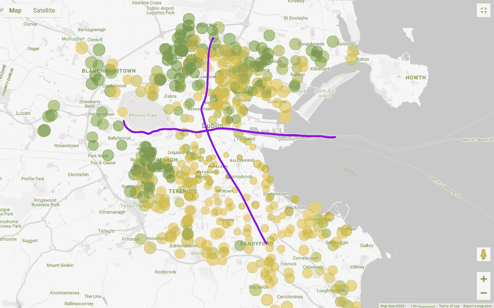**

**一般来说，伦敦国际电影节南部的要价比北部的要价高得多，除了西南部的一些例外。**即使在生活费用以上,“外部地区”,即东北和西北，似乎也比“纯北方”便宜。**其中一个原因是，都柏林的主要有轨电车线路(LUAS)在一条直线上从北到南穿过城市(还有一条从西到东的 LUAS，但它没有到达所有的商业区)。**

**请注意，我是通过简单的目视检查来考虑这些问题的；**更严格的方法需要验证房价与公共交通路线距离之间的相关性**，但我们对证明这种关系不感兴趣。**

**如果我们根据我们的预算进行过滤，情况会变得更加有趣**(*回想一下，下面的地图显示了 3 间卧室的房子，允许不到 60 分钟的通勤*，*，下面的地图只增加了对询问*价格的过滤):****

**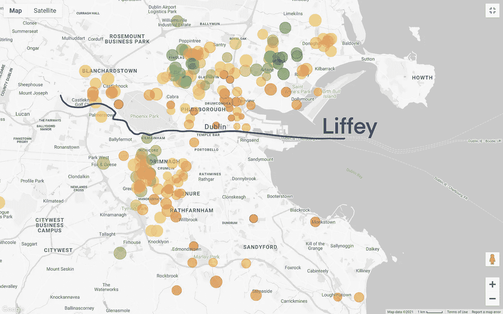**

**让我们后退一步。我们大概知道我们能负担的范围，但是我们仍然需要处理最困难的部分:**妥协**！我们想做一个更经济实惠的搜索吗？或者我们想看看用辛苦赚来的积蓄可能买到的最好的房子？不幸的是，这不是数据科学分析的一部分，但**这是一个实际的商业(非常个人化)决策**。**

**假设我们选择后者:**我们希望更喜欢房子或面积质量，而不是更低的价格**。**

**如果这是目标，我要说我们需要考虑以下几点:**

*   ****不在集群中的房屋** —在地图上孤立的房屋，可能表明该地区没有太多报价，因此业主可能不愿意轻易出售。**
*   ****位于“昂贵”区域的房子** —如果房子周围的所有其他房产都很昂贵，这可能表明该位置的需求很高。我将把它作为旁注留在这里，但我们**可以通过使用空间自相关**来量化这一现象(例如计算 [**莫兰的 *I***](https://en.wikipedia.org/wiki/Moran%27s_I) )。**

**即使第一个选项看起来很有吸引力，**我们也需要考虑到，如果一处房产的价格与周边地区相比非常低，那么该房产本身可能存在某种问题**(例如，房间小，装修成本非常高)。因此，**我们将继续关注第二个类别的分析，我认为考虑到我们的“业务目标”,这是最有希望的。****

**让我们更深入地分析一下以下领域所提供的内容:**

**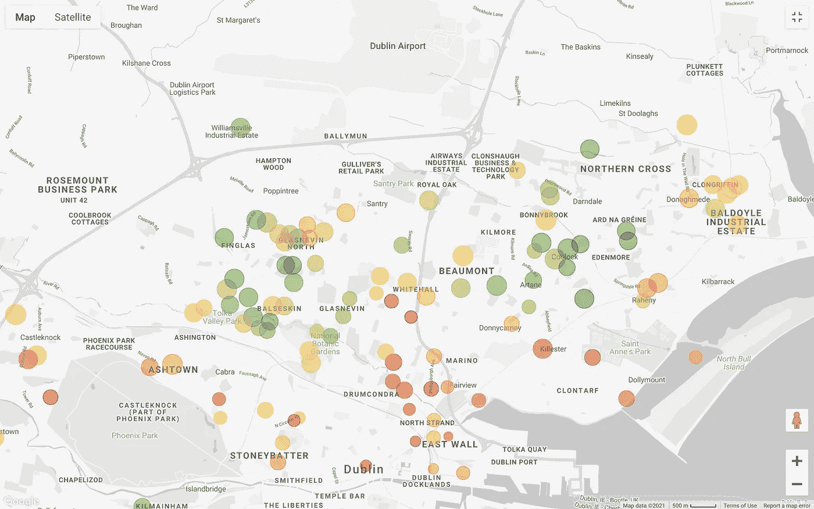**

**我们已经将选项从 4000 个元素减少到 200 个以下，我们现在需要做的是**更好地划分点，并比较集群**。**

**自动化集群搜索不会给这个分析增加太多，但是让我们应用[DBS can](https://en.wikipedia.org/wiki/DBSCAN)；我们选择 DBSCAN 是因为一些分组可能是非球状的(例如，k-means 在这个数据库上不能正常工作)。理论上，我们需要计算点之间的地理距离，但我们将使用欧几里得距离，因为它是一个很好的近似值:**

**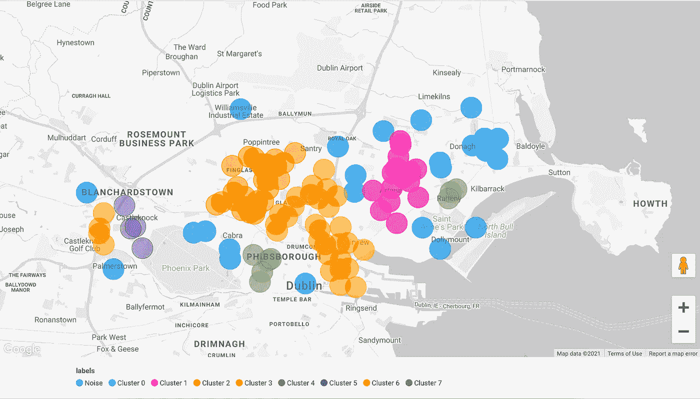**

**该算法做得相当好，但我会修改集群如下(与一些“商业知识”对都柏林):**

**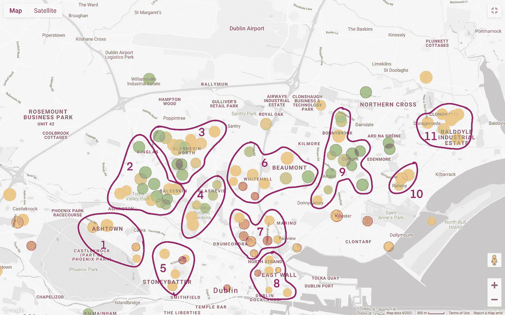**

**我们希望**降低要价较低的地区**的优先级，因为我们**希望利用我们的预算**最大限度地提高房屋和通勤质量；出于这个原因，我们可以**过滤掉集群 2、3、4、6 和 9。**请注意，集群 2、3 和 4 是北都柏林最经济的地区之一(这可能是由于公共交通覆盖率低)。第 11 类既昂贵又遥远，因此我们可以删除这一类。**

**看看更贵的总量，**数字 7 在通勤**方面是最好的之一。这是 [Drumcondra](https://en.wikipedia.org/wiki/Drumcondra,_Dublin) ，都柏林北部的一个不错的住宅区；尽管 Drumcondra 的 LUAS(有轨电车线)服务不好，但它与公共汽车联系很好；**集群 8 的成本和通勤情况与 Drumcondra** 相似。另一个值得分析的分组是第 10 个**:**这个分组似乎位于一个供应较低的地区，**这意味着它可能是一个人们不太可能出售的地方，并且由于铁路的存在，它仍然连接得很好(我们假设所有地区都有相似的人口密度)。****

**最后但同样重要的是，**集群 1 和集群 5** 非常靠近凤凰公园 [*这是欧洲任何首都城市中最大的封闭式公园*](http://phoenixpark.ie/) *。***

**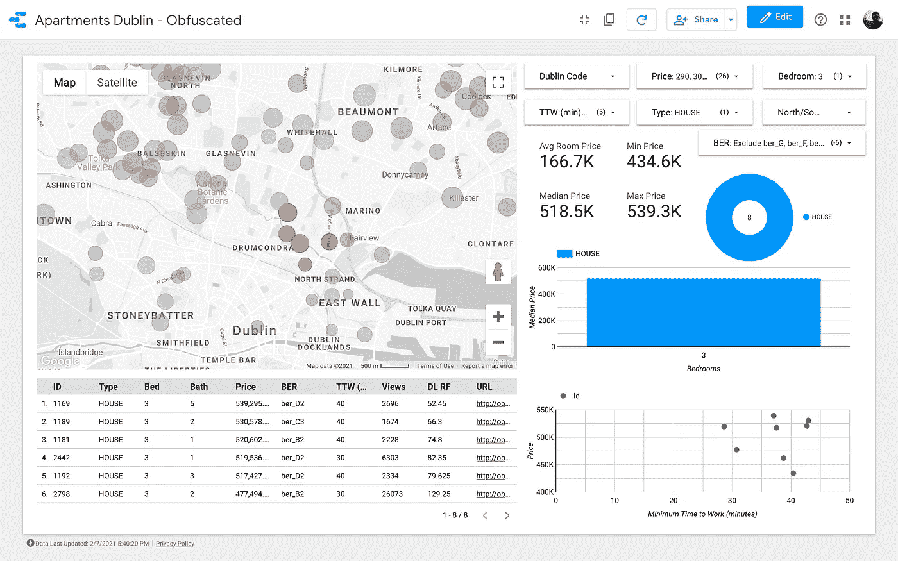**

****集群 7****

**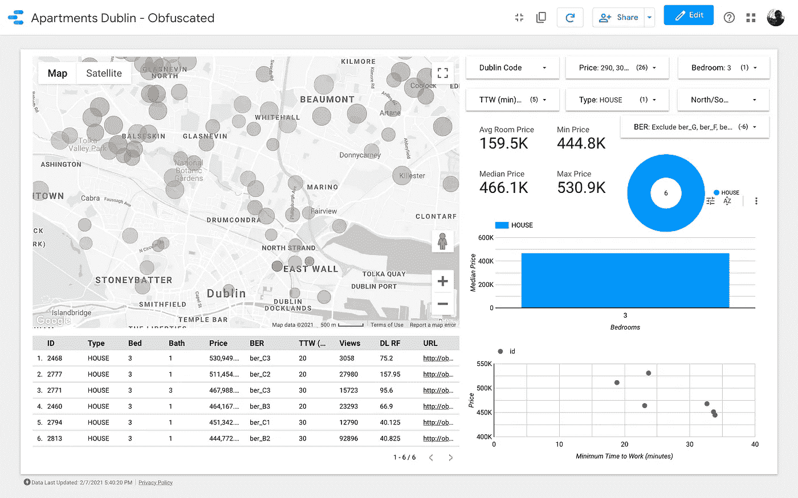**

****第八集群****

**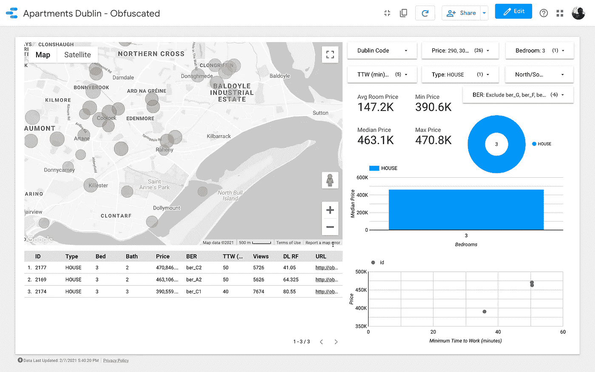**

****集群 10****

**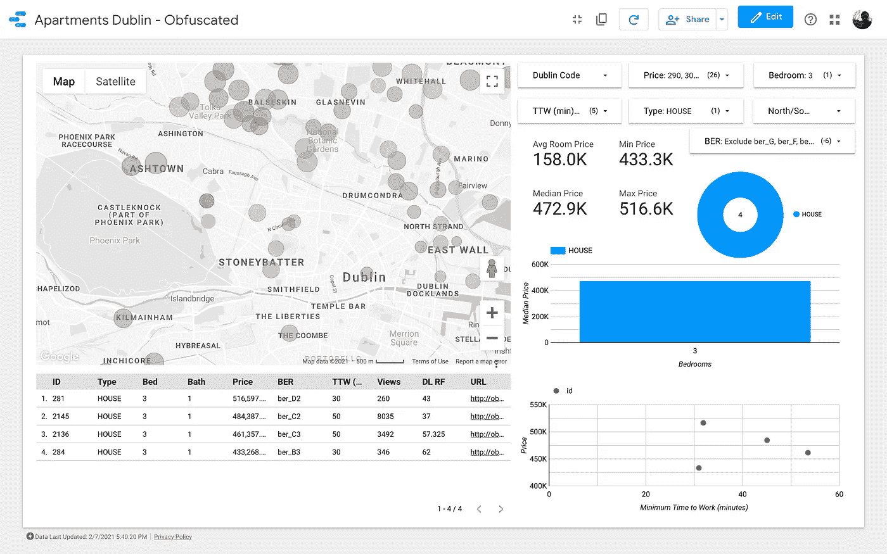**

****集群 1****

**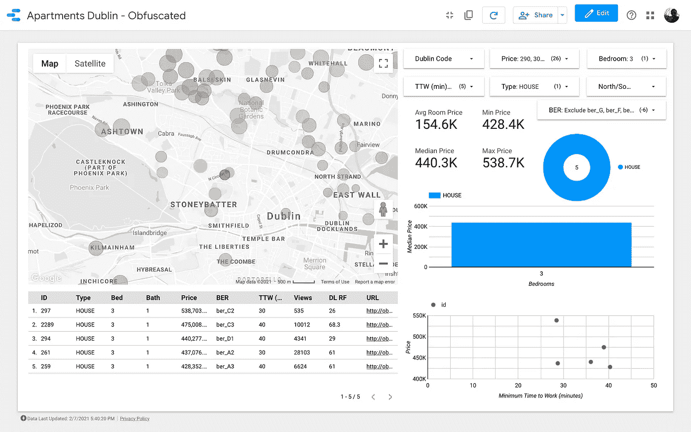**

****集群 5****

**太好了！我们确定了 26 处我们认为最值得一看的房产。我们现在可以开始深入每一栋房子，并最终与房地产经纪人一起组织看房！**

# **结论**

**我们开始对都柏林几乎一无所知，最终我们对购房者最需要的城市区域有了一些了解。**

**只要注意到我们甚至没有看照片，也没有读过关于这些房子的任何东西！通过简单地查看一个组织有序的仪表板**我们发现了一堆我们在旅程开始时不知道的见解！****

****这些数据不能进一步帮助**，一些整合可以改善分析。一些想法:**

*   ****我们没有集成便利设施数据集**(我们可以通过 Places APIs 检索的数据集)。有了更多的云服务预算，我们可以轻松地将这些信息添加到仪表板中。**
*   ****爱尔兰在该国的** [**统计网站**](https://data.cso.ie/) 发布了很多有趣的数据:例如，可以下载每个季度和犯罪类型打给每个警察局(爱尔兰警方)的**电话数量；这样，我们就可以知道哪些地区的盗窃案数量最多。由于检索每个选区的人口普查信息是可能的，**我们也可以考虑根据人口加权来计算犯罪率**！**注意，对于这样的高级功能，我们需要一个合适的地理信息系统(如**[**【QGIS】**](https://www.qgis.org/en/site/)**)，或者一个可以处理地理数据的数据库(如**[**【PostGIS】**](https://postgis.net/)**)**。****
*   ****爱尔兰有一个包含以前房价的数据库，名为** [**住宅物业登记册**](https://www.propertypriceregister.ie/) **。**来自他们的网站:*【住宅物业登记册】包括自 2010 年 1 月 1 日以来在爱尔兰购买的所有住宅物业的销售日期、价格和地址。拥有房屋的历史价格可能有助于理解需求是如何随时间变化的。***
*   ****房屋保险强烈依赖房屋位置来获得报价**。通过一些努力，我们可以将保险网站整合到我们的仪表板中，集成他们的“风险模型”。**

**在都柏林这样的市场上，寻找新家可能是一种压倒性的体验，尤其是对那些刚刚搬到这里、对这座城市的每一条路都不熟悉的人来说。**

**有了这个工具，我和妻子最终减少了我们浪费的时间(和代理人的时间):**我们参加了 4 次看房，投标了 3 栋房子，赢得了 1 栋。****

# **在 LinkedIn 和 Medium 上关注我**

**如果你喜欢这篇文章，**可以随时联系 LinkedIn**<https://www.linkedin.com/feed/>****(我欢迎个性化的连接请求)**并关注我的** [**媒体**](https://medium.com/@andrea.ialenti) **！********

******</javascript-charts-on-jupyter-notebooks-dd25f794cf6a>  </clustering-pollock-1ec24c9cf447> ******