# 基于能量模型的物理学

> 原文：<https://towardsdatascience.com/the-physics-of-energy-based-models-1121122d0d9?source=collection_archive---------6----------------------->

## [思想和理论](https://towardsdatascience.com/tagged/thoughts-and-theory)

## 用物理学来理解基于能量的模型

**作者:**帕特里克·胡姆贝利(EPFL)、胡安·米盖尔·阿拉佐拉(世外桃源)、内森·基洛兰(世外桃源)、马苏德·莫塞尼(谷歌量子人工智能)、彼得·魏特克

# 纪念彼得·魏特克

当我们想到彼得时，他积极的天性和他敢做敢为的态度不可避免地浮现在脑海中。他有能力激励和带动周围的人，让他们相信几乎一切皆有可能。早在 2018 年，他就想出了一个关于基于能源的模型主题的互动博客帖子的想法，并向我们推荐了它。抗拒他热情的态度几乎是不可能的，当然我们和他一起开始了这次冒险。带着我们在物理学和机器学习方面的知识，以及几乎没有任何关于 Javascript 的线索，我们开始了我们的旅程。经过许多艰苦的工作，我们终于能够完成这个项目。我们对最终的结果欣喜若狂，我们希望他能看到。我们想念你，彼得。我们想念你，你是我们的同事，是我们的灵感，更是我们的朋友。
由于 Medium 不支持用 Latex 编写的 Javascript 和方程，我们建议也看看我们的[互动帖子](https://physicsofebm.github.io)。

# 介绍

我们从一个相当简单的物理角度概述了基于能量的模型，这是一类历史上重要的生成机器学习模型。我们假设没有机器学习的先验知识。我们通过联系相互作用粒子的物理行为来激发基于能量的模型，而不是主要概念的纯数学公式。我们从不同的角度解释熟悉的概念，并揭示基于能量的模型的理论和实践背后的关键物理概念。这包括 Hopfield 网络[1]和 Boltzmann 机器[2]的设计、实现和训练，强调物理原理如何解释与这些模型相关的成功和挑战。我们关注这些模型是因为它们的历史意义——为该领域未来的革命铺平了道路——以及它们与基本物理原理的直接联系。此外，注意力放在使用物理学来理解重要的概念，如能量函数，玻尔兹曼分布和对比发散[3]。最后，我们根据最近的进展思考了机器智能未来可能的趋势，揭示了物理学和机器学习界面上的前沿研究。

# 基于能源的模型

基于能量的模型是由描述特定状态概率的能量函数控制的概率模型。基于能量的模型出现在 20 世纪 80 年代的机器学习文献中[1，2]。经过几十年的工作，它们得到了进一步的发展、扩展和改进[4]。最近，一些基于能量的模型已经被“移植”到物理学中，并被用来模拟量子系统的波函数[5，6，7，8]。此外，他们仍在其他领域工作[9，10，11，12]，在特定任务中，他们已经开始与 GANs 竞争[13]。许多类型的基于能量的模型是可生成的，保证采样一个有效的概率分布，并且可以经常被堆叠以创建深层次的表示[14]。最近的发展包括它们在强化学习中的应用[15，16，17]，作为 GANs 中鉴别器的潜在替代物[18]，以及基于量子能量的模型的出现[19，20]。

为了理解基于能量的模型的起源，想象一个科学家的目标是设计一个能够学习和记忆模式的物理系统。最初的策略选择是使用粒子的随机行为来模拟应该学习的一些数据的概率分布。目标是设计*概率系统*，利用随机性来概括记忆的模式。在数学上，概率系统的特征在于确定系统可能状态的概率分布。挑战在于设计足够复杂的系统以产生丰富的行为，但也足够简单以使它们可以被有效地训练和表征。

对于大型系统，跟踪所有快速波动的内部自由度是极其困难的。通常只能访问粗粒度的信息，这意味着我们只能跟踪系统的宏观属性，而不是所有的自由度。这种粗粒度信息的一个例子是总能量[21]，它可以从理论上确定系统的任何给定状态。

更准确地说，一个系统的总能量是根据一个*能量函数 E* ( *x* )来定义的，这个函数将能量值分配给所有可能的状态。一个 *n* 粒子系统的状态可以描述为 *x* =( *x* ₁， *x* ₂，…， *x* ₙ)，其中 *x* ᵢ表示第 *i* 粒子的相关自由度。

# 玻尔兹曼分布

能量为 *E* ( *x* )的一个状态 *x* 可以分配到什么概率分布 *P* ( *x* )？如果我们没有任何关于特定自由度的信息——因此没有约束——我们应该在选择模型时保持最大的灵活性，同时与受约束的数量保持一致。因此，选择具有最大熵的分布是合理的，因为最大熵模型减少了构建到模型中的潜在有偏差或未经证实的先验信息的量。这种策略被称为*杰恩斯的最大熵原理*【22】。它指出，在根据部分可用信息分配模型时，应选择具有最大可能熵的分布。得到的分布 *P* ( *x* )就是优化问题的解

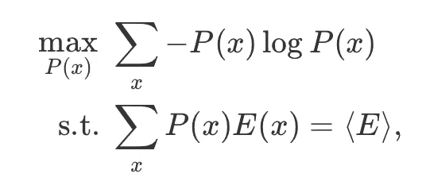

给予[22]

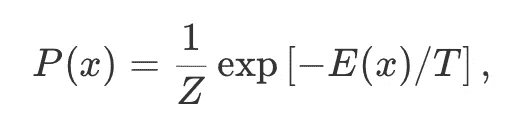

其中 *T* 是自由参数，*z*=∑ₓexp[*e*(*x*/*t*)是归一化常数，称为*配分函数*。这种概率分布最早出现在统计物理中，现在广泛应用于其他领域。在其最初的物理解释中，玻尔兹曼分布描述了当系统与温度为 *T* 的热浴处于热平衡时，找到处于状态 *x* 的系统的概率。玻尔兹曼分布在能量和概率之间建立了一种具体的关系:低能态最有可能被观察到。

物理系统的能量函数可以表示为每个粒子的内能和它们之间的相互作用所产生的贡献的总和。在这种情况下，能量函数可以写成

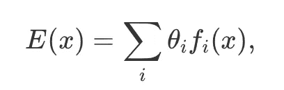

对于合适的参数 *θ* ᵢ和函数 *f* ᵢ ( *x* )。在温度 *T* 下得到的玻尔兹曼分布由参数 *θ* ᵢ唯一确定，或者等效地，由期望值⟨ *f* ᵢ ( *x* )⟩唯一确定，它们是分布【24】的*充分统计量*。期望值⟨ *f* ᵢ ( *x* )⟩)的知识确定了参数 *θ* ᵢ，因此也确定了所得玻尔兹曼分布的性质。参数 *θ* ᵢ决定了这些期望值在最小化能量中的相关性。当一个特定的 *θ* ᵢ很小时，相应的充分统计量，即粒子的状态或相互作用项，在很大程度上与其对能量的贡献无关。

认识到温度的作用很重要:它决定了观察到高能态的相对概率，而不仅仅是最低能态。在零温极限下，只能观察到对应于能量函数全局极小值的那些状态。在无限温度的极限下，所有状态的可能性都是相等的。在物理上，温度量化了系统和环境之间相互作用的平均能量。这种交换导致向更高能量状态的零星“跳跃”。温度越高，这种跳跃就越普遍、越普遍。下图显示了温度在玻尔兹曼分布中的作用，您可以从中研究不同温度和能量函数参数的影响。

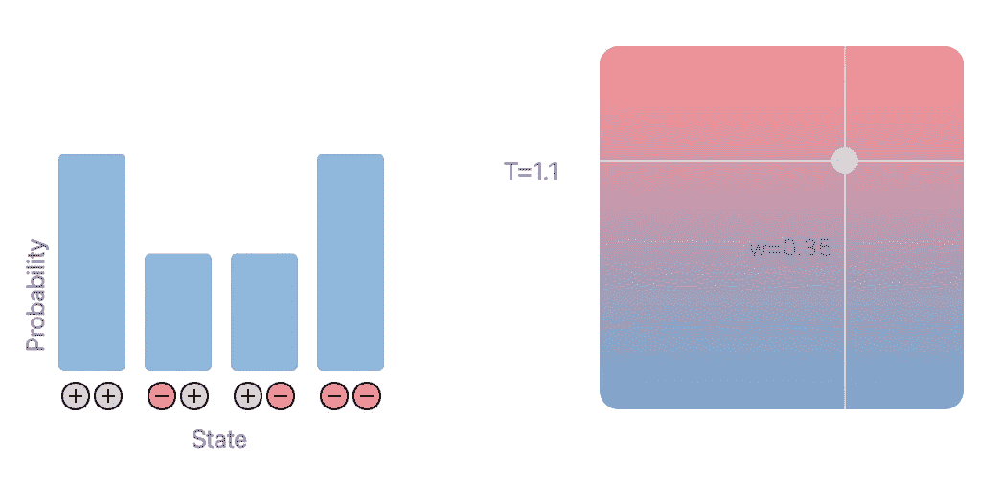

**随相互作用和温度变化的玻尔兹曼分布(此图的交互版本可在此处找到******):**温度 T *T* 和相互作用强度 w *w* 对两粒子系统玻尔兹曼分布的影响。左边的直方图显示了每个可能配置的概率，其中 xᵢ∈{−1,+1}(红色/灰色)。能量函数为 *E* ( *x* ₁，*x*₂)=*w x*₁*x*₂.相互作用的符号决定了哪些配置更有可能:如果 w<0*w*0，相反的配置*x*₁=*x*₂具有较低的能量(较高的概率)。如果 w > 0，等构型 *x* ₁= *x* ₂能量较低(概率较高)。提高温度 *T* 使得高能配置更有可能。在非常高的温度极限下，不管相互作用强度如何，态都变得近似等概率。**

# **结构**

**设计基于能量的模型的下一步是选择能量函数。我们从可以说是最简单有趣的模型开始:具有两个自由度的粒子集合，其能量函数取决于粒子的单个状态以及它们之间的成对相互作用。用向量
*=(*σ*₁， *σ* ₂,…， *σ* ₙ)来描述这 n 个粒子的状态，其中*σ*ᵢ∈{-1，1}是第 *i* 个粒子的状态。由此产生的能量函数为***

***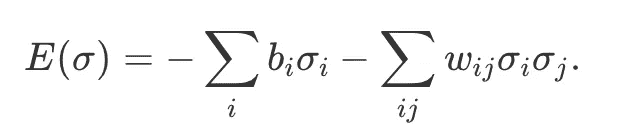***

***这个能量函数被称为*伊辛模型*【25】。参数 *b* ᵢ设定了粒子的个体能量，这取决于状态 *b* ᵢ *σ* ᵢ = *b* ᵢ。参数 *w* ᵢⱼ *对于 *w* ᵢⱼ > 0，相反的状态( *σ* ᵢ=− *σ* ⱼ)导致更高的能量。这种基于能量的模型被称为 Hopfield 网络。能量函数中的参数ᵢⱼ可以被视为图中的加权边，因此该模型可以由网络表示——神经网络，当粒子本身被视为神经元时。****

***使用该模型可以执行哪些任务？考虑零温度的情况。在平衡状态下，只能观察到最低能态。如果系统被设置为具有较高能量的状态，并被允许平衡回到零温度，则它回复到具有最低能量的基态之一。如果数据被编码到系统的基态中，该模型有能力从不完整或损坏的输入中检索数据实例，这些输入是非平衡状态。该模型可以作为一个*自动联想记忆*【1】，当相似的模式作为输入时，能够“记住”模式。***

***Hopfield 网络的能量函数只考虑成对的相互作用。将范围扩展到更复杂的模型是可能的，但代价很大:它们通常更难训练，也更难对它们进行推理。相反，新的粒子可以被添加到网络中，这些粒子不用于表示数据，但是它们的作用是增加模型的整体复杂性。它们被称为*隐藏*节点(如网络中的节点),充当其余*可见*节点之间的中介，对数据进行编码。每个隐藏或可见节点的集合被称为一个*层*。***

***在物理上，隐藏节点能够实现可见节点之间的有效高阶交互，从而为可见节点产生新的有效能量函数[26，27]。由此产生的网络被称为*玻尔兹曼机器*，意指控制其行为的玻尔兹曼分布。它们是 Hopfield 网络的推广，在某种意义上，它们是作为一种特殊情况而包含的:当隐藏和可见节点之间的相互作用 *w* ᵢⱼ设置为零时，玻尔兹曼机器简化为 Hopfield 网络。重要的是，玻尔兹曼机器不仅比 Hopfield 网络更强大，而且在某种意义上也是最强大的:它们是通用的近似器，原则上能够以任意精度复制任何离散的概率分布[28]。***

***模拟和训练波尔兹曼机器可能具有挑战性。为了促进进展，可以研究一些连接被设置为零的模型。在最极端的情况下，所有层内连接都被移除，只留下可见和隐藏节点之间的连接。由此产生的模型被称为*受限玻尔兹曼机器* (RBMs)。通常，RBM 的状态用可见( *v* )和隐藏( *h* )节点、
*=(*v*、 *h* )来表示，其能量函数由下式给出****

****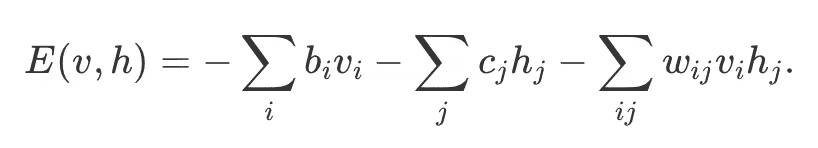****

****与全连接玻尔兹曼机相比，RBM 更缺乏表现力，因为它的参数更少。然而，在模拟和训练这些模型中获得的优势超过了表达能力的损失，特别是因为不太复杂的模型往往概括得更好[29]。我们在本文中研究的三个基本的基于能量的模型，Hopfield networks、Boltzmann machines 和 RBMs，如下图所示，我们介绍了不同的架构，并说明了隐藏节点如何使模型变得更加复杂。****

****当能量函数不包含偏置项时，Hopfield 网络和 Boltzmann 机具有所谓的翻转对称性:如果我们翻转所有节点的值，翻转前后的状态具有相同的能量。因此，在所有节点上因翻转而不同的模式是无法区分的。添加隐藏节点可以通过向每个可见模式分配非对称的隐藏节点状态来打破这种对称性。下图说明了这种行为**(查看** [**互动版**](http://physicsofebm.github.io/) **获得更多直觉)**。****

****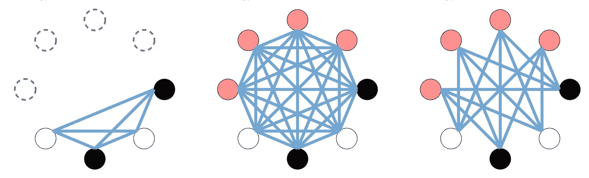****

******Hopfield 网络(左):**节点的数量等于输入数据的大小。没有隐藏节点(虚线)贡献能量，这限制了该模型的表达能力。在这篇文章的[互动版本](http://physicsofebm.github.io/)中，你可以点击节点来翻转它们所有的值，但是对于没有偏置项的 Hopfield 网络，这两个状态具有相同的能量。您可以将鼠标悬停在节点和连接上以获取更多信息。**玻尔兹曼机(中):**玻尔兹曼机网络完全连通。可见节点(黑色或白色)被钳制到输入数据，隐藏节点(红色或灰色)是自由参数。我们在整篇文章中使用这种配色方案来区分隐藏节点和可见节点。我们为翻转的可见配置分配不同的隐藏模式，因此翻转的可见节点在翻转前后具有不同的能量。**受限玻尔兹曼机(右):**RBM 使用隐藏和可见节点，但同一层内不允许连接，即网络是二分的。这种限制大大简化了训练。**(本图的互动版可以在这里找到******)********

# ******抽样******

******从物理角度来看，从玻尔兹曼分布中取样在概念上很简单:只需将系统与所需温度的环境接触，并记录系统在不同时间的状态。但是建造这些系统并设计它们的能源功能在实践中极具挑战性。然而，最近有人提议建立概率计算机，采用与热噪声相互作用随机磁隧道结来物理实现概率位(p 位)[59]或其基于 FPGA 的模拟[60]。今天，在实践中，人们使用标准计算基础设施模拟这种概率机器，基于具有 von Numann 架构的图灵机，因此与它们在不久的将来可能发生的直接物理实现相比，需要额外的能量和时间开销[59]。******

******首先考虑零温度情况。玻尔兹曼分布背后的关键物理原理是能量和概率之间的联系。模拟波尔兹曼分布采样的策略是识别低能态，并根据温度偶尔选择高能态。一个简单的方法是局部改变每个粒子的状态，从而降低系统的总能量。对于伊辛能量函数，通过将第 *i* 粒子的状态从 *σ* ᵢ变为 *σ* ᵢ而引入的能量变化(δ*e*)为******

******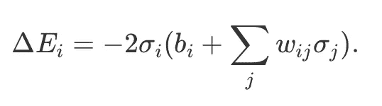******

******为了寻找平衡状态，我们迭代地应用更新规则******

******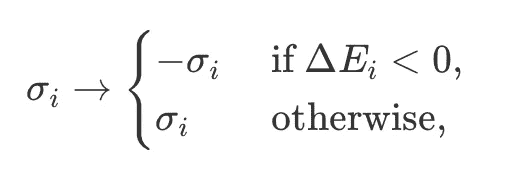******

******只有当这种变化降低了能量时，才会翻转节点的值。从随机初始化开始，通过重复更新单个粒子的状态，系统的状态收敛到局部最小值[30]。这种方法不能保证找到真正的基态，即能量函数的全局最小值。对于有限的温度，策略是相似的，除了现在有可能偶尔跳到更高的能量状态。在这种情况下，更新规则是:******

******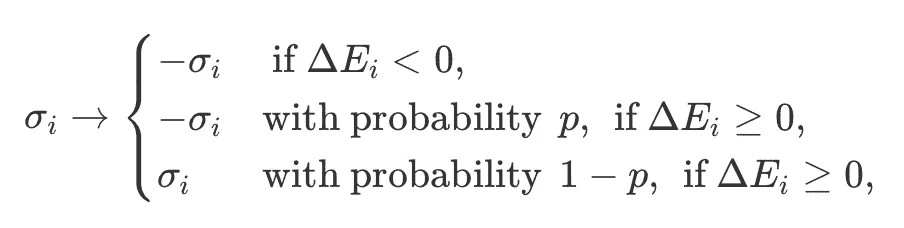******

******其中*p*= exp((1/*t*)δ*e*ᵢ).在物理上，这些向更高能态的跳跃模拟了在有限温度下与环境交换能量时产生的随机热波动。这种采样算法是 Metropolis-Hastings 算法[31，32]的一个具体实例，当分布已知达到一个归一化常数时，这种算法特别方便，例如玻尔兹曼分布。下图说明了运行中的算法。******

******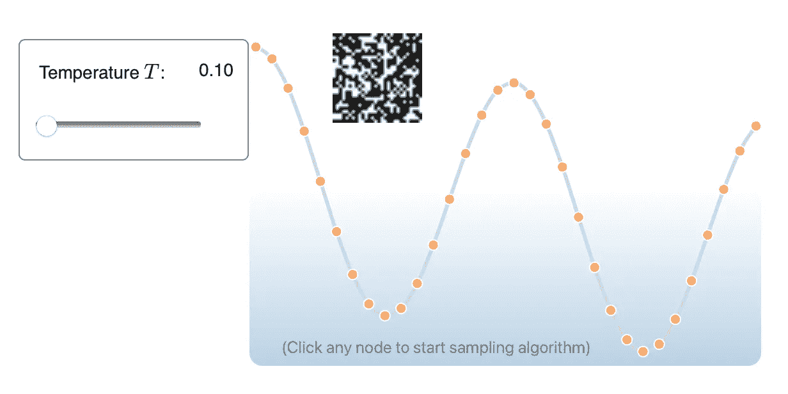******

********从玻尔兹曼分布中取样(此图的交互式版本可在** [**这里找到**](http://physicsofebm.github.io/) **)。**该图显示了一个简化的能量景观，其中能量函数的最小值对应于编码一个 MNIST 数字的状态。相邻状态是随着能量增加而变得越来越嘈杂的变体。采样算法从随机选择的状态开始，您可以通过单击相应的黄色点来选择该状态。在非常低的温度下，算法的每一步都将状态更新为具有较低能量的状态，直到我们达到并停留在局部最小值。当前状态以红色突出显示。在更高的温度下，算法的每一步都可能跳到更高的能量状态，并且最终的采样状态不一定是局部最小值。******

# ******吉布斯采样******

******对该算法的一个可能的改进是找到局部更新规则在寻找低能量状态方面甚至更好的模型。本地更新的问题是能量的变化******

******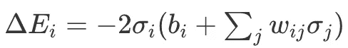******

******对于节点*，i* 依赖于所有其他节点的状态。因此，每次状态σi *σi* 被更新时，影响会扩散到所有其他节点，改变它们的本地更新规则。但对于 RBM 来说，情况并非如此。可见节点中的能量变化，******

******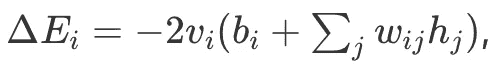******

******不依赖于任何其他可见节点:当其中一个节点翻转时，其他可见节点不受影响。这使得本地更新规则更加有效，因为可见节点的整个集合可以被视为单个实体。当可见节点固定时，类似的语句适用于更新隐藏节点。事实上，RBM 中缺乏层内相互作用意味着条件概率 *P* ( *v|h* )和 *P* ( *h|v* )分解为:******

******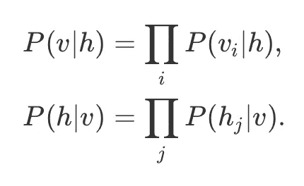******

******此外，由于同一层中节点之间的独立性，单个条件概率可以通过分析计算得出，如下所示:[33]******

************

******剩余的概率*p*(hⱼ= 1 |*v*)和*p*(*v*ᵢ= 1 |*h*)遵循这些等式。RBM 的这些特性允许一种新的采样策略:******

1.  ******修复隐藏的节点。从条件分布*p*(*v | h*)=∏ᵢ*p*(*v*ᵢ|*h*)中通过从其分布*p*(*v*ᵢ*| h*)中独立采样每个节点的状态来从条件分布*p*(*中采样可见节点。*******
2.  ******根据上一步的示例修复可见节点。从条件分布*p*(*h | v*)=∏ᵢ*p*(*h*ᵢ|*v*)中抽取隐藏节点，从其分布
    *p*(*h*ᵢ|*v*中独立抽取每个节点的状态。******
3.  ******重复上述步骤 *N* 次，选择合适的 *N* 。******

******由此产生的状态( *v* ， *h* )将从系统的波尔兹曼分布中近似采样。这种算法被称为*吉布斯采样*，它是实践中对 RBM 进行采样的典型方法【3】。******

# ******培养******

******我们已经知道，概率模型可以根据与热平衡的物理系统相同的原理来构建。我们还确定了有用的架构，并开发了从它们的玻尔兹曼分布中取样的算法。最后一个挑战仍然存在:如何训练这些系统来执行特定的任务？在这种情况下，训练等价于逆伊辛问题；即识别产生期望概率分布的能量函数的参数。******

******为了便于说明，考虑一个简单的物理系统:一个质量 *m* 与一个弹簧相连。弹簧的特征在于常数 *k* 并且质量经受位置相关的力*F*(*y*)=*ky*，其中 *y* 是质量的位移。如果将质量置于重力场中，它会受到一个恒定的外力 *F* ᴳ= *mg* ，其中 *g* 为重力加速度。只有在这两个力平衡的精确位置，即当*f*ᴳ+*f*(*y*)= 0 时，质量才处于平衡状态。******

******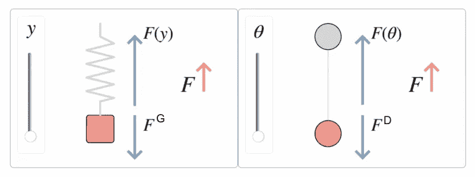******

********训练与平衡(此图互动版可在** [**此处**](http://physicsofebm.github.io/) **)。**与训练耦合节点相比，弹簧-质量系统中的平衡力。质量是固定的，重力 *F* ᴳ是恒定的。如果弹簧伸展到一个位置，使得*f*(*y*)=*f*ᴳ，即，使得合力 *F* 为零，则力处于平衡状态。在一个简单的基于能量的模型中，外部“力” *F* ᴰ，即节点对数据的期望值，是恒定的。培训包括识别联轴器 *θ* ，以使虚拟力 *F* ( *θ* )与 F(θ)=Fᴰ的数据“力”平衡。******

******对于具有单参数能量函数*e*(*x*)=*θf*(*x*)的模型，期望值⟨ *f* ( *x* )⟩是玻尔兹曼分布的充分统计量——知道这个期望值唯一地固定了参数 *θ* ，因此也固定了分布*p*(*x*)= 1/目标是训练一个基于能量的模型来重现数据集的统计数据，指定为一组状态( *x* ⁽ ⁾， *x* ⁽ ⁾,…， *x* ⁽ᵐ⁾).)训练模型相当于辨识参数 *θ* ，使得模型的充分统计量与数据的充分统计量一致，即⟨*f*(*x*)⟩ᵐᵒᵈᵉᴵ=⟨*f*(*x*)⟩ᵈᵃᵗᵃ。由于对模型分布的期望取决于 *θ* ，对于合适的函数 *F* ( *θ* )，我们可以写成⟨*f*(*x*)⟩ᵐᵒᵈᵉᴵ=:*f*(*θ*)。对数据的期望是不变的，所以我们可以写成
⟨*f*(*x*)⟩ᵈᵃᵗᵃ=:*f*ᴰ。将这些解释为作用在相反方向上的广义力，并将参数 *θ* 解释为广义位置，当位置 *θ* 使得力处于平衡状态时训练模型:*f*ᴰ+*f*(*θ*)= 0。******

******当力不平衡时，例如如果重力的拉力超过了弹簧的恢复力，物体就会加速并改变位置。对于静止开始的物体，由于力的不平衡引起的初始位移为******

******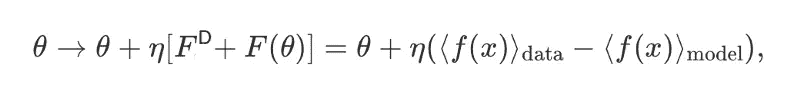******

******其中 *η* > 0 是一个常数，取决于物体的质量和力作用的时间。第一个力 *F* ᴰ可以解释为由外部系统产生的外力，比如地球引力场。对于基于能量的模型，外部系统实际上是一组训练数据，其向数据集中出现的优选状态提供恒定的“拉力”。第二个力 *F* ( *θ* )代表系统对某些状态的自然偏好。这提供了一个内部提升，对抗训练数据的向下拉力。至关重要的是，在两个不同方向的竞争力量存在的情况下，由此产生的位移导致物体移动到一个减少力量不平衡的位置。例如，在弹簧-质量系统中，如果*f*ᴳ>ky，质量被向下拉到一个新的位置*y*′>t14】y，这增加了弹簧产生的力，使两个力更接近平衡。通过对足够小的步长重复应用上述更新规则，可以找到平衡两个虚拟力的参数值，从而得到训练模型。我们现在将这种物理直觉发展成基于能量模型的具体训练策略。******

# ******训练 Hopfield 网络******

******训练 Hopfield 网络等同于识别参数，使得能量函数的基态是输入数据的状态。假设给我们一个单一的 n 维数据向量σ⁽⁾.有一个简单的方法来确保它是一个基态:设置所有的 *b* ᵢ=0 并固定*w*ᵢⱼ=*σ*ᵢ⁽⁾*σ*ⱼ⁽⁾。于是，能量函数是*e*(*σ*)=−⟨*σ*⁽⁾， *σ* ⟩，当内积⟨ *σ* ⁽ ⁾，*σ*⟩=σᵢ*σ*ᵢ⁽⁾， *σ* ᵢ最大化时，即当*σ*=时，能量函数达到最小值对于更多的数据点 *σ* ⁽ ⁾、 *σ* ⁽ ⁾,…、 *σ* ⁽ᵐ⁾，我们遵循类似的规则，这次将交互参数设置为******

******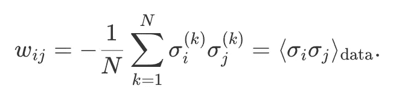******

******注意我们之前研究的虚构力的出现。这种策略被称为 *Hebbian 学习*，当所有数据向量几乎相互正交时效果最佳，在这种情况下，所有数据点都是能量函数的局部最小值【34，35】。否则，可能会出现与数据向量不对应的所谓伪最小值，从而导致错误的内存检索[36]。******

******为了解决伪最小值的问题，引入了“不学习”的概念来提高 Hopfield 网络的性能[37]。对于不学习，根据以下条件设置参数******

******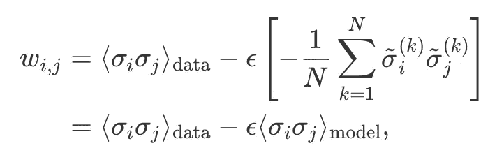******

******其中*ϵ*t40】0 是一个小参数。模型平衡状态******

******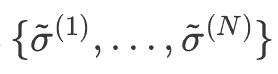******

******通过选择一个随机的初始状态并使用前面描述的采样算法找到平衡状态来获得。在采样过程中，模型的权重根据赫比规则设置。在模型状态上增加这个期望值导致所有最小值的能量增加，包括虚假的。通过适当选择 *ϵ* 的值，这种能量的增加可以导致虚假最小值的消失，从而导致“不学习”。******

# ******训练波尔兹曼机器******

************

********训练一个 RBM(此图的交互版可以在这里找到******):**偏置可以通过移动“偏置域”内的节点来调整。可以使用 2D 滑块来调整权重。右边的直方图显示了某个状态变得有多可能。我们鼓励读者尝试调整 RBM 的参数，以便它学习某种数据模式，即最有可能产生特定的可见状态。********

******当应用于 Boltzmann 机器时，Hebbian 学习和去学习技术是有问题的:因为只有可见节点编码数据，所以不清楚如何给隐藏节点赋值。Hebbian 学习规则可以提升为一个*更新*规则，该规则通过每一步迭代地提高权重。通过这样做，我们允许隐藏的节点与可见的节点一起“移动”，从而训练完整的模型。从初始值 *w* ᵢⱼ开始，权重被更新为******

******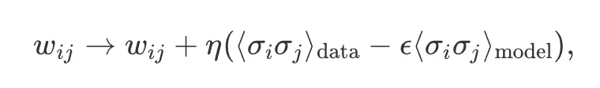******

******其中*η*0 为小*学习率*。每当 *σ* ᵢ *σ* ⱼ包含隐藏节点时，通过将可见单位固定到数据上，然后使用 Gibbs 采样来获得隐藏节点的值，从而获得数据的平均值。在 RBM 的特定情况下，当设置 *ϵ* =1 时，更新规则采用以下形式******

******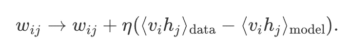******

******这一规则被称为用于培训 RBM 的*对比差异*公式。希伯来学习术语⟨ *v* ᵢ *h* ⱼ ⟩ᵈᵃᵗᵃ，通常被称为*正相位*，降低了训练数据的状态能量。未学习项⟨*v*ᵢ*h*ⱼ⟩ᵐᵒᵈᵉᴵ(*负相*)增加了所有接近平衡态的能量。下图说明了竞争的 Hebbian 学习项和 unlearning 项如何帮助学习一个模式，同时避免局部伪最小值。******

******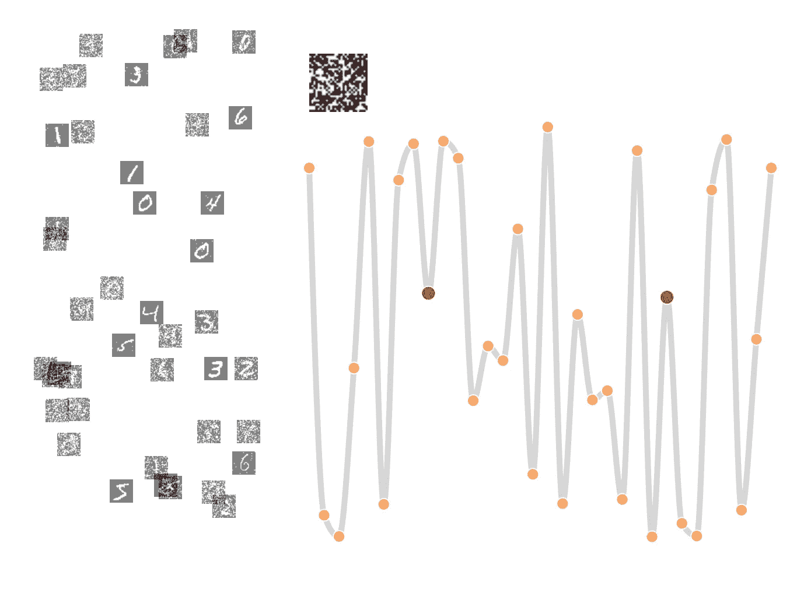******

********学习与遗忘(该图的交互式版本可以在这里找到******):**一个随机初始化的系统有一个能量景观(这里用一条简化的曲线表示)，它有许多不同的局部极小值。在物理学中，这通常被称为自旋玻璃相[34]。在基于能量的模型中，学习某个状态(红点)意味着它们的能量需要减少。这可以通过局部更新模型权重的“学习步骤”来实现，以降低数据状态的能量，我们称之为 Hebbian 学习项(正阶段)。你可以点击“不遗忘”按钮来尝试一下。这种策略的缺点是，依赖于系统的初始化，其他点的能量可能是局部最小值。相反，通过在学习和遗忘步骤之间交替，你可以通过点击“有遗忘”按钮来做到这一点，虚假最小值的出现可以通过遗忘项(负相位)来减少。将鼠标悬停在橙色和红色的点上可以显示它们代表的图案。在左边，我们从一个更全球化的视角展示了某些状态的能量会发生什么。********

******对比发散的作用是逐渐塑造模型的能量函数，直到模型的所有低能态对应数据点。将权重视为广义位置，我们将术语
δ*w*ᵢⱼ:=⟨*v*ᵢ*h*ⱼ⟩ᵈᵃᵗᵃ−⟨*v*ᵢ*h*ⱼ⟩ᵐᵒᵈᵉᴵ解释为源自两个竞争力的净力:由数据产生的固定外力，以及由系统的特定广义位置产生的内力。当力不平衡时，会导致位置向力更接近平衡的方向移动。权重的每一次移动都在影响所有力的整个模型中传播，因此对比发散训练算法的策略是设置一个小的学习率 *η* ，直到所有力都平衡并且模型被训练。******

******下图收集了我们到目前为止所涉及的概念，展示了一个训练有素的 RBM 如何从损坏的输入中恢复数据实例。一旦模型被训练，能量函数的最小值对应于编码数据。具有大能量的受损输入可以通过允许系统平衡回到低能量状态来修复。******

******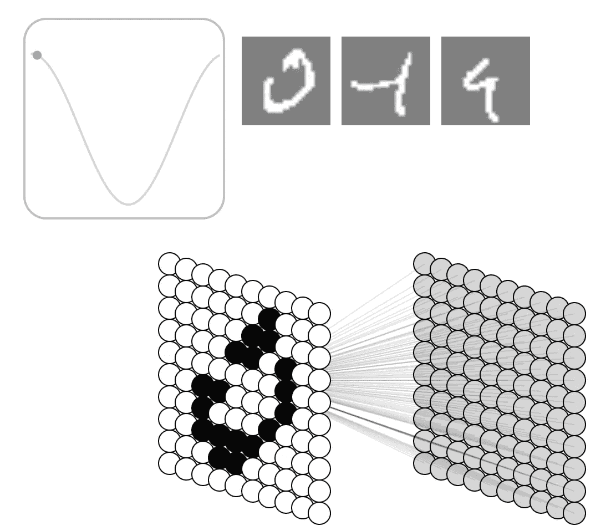******

********使用 RBM 恢复受损图像(此图互动版可在** [**此处**](http://physicsofebm.github.io/) **)。**在这个例子中，用部分损坏的 MNIST 数字初始化训练模型的可见单元。经过训练的模型的低能量状态对应于真实的 MNIST 数字，因此可以通过更新网络的节点来修复输入，直到它们对应于平衡状态。这可以通过吉布斯采样来实现。第一步，可见节点固定，隐藏节点通过从条件分布 *P* ( *h|v* )中采样其新状态进行更新。下一步是修复隐藏节点并对可见节点进行采样。重复这一过程，每一步都降低能量(用人工曲线可视化),直到恢复平衡状态。******

# ******展望:物理学和机器学习的未来研究******

******基于能量的模型正经历着兴趣的复苏:它们训练稳定，需要很少的参数，表现出高样本质量，泛化能力，并服从组合性[13]。这些都是其他生成模型，如变分自动编码器或生成敌对网络难以应对的特征。在提高培训规模方面也取得了进展[13，38]。随着这些发展，有迹象表明这一系列模型继续与机器学习相关。然而，基于能源的模型还需要在几个前沿领域进行改进。由于状态空间的组合爆炸，对离散数据的学习和推理仍然极具挑战性，这通常被称为维数灾难。特别是，基于能量的模型中的训练和概率推断仍然是低效的。这是由于计算或采样配分函数的困难，从计算复杂性的角度来看，这是一项困难的任务，这源于最坏情况下离散优化问题的 NP 难度。开发基于物理的模型来解决这些困难是一个重要的机会，特别是从我们下面讨论的非平衡统计物理或量子模型的前景来看。在机器学习、量子计算、多体物理学和最优化的界面上有令人兴奋的新兴研究领域。这种融合提供了一个独特的机会，在这些主要学科之间的相互接口作出贡献。******

******在量子力学中，一个系统的可能状态被扩展到还包括不同状态上的*线性组合*，称为叠加态。例如，n 个 *n 个*粒子的状态先前由向量
*x* =( *x* ₁、 *x* ₂、…、 *x* ₙ).表示在量子设置中，更一般的状态 *ψ* 是可能的，具有以下形式******

******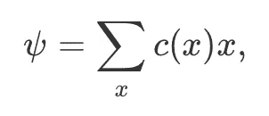******

******其中复系数 *c* ( *x* )满足∑ₓ | *c* ( *x* )| =1。这个性质产生了干涉和纠缠等概念。第二个变化是能量函数，通常在这种情况下称为哈密顿量，被算子所取代。它们通常采取以下形式******

******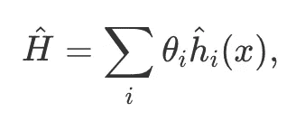******

******其中帽子用来表示这些是操作符。这一变化具有深远的影响:运营商通常不通勤，即它可能持有******

******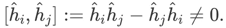******

******这一特性是不确定性原理和不可克隆定理等概念的基础。******

******作为一个具体的例子，我们可以用一个哈密顿量来描述量子玻尔兹曼机******

******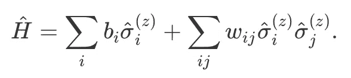******

******单个运算符 *σ* ᵢ⁽ᶻ⁾，当表示为矩阵时，采用以下形式******

************

******上标用来表示算子是对角的特定基。通过使用非交换操作符，这个模型可以变得更有趣******

******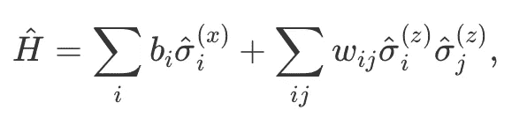******

******在哪里******

******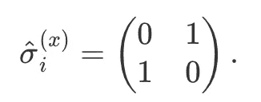******

******请注意， *σ* ᵢ⁽ˣ⁾不与 *σ* ⱼ⁽ᶻ⁾一起通勤。这被称为*横向场伊辛模型*。量子玻尔兹曼机是一个由任何这样的哈密顿量描述的系统，它至多涉及粒子间的成对相互作用。从理论上理解这些模型，推导出有效训练它们的方法，并在实践中实现它们，这些都是目前正在进行的任务[19，40，41]。******

******除了量子模型，我们还可以考虑自旋玻璃——伊辛哈密顿量的推广——它为表示离散优化问题提供了一种计算通用语言[42，54]。这种系统的能量函数包含以下形式的项******

******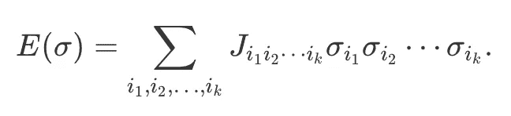******

******值得注意的是，这种广义自旋玻璃系统的低能态的物理复杂性和找到所有这种态的巨大困难与计算机科学中许多重要问题的计算复杂性有着根本的联系。例如，这在数学上等价于在给定的近似比内对 NP-hard 组合优化问题的高质量解进行计数[43]，或者在图形模型中对概率推断进行采样配分函数[44]。因此，探索广义自旋玻璃复合体的结构和动力学及其相变可以导致对非平衡复杂动力学系统中涌现的多体现象的更深入理解，这些现象是几十年来跨越许多不同学科的主要公开问题，包括凝聚态物理、物理化学、生物学、理论神经科学、经济学和社会科学。******

******对这类问题的解空间进行采样的一类受概率物理学启发的方法是基于马尔可夫链蒙特卡罗技术，例如 Metropolis-Hastings 算法、模拟退火[45]和并行回火[46]。更先进的方法是在马尔可夫链蒙特卡罗家族的主干算法上结合概率聚类更新策略[47，48，49，50，51，52]。然而，这些方法要么对受抑自旋玻璃系统失效[48]，对大于 2 的维度进行过滤[49]，要么假设随机的树状子图[50，51，52]，这些子图不一定与潜在自旋玻璃问题的实际低能激发“液滴”相关。******

******不幸的是，自旋玻璃系统的离散性质及其包含大量无序和挫折的固有能力，使得将现成的基于梯度的机器学习算法应用于这种复杂系统成为可能。最近，已经进行了一些尝试，在生成模型中应用先进的技术，例如通过基于 MCMC 的工具(如平行回火)和某些弛豫技术来表征自旋玻璃复合物[54]来组合归一化流。******

******已经证明可以成功地学习自旋玻璃相的某些物理和计算性质，包括多模态稳态分布和亚稳态之间的拓扑结构。值得注意的是，学习本身可以对应于经过训练的归一化流层内自旋玻璃的相变[54]。总的来说，有机会采用机器学习和统计力学技术的这种组合，以针对困难问题的某些子集的实例方式有效地采样高质量的解决方案。[61]******

******物理学和机器学习的进步将受益于这两个领域之间的相互作用。机器学习与量子计算、量子控制和多体系统的接口正在出现。机器学习工具可以帮助理解物理数据[55，56]，设计新的实验[57]，用新的方法解决老问题[58]。类似地，来自物理学的见解可以激发新的模型，并导致新的硬件。物理学和机器学习相结合，继续扩展视角，增加理解，并推动技术的前沿。******

********本帖互动版可以在** [**这里**](http://physicsofebm.github.io/) 找到。由于 Medium 不支持用 Latex 编写的 Javascript 和方程，我们建议也查看一下我们的交互式帖子。******

# ******参考******

1.  ******具有突发集体计算能力的神经网络和物理系统
    霍普菲尔德，J.J .，1982。美国国家科学院院刊，第 79 卷(8)，第 2554-2558 页。国家科学院。******
2.  ******玻尔兹曼机器的学习算法
    Ackley，D.H .，Hinton，G.E .和 Sejnowski，T.J .，1985。认知科学，第 9 卷(1)，第 147-169 页。爱思唯尔。******
3.  ******论对比差异学习。卡雷拉-佩皮南，硕士和辛顿，通用电气公司，2005 年。《美国统计》，第 10 卷，第 33-40 页。******
4.  ******基于能量的学习指南
    LeCun，y .，Chopra，s .和 Hadsell，r .，2006。******
5.  ******用人工神经网络解决量子多体问题
    Carleo，g .和 Troyer，m .，2017。科学，第 355 卷(6325)，第 602-606 页。美国科学促进协会。******
6.  ******用深度神经网络高效表示量子多体态
    高，x .和段，l . 2017。《自然通讯》，第 8 卷第 1 期，第 662 页。自然出版集团。******
7.  ******神经网络量子状态层析成像
    Torlai，g .，Mazzola，g .，Carrasquilla，j .，Troyer，m .，Melko，r .和 Carleo，g .，2018。自然物理学，第 14 卷第 5 期，第 447 页。自然出版集团。******
8.  ******量子物理中的受限玻尔兹曼机器
    Melko，R.G .，Carleo，g .，Carrasquilla，j .和 Cirac，J.I .，2019。自然物理学，第 15 卷(9)，第 887-892 页。自然出版集团。******
9.  ******用于协同过滤的受限波尔兹曼机器
    Salakhutdinov，r .，Mnih，a .和 Hinton，g .，2007。第 24 届机器学习国际会议论文集，第 791–798 页。******
10.  ******基于深层结构能量的异常检测模型
    翟，s，程，y，陆，w，张，z，2016。arXiv:1605.07717。******
11.  ******使用均值协方差受限玻尔兹曼机进行电话识别
    Dahl，g .，Ranzato，m .，Mohamed，a .和 Hinton，G.E .，2010。神经信息处理系统进展，第 469-477 页。******
12.  ******关于基于能量的模型的自动编码器和分数匹配
    Swersky，k .，Buchman，d .，Freitas，N.D .，Marlin，B.M .等人，2011 年。第 28 届机器学习国际会议录(ICML-11)，第 1201–1208 页。******
13.  ******基于能源的模型中的隐式生成和推广
    Du，y .和 Mordatch，I .，2019。arXiv:1903.08689。******
14.  ******深度信念网络是紧凑的通用近似器
    勒鲁和本吉奥，纽约，2010 年。神经计算，第 22 卷(8)，第 2192–2207 页。麻省理工出版社。******
15.  ******生成性对抗网络、逆向强化学习和基于能量的模型之间的联系
    Finn，c .，Christiano，p .，Abbeel，p .和 Levine，s .，2016。arXiv 预印本 arXiv:1611.03852。******
16.  ******基于深度能源政策的强化学习
    Haarnoja，t .，Tang，h .，Abbeel，p .和 Levine，s .，2017。第 34 届机器学习国际会议论文集-第 70 卷，第 1352-1361 页。******
17.  ******基于能源模型的模型规划
    Du，y .，Lin，t .和 Mordatch，I .，2019。arXiv:1909.06878。******
18.  ******基于能量的生成对抗网络
    赵，j . Mathieu，m .和 LeCun，y . 2016。arXiv:1609.03126。******
19.  ******量子玻尔兹曼机器
    Amin，M.H .，Andriyash，e .，Rolfe，j .，Kulchytskyy，b .和 Melko，r .，2018。物理评论 X，第 8 卷(2)，第 021050 页。APS。******
20.  ******连续问题的量子近似优化算法
    Verdon，g .，Arrazola，J.M .，Bradler，k .和基洛兰，n .，2019。arXiv 预印本 arXiv:1902.00409******
21.  ******经典力学
    戈尔茨坦，h，2002。{培生教育}。******
22.  ******信息论和统计力学
    杰恩斯，E.T .，1957。物理评论，第 106 卷(4)，第 620 页。APS。******
23.  ******学习用于分类的判别充分统计得分空间
    李，x，王，b，刘，y，李铁生，2013。数据库中的机器学习和知识发现欧洲联合会议，第 49-64 页。******
24.  ******使用所有数据的逆伊辛推理
    Aurell，e .和 Ekeberg，m .，2012。物理评论快报，第 108 卷(9)，第 090-201 页。APS。******
25.  ******伊辛模型简介
    Cipra，文学学士，1987 年。美国数学月刊，第 94 卷(10)，第 937-959 页。泰勒和弗朗西斯。******
26.  ******非微扰 k 体到两体交换转换哈密顿量并将问题实例嵌入伊辛自旋
    Biamonte，j .，2008。物理评论 A，第 77 卷(5)，第 052331 页。APS。******
27.  ******用于编译绝热量子优化问题的资源高效小工具
    Babbush，r .，O'Gorman，b .和 Aspuru-Guzik，a .，2013 年。《物理学年鉴》，第 525 卷(10-11 期)，第 877-888 页。威利在线图书馆。******
28.  ******受限玻尔兹曼机器和深度信念网络的代表性力量
    Le Roux，n .和 Bengio，y .，2008。神经计算，第 20 卷第 6 期，第 1631-1649 页。麻省理工出版社。******
29.  ******探索深度学习中的泛化
    Neyshabur，b .，Bhojanapalli，s .，McAllester，d .和 Srebro，n .，2017。神经信息处理系统进展，第 5947–5956 页。******
30.  ******神经网络:系统介绍。施普林格出版社。******
31.  ******使用马尔可夫链的蒙特卡罗抽样方法及其应用
    黑斯廷斯，W.K .，1970。牛津大学出版社。******
32.  ******大都会—黑斯廷斯算法
    罗伯特，C.P .和卡塞拉，g .，1999 年。蒙特卡罗统计方法，第 231-283 页。斯普林格。******
33.  ******受限玻尔兹曼机器介绍
    Fischer，a .和 Igel，c .，2012。伊比利亚美洲模式识别大会，第 14-36 页。******
34.  ******神经网络的自旋玻璃模型
    Amit，D.J .，Gutfreund，h .和 Sompolinsky，h .，1985 年。物理评论 A，第 32 卷(2)，第 1007 页。APS。******
35.  ******神经网络的自旋玻璃模型[【链接】](https://link.aps.org/doi/10.1103/PhysRevA.34.3435)
    范·赫蒙，法学博士，1986 年 10 月 1 日。，第 34 卷(4)，第 3435-3445 页。[DOI:10.1103/physreva . 34.3435](https://doi.org/10.1103/PhysRevA.34.3435)******
36.  ******神经网络:系统介绍
    罗哈斯，r .，2013 年。施普林格科学\ &商业媒体。******
37.  ******“忘却”在集体记忆中有稳定作用[【链接】](http://www.nature.com/articles/304158a0)
    霍普菲尔德，J.J .，范斯坦，D.I .和帕尔默，R.G .，1983–07。，第 304 卷(5922)，第 158 页。 [DOI: 10.1038/304158a0](https://doi.org/10.1038/304158a0)******
38.  ******基于 MCMC 的基于能量模型的最大似然学习剖析
    Nijkamp，e .，Hill，m .，Han，t .，Zhu，s .和 Wu，Y.N .，2019。******
39.  ******量子计算与量子信息
    尼尔森，硕士，庄，2002。AAPT。******
40.  ******量子变分自动编码器[【链接】](https://doi.org/10.1088%2F2058-9565%2Faada1f)
    Khoshaman，a .，Vinci，w .，Denis，b .，Andriyash，e .，萨德吉，h .和 Amin，M.H .，2018。量子科学与技术，第 4 卷(1)，第 014001 页。{IOP}发布。DOI:10.1088/2058–9565/aada1f******
41.  ******用量子玻尔兹曼机器进行断层成像和生成训练
    Kieferova，m .和 Wiebe，n .，2017。物理评论 A，第 96 卷第 6 期，第 062327 页。APS。******
42.  ******旋转眼镜与复杂性[【链接】](http://www.jstor.org/stable/j.ctt12f4hf)
    Stein，D.L .和 Newman，C.M .，2013。普林斯顿大学出版社。******
43.  ******信息、物理和计算。牛津大学出版社。******
44.  ******计算的本质[【链接】](https://www.amazon.com/Nature-Computation-Cristopher-Moore/dp/0199233217)
    Moore，c .和 Mertens，s .，2011。牛津大学出版社。******
45.  ******模拟退火优化[【链接】](https://science.sciencemag.org/content/220/4598/671)
    柯克帕特里克，s .，格拉特，C.D .和韦奇，M.P .，1983。科学，第 220 卷(4598)，第 671-680 页。美国科学促进协会。[DOI:10.1126/science . 220 . 4598 . 671](https://doi.org/10.1126/science.220.4598.671)******
46.  ******平行回火:理论、应用和新观点[【链接】](http://dx.doi.org/10.1039/B509983H)
    Earl，D.J .和 Deem，M.W .，2005 年。物理化学。化学。物理学，第 7 卷(23)，第 3910-3916 页。皇家化学学会。 [DOI: 10.1039/B509983H](https://doi.org/10.1039/B509983H)******
47.  ******蒙特卡罗模拟中的非普适临界动力学。物理牧师列特。，第 58 卷(2)，第 86-88 页。美国物理学会。[DOI:10.1103/physrevlett . 58.86](https://doi.org/10.1103/PhysRevLett.58.86)******
48.  ******自旋系统的集体蒙特卡罗更新[【链接】](https://link.aps.org/doi/10.1103/PhysRevLett.62.361)
    沃尔夫，美国，1989。物理牧师列特。，第 62 卷(4)，第 361-364 页。美国物理学会。[DOI:10.1103/physrevlett . 62.361](https://doi.org/10.1103/PhysRevLett.62.361)******
49.  ******二维自旋玻璃的一种团簇蒙特卡罗算法[【链接】](https://doi.org/10.1007/PL00011151)
    侯代尔，j .，2001。欧元。《物理学报》,第 22 卷第 4 期，第 479-484 页。 [DOI: 10.1007/PL00011151](https://doi.org/10.1007/PL00011151)******
50.  ******从田地到树木，Hamze，f .和 de Freitas，n .，2004 年。第 20 届人工智能不确定性会议论文集，第 243-250 页。AUAI 出版社。******
51.  ******带挫折的{Ising-type}模型的高效子图采样
    Selby，a .，2014。******
52.  ******用聚类自旋的优化树求解自旋眼镜[【链接】](https://link.aps.org/doi/10.1103/PhysRevE.96.022105)
    Hen，I . 2017。物理评论 E，第 96 卷(2)，第 022105 页。美国物理学会。[DOI:10.1103/phys reve . 96.022105](https://doi.org/10.1103/PhysRevE.96.022105)******
53.  ******自旋玻璃系统的概率密度理论
    Hartnett，G.S .和 Mohseni，m .，2020 年。******
54.  ******具有归一化流的生成自旋玻璃的自我监督学习
    Hartnett，G.S .和 Mohseni，m .，2020。******
55.  ******相变的无监督学习:从主成分分析到变分自动编码器
    Wetzel，S.J .，2017。物理评论 E，第 96 卷(2)，第 022140 页。APS。******
56.  ******多体定位中相变特征的自动发现
    Huembeli，p .，Dauphin，a .，魏特克，p .和 Gogolin，c .，2019。物理评论 B，第 99 卷(10)，第 104-106 页。APS。******
57.  ******主动学习机学习创造新的量子实验
    Melnikov，A.A .，Nautrup，H.P .，Krenn，m .，Dunjko，v .，Tiersch，m .，Zeilinger，a .和布里格尔，H.J .，2018。美国国家科学院院刊，第 115 卷(6)，第 1221-1226 页。国家科学院。******
58.  ******用神经网络发现物理概念
    Iten，r .，Metger，t .，Wilming，h .，Del Rio，l .和 Renner，r .，2018。arXiv 预印本 arXiv:1807.10300。******
59.  ******使用随机磁性隧道结的整数因子分解
    Borders，W.A .，Pervaiz，A.Z .，Fukami，s .，Camsari，K.Y .，Ohno，h .和达塔，s .，2019。《自然》，第 573 卷(7774 期)，第 390-393 页。自然出版集团。******
60.  ******每秒千万亿次运算的自主概率协同处理
    萨顿，b .，法利亚，r .，甘塔萨拉，L.A .，贾斯瓦尔，r .，卡姆萨里，K.Y .和达塔，s .，2020。IEEE 访问，第 8 卷，第 157238–157252 页。IEEE。******
61.  ******米（meter 的缩写））Mohseni 等人(2021 年)，正在编写中******