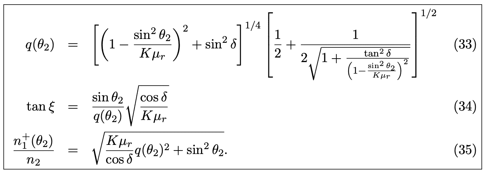

# 成功数据科学的支柱

> 原文：<https://towardsdatascience.com/the-pillars-of-successful-data-science-af4efe14b006?source=collection_archive---------36----------------------->

## 设计良好的分析数据仓库，利用自动化和自助分析

*作者图片*

数据科学(或可互换的分析)的目的是*使*业务用户能够根据数据做出更好的决策。定量数据通常比基于“猜测”或“直觉”的决策更好，但人们不应该盲目地遵循数据，因为——尤其是在商业环境中——必须在某些商业背景下和数据的限制范围内理解数据。在商业中，数据永远不会像在物理、化学、工程或其他硬科学中那样原始。我们没有运行高度受控实验的奢侈，也没有不变物理定律的优势！因此，当应用于业务时，从硬科学中借鉴的数据科学技术的使用应遵循以下一般理解:

1.  数据永远不会是原始的，并且几乎永远不会支持超过一个小数位的精确度(例如，不计算到 5 个小数位的转换率)。商业不是物理。
2.  数据科学家(或可互换的分析师)的主要目的是提供所需的主题专业知识，以判断数据有多好，应该使用什么数据科学技术，并了解我们对数据告诉我们的事情有多大信心。
3.  不能被业务用户理解的数据科学(或分析)是没有意义的；*其他*数据科学家的主要目的是知道如何以业务用户可以理解的方式传达分析结果。与营销总监谈论数据的一阶矩(即平均值)就像用粤语与只会说英语的人交谈一样有用。数据科学家必须有丰富的数学经验，但同样重要的是能够用简单的英语与非专家交流。
4.  报告不等于数据科学。报告的唯一目的是计数(例如，我们本周收到了多少订单？我们上个月卖了多少美元的小配件？).如果你付钱给一个数据科学家只是为了计数，你是在浪费他们的大脑和你的钱。数据科学是通过借用物理科学中长期使用的数学技术，获取原始的、基本的数据，并做出更高级的、不太明显的推论。然而，不要忘记上面那一点的重要性(第三点)。
5.  当应用于商业数据时，花哨的数学技术不会比简单的技术产生更好的结果。参见第 1 点。当应用于大多数业务数据时，使用简单的线性模型可能会产生与神经网络一样好的答案。更高级的方法是有时间和空间的，但是在尝试更复杂的方法之前，先尝试简单的方法并运用判断力。参见第 2 点。

而且数据越多不一定越好！这是一个根本性的误解。添加坏数据就像给音乐添加更多的“随机噪音”……它的数据，而不是能帮助你更好地欣赏这首歌的数据。

# 三大支柱

任何企业中运行良好、高效且有用的数据科学部门都有三大支柱:

1.  结构合理的[分析数据仓库](/the-basics-of-a-good-analytics-data-warehouse-4407b4b5ce50)，将业务分解为一系列事实、维度和用户表。理解这三种类型的表之间的根本区别是很重要的。使用这种方法的主要挑战之一是不能清楚地描述事实表、维度表和用户表之间的区别！一个*事实*表正是它在简单英语中的意思:围绕单个实体(例如，订单)的事实集合。*用户*表通常包含跨实体的事实的特定组合(例如，出于财务计划与运营计划的目的的订单的特定定义——运营计划用户表可以包括对问题订单的修复，因为其工作必须完成，而财务用户表可以排除修复，因为它们不产生收入)。在英语中，尺寸是单词“by”之后的任何东西。例如，按渠道的订单数量(即，渠道是一个维度)；各州的订单数量(即地理位置是一个渠道)。维度是为了理解数据而对数据进行“分段”的方式。
2.  [自动化](https://medium.com/codex/automation-or-ways-not-to-waste-the-talents-of-your-pricey-data-scientists-f8f2b93693b)使数据自动从数据源流入分析数据仓库，再从分析数据仓库流向用户。基本的标准分析应该在尽可能靠近数据仓库的地方自动应用，以避免浪费数据科学家的宝贵时间。他们拿工资是为了思考…而不是在电子表格间复制数据和应用简单的计算。
3.  使用自助式分析，通过 QlikView 或 Tableau 等商业智能工具向业务用户推送精选信息。业务用户应该拥有并理解他们自己的数据，以便他们能够做出快速的信息驱动的决策。请注意，我们故意说“精选信息”,因为大量缺乏理解或结构化的数据是无用且有害的；数据越多并不总是越好。

这三件事对于一个运行良好的数据科学功能是必要的，因为任何数据科学项目中的大部分时间(或努力)都是*而不是*数据科学本身！它是您需要的数据的*获取*，有用的数据科学的*重复* *执行*，以及数据科学的*发布*给业务用户，以便他们可以采取行动。我们将在以后的文章中详细阐述这些。