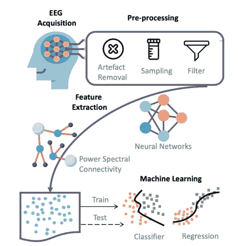
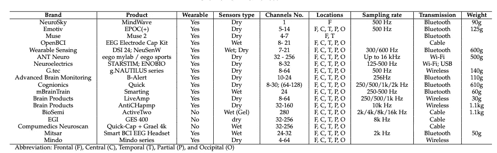

# 基于 EEG 的身份认证系统的流程和局限性

> 原文：<https://towardsdatascience.com/the-pipeline-and-limitations-of-the-eeg-based-authentication-systems-df9f0a05d9ff?source=collection_archive---------13----------------------->

## 人工智能应用

## 将语音识别集成到认证系统中的新方法(2)

照片由[马修·休姆](https://unsplash.com/photos/gRbkAc6bwmY)从 [Unsplash](https://unsplash.com/) 拍摄

在前一部分中，我们[回顾了现存的最常见的认证系统](/the-most-common-authentication-systems-explained-512cddc432ea?sk=83f828d31b08ab8559cb9d2a3340e78e)。我们意识到文本和图形密码以及生物识别方法的局限性，包括虹膜、指纹和面部识别。因此，在这一部分中，我们将深入探讨生物认证领域中更可行的方法之一:基于 EEG 的认证系统。

# 1.四个步骤

脑电在工业和科研中有着广泛的应用。它们涉及游戏交互的娱乐、机器人控制、情感识别、疲劳检测、睡眠质量评估和临床领域，如异常脑疾病检测和预测，包括帕金森病和阿尔茨海默病[ [10](https://arxiv.org/pdf/2001.11337.pdf) ]。使用脑电信号进行身份认证是由 Thorpe et al. [ [11](https://www.nspw.org/2009/proceedings/2005/nspw2005-thorpe.pdf) ]首先提出的；作者提出了一个新的想法，使用脑电波进行用户认证，称为 Pass-think。基于脑电信号的认证系统主要由四个步骤组成:**数据采集、预处理、特征提取和分类**，如下图所示。

脑电生物认证系统的四个主要模块。图片来自研究论文[ [10](https://arxiv.org/pdf/2001.11337.pdf)

## 1.1 数据采集

脑电采集协议可分为睁眼或闭眼放松、视觉刺激、精神任务(做特定任务的想象)和情绪刺激[ [12](https://ietresearch.onlinelibrary.wiley.com/doi/pdfdirect/10.1049/iet-bmt.2014.0040) ]。

## 1.2 数据预处理

预处理阶段涉及不同的信号处理技术，为特征提取做好准备。一些方法是:不同时期长度中的信号分段或分帧，信号滤波以提取某些 EEG 频带、噪声和伪像，以及去除伪像。alo mari et al .[[13](https://faculty.ontariotechu.ca/vargas/papers/EEG_PredictMemorability-ICMLA2018.pdf)]将通带为 0.1hz—40hz 的 Butterworth 滤波器应用于 EEG 数据，然后对数据进行分段、分类和伪迹检测，以研究在呈现密码期间测量的 EEG 信号之间的相关性，以及用户如何感知密码的可记忆性。他们的项目表明，有可能根据密码演示期间的脑电图活动来预测随后的密码回忆。

## 1.3 特征提取

**特征提取**是脑电信号处理的关键部分。这些技术已经在不同的领域得到应用，例如频率特征、时频特征、统计特征、基于熵的特征和高阶交叉(HOC)特征。Zeynali 等人[ [14](http://jad.shahroodut.ac.ir/article_1721_201fe0cafa680fc649fcaa27eabb1fdb.pdf) ]提出了一种通过使用离散傅立叶变换、离散小波变换、自回归建模、能量熵和样本熵来减少基于 EEG 的密钥生成过程的误差的模式。Petrantonakis [ [15](https://ieeexplore.ieee.org/abstract/document/5291724) ]对 EEG 数据应用了特别的特征提取分析来识别情绪。

EEGLAB 是用于 EEG 数据处理的最广泛的 Matlab 工具箱，它提供了一个交互式图形用户界面，供用户将独立分量分析(ICA)、时间/频率分析(TFA)和标准平均方法应用于记录的脑信号；开源实时 EEG 源映射工具箱(REST)是另一个在线伪影拒绝和特征提取的有用工具[10]。

## 1.4 分类

目前大多数基于 EEG 的脑机接口(BCI)都是基于**机器学习算法**，最近设计的基于 EEG 的 BCI 的分类算法可以分为四大类:自适应分类器、矩阵和张量分类器、迁移学习和深度学习，加上少数其他杂项分类器 [16](https://hal.inria.fr/hal-01846433/document) 。神经网络(NN)和支持向量机(SVM)已经被 Alomari 等人用于检查密码可记忆性和回忆的相关性[ [17](https://faculty.ontariotechu.ca/vargas/papers/EEG_PredictPMemorability-ICCC2019.pdf) ] [ [13](https://faculty.ontariotechu.ca/vargas/papers/EEG_PredictMemorability-ICMLA2018.pdf) ]。杨[18](https://www.koreascience.or.kr/article/JAKO202032255805996.pdf)提出了一种采用一键编码技术的多项分类法来识别用户的大脑密码。

# 2.限制

## 2.1 脑电图数据库的规模

大多数脑电图分析任务使用一个小数据集。Alomari 等人[ [13](https://faculty.ontariotechu.ca/vargas/papers/EEG_PredictMemorability-ICMLA2018.pdf) ]通过电子邮件广告从 77 名大学志愿者那里获得了使用 Muse 头带记录的脑电图数据；在他们的另一项研究工作[ [17](https://faculty.ontariotechu.ca/vargas/papers/EEG_PredictPMemorability-ICCC2019.pdf) ]中，他们通过对 19 名大学生进行实验室研究，在学生面前出示两套密码时记录数据，从而获得数据。样本量特别有限。

一些脑电图数据库可公开用于人类识别目的，例如 [UCI KDD 脑电图数据库](https://kdd.ics.uci.edu/databases/eeg/eeg.html)，脑电图运动/想象数据集，以及[澳大利亚数据库](https://pubmed.ncbi.nlm.nih.gov/15999902/)。尽管如此，数据集的规模不能决定所提出的系统可以推广到大规模的脑电图数据的表现。因此，需要在不同的数据采集场景下收集和测试更显著的群体，以证明 EEG 信号对于被视为每个人的标识的个体是唯一的。

## 2.2 心理健康的影响

在大多数实验中，健康人的大脑信号作为样本进行测试；然而，精神障碍存在于现实生活中，它可能会改变脑电波形状，从而改变分类模型的结果。关于精神障碍对脑波信号的影响以及脑电图鉴定结果的表现，还需要做更多的研究。

## 2.3 脑电图设备

大多数精确的脑电图设备需要在头皮上放置多个电极，不便于商业使用。随着技术的发展，越来越多的干电极便携式设备被发明并应用于日常生活中。下表列出了脑电图设备的概况；它规定了传感器类型(无论是干的还是湿的)、通道数量、采样率、重量以及与每种产品相对应的更多特性。干式设备的主要缺点是其精确度不如医疗领域中使用的其他 BCI 设备。因此，带有干电极的便携式设备是否是记录用于识别个人的 EEG 数据的合适选择，值得更多的研究。

所有脑电图设备。图片来自报纸[10]

> 在本系列的下一部分，我将更多地讨论基于语音的认证系统及其局限性，然后提出一个集成了语音识别的新型认证系统。

敬请关注，欢迎在 Linkedin 上留下评论和我联系。

<https://www.linkedin.com/in/fangyiyu/>  

# 第 1 部分后的参考资料:

[10] X. Gu，Z. Cao，A. Jolfaei，P. Xu，D. Wu，T.-P. Jung 和 C.-T. Lin，“基于 Eeg 的脑-机接口(bcis): [信号传感技术和计算智能方法及其应用的近期研究综述](https://arxiv.org/pdf/2001.11337.pdf)，《IEEE/ACM 计算生物学和生物信息学汇刊》，2021 年。

[11] J. Thorpe，P. C. Van Oorschot 和 A. Somayaji，“P[ass-thoughts:authenticating with our minds](https://www.nspw.org/2009/proceedings/2005/nspw2005-thorpe.pdf)”，载于《2005 年新安全范例研讨会会议录》，2005 年，第 45-56 页。

[12] M. Abo-Zahhad、S. M. Ahmed 和 S. N. Abbas，“[基于脑电图信号的个人识别的最新方法和未来前景”](https://ietresearch.onlinelibrary.wiley.com/doi/pdfdirect/10.1049/iet-bmt.2014.0040)，《IET 生物识别》，第 4 卷，第 3 期，第 179-190 页，2015 年。

[13] R. Alomari 和 M. V. Martin，“利用神经网络预测密码记忆性的脑电信号分类，”，2018 年第 17 届 IEEE 机器学习与应用国际会议(ICMLA)。IEEE，2018 年，第 791–796 页。

[14] M. Zeynali、H. Seyedarabi 和 b .莫扎法里·塔泽坎德，“[使用大脑信号开发具有可重复性的基于生物特征的唯一加密密钥生成](http://jad.shahroodut.ac.ir/article_1721_201fe0cafa680fc649fcaa27eabb1fdb.pdf),《人工智能和数据挖掘杂志》，第 8 卷第 3 期，第 343–356 页，2020 年。

[15] P. C. Petrantonakis 和 L. J. Hadjileontiadis，“使用高阶交叉点从脑电图中识别情绪”, IEEE 生物医学信息技术汇刊，第 14 卷，第 2 期，第 186-197 页，2009 年。

[16] F. Lotte，L. Bougrain，A. Cichocki，M. Clerc，M. Congedo，A .拉科-commonly，和 F. Yger，"[基于 EEG 的脑机接口分类算法综述:10 年更新](https://hal.inria.fr/hal-01846433/document)，《神经工程杂志》，第 15 卷，第 3 期，第 031005 页，2018 年。

[17] R. Alomari，M. V. Martin，S. MacDonald 和 C. Bellman，“使用脑电图预测和分析密码记忆性[，”2019 年 IEEE 认知计算国际会议(ICCC)。IEEE，2019 年，第 42–49 页。](https://faculty.ontariotechu.ca/vargas/papers/EEG_PredictPMemorability-ICCC2019.pdf)

[18] G.-C. Yang，“基于脑电信号和深度学习的[下一代个人认证方案](https://www.koreascience.or.kr/article/JAKO202032255805996.pdf)”，信息处理系统杂志，第 16 卷第 5 期，第 1034–1047 页，2020 年。