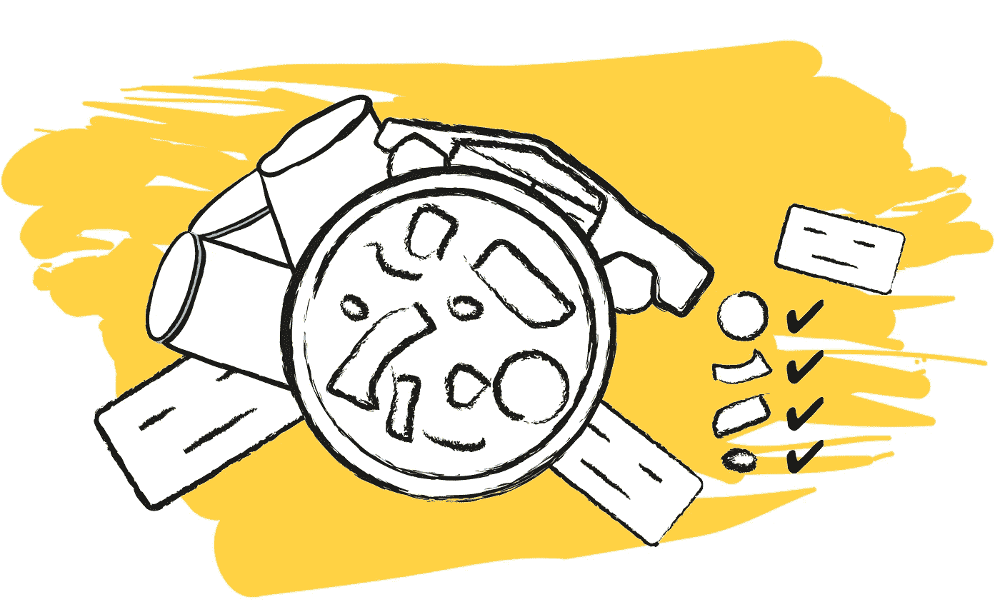
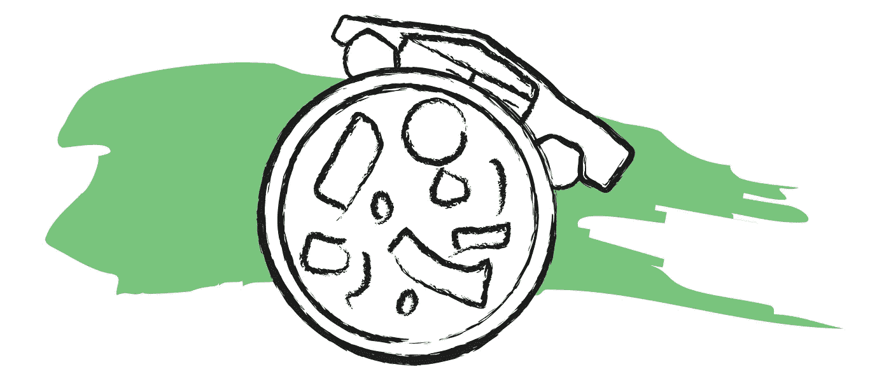
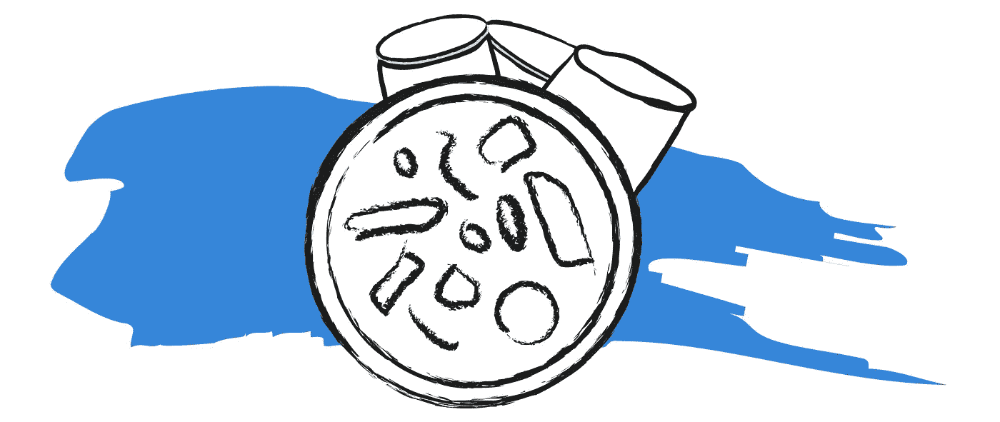
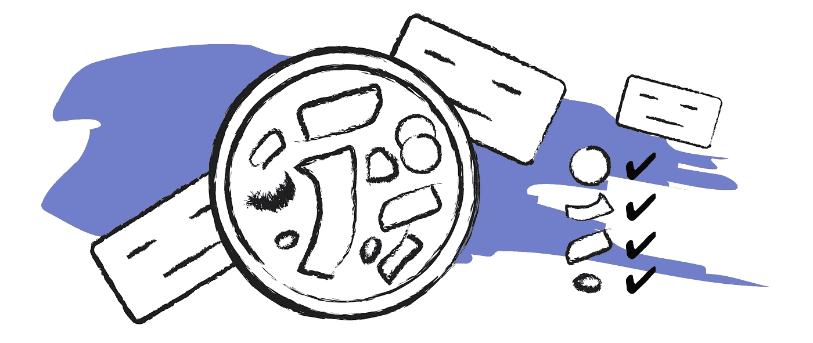
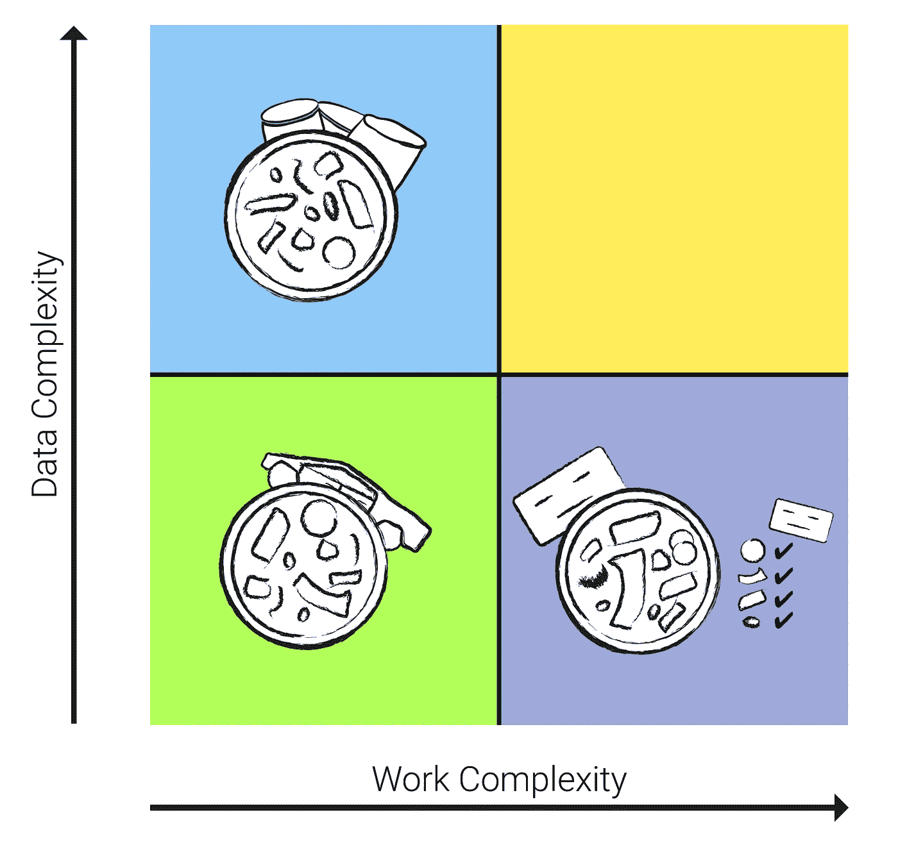

# 成为人工智能领跑者的披萨连锁店

> 原文：<https://towardsdatascience.com/the-pizza-chain-that-became-an-ai-front-runner-a0e297320cf6?source=collection_archive---------11----------------------->

## 达美乐比萨采用了几种人工智能策略

本文所有插图均由作者制作。

当你听到人工智能这个词时，你首先想到的是哪家公司？DeepMind？OpenAI？波士顿动力公司？不管是什么，很可能不是达美乐披萨。但这家国际披萨连锁店是人工智能的一个有趣案例。

达美乐对人工智能的采用相当引人注目，主要是因为该公司是 T2 最不可能采用人工智能的公司之一。是的，它是一家跨国非科技公司[，成立于 20 世纪 60 年代](https://biz.dominos.com/about/)，拥有精简的价值链和市场主导地位。如果你明白我的意思，具有这些特征的公司往往会在数字化派对上迟到。

对于拥有优化价值链的大公司来说，采用人工智能可能是一个巨大的挑战，因为流程往往需要从根本上重新设计。这就是为什么逐步采用人工智能解决方案并为每个活动使用合适的人工智能策略至关重要。

我最近发表了一篇关于人工智能商业策略的文章。如果你还没有读过，我会推荐[去看看](/4-business-strategies-for-implementing-artificial-intelligence-24deff39158c)，但是不管怎样，让我给你一个执行摘要。

人工智能可以通过自动化或增强来改善任何活动。自动化是从一项活动中去除人类，而增强是在一项活动中赋予人类权力。自动化和增强是一个包含四种人工智能策略的规模。世界上的每一个人工智能解决方案都可以放在以下四个人工智能战略中的一个或多个战略中:

1.  效率策略，通过自动化优化活动。
2.  有效性策略，在这种策略中，活动是无缝的，使得沟通更加容易。
3.  专家战略，人工智能赋予决策能力。
4.  创新战略，人工智能使创造力成为可能。

我们会发现，达美乐至少采用了这四种人工智能策略中的三种。让我带你看一下该公司的三个人工智能实现，然后在最后，我们将看一下更大的图片。

# 用自动驾驶车辆送披萨

众所周知，出租车、公交车和卡车司机将受到自动驾驶汽车的影响，但自动驾驶汽车也会影响许多其他行业。对于达美乐来说，这可能会影响披萨的配送方式。

这就是为什么达美乐在 2019 年开始了一项[自动驾驶披萨外卖试点计划](https://techcrunch.com/2019/06/17/dominos-serves-up-self-driving-pizza-delivery-pilot-in-houston)。该公司与自动驾驶汽车初创公司 Nuro 合作，后者提供自动驾驶电动汽车，这些汽车配备有锁在 PIN 码后面的车门。PIN 码只提供给订购披萨的人，因此潜在的披萨窃贼无法窃取不属于他们的披萨。该项目始于休斯顿，尽管达美乐比萨打算在未来几年全面推广。

# 通过人工智能助手订购披萨

你如何订购比萨饼？嗯，现在，如果你想接触一家比萨饼店，你有相当多的选择。举几个例子，你可以:

1.  给餐馆打电话。
2.  下载一个专门的送餐应用程序到你的手机上，然后在那里下单。
3.  在你的网络浏览器上访问一个送餐网站(或者，如果他们有，比萨饼店自己的网站)。
4.  亲自去比萨店，在那里下订单。
5.  使用人工智能聊天机器人。

在这五个选项中，第五个是最近发明的。而且，这是最快的。

你看，通过在你已经下载的应用程序(比如脸书或推特)上发信息或与一家公司的聊天机器人交谈，你只需几句话就可以点一份披萨，比如“把我最喜欢的发给我”用户可以比以往更快地订购产品，而无需下载任何额外的应用程序。在一些聊天机器人中，机器人可以记住你住在哪里，甚至你的信用卡信息，所以你也不需要提供这些信息。

你大概可以看到这是怎么回事。达美乐的确已经实现了[人工智能聊天机器人来订购披萨](https://anyware.dominos.com/)。相当令人惊讶的是，该公司已经将其人工智能订购助手放在几乎所有可以想象的平台上。用户可以通过 Google Home、亚马逊 Alexa、Slack、Twitter、Facebook Messenger、短信、智能手表，甚至福特 Sync 和三星智能电视订购披萨。顾客下单时不需要与任何人互动，因为人工智能完全自主地接受订单。用户可以保存他们喜欢的订单，这样只需说出两三个单词就可以完成整个订单。

# 用人工智能专家确保披萨的质量

达美乐还在使用人工智能来增强厨师的能力，以持续烹饪美味的披萨。达美乐注意到顾客在社交媒体上分享不好看的披萨照片，上面的配料不一致甚至不正确。

为了解决这个问题，该公司开始使用一种机器学习人工智能，他们称之为 [DOM Pizza Checker](https://dompizzachecker.dominos.com.au/) 。人工智能会拍摄餐厅厨师烹饪的每一张披萨的照片，并对其进行分析，根据各种标准对披萨进行分级。例如，DOM Pizza Checker 检查浇头和奶酪是否均匀分布，以及选择的配料是否适合比萨饼类型。

如果披萨不符合标准，人工智能会要求厨师重新制作。制作出令人满意的披萨后，照片会发送给顾客。通过这种方式，达美乐可以确保比萨饼送到时不会给顾客带来不必要的惊喜。

达美乐与 Dragontail Systems 合作开发人工智能。该系统的第一个版本花了两年时间才推出，现在正在自我完善，因为它每天都扫描披萨，并从每一个披萨中学习。

Domino 的三个 AI 实现应用于[一个 AI 策略框架](/4-business-strategies-for-implementing-artificial-intelligence-24deff39158c)。

# 整个组织的人工智能

这三种不同的人工智能应用是三种不同的人工智能策略的例子。

**效率战略:**用无人驾驶汽车运送披萨是价值链中一项活动完全自动化的例子。

**效果策略:**使用 AI 助手接单，让一个活动无缝衔接。它简化了沟通并自动化了流程。

**专家战略:**通过扫描每一块披萨的图像识别人工智能来增强厨师是利用专业知识的一个完美例子。

他们价值链中的三个不同流程已经通过人工智能进行了改进，采用了三种不同的策略，每种策略都针对活动的目的进行了优化。

1.  一位顾客通过人工智能助手订购比萨饼。
2.  比萨饼是通过人-人工智能合作烹饪的。
3.  它最终由自动人工智能驾驶的车辆交付。

达美乐已经推出了人工智能计划和试验，而没有完全取代旧的流程。他们在不同地区的各种业务活动中采用了人工智能，在整个企业中工作，并意识到为正确的业务流程选择正确的人工智能策略的价值。

实现人工智能的一个优秀方法是查看价值链中的流程，分析人工智能如何改进每个特定的活动，然后一次一个活动地逐步实现人工智能。

嘿，如果一家 60 年的披萨连锁店能做到，那你也能。

*感谢阅读！如果你想找到更详细的人工智能策略介绍，以及 100 种人工智能的现实世界实现，请查看我的关于人工智能的非技术书籍***。**

* [## 这是真正的人工智能:100 个人工智能的现实世界实现

### 你知道吗？最近，人工智能(AI)发现了世界上最好的流感疫苗。渐进…

thisisrealaibook.com](https://thisisrealaibook.com/)*