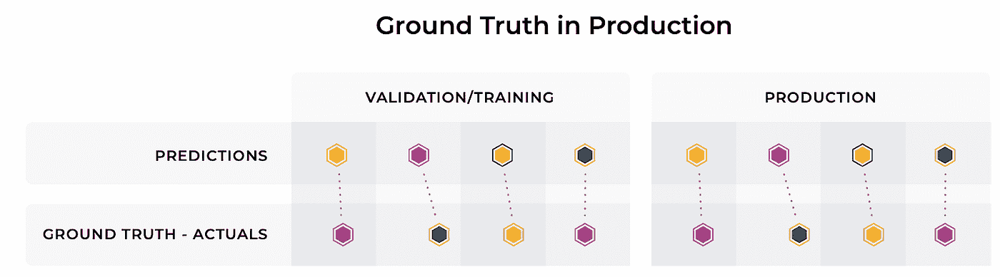
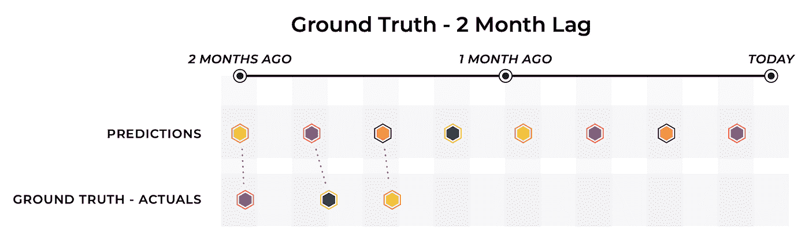
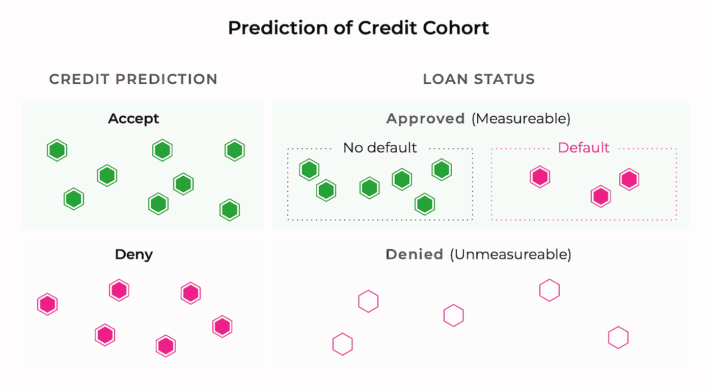
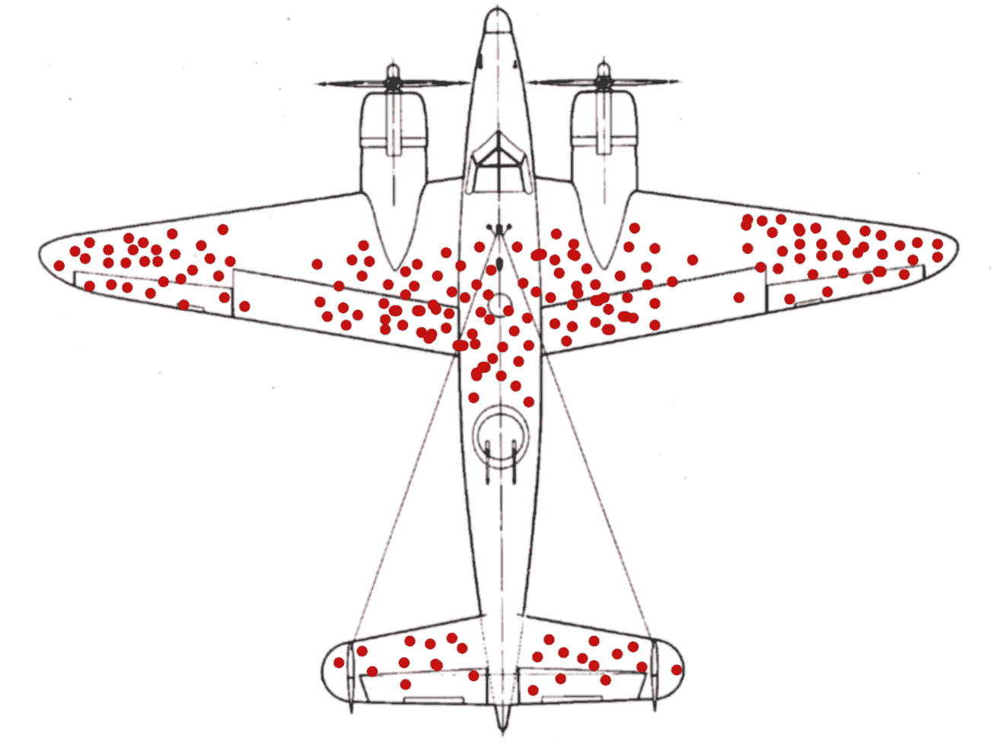
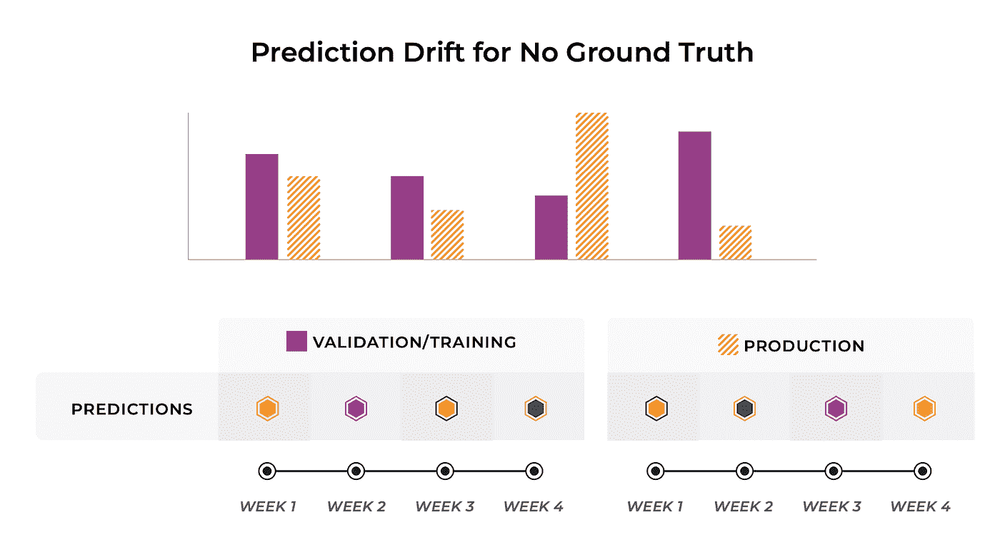
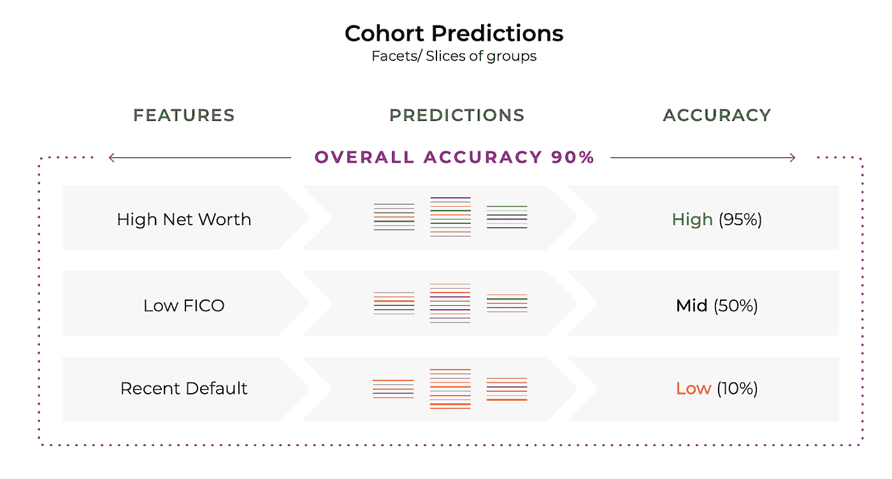
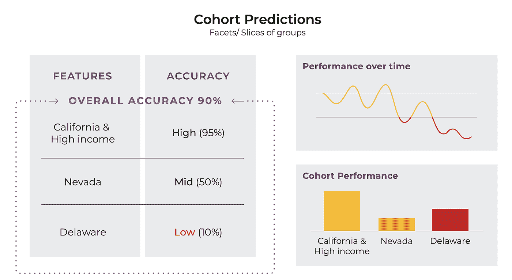

# 监控您的模型在生产中的性能的行动手册

> 原文：<https://towardsdatascience.com/the-playbook-to-monitor-your-models-performance-in-production-ec06c1cc3245?source=collection_archive---------5----------------------->

## [ML 可观测性系列](https://towardsdatascience.com/tagged/ml-observability)

## 机器学习模型的性能监控

随着机器学习基础设施的成熟，对模型监控的需求激增。不幸的是，这种不断增长的需求并没有导致一个简单的剧本，向团队解释如何测量他们模型的性能。

生产模型的性能分析可能很复杂，每种情况都有其自身的挑战。不幸的是，并不是每一个模型应用场景都有一个像学校里教的玩具问题那样的测量性能的明显途径。

在这篇文章中，我们将讨论与地面实况的可用性相关的许多挑战，并讨论在每个场景中可用于测量模型的性能指标。

# **案例一:实时地面实况**

理想的 ML 部署场景，通常是他们在课堂上教给你的，是当你将你的模型部署到生产环境中时，你可以很快地从模型中获得可操作的和快速的性能信息。

这个理想的视图看起来像这样:

与预测相关联的实时地面实况，图片由作者提供

在这个例子中，每一个预测的基本事实都浮现在你面前，并且在预测和基本事实之间有一个直接的联系，允许你直接分析你的模型在生产中的表现。

有很多行业有幸面对这种理想场景。数字广告就是这种情况，模型试图预测消费者最有可能参与的广告。几乎在预测做出后，地面真相，无论他们是否点击，都是确定的。

对于这种理想情况的另一个例子，我们可以看看预测粮食交付估计。当比萨饼到达饥饿的顾客家时，你就知道你的模型做得有多好。

一旦您将这一潜在的基础事实链接回您的预测事件，就可以很容易地计算和跟踪模型性能指标。要使用的最佳模型度量主要取决于模型的类型以及它所预测的数据的分布。以下是一些常见的模型性能指标:

**准确度**:总体准确度是一个常用的统计数据，在平衡等级时非常有用。

**回忆**:对不平衡类有用。我答对了多少积极因素。

[**精度**](https://arize.com/blog-course/precision-ml/) :对不平衡类有用。有多少肯定的识别是正确的。

**F1:** 对不平衡类有用，允许分析 [**精度**和**召回**](https://arize.com/blog-course/precision-vs-recall/) 之间的权衡。

**MAE 或** [**MAPE**](https://arize.com/blog-course/mean-absolute-percentage-error-mape-what-you-need-to-know/) :回归或数字度量性能分析。当你离 MAPE 有多远的百分比很重要的时候，它可能是好的。

一旦确定了模型指标，通过每天或每周跟踪该指标，您可以确保性能从培训时或最初提升到生产时起没有急剧下降。

然而，正如你现在肯定已经预测到的，这种理想的情况是例外，而不是规则。在许多真实世界环境中，对基础事实的访问可能会有很大的不同，随之而来的是您所拥有的监控模型的工具的方式。

# **案例 2:延迟的地面实况**

虽然许多应用程序享受模型预测的实时真相，但许多模型应用程序场景必须等待一段时间才能知道他们的模型*在生产中应该如何表现。*

想象一下，你正试图预测你的哪些客户是值得信赖的，哪些客户可能会拖欠贷款。在贷款还清或客户违约之前，你可能不会知道自己是否做了一个好的决定。这使得确保您的模型按预期运行变得很棘手。

接收地面实况的这种延迟也可以没有固定的时间尺度。例如，尝试对哪些信用卡交易是欺诈性的进行分类。你可能不会知道一笔交易是否是真正的欺诈，直到你收到一份声称他们的卡被盗的客户报告。这可能发生在交易清算后的几天、几周甚至几个月。

在这些情况下，以及许多其他情况下，模型所有者有很长的时间来接收他们的模型预测的真实结果。

延迟的真相，作者图片

在上面的图表中，虽然我们确实看到模型的基础事实最终被确定，但模型在过去一个月的预测并没有得到相应的结果。

当这个基本事实延迟足够小时，这个场景与实时基本事实没有太大的不同，因为模型所有者仍然有合理的节奏来测量性能度量并相应地更新模型，就像在实时基本事实场景中所做的那样。

然而，在系统中，接收基本事实有很大的延迟，团队可能需要求助于**代理指标**。代理指标是与您试图接近的基本事实相关的替代信号。

例如，想象你使用一个模型，消费者最有可能拖欠他们的信用卡债务。在这种情况下，成功的一个潜在的代理指标可能是您已经贷出的逾期付款的消费者的百分比。

因此，虽然您还无法获得基本事实，但您可以开始了解您可以同时计算的代理指标如何随着时间的推移而变化，以衡量您的模型的表现。

面对延迟的基本事实，代理指标是一个强有力的工具，因为它们提供了一个关于你的模型执行情况的最新指标。

# **案例 3:对基本事实的因果影响(有偏见的基本事实)**

需要注意的一件重要事情是，并非所有的基本真理都是生而平等的。有些情况下，团队会收到实时的地面实况；然而，模型的决策会极大地影响结果。

*预测会产生地面真实偏差，作者图片*

在这个例子中，我们试图预测谁有足够的信用来获得贷款。这变得很棘手，因为当你拒绝某人的贷款时，你不再知道他们是否会还你钱。

换句话说，只有你决定贷款给的人会导致你可以用来训练未来模型的结果。因此，我们永远也不会知道模型预测会违约的人是否真的全额偿还了贷款。

这可能会让你把手举到空中，接受你的地面真相只是会有偏差；但是，您确实有一些工具可以使用。

您可以创建一个不遵循模型预测的拒绝集，并比较该拒绝集与使用模型预测的集之间的预测性能差异。

你可以使用这两组接受了不同处理的人来验证你的模型预测，在我们的例子中，确保你没有潜在地错过你的模型所错过的一组潜在的有信用的人。

作为处理数据的人，您很可能会经常看到这张图片。如果不提及数据偏差，那么关于数据偏差的讨论就是不完整的。

幸存者偏见，图片来自[维基百科](https://en.wikipedia.org/wiki/Survivorship_bias)

正如故事所述，二战中的工程师们绘制了一张子弹孔穿透从战场归来的飞机的位置热图，目的是确定在哪里加固装甲。一天，一位名叫 Ahbrahm Wald 的统计学家指出，这份热图仅仅是由完成任务返回的飞机绘制的。所以，事实上，最好的放置装甲的地方可能是有空的地方，比如引擎，因为在这些地方被击中的飞机永远不会回家。

***TLDR:永远要意识到你地面真实数据的偏差***

# **案例四:没有地面真相**

这给我们带来了建模团队最糟糕的情况:没有真实的反馈来连接回模型性能。

在上面的例子中，我们在我们的验证和训练集中有基础事实来链接回我们的模型预测；然而，在生产中，我们几乎没有关于我们的模型表现如何的反馈。

同样，在这种情况下,**地面实况的代理指标**非常有用。在缺乏基本事实的情况下，如果您可以找到与基本事实相关的其他东西，您仍然可以了解您的模型随着时间的推移是如何表现的。

除了代理基本事实指标之外，即使基本事实很难收集，团队找到收集基本事实数据样本的方法也是很重要的。

获取这些基本事实数据的一种方法是雇佣人类注释者或标注者来提供关于他们模型性能的反馈。这种方法既昂贵又耗时；然而，拥有一套高质量的地面真实数据的回报是巨大的。

在基本事实可用或已通过人工注释收集的时期，可以使用绩效或滞后绩效指标。尽管这些滞后的性能度量在实时应用程序中不太擅长发出突然的模型性能回归的信号，但是它们仍然提供了有意义的反馈，以确保模型性能随着时间的推移朝着正确的方向发展。

## 漂移是性能的代表

虽然这些滞后的性能指标不能立即表明模型性能的变化，但测量预测输出分布的变化可能可以。输出预测中出现的漂移可用于警告团队异常的模型行为，即使不存在真实情况。

预测漂移没有地面真相，由作者图像

一些可以用来量化预测漂移的指标是分布距离指标，例如:Kullback-Leibler 散度、种群稳定性指数(PSI)、Jensen-Shannon 散度等。

**关于使用统计距离进行漂移监测的更多详情，请点击此处** **查看我的详细文章** [**。**](/using-statistical-distance-metrics-for-machine-learning-observability-4c874cded78)

# 其他性能监控注意事项

## **按群组划分的模型指标**

尽管数据科学家喜欢处理聚合优化统计数据，但现实是模型对不同的人、客户群和业务决策有不同的影响。

具有相同精确度的两个候选模型可能会对特定人群产生显著不同的影响，这些差异对您的业务非常重要。

团队通常将他们的数据分成“切片”或“群组”。随着时间的推移，可以发现这些群组，或者在模型出现大量错误的情况下，动态构建这些群组以进行调试。

群组预测，作者图片

在上面的示例中，我们看到基于高净值、低 FICO 分数和最近违约的存在等特征的分组数据提供了关于模型对于这些特定群组的表现的重要信息。

高于 90%的总体准确率实际上掩盖了一个事实，即该模型在预测最近违约的人的信用价值方面表现糟糕。

监控群组预测，图片由作者提供

跨群组测量模型性能类似于总体测量模型性能。应对对业务很重要的每个群组的绩效进行衡量，当绩效下降到培训或初始模型发布定义的阈值以下时，应发出警报。

## **衡量业务成果**

既然我们已经讨论了通过为您的应用程序场景选择正确的模型度量来度量模型性能，那么让我们简单地讨论一下度量业务度量。

业务度量标准与模型度量标准密切相关，如果定义得当，它们应该相互联系。在一天结束的时候，你没有给你的客户发送 F1 分数，因此，了解你的模型如何影响每个客户体验你的产品是很重要的。

业务度量往往不太适合传统的优化，但是它们提供了对业务目标的关键洞察。由于这些指标对于一个模型来说不容易优化，因此优化问题将使用并行指标来解决。

再次回到信用价值的例子，虽然你的模型可能会优化传统的模型指标，如准确性或 F1，但你可能希望监控的一个业务指标是你拒绝贷款的人的百分比。

归根结底，你团队中的产品经理可能不关心 MAPE，但他们会关心你的用户如何体验你的产品。衡量[模型评估指标](https://docs.arize.com/arize/sending-data-to-arize/model-types)通常不会捕捉到你可能有多少愤怒的客户。

正如您可能已经意识到的，识别和度量业务度量是一个极其重要的过程，可以确保您的努力在改进您的产品方面得到充分利用，我将在以后的文章中对此进行更深入的探讨！

# **总结**

总之，测量模型性能并不是一刀切的，您的业务应用程序可能需要我们在中讨论的部分或全部测量[技术。](https://arize.com/blog/monitor-your-model-in-production/)

虽然衡量模型性能的方法并不总是一目了然，但可以确定的是，正确衡量模型性能对于确保向客户交付一致且有效的产品至关重要。

## 联系我们

如果这篇博客引起了你的注意，并且你渴望了解更多关于[机器学习可观察性](https://arize.com/platform-overview/)和模型监控的信息，请查看我们的其他[博客](https://arize.com/blog/)和关于 [ML 监控](https://arize.com/ml-monitoring/)的资源！如果您有兴趣加入一个有趣的 rockstar 工程团队，帮助模型成功生产，请随时[联系](https://arize.com/contact/)我们，并在此处[找到我们的空缺职位](https://arize.com/careers/)！