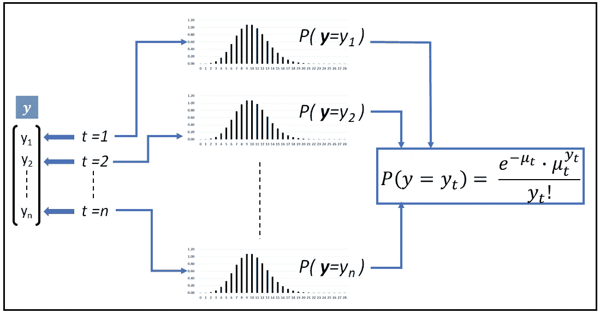
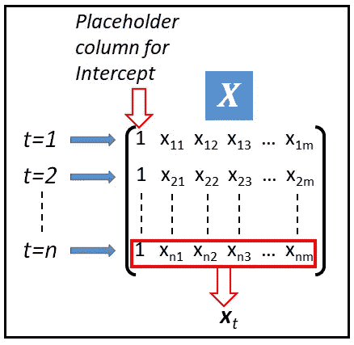
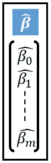
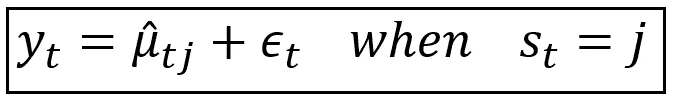
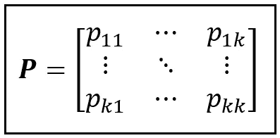
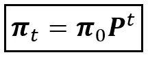
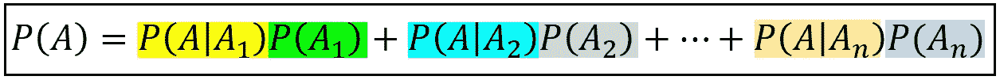
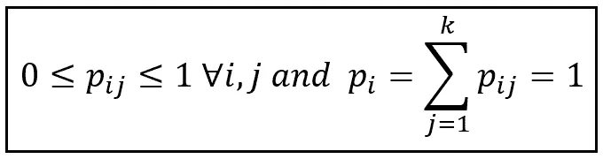
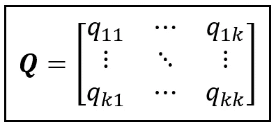
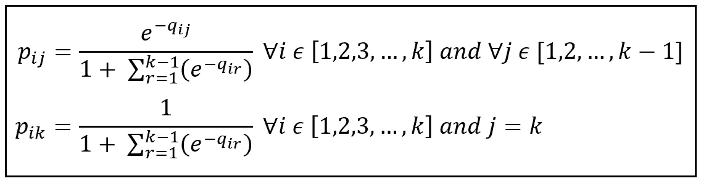

# 时间序列回归的泊松隐马尔可夫模型

> 原文：<https://towardsdatascience.com/the-poisson-hidden-markov-model-for-time-series-regression-236c269914dd?source=collection_archive---------4----------------------->

## 如何混合使用两个强大的随机过程来模拟时间序列数据

一个**泊松隐马尔可夫模型**使用两个随机过程的混合，一个**泊松过程**和一个**离散马尔可夫过程**，来表示基于**计数的时间序列**数据。

基于计数的时间序列数据仅包含整数数值，如 0、1、2、3 等。这种数据的例子是电子商务网站上的每日点击数、百货商店中每天购买的肥皂的数量等等。

使用诸如线性模型或 ARIMA 模型之类的模型不能充分地表示这样的数据，因为在那些模型中，因变量( ***y*** )被假定为允许正值和负值的实值。基于计数的时间序列数据需要使用模型，这些模型假定因变量是 1)离散的，和 2)非负的，换句话说，是整数的。

[泊松](/an-illustrated-guide-to-the-poisson-regression-model-50cccba15958)或类泊松模型，如[广义泊松](/generalized-poisson-regression-for-real-world-datasets-d1ff32607d79)和[负二项式](/negative-binomial-regression-f99031bb25b4)模型通常适用于对整个编号的数据集进行建模。

不幸的是，泊松系列模型没有明确说明，因此无法充分捕捉数据中的自相关，而这恰好是时间序列数据集的一个标志。

多年来，研究人员对基本泊松模型进行了一些修改，使其能够解释时间序列数据中的自相关性。其中值得注意的是 [**泊松自回归模型**](/poisson-regression-models-for-time-series-data-sets-54114e68c46d) 和 [**泊松整数 ARIMA 模型**](/an-introduction-to-the-poisson-integer-arima-regression-model-b66d3ff2e6e5) ，其中泊松条件均值不仅表示为回归变量 ***X*** 的线性组合，还表示为因变量 ***y*** 的滞后副本。

**泊松隐马尔可夫模型**更进了一步，混合了离散的 *k* 状态马尔可夫模型，该模型是“隐”的，因为在时间序列的每个时间步，人们不能确切知道马尔可夫过程处于哪个马尔可夫状态。取而代之的是，在每个时间步，人们估计每个区域可能存在的对泊松模型预测的平均值的影响。这使得泊松过程意味着一个随机变量**，其期望值是基础马尔可夫模型处于特定状态的概率的函数。**

在本文中，我们将精确地描述可见泊松模型和隐马尔可夫模型预测的平均值之间的关系。

如果你是马尔可夫过程或隐马尔可夫模型的新手，请浏览下面两篇文章:

</a-beginners-guide-to-discrete-time-markov-chains-d5be17cf0e12>  </a-math-lovers-guide-to-hidden-markov-models-ad718df9fde8>  

我还建议回顾下面这篇关于**马尔可夫转换动态回归模型**的文章，以详细了解 MSDR 模型是如何构建的。泊松 HMM 是一种 MSDR 模型，其中模型的“可见”部分服从泊松过程。

</a-worms-eye-view-of-the-markov-switching-dynamic-regression-model-2fb706ba69f3>  

# 泊松隐马尔可夫模型的详细说明

我们将首先阐述“可见的”泊松过程，然后展示马尔可夫过程如何“混合”到泊松过程中。

考虑以下包含附加误差成分的模型方程:


y_t 表示为平均值和误差项之和(图片由作者提供)

在上面的模型中，观测值 *y_t* 是预测值 *μ_cap_t a* 和残差 *ε_t* 之和。我们进一步假设 *ε_t* 是一个均值为零的[同方差](/heteroscedasticity-is-nothing-to-be-afraid-of-730dd3f7ca1f)(常方差)正态分布随机变量，表示为 *N(0，σ )* 。

*y_t* 是*【n×1】*观测值向量 ***y*** 的第 *t-* 个元素:


因变量 **y** (图片作者提供)

我们假设 ***y*** 服从泊松过程。因此，[1…n] 中的 *t 的 *y_t* 是 *n 个*独立的泊松分布随机变量，每个变量都具有可能不同的均值 *μ_t* ，如下所示:*



服从泊松过程的时间序列 ***y*** (图片由作者提供)

*的 **P** 概率**M**ass**F**function(PMF)，也就是观察到 *y_t* 的概率的另一种说法，由下式给出:*

**

*泊松分布的 PMF**y**均值*μt(图片由作者提供)**

*在一个训练好的回归模型中，我们用“拟合”平均值 *μ_cap_t.* 代替 *μ_t**

*设 ***X*** 为一个*【n X(m+1)】*大小的回归变量矩阵如下图。这个矩阵的第一列是截取 ***、*** 和***x****_ t*的占位符，是这个矩阵的一行。*

**

*回归变量矩阵 **X** (图片来自作者)*

*设 ***β_cap*** 为回归系数的 *[(m+1) X 1]* 向量。**β*上的“cap”表示它是模型训练产生的系数的拟合值。**

****

**拟合回归系数β_cap 的向量(图片由作者提供)**

**我们将平均值 *μ_cap_t* 表示为 ***x*** *_t 和* ***β_cap*** 的指数线性组合如下:**

****

**泊松回归模型的指数均值(图片由作者提供)**

**其中，***x****_ t*与 ***β_cap*** 之间的点积可以展开表示如下:**

****

**回归变量和拟合回归系数的线性组合(图片由作者提供)**

**点积的指数运算确保了平均值以及模型的预测永远不会为负。这是对整数计数数据集建模的关键要求。**

**这就完成了泊松 HMM 的泊松部分的规范。现在，让我们把注意力转向马尔可夫部分。**

## **隐马尔可夫模型中的混合**

**我们将看到如何将离散马尔可夫模型“混合”到泊松回归模型中。**

**考虑一个 *k* 状态的马尔可夫过程，假设它处于某个状态 *j ϵ [1，2，3，…k]* 。我们不知道马尔可夫过程在时间 *t* 处于哪种状态。我们仅假设它以下列方式影响泊松过程模型:**

****

**用预测均值 *μ_cap_t_j 和残差* ε_t 之和表示的观测值 y_t(图片由作者提供)**

**注意，拟合的平均值 *μ_cap_t_j* 现在用马尔可夫状态 *j 来索引。μ_cap_t_j* 表示如下:**

****

**当基础马尔可夫过程处于状态 j 时泊松 HMM 的指数均值(图片由作者提供)**

**注意，我们现在使用的是与第*个第 j 个*马尔可夫状态相对应的马尔可夫状态特定回归系数向量 ***β_cap*** *_j* 。**

**如果马尔可夫模型在' *k'* 状态*【1，2，…，j，…，k】*上运算，回归系数采用大小为 *[(m+1) X k]* 的**矩阵**的形式，如下所示:**

****

**大小为[k x (m+1)]的系数矩阵(图片由作者提供)**

**这里的直觉是，根据哪个马尔可夫状态或“体制”，回归模型系数将从 ***β_cap_s*** 切换到适当的体制特定的*向量****β_ cap****_ j*。**

***k*-状态马尔可夫过程由以下状态转移矩阵 ***P*** 控制，其中每个元素 *p_ij* 是在时间 *t* 转移到 *j* 的概率，假定该过程在时间 *(t-1)* 处于状态 *i* :**

****

**马尔可夫过程的状态转移矩阵 **P** (图片作者提供)**

**马尔可夫过程在时间步 *t* 也有如下状态概率分布***π_****t*:**

****

**k 状态马尔可夫过程的状态概率分布向量(图片由作者提供)**

```
**Quick tip: Some texts call the state vector ***δ****_t* instead of ***π_****t*, and they call the Markov state transition probabilities *γ_ij* instead of *p_ij*.**
```

**已知/假设 ***π_0*** 在 *t=0* 时的某个值，我们计算***π_****t*如下:**

****

**给定 t=0 时的概率分布和转移矩阵 **P** (图片由作者提供)，马尔可夫过程在 t 时的状态概率分布公式**

**让我们回到泊松平均值的州特定公式:**

****

**当基础马尔可夫过程处于状态 j 时，泊松 HMM 在时间 t 的指数均值(图片由作者提供)**

***μ_cap_t_j* 是假设基础马尔可夫过程处于状态 *j* 时泊松回归模型在时间 *t* 的预测均值。由于我们实际上不知道马尔可夫过程在时间 *t* 时处于哪个状态，在每个时间步，对于一个 *k* 状态的马尔可夫过程，我们必须使用 *k* 这样的预测方法，如下所示:**

****

**k 个预测的向量意味着来自泊松回归模型，对应于马尔可夫过程可能处于的 k 个可能状态(图片由作者提供)**

**在每个时间步为 *y_t* 生成 *k* 预测是荒谬的。因此，我们使用**预期**的公式将这些 *k* 预测合并成一个预测 *μ_cap_t* 。诀窍在于认识到***μ_ cap****_ t*是一个随机变量，有 *k* 个可能值，每个值都与一个发生概率相关联。这个概率就是 *π_tj* 这是潜在马尔可夫过程在时间 *t* 处于状态 *j* 的无条件概率。**

**因此:**

**泊松 HMM 的预测均值是所有可能马尔可夫状态的期望值，如下所示:**

****

**用随机变量***μ_ cap****_ t(图片由作者提供)*的期望值表示的预测均值**

**概率 *π_tj* 是*向量π_t.* 在每个时间步 *t* 的分量值，我们使用以下公式计算 *π_t* :**

****

**给定 t=0 时的概率分布和转移矩阵 **P** (图片由作者提供)，马尔可夫过程在 t 时的状态概率分布公式**

# **训练和评估**

**泊松隐马尔可夫模型的训练包括估计系数矩阵 ***β_cap_s*** 和马尔可夫转移概率矩阵 ***P*** 。估计过程通常是[最大似然估计](https://en.wikipedia.org/wiki/Maximum_likelihood_estimation) (MLE)或[期望最大化](https://en.wikipedia.org/wiki/Expectation%E2%80%93maximization_algorithm)。**

**我们将描述如何使用 MLE 来找到 ***P*** 和 ***β_cap_s*** 的最优值，这将*最大化观察整个训练数据集* ***y*** 的联合概率密度。换句话说，我们希望最大化以下产品:**

****

**观察数据集的可能性(图片由作者提供)**

**在上面的乘积中，概率*P(****y****= y _ t)*就是泊松过程的 **P** 概率**M**ass**F**function(PMF):**

****

**泊松条件 PMF(作者图片)**

**在给定拟合平均速率 *μ_cap_t 的情况下，L.H.S .上的概率被解读为在时间 *t* 观察到 *y_t* 的条件概率。μ_cap_t* 是使用我们之前看到的期望值公式计算的所有可能状态的预测平均值的期望值。**

*还有第二种方法来计算泊松 PMF。*

*让我们再来看看观测 *y_t* 的预测泊松概率的公式，假设底层马尔可夫过程处于状态 *j* :*

**

*预测泊松概率观察 *y_t* ，假设底层马尔可夫过程处于状态 *j* (图片由作者提供)*

*其中:*

**

*当基础马尔可夫过程处于状态 j 时，泊松 HMM 在时间 t 的指数均值(图片由作者提供)*

*马尔可夫状态特定线性组合表示如下:*

**

*回归变量 vector **x** _t 和状态特定回归系数***β_ cap****_*j 的马尔可夫状态特定线性组合(图片由作者提供)*

*使用泊松 PMF，并假设一个 *k-* 状态马尔可夫过程，在每个时间步 t，我们将得到观察 *y_t* 的 *k* 概率，每一个都以马尔可夫过程处于状态 *j.* 为条件。以下向量捕获这些 *k* 概率:*

**

**观察到的 k 个*泊松概率 *y_t* ，每一个都以马尔可夫过程在时间 t 处于状态 *j 为条件**

*和以前一样，对于每个时间步，我们希望将这些 *k* 概率合并成一个概率。为此，我们求助于 [**全概率**](https://en.wikipedia.org/wiki/Law_of_total_probability) 定律，该定律指出，如果事件 A 可以与事件 A1、事件 A2 或事件 A3 等一起发生，那么 A 的无条件概率可以表示如下:*

**

*全概率定律(图片由作者提供)*

*使用该定律，我们将计算泊松 HMM 预测的在时间 *t* 观察到 *y_t* 的概率如下:*

**

*k 状态马尔可夫模型影响下的 ***y*** 的概率密度(图片由作者提供)*

*在上面的求和中， *P(s_t=1)，P(s_t=2)，…等等。*是马尔可夫过程在时间 *t.* 的状态概率，我们从前面的讨论中知道，这些只是简单的*π_ TJ*——向量的不同分量 *π_t.**

*实际上，我们已经想出了两种不同的方法来计算泊松概率*P(****y****= y _ t)。**

*让我们回到可能性等式:*

**

*观察数据集的可能性(图片由作者提供)*

*最大化乘积的**自然对数通常是迅速的，因为它有将乘积转换成和的好处，并且后者在微积分中更容易处理(我们很快就会知道为什么)。因此，我们将最大化下面的 ***对数***——由程式化的ℓ:表示的可能性***

**

*观察数据集的对数似然性(图片由作者提供)*

*对数似然的最大化通过使用以下程序来完成:*

1.  *我们将取对数似然 w . r . t .*中每个转移*概率 p_ij* 和系数矩阵***β_ cap _ s****中每个状态特定系数 *β_cap_q_j* 其中 *q* 位于*【0，1，…，m】****
2.  **我们将把每个偏导数设为零，**
3.  **我们将使用诸如 [Newton-Raphson](https://en.wikipedia.org/wiki/Newton%27s_method) 、 [Nelder-Mead](https://en.wikipedia.org/wiki/Nelder%E2%80%93Mead_method) 或 [Powell 等优化算法来求解与 ***β_cap_s*** 中的*(k+(m+1)* k】*个方程(实际上比这个数少得多)对应的 *k* 马尔可夫转移概率、 *(m+1)*k* 个系数](https://en.wikipedia.org/wiki/Powell%27s_method)**

**有一个小问题我们需要解决。在整个优化过程中，马尔可夫状态转移概率 *p_ij* 需要位于*【0.0，1.0】*区间内，并且任意一行 ***P*** 的概率总和需要为 1.0。在方程形式中，这两个约束表示如下:**

****

**所有马尔可夫状态转移概率遵守的约束(图片由作者提供)**

**当注意到如果马尔可夫过程在时间 *(t-1)* 处于状态 *i* ，那么在下一个时间步 *t* ，它必须处于可用状态*【1，2，3，…，k】*之一时，1.0 约束的求和变得明显。**

**在优化期间，我们通过定义大小为 *(k x k)* 的矩阵 ***Q*** 来处理这些约束，如下所示:**

****

**代理矩阵 **Q** (图片作者提供)**

*****Q*** 充当**的代理 *P*** 。我们不是优化 ***P*** ，而是通过允许 *q_ij* 在-∞到+∞之间自由变化来优化*。在每次优化迭代中，**我们通过将局部优化的*****值标准化到区间***【0.0，1.0】*来获得 *p_ij* **，如下:******

****

**标准化 **Q** 矩阵以获得 **P** 矩阵(图片由作者提供)**

***在我下周的文章中，我们将* ***使用 Python 和 statsmodels*** *构建并训练一个泊松隐马尔可夫模型。所以下周请继续关注这个话题。快乐造型！***

# **参考文献和版权**

## **书**

**卡梅伦和特里维迪出版社(2013 年)。 [*计数数据的回归分析*](http://faculty.econ.ucdavis.edu/faculty/cameron/racd2/) (第 2 版。，计量经济学会专论)。剑桥:剑桥大学出版社。doi:10.1017/CBO 9781139013901567**

**詹姆斯·d·汉密尔顿， [*时间序列分析*](https://press.princeton.edu/books/hardcover/9780691042893/time-series-analysis) ，普林斯顿大学出版社，2020 年。ISBN: 0691218633**

## **形象**

**所有图片的版权归 [Sachin Date](https://www.linkedin.com/in/sachindate/) 所有，由 [CC-BY-NC-SA](https://creativecommons.org/licenses/by-nc-sa/4.0/) 所有，除非图片下面提到了不同的来源和版权。**

# **相关阅读**

**</a-beginners-guide-to-discrete-time-markov-chains-d5be17cf0e12>  </a-math-lovers-guide-to-hidden-markov-models-ad718df9fde8>  

*感谢阅读！如果您喜欢这篇文章，请* [***关注我***](https://timeseriesreasoning.medium.com) *获取关于回归和时间序列分析的技巧、操作方法和编程建议。***