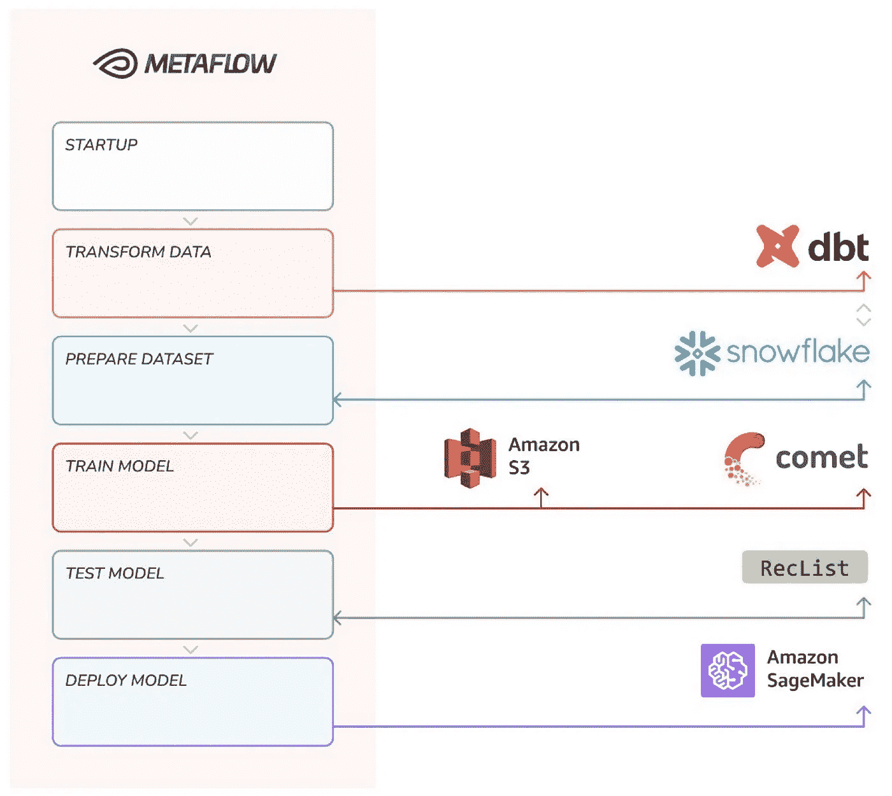

# 后现代堆栈

> 原文：<https://towardsdatascience.com/the-post-modern-stack-993ec3b044c1?source=collection_archive---------21----------------------->

## [在启动阶段有效地进行 ML](https://towardsdatascience.com/tagged/mlops-without-much-ops)

## 连接现代数据堆栈和现代 ML 堆栈

## **概述**

随着天下没有不散的宴席，我们已经到了这个系列的最后一集，一个全新的[开源回购](https://github.com/jacopotagliabue/post-modern-stack)汇集了我们在前几集讨论的许多主题，在开始之前我们在这里回顾一下:

1.  [m lops without more Ops](/mlops-without-much-ops-d17f502f76e8):我们引入了关注重要事物的原则；
2.  [合理规模的 ML 和 m lops](/ml-and-mlops-at-a-reasonable-scale-31d2c0782d9c):这里我们解释“合理规模”。在科技巨头的行星级基础设施和无代码场景之间，有一个复杂的从业者的令人兴奋的工作世界:我们称之为“合理的规模”，它确实是大多数数据操作和 MLOps 发生的地方；
3.  [Hagakure for MLOps](/hagakure-for-mlops-the-four-pillars-of-ml-at-reasonable-scale-5a09bd073da) :在这里，我们讨论现代 MLOps 的原则，以及小型团队如何得益于蓬勃发展的开放生态系统而富有成效；
4.  [现代数据模式](/the-modern-data-pattern-d34d42216c81):我们提出了(包括电池、数据和开源代码)一个实用的解决方案，来解决大规模接收、转换和查询数据的问题。

如果你密切关注我们，第 4 集将我们带到了数据领域的极限，在 ML 领域的开始:现在是时候结束这个循环了，将那些经过良好转换的数据行纳入机器学习模型，为用户提供预测服务。

**TL；博士**:在*这个*岗位上，我们将再次把技术含量和组织智慧结合起来:

*   我们引入“后现代堆栈”，也就是一种解构(看到现在的双关语了吧？我们之前共享的现代数据堆栈。我们重新利用[第 4 集](https://github.com/jacopotagliabue/paas-data-ingestion)(雪花+ dbt)中的数据操作工具来支持我们最喜欢的 MLOps 设置，这是一个[元流](https://metaflow.org/)管道，无缝结合了本地和云计算，并以无服务器的方式弥合了数据、训练和推理之间的差距。
*   我们回到开始的地方，根据我们所学的知识，再次讨论*没有 Ops 的 MLOps，*的基本原则，以及它如何形成(或应该形成)许多关于软件组织的传统讨论:人员配备、构建与购买，等等。

克隆[回购](https://github.com/jacopotagliabue/post-modern-stack)，[查看视频](https://www.youtube.com/watch?v=5kHDb-XGHtc)，扣好安全带，和我们一起做最后一次旅行。

## **将现代数据堆栈与现代 ML 堆栈结合起来**

[现代数据堆栈](https://www.mihaileric.com/posts/mlops-is-a-mess/) (MDS)已经整合了大量关于数据收集、存储和转换的最佳实践。对于结构化或半结构化数据，MDS 尤其有效，它通常依赖于三个关键部分:

*   通过工具或基础设施的可扩展摄取机制；
*   一个用于存储和计算的数据仓库(在合理的规模下，查询性能令人印象深刻)；
*   一个对原始数据进行类似 DAG 操作的转换工具，可能基于 SQL 作为不同角色(数据工程师、分析师、ML 人员)的通用语言。

网络上到处都是例子(包括我们自己的[！)如何建立 MDS。然而，它们可能会让你想知道“在 ML 方面”会发生什么:一旦数据被预先聚合，特性被预先计算，它是如何被下游消费以产生商业价值的？*这篇*文章通过提出一个轻量级工具链来回答这个问题，该工具链利用 Metaflow 作为 ML 操作的主干:社区对](https://github.com/jacopotagliabue/paas-data-ingestion)[“更大的船”回购](https://github.com/jacopotagliabue/you-dont-need-a-bigger-boat)的反应非常积极，*但是*我们认为我们也应该为希望更快开始的团队提出一个低接触的替代方案。

## **后现代堆栈**

由于流程图胜过一千个自述，我们的后现代堆栈(PMS)看起来是这样的:

*后现代堆栈一览【图片由我们的朋友在*[*outbounds*](https://outerbounds.com/)，ll 商标，所有标识均为其各自所有者的财产】

我们有四个主要的“功能”阶段，两个在数据领域，两个在 ML 领域:

1.  **存储**:我们使用雪花存储原始数据——我们重新使用 Coveo 去年发布的神奇的电子商务开放数据集，其中包含数百万个真实世界的匿名购物事件。
2.  **转换**:我们使用 [dbt](https://www.getdbt.com/) 作为我们的转换框架——我们在雪花中运行一系列类似 DAG 的 SQL 查询*，并准备好我们的原始数据供 Python 代码使用。*
3.  **训练**:我们使用深度学习框架 [Keras](https://keras.io/) 来训练购物推荐的顺序模型——给定购物者互动过的产品列表，最有可能的下一次互动是什么？
4.  **服务**:我们使用 [Sagemaker](https://aws.amazon.com/sagemaker/) 作为我们的 PaaS 服务平台，这样一来，I)我们可以使用 Python 代码来触发部署，ii)通过使用 AWS，我们可以获得与 Metaflow 的良好互操作性(即模型工件已经在 s3 中)。

PMS 并不比[你的普通元流管道](/noops-machine-learning-3893a42e32a4)更复杂:通过将聚合委托给雪花，分布式计算被抽象为合理的规模；通过引入对 dbt 的支持，端到端的科学家可以准备好自己的特性，并一步到位地对数据集进行版本化；通过使用 Metaflow，我们可以运行我们想要的所有 Python 代码，*在我们想要的地方*:我们可以以统一的、有原则的方式加入 dataOps 和 MLOps，我们可以挑选需要硬件加速的地方。

PDP 是一个零脂肪、严肃但完全现实的管道，开始将原始数据转化为实时预测。

> 更好的是，你有一个管道**大量使用开源软件，而很少占用人们的时间**:开发、培训和部署可以由一个 ML 工程师*完成，不需要任何基础设施知识*，也不需要 devOps 的支持。

在探索这种设置对您的组织(而不仅仅是您的代码)的全面影响之前，可能是一个好时机来为对书呆子细节感兴趣的读者提及一些隐藏的瑰宝:

*   dbt cloud : dbt 为团队内部和团队之间的协作提供了一个 SaaS 版本的工具。为了支持这一场景，我们包括了通过连接到 dbt 云实例来运行相同流的可能性:虽然从流的角度来看这有点不太直观，但我们确实相信云产品是有价值的，特别是在数据堆栈涉及的人员更加多样化的大型组织中。
*   **模型测试**:我们在部署前加入了一个测试步骤，以提高对部署前全面测试重要性的认识。我们将 [RecList](https://github.com/jacopotagliabue/reclist) 与 Metaflow [cards](/integrating-pythonic-visual-reports-into-ml-pipelines-a163d150ed04) 的力量结合起来，展示开源软件如何帮助开发更值得信赖的模型和更具包容性的文档。敬请期待不久的将来更深入的集成！

在[蓬勃发展的时刻，但也是空间](https://www.mihaileric.com/posts/mlops-is-a-mess/)令人困惑的增长时刻，我们希望我们的开放堆栈将为测试 MLOps 水域的团队提供可靠的第一步，展示几个简单的部分如何在大规模构建 ML 系统方面走得非常远。

> 这可能不是你旅程的终点，但我们相信这是一个很好的开始。

## **MLOps 和 peopleOps**

如果你还记得我们的[景观概述](/mlops-without-much-ops-d17f502f76e8)，以合理规模运营的团队要么是小型的快速成长的创业公司，要么是在大型但传统的公司中开始 ML 实践的团队(如果你愿意的话，是企业中的创业公司*):他们想要的是*关闭反馈回路*的速度，所以 NoOps 是他们所需要的。特别是，我们对 ML 生命周期的方法强调了不花费*前期*工程时间来支持在第一天(甚至可能在第 1000 天)肯定不需要的规模和复杂性的重要性。*

> 与“玩具世界”教程相比，我们的设计具有与您一起成长的优势:如果您确实需要在第 1000 天将 X 换成 Y，其余的工具仍然可以完美地相互配合。

我们想要结束我们的系列，强调这种方法对组织如何工作和概念化数据以及他们产品的 ML 开发的一些影响。

*   超越人数的效率。考虑传统指标，如研发人数:现代 MLOps 方法可能会质疑围绕这一点的一些既定原则。例如，采用现代 MLOps 方法意味着你的商品销售成本(COGS)可能会构成**一个更大的 AWS 账单——然而商品和服务生产中涉及的直接人工可能会更低。**此外，这也意味着可能需要重新考虑传统指标，如[研发人数或申请的专利数量](https://www.fingrid.fi/globalassets/dokumentit/fi/yhtio/tki-toiminta/raportit/fingrid-measure_final_public.pdf)，并且可能需要不同的基准**。**因此，随着科技世界的快速变化，我们的衡量方法应该考虑到这一点。
*   *灵活的垂直度。ML 正在成为许多公司的重要产品组件(Coveo 当然是其中之一)。关于能够在产品中嵌入 ML 功能的令人不安的事实是，ML 工程师需要在业务问题方面接受培训，就像他们在超参数优化方面一样。考虑到这一点，在一个横向独立的单位中拥有 10 多名数据科学家可能不是正确的方式，因为这将他们从现场分离出来，并减缓数据和决策之间的反馈循环。或者，人们可能希望将 ML ninjas 直接嵌入到业务单元中，这样他们可以直接了解业务问题。唯一的问题是，如果业务部门没有准备好吸收 ML 工程师，他们很容易就会失去预期的影响力。采用强大的 MLOps 实践是使 ML 团队的垂直化更加亲切的一种方式，因为业务部门可以更有效地吸收数据科学家。“合理规模”拓扑中的 MLOps 看起来像垂直和水平之间的中间点——如果你愿意，可以说是一个 T 形:一些水平组件已经到位，以使每个人都具有生产力并重用知识和专业技能(例如，广泛采用元流)；但是考虑到用例的特殊性，特性是在业务线内垂直开发的。*
*   留住人才:远离基础设施。可以说，这种方法最重要的结果是，MLOps 可以作为吸引和留住关键人才的一部分。用更少的人力换取更多的计算将会产生**一个小的、快乐的 ML 团队，这个团队比一个更大的、不那么专注的团队要好得多。大多数技术人才对使用最好的工具做前沿工作感到兴奋，关注具有挑战性的问题，并看到他们的工作在生产中的影响。如果没有正确的 MLOps 实践，顶级人才将很快因从事事务性任务而感到沮丧，并且看不到他们的工作有切实的业务影响。因此，更高的留存率和更高的 ML 生产率通常可以抵消可能更高的 AWS 账单。正如麦肯锡在一篇关于[“大损耗](https://www.mckinsey.com/business-functions/people-and-organizational-performance/our-insights/the-organization-blog/the-great-attrition-wanting-the-best-keeping-the-worst)”的文章中所说，“公司想要最好的，保留最差的，ML 从业者更替的主要原因之一是将相当大一部分时间投入到低影响的任务中，如数据准备和基础设施维护。**

> 最后，采用我们的 MLOps 方法也将明显影响首席财务官做出的[战略决策，并让他们更开心。](https://www.gartner.com/smarterwithgartner/how-leading-cfos-use-cost-management-as-a-catalyst-for-growth)

有一种流行的观点认为，管理 R&D 支出的有效方式需要降低基础设施成本。但这通常是一种误导性的看待事物的方式。**购买而非建设可以带来更准确的 COGS** 估计和预测，尤其是对于不太成熟、更具实验性的行业——众所周知，时间就是金钱，考虑到缓慢勘探的机会成本，基础设施可能看起来更便宜。此外，我们经常发现，随着时间的推移，在初创企业中构建和维护基础设施的实际成本比大多数人想象的更难预测。不仅很容易低估长期所需的全部努力，而且每次你为了构建一个基础设施而创建一个团队时，你都引入了人的因素的典型的不可预测性。

## **想多聊聊 ML“合理规模”的未来？**

[我们的系列报道到此为止](https://towardsdatascience.com/tagged/mlops-without-much-ops)，但是我们很乐意收到您的来信:联系我们，在 Medium 和 Linkedin 上关注我们([这里](https://www.linkedin.com/in/jacopotagliabue/)、[这里](https://www.linkedin.com/in/cirogreco/)和[这里](https://www.linkedin.com/in/andrea-polonioli/))，看看我们的下一个“合理项目”是什么。

> 再见，牛仔们！

## **致谢**

特别感谢 dbt Labs 的 Sung Won Chung、Hugo Bowne-Anderson、Gaurav Bhushan、Outerbounds 的 Savin Goyal、Valay Dave 以及 Coveo 的 Luca Bigon 和 Patrick John Chia 对草案和回购提出的有益意见。