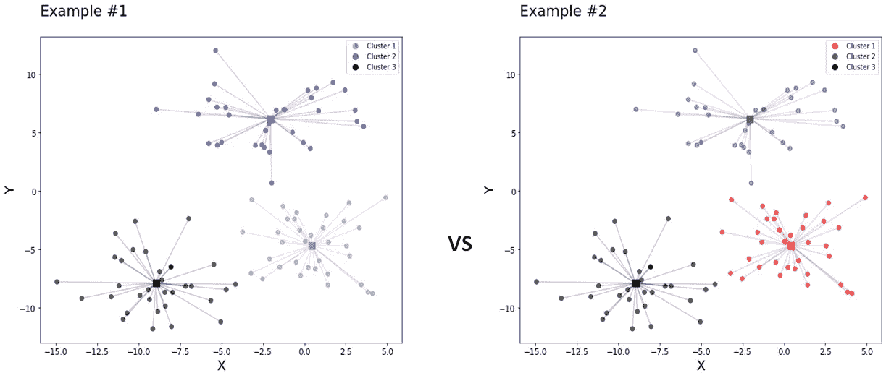
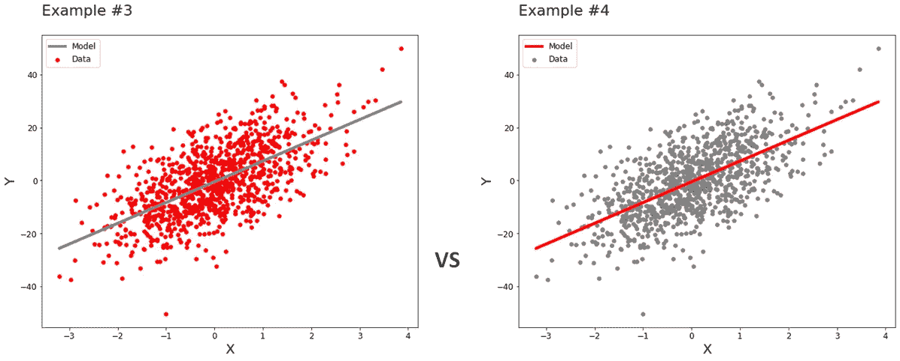
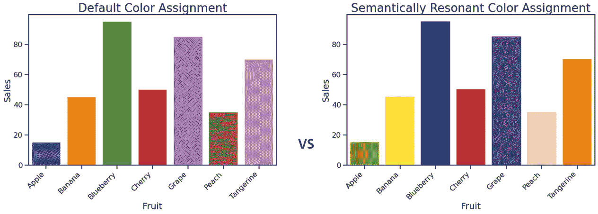

# 色彩的力量

> 原文：<https://towardsdatascience.com/the-power-of-color-be3bbe9f6bc1?source=collection_archive---------36----------------------->

## 将您选择的颜色与您的视觉价值联系起来

版权所有 [Benjavisa Ruangvaree](https://www.123rf.com/profile_benjavisa'>Benjavisa Ruangvaree)

我们的视觉是我们感官中最发达、最重要、最复杂的，这是一个被广泛接受的观点。不是每个人都认识到这个事实是基于生理学的。一些人认为这可能是有文化和历史基础的。然而，这并不能改变人类严重依赖视觉来探索、分析和理解世界的事实。

## 介绍

视觉对象的主要特征之一是它的颜色。这不是偶然的。颜色可以帮助区分背景和前景中的东西，它可以对比差异，将我们的注意力吸引到一个物体上，甚至让我们更好地记住物体。

心理学中有一个子领域——被恰当地称为**色彩心理学**——其发现被企业广泛用于营销和品牌推广。根据维基百科:

> **色彩心理学**是将色彩作为人类行为[的决定因素](https://en.wikipedia.org/wiki/Behavior)的研究。颜色影响不明显的感知，比如食物的味道。颜色具有能引起人们某些情绪的特质…颜色对个人的影响可能因年龄、性别和文化而异…尽管颜色联想可能因文化背景而异，但颜色偏好在性别和种族之间相对一致。

营销和品牌专家不应该是唯一关心色彩心理学研究的发现和建议的人；数据科学家也应该知道。

## 影响观众的情绪

你希望你的观众兴奋还是无聊？沮丧还是冷静友好？色彩心理学的一个理论是色彩会影响我们的心情。对颜色的感知是不一致的；这是一种模式，而不是绝对的常数。然而，可以肯定的是，你的大多数潜在受众都属于模态价值范畴。

2012 年，埃利奥特和迈尔认为颜色会影响我们的心理功能。这一理论被称为*情境中的颜色理论。*该理论的中心观点是，颜色承载着意义，可以直接影响我们的认知过程，包括我们的注意力。颜色的影响力与我们对颜色“友好”或“敌对”的感知有关人们可能会认为“敌对”的颜色会吸引注意力，而“友好”的颜色会让我们感到安全和困倦。红色是“敌对”颜色的典型代表。这并不意味着红色会让人产生负面情绪。意思是吸引眼球。在自然界中，红色可以有几种含义，其中包括危险和恐惧。与此同时，在包括人类在内的许多物种中，红色可以作为性吸引力的信号。红色不会让我们感觉冷漠。

红色是一种恰当的颜色，可以把你的观众的注意力吸引到你演讲的要点上。红色情绪影响的一个有益的副作用是，当红色被用来说明数据时，观众会更好地记住正在呈现的材料。然而，重要的是要记住适度是关键。如果你所有的视觉效果都使用红色调色板，你的观众可能会开始感到不安甚至恼怒。他们可能会记住你的演示，但可能不是以你希望他们记住的方式。

颜色应该用来集中注意力，突出元素组，对比数据元素的相关性和关系。

用红色突出显示集群；作者图片

突出红色的相关性；作者图片

## 用颜色表达意义

2008 年，Castelhano 和 Henderson 进行了实验，以确定颜色是否会影响人们收集视觉场景信息的能力和速度。他们发现，如果图片是彩色的，并且颜色与上下文相关，人类理解图片的速度会快得多。换句话说，颜色“正确”的物体图像更容易被人们理解。

这一理论与林等于 2013 年提出的语义共振色彩理论有着密切的联系。这不是第一次语义和颜色之间的密切联系被证明，但斯坦福大学的研究人员将它有益地放入数据可视化的背景中。

> 在美国，大多数人的反应是，金钱是绿色的，爱情是红色的，海洋是蓝色的。许多概念唤起了相关的颜色——无论是由于物理外观、常见的隐喻还是文化习俗。当颜色与唤起它们的概念配对时，我们称之为“语义共鸣的颜色选择”——摘自《哈佛商业评论》(2014)，林莎伦和杰弗里·赫尔。

林和他的合作者发现，与随机配色方案相比，当数据以语义合适的颜色呈现时，人们在条形图上执行比较任务的速度要快 10%。下面，你可以看到一对条形图。它们每一个都代表水果销售，与林实验中使用的方法相似。左边的使用默认的 matplotlib 配色方案，而右边的使用由谷歌图像搜索算法分配的语义共振颜色。

哪个条形图更容易用来回答“苹果和橘子的销售额更高？”蓝莓对桃子呢？语义共鸣调色板的编译方式本身就是一个迷人的主题，但它与本文的主题并不完全相关，所以我们将把它留到以后再说。

使用语义共鸣的颜色；作者图片

林的研究结论是，语义共鸣的调色板有助于人们视觉化的整体效果，因此匹配数据内容和选择的颜色至关重要。

## 色彩的和谐

2011 年，托马斯·萨诺基和诺亚·sulman⁵进行了一项实验，研究颜色搭配如何影响短期记忆(我们记住刚刚看到的东西的能力)。

在实验中，参与者被提供两套调色板，并被要求评价每套调色板的和谐程度。一小段时间后，参与者被要求回忆这些场景。研究中使用的器械包与下图中的器械包相似。这个实验的结果导致了以下结论:

*   人们认为相似的调色板更和谐、更令人愉快。
*   和谐的颜色比不和谐的颜色更容易在我们的短期记忆中保留下来。高颜色相似度的调色板导致了显著更高的回忆表现，产生了 26%到 45%的估计记忆容量的增加
*   人们对只有三种或更少颜色组合的调色板的记忆比有四种或更多颜色的调色板更好。
*   相邻颜色的对比度会影响人们对配色方案的记忆..

Sanocki 和 Sulman 的研究结论引出了一个想法，即可以通过选择和谐愉悦的颜色来影响受众对数据的记忆。然而，保持相邻颜色之间的强烈对比也很重要。值得记住的是，除了基于相似性的颜色和谐之外，颜色之间还有其他几种类型的和谐。

Sanoki/Sulman 实验中使用的不和谐与和谐色彩模式，图片由作者提供

## 结论

这篇文章只涵盖了最近色彩心理学研究的一小部分。但是即使是这种有限的回顾也能为你提供有用的工具，你可以用它来影响你的听众对你所展示的信息的注意、理解和记忆。最后，但同样重要的是，记住要注意你的观众中的色盲成员。Tableau 和 matplotlib 都有适合色盲用户的调色板。在你的讲义材料中增加针对色觉障碍观众的可视化效果，至少可以让你赢得观众的感激和友好。

## 参考资料:

[1] Fabian Hutmacher (2019)，为什么对视觉的研究比任何其他感官形式的研究都多？《心理学前沿》， 10，2246。

[2] Elliot，A. J .和 Maier，M. A. (2012)，语境中的颜色理论。*高级进出口。社会主义者心理学。* 45，61–125。

[3] Monica S Castelhano 和 John M Henderson (2008)，颜色对场景要点感知的影响。 *J Exp 心理人类感知执行。34(3)，660–75。*

[4]林莎伦、朱莉·福尔图娜、钦梅·库尔卡尼、莫琳·斯通、杰弗里·赫尔(2013)，为数据可视化选择语义共鸣的颜色。*euro vis’13:第 15 届欧洲可视化图形会议论文集*，2013 年 6 月，401–410 页

[5] Thomas Sanocki，Noah Sulman (2011)，颜色关系增加了视觉短期记忆的容量。*感知*，第 40 卷，635–648 页