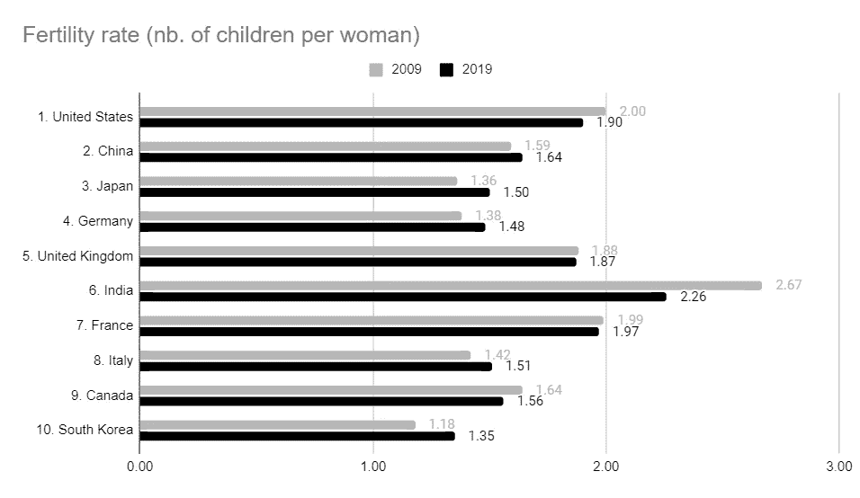
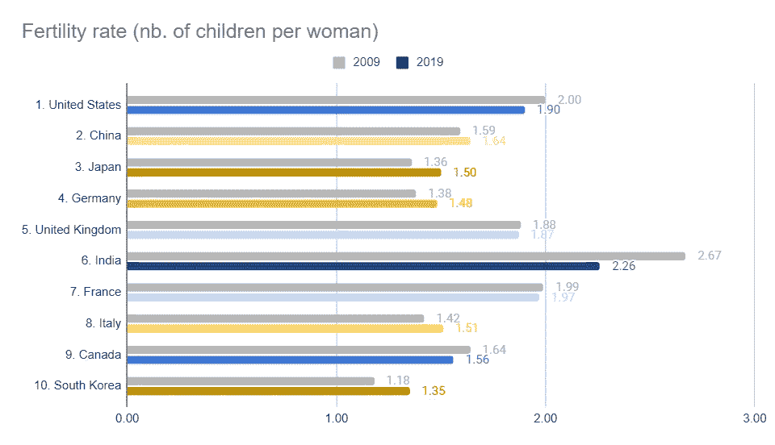
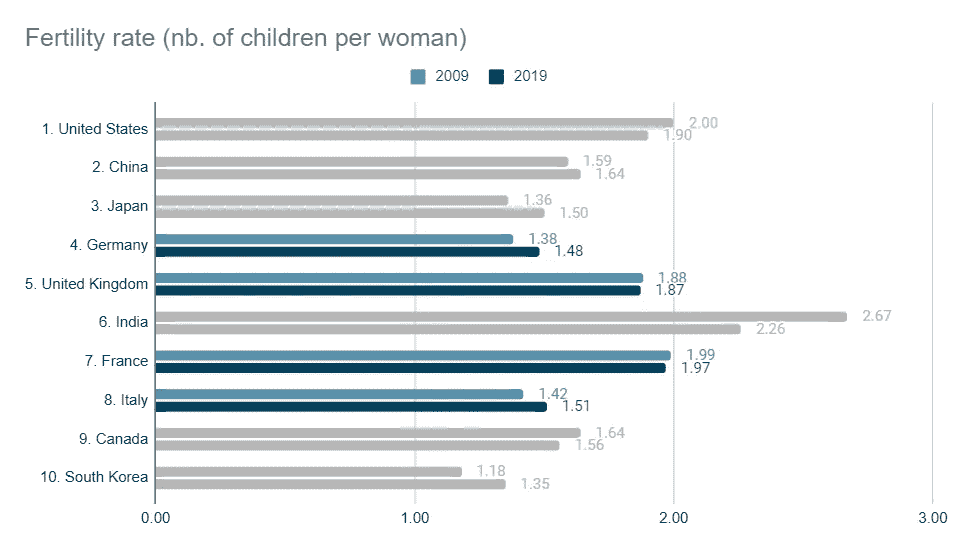

# 数据可视化中颜色的力量

> 原文：<https://towardsdatascience.com/the-power-of-color-in-data-visualizations-9868d661f2a0?source=collection_archive---------12----------------------->

## 仅仅改变图表的颜色会导致完全不同的解释

马里奥·高在 [Unsplash](https://unsplash.com/?utm_source=unsplash&utm_medium=referral&utm_content=creditCopyText) 上的照片

每天，我们每个人看到、分析和分享的图片、图表和信息图表的数量是巨大的。例如，Domo 估计脸书用户每天每分钟都会在平台上上传 47 万张照片([数据从不睡觉，2020](https://www.domo.com/learn/infographic/data-never-sleeps-8) )。即使我们认为这些图像中只有一小部分与数据可视化相对应，**当图表呈现在您面前时，您是否曾经花时间分析过您解读图表的方式？**

我最近花时间分析了我的大脑是如何被我自己的背景——我的信仰，我的文化，甚至我的偏见——有意无意地影响的。由于我们生活在一个持续信息流的世界，越来越多地基于图片、视频和其他视觉刺激，更好地理解颜色如何影响同一图表产生不同解释的方式会很有趣。在这篇文章中，我想证明，一个相同的图表，呈现完全相同的数据，可以导致不同的解释的基础上，颜色的选择，其作者。

为了说明我的观点，让我们根据名义 GDP(国内生产总值)创建一个图表，显示 2009 年至 2019 年间[十大经济体](https://en.wikipedia.org/wiki/List_of_countries_by_GDP_(nominal))的生育率演变。为了做到这一点，我使用了基于联合国提供的公开数据的数据集。这种分析的一个目标可能是**检验生育率和经济财富相关的假设**。然而，我们将会看到，根据作者对颜色的选择，一幅图所传达的主要思想可能会有所不同。

# 从中性色开始

为了使颜色对读者的影响尽可能小，我首先选择了相对中性的颜色，简单地改变两种灰色之间的对比度来显示两个时间段。这样，作为一个作者，我在展示数字的同时，并没有传达一个强烈的解释信息:作为读者，你被邀请去做你自己的思考，从这个图形中寻找意义。

图表 1 —中性—玛丽·勒费夫尔

那么，你为什么需要添加颜色呢？

将颜色添加到图表中有以下效果:

*   通过建议某种解释，它给了读者线索**快速解释你图表中显示的数据**
*   从美学角度来看,**更有吸引力**，因此能更好地吸引读者的注意力
*   [视觉元素在记忆中保留的时间更长](https://www.shiftelearning.com/blog/bid/350326/studies-confirm-the-power-of-visuals-in-elearning) —你的图表包括它的**颜色应该是令人难忘的**！

# 用颜色标记反对意见

图表 2——反对意见——玛丽·勒菲弗尔

有时候最明显的解决方案会变成最好的解决方案。在这种情况下，我想突出两个系列的积极和消极的内涵，我会选择基本的颜色，如绿色和红色。例如，我想标记 2009 年至 2019 年间生育率正演变的国家与生育率负演变的国家之间的对立。不超过三种颜色和一个容易理解的颜色代码是支持这样一个简单想法的关键。这里传达的主要隐含信息是:

> *“生育率上升的国家往往在十大经济体中排名较高”。*

请注意**使用带有隐含解释的颜色**会误导读者。在这里，常识会让我们明白，生育率的下降(红色国家)意味着这些国家面临困难，这种趋势对它们是有害的。然而，这是一个基于社会、文化和政治考虑的预设想法:根据具体情况，生育率下降可能对一些国家有害，而对另一些国家则可能是一个积极的机会。

如果你想传达一个更微妙的信息呢？

# 用颜色来突出进化的进步性

图表 3——细微差别——玛丽·勒菲弗尔

为了给图带来细微差别，建议使用色标。如果进化朝着一个方向进行，你可以在颜色饱和度上做文章(例如，从浅蓝色到深蓝色)。这里的演变有两个方向:向负值方向，蓝色变得越来越暗，向正值方向，黄色变得越来越接近棕色。

与前面的图表相反，这里选择的颜色没有表达任何判断:绿色和红色显然分别与积极和消极的方面有关，而蓝色和黄色尽管在视觉上是很好的颜色，但在意义上是相当中性的。这里传达的主要隐含信息是:

> 生育率演变的强度和方向似乎对一个国家在最大经济体中的排名都没有明显的影响。

*图表中的特定亮点是什么？*

# 使用颜色突出显示图表的特定部分

图表 4 —亮点—玛丽·勒菲弗尔

正如你在图 3 中看到的，使用一系列的颜色有助于比较和展示不同国家的不同发展水平。然而，你需要确保读者不会被信息淹没。当你向你的观众展示图表时，通常会有一个完整的上下文。因此，你应该能够**确定你的图表**中最重要的是什么。

在我们的例子中，假设我们只想强调欧洲国家生育率的变化。这就是为什么我选择在图 4 中给欧洲国家添加颜色，而用灰色显示其他国家的数据。通过这样做，**注意力被吸引到感兴趣的主题**(最大的欧洲国家)，同时保持图表的详尽性(显示十大经济体)。这里传达的信息是:

> “在过去的十年里，欧洲国家要么面临生育率的稳定，要么面临生育率的上升”。

# 结论

我最后的建议是要意识到颜色对我们大脑的影响。

**作为读者，**在解读任何数据可视化的时候，都要三思。不管是有意还是无意，我们做出了一些决定来创建你面前的图表。现在轮到你退一步，用最相关的方式解释它了。

**作为一名作家或分析师，**系统地考虑至少三种方式来展示你将呈现给观众的数据。当选择你的图表的最终版本时，问问你自己或其他人:当别人看我的图表时，他们会在最初的 5 秒内解释什么？

你喜欢读这篇文章吗？ [*成为*](https://marie-lefevre.medium.com/membership) *的一员，加入一个不断成长的充满好奇心的社区吧！*